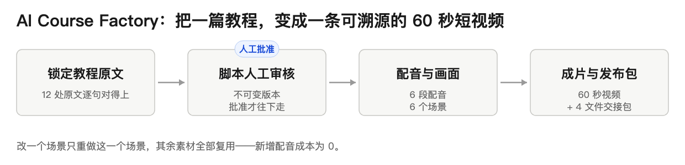

<div align="center">

# AI Course Factory

**把一篇公开教程，变成一条每一帧都能回溯来源的 60 秒短视频。**


[快速开始](#快速开始) · [Issues](https://github.com/JettxonHo/AI-Course-Factory/issues) · [决策日志](docs/decision-log.md)

</div>

> 这个项目回答的问题：**AI 生成的内容，凭什么让人相信？**——答案是溯源：每句脚本都对应教程原文的具体位置，每个版本都可重放。

## 目录

- [它是什么](#它是什么)
- [功能特性](#功能特性)
- [真实运行界面](#真实运行界面)
- [已验证事实](#已验证事实)
- [它和其他 AI 视频工具的区别](#它和其他-ai-视频工具的区别)
- [快速开始](#快速开始)
- [常见问题](#常见问题)

## 它是什么

知识创作者做短视频，要在脚本、素材、配音、剪辑之间来回切换，成本很高；而纯 AI 一键生成的内容又常常"看起来对、其实没出处"。这个工作台走中间路线：把 GitHub 上的优质公开教程转成短视频，但**每一步都要么可追溯、要么经人工批准**。



## 功能特性

- **原文锁定**：教程来源固定到 commit / blob 级，脚本逐句可回溯到 12 处原文定位
- **脚本人工审核**：不可变脚本版本 + 显式批准 / 驳回，批准后才进入制作
- **AI 配音**：GPT-SoVITS 整篇旁白（v1.1），MBL 主链切换为豆包"刘飞 2.0"
- **场景级复用**：修改单个场景只重做该场景，其余场景与音频全部复用，新增配音成本为 0
- **发布包交付**：成片 + 字幕 + 交接清单一键打包，重启后字节一致
- **本地运行**：三个服务端渲染页面 + 明确数据目录，默认只绑定本机回环地址

## 真实运行界面


本地实跑截图（2026-09）：三阶段导航（内容与脚本 → 制作与回导 → 终审交付），每一步保留原始事实，刷新或重启后可继续。

## 已验证事实

> 截至 2026-09-02。口径说明：60 秒成片与 52+422 属 FAST-MVP v1.1 历史交付；当前主链已重基线为抖音发布业务闭环（B0 已合并，B1 进行中，B2–B6 未授权）。

| 事实 | 数值 |
|---|---|
| 首个端到端成片 | 1 条 60 秒、6 场景视频 + 6 段配音 + 4 文件发布包，来源锁定 12 处原文 |
| 测试规模 | 52 项聚焦测试 + 422 项回归测试通过（FAST-MVP v1.1 验收） |
| 生成成本控制 | 替换单个场景时复用其余场景与全部音频，新增配音调用为 0；两次重启后产物字节一致 |
| 脚本审核基线 | 不可变脚本版本 + 人工批准 / 驳回 + 重启可重放，回归 476/476（v1.3 S1） |

## 它和其他 AI 视频工具的区别

- **先溯源，后生成**：脚本必须锁定原文出处才能进入制作，不生成无出处的内容
- **复用即省钱**：生成成本被当成产品指标管理，而不是事后看账单
- **版本可重放**：重启后从历史状态精确恢复，不依赖运气

## 快速开始

前置条件：Python 3.11+ 与 [uv](https://docs.astral.sh/uv/)。

```bash
PYTHONPATH=src uv run python -m ai_course_factory.web --data-dir ./var/ai-course-factory
```

默认只绑定 `127.0.0.1:8000`。完整回归：`PYTHONPATH=src uv run python -m unittest discover -s tests -v`。

## 常见问题

**支持哪些内容来源？**
当前固定为公开 GitHub 教程仓库（首期系列使用 microsoft/AI-For-Beginners 的计算机视觉课程），其他来源需要另行评估。

**能自动发布到抖音吗？**
不能，也不打算自动发布。发布包在人工终审后手工发布；72 小时反馈与 7 天归档是业务闭环的一部分。

**为什么不直接全自动生成？**
知识内容的错误会消耗创作者信誉。这个工具的定位是"业务控制台"，不是批量生成器——审核与溯源结构就是产品本身。

---

> 以下为产品与治理文档（原 README 内容保留不变，从"## 当前产品真相"开始）

## 当前产品真相

访客可先读上方"对访客"一节；本节是与 GOAL.md 对齐的权威 current truth，措辞以门禁状态为准。

- FAST-MVP v1.1 与 Creator Handoff v1.2 H0–H3.5 是保留的本地历史/基础能力；Creator Handoff H4 从未完成。
- Knowledge Video Editorial MVP v1.3 已完成 E0、S0 与 S1。Creator-authored Script Package intake/re-import、immutable Script Version、exact approve/reject Decision、restart/replay 已通过 Issue #150 / PR #151 合并到 `main@1a769289`，最终回归 476/476。
- v1.3 没有完成 Narrative Clock、Visual Edit Plan、Sample、full render 或发布；Issue #145 仍 OPEN/PAUSED，其未合并候选不得恢复或整包复用。
- Product Owner 于 2026-08-27 批准 **Knowledge Video Business Loop MBL v1.0** exact Goal。B0 Issue #152 / PR #153 已合并；B1 Issue #154 正在执行精确的 Computer Vision 来源与三份 Creator Package readiness，B2–B6 代码、Provider 调用、媒体生产和抖音发布仍未授权。

批准的 MBL 主链是：

```text
exact Computer Vision Source
  -> explicit Creator-authored Script Package intake
  -> exact human-approved Script Version
  -> Doubao Liu Fei 2.0 Whole Narration
  -> short-phrase continuous clock + canonical SRT
  -> human-approved Visual Edit Plan
  -> Codex creator assets + deterministic A-roll / B-roll
  -> approved 15–20 second Sample Video
  -> full local render
  -> named-human Final Review
  -> publish-ready package
  -> manual Douyin publication
  -> 72-hour feedback + 7-day archive
```

首轮固定为三条“AI 如何看懂画面”系列，使用 `microsoft/AI-For-Beginners/lessons/4-ComputerVision/06-IntroCV/README.md` 的 exact commit/blob/locator 事实。每条 60–90 秒；第 1 条验证完整生产/发布/反馈路径，三条建立首个账号基线。数据不好可以否定内容假设，但不否定业务闭环已被真实执行。

AI Course Factory 是业务控制台，不是专业剪辑器。当前 MBL 允许 Codex 在应用外完成脚本与静态素材生产，豆包“刘飞 2.0”承担整篇旁白，HyperFrames/FFmpeg 通过后续 bounded adapter 负责确定性渲染。稳定生产合同必须允许将来替换为独立模型/API；B1 不调用任何 Provider、ImageGen、HyperFrames 或抖音能力。

现行权威见 [Knowledge Video Business Loop MBL v1.0](docs/goals/KNOWLEDGE-VIDEO-BUSINESS-LOOP-MBL-v1.0.md) 与 [GOAL.md](GOAL.md)。[v1.3 Goal Contract](docs/goals/KNOWLEDGE-VIDEO-EDITORIAL-MVP-v1.3-PROPOSAL.md) 和 [Creator Script 重基线](docs/goals/KNOWLEDGE-VIDEO-EDITORIAL-MVP-v1.3-SCRIPT-INPUT-REBASELINE.md) 保留为 S1 基础合同/历史。

## 当前可运行的已实现能力

合并后的应用仍是三个本地 server-rendered 页面，可从明确的数据目录启动：

```bash
PYTHONPATH=src uv run python -m ai_course_factory.web --data-dir ./var/ai-course-factory
```

默认只绑定 `127.0.0.1:8000`。已实现的 v1.2 兼容路径仍支持显式 GPT-SoVITS、本地图片输入及 creator-generated MP4 目录，但这些能力不构成 v1.3 已实现证据，也不应在当前 PARK 状态下驱动 H4 外部视频生成。

### 历史/兼容性本地输入

- F2A 图片输入只接受显式目录与固定 `scene-1.png` 至 `scene-6.png`。
- H3 creator clip 输入只接受显式目录与固定 `scene-1.mp4` 至 `scene-6.mp4`，没有浏览器路径/上传或 Downloads/Desktop/latest 扫描。
- F2B GPT-SoVITS 使用显式外部 Python 3.11、官方 repo/model/reference 配置；不读取云端凭据，外部调用费用为 0。

这些是保留的实现事实，不是继续外部 clip 生产、恢复 #145 或跳过 B1–B6 gate 的授权。

## 开始之前

Codex 和开发者按以下顺序阅读：

1. [docs/README.md](docs/README.md)
2. [GOAL.md](GOAL.md)
3. [docs/STATUS.md](docs/STATUS.md)
4. [AGENTS.md](AGENTS.md)

## 验证命令

代码任务的完整回归命令仍为：

```bash
PYTHONPATH=src uv run python -m unittest discover -s tests -v
```

B0 Issue #152 / PR #153 是已合并的 exact 11-doc change。B1 Issue #154 运行 focused RED/compatibility checks、compileall、ownership 与 `git diff --check`；浏览器/真实边界证据及 merge 前一次 full regression 仍由 controller 负责。

## 权威文档

- [PRD](docs/product/PRD.md)：产品价值、行为和验收候选。
- [System Spec](docs/spec/SYSTEM-SPEC.md)：系统 ownership、事实与 gate 候选。
- [Implementation Spec](docs/spec/IMPLEMENTATION-SPEC.md)：复用、物理方向和验证策略候选。
- [Decision Log](docs/decision-log.md)：D-012 MBL 重基线及保留的历史决策。
- [Development Workflow](docs/DEVELOPMENT-WORKFLOW.md)：Goal、Luna、Issue、PR 和验收协作。

历史 Phase、Creator Handoff、v1.3 与受保护候选继续保留为实现和决策证据，不作为 MBL milestone 实施授权。
