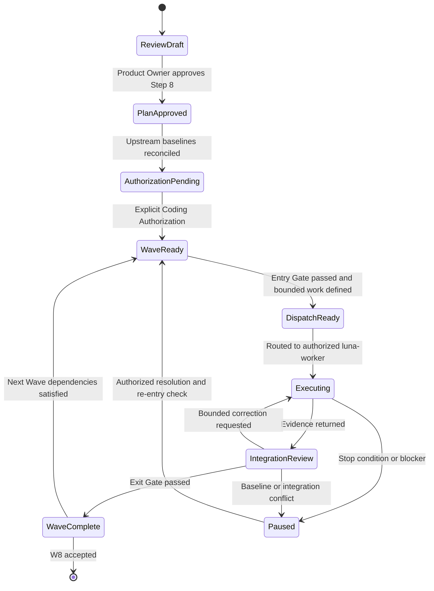
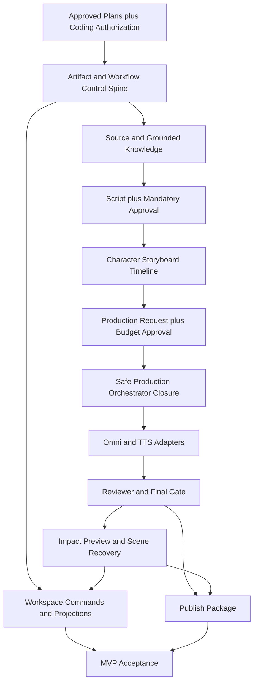
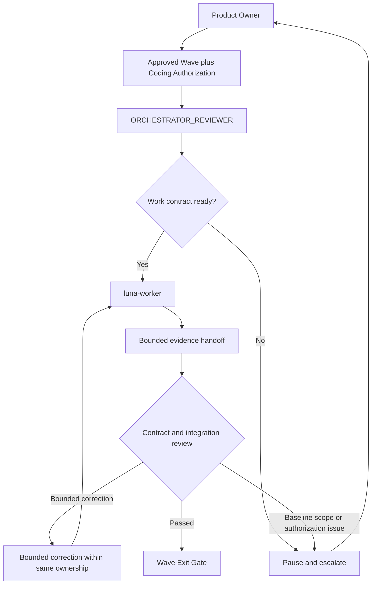
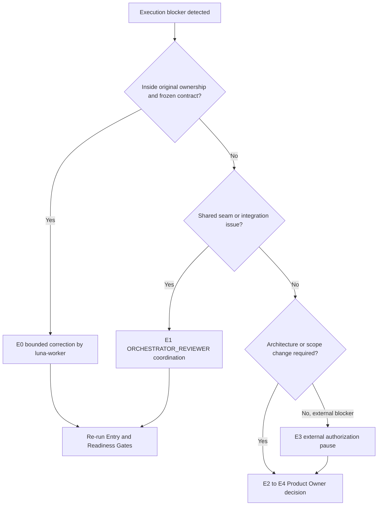

# AI Course Factory MVP Execution Plan v0.1

## Document Status

| Field | Value |
| --- | --- |
| Document | AI Course Factory MVP Execution Plan |
| Version | v0.1 |
| Phase | Phase 1.3 Step 8 — Execution Plan Design |
| Status | Review Draft |
| Execution Plan | Review Draft |
| Coding | Not Started |
| Coding Authorization | Not Granted |
| Last Updated | 2026-08-10 |
| Input Plan | AI Course Factory MVP Implementation Plan v0.1 — Step 7 Review Draft |
| Next Gate | Product Owner Review；上游计划与本 Plan 获批后，仍需独立 Coding Authorization |

### Purpose

本文档把 Step 7 中的 M0–M8 Milestone 转换为可治理的 Execution Wave，定义未来工程执行的顺序、依赖、有限并行、角色路由、Gate、停止条件与失败升级规则。

本文档回答：

> 在未来获得 Coding Authorization 后，如何按可审查、可暂停、可恢复且不越过架构边界的方式执行 Implementation Plan？

本文档不创建 Goal、GitHub Issue、Implementation Task、Branch、PR 或代码。文中的 Execution Wave、Lane、Gate、evidence class 和未来拆分规则均是执行治理语义，不是已经创建的工程工作项。

### Source of Truth

本 Plan 继续使用以下输入，并且不修改其既有内容或状态：

1. [AI Course Factory MVP PRD v0.3 — Approved Baseline](../product/AI_Course_Factory_MVP_PRD_v0.3.md)
2. [Renderer Strategy Revision Addendum v1.0 — Accepted](../architecture/Renderer_Strategy_Revision_Addendum_v1.0.md)
3. [AI Course Factory MVP Technical Spec v0.1 — Step 1–5](../technical-spec/AI_Course_Factory_MVP_Technical_Spec_v0.1.md)
4. [AI Course Factory MVP Implementation Boundary Spec v0.1 — Step 6 Review Draft](../technical-spec/AI_Course_Factory_MVP_Implementation_Boundary_Spec_v0.1.md)
5. [AI Course Factory MVP Implementation Plan v0.1 — Step 7 Review Draft](../implementation-plan/AI_Course_Factory_MVP_Implementation_Plan_v0.1.md)

冲突优先级保持：Approved PRD → Accepted Addendum → Decision Records → Strategy → Technical Spec → Implementation Boundary → Implementation Plan → Execution Plan。

若本 Execution Plan 与任何上游冻结决策冲突，本文件必须停止向下授权并升级评审；不得通过执行顺序、角色路由或任务拆分静默改变产品与架构。

### Baseline Status Qualification

- PRD v0.3 保持 `Approved Baseline`。
- Renderer Strategy Revision Addendum 保持 `Accepted`。
- Technical Spec Step 1–5 保持原状。
- Step 6 保持 `Review Draft`。
- Step 7 保持 `Review Draft`。
- 本 Step 8 只生成 `Review Draft`。
- Product Owner 要求进入 Step 8，构成 Execution Planning Authorization，不构成 Coding Authorization。

因此，本文件可以完成执行规划，但当前不能派发任何 implementation work。

### Frozen Architecture Guard

所有 Execution Wave 必须保持以下边界：

1. **Artifact First**：业务事实只通过 Candidate → Validation → Commit → exact Artifact Reference 建立；版本不可静默覆盖。
2. **Workflow Control**：Top-level Workflow 是 Lifecycle、Human Gate、Budget Gate、Checkpoint、Resume 与 Continue From Here 的唯一所有者。
3. **Production Orchestrator**：它是生产执行的唯一入口，负责 Skills 协调、有限 Retry、Failure Normalization 与生产 Candidate，不拥有人工批准。
4. **Provider Adapter**：外部 Provider 只通过 core-owned interface 与 Adapter 进入；SDK、raw response 与 provider-specific Prompt 不得穿透核心状态。
5. **Four Product Agents Only**：Knowledge Agent、Content Agent、Production Agent、Reviewer；工程执行角色不是产品 Agent。
6. **Frozen Scope Only**：不增加 Agent、Skill、Provider、Renderer、Knowledge Source 或产品能力。

# 1. Execution Model

## 1.1 Execution Wave Definition

Execution Wave 是一个受 Gate 约束的实施调度区间，用于把一个 Milestone Outcome 转换为有序执行、有限并行和统一集成审查。

Execution Wave：

- 有明确的上游 Milestone、Entry Gate、Exit Gate 与停止条件；
- 可以包含多个逻辑 Lane，但 Lane 只有在依赖稳定、ownership 不重叠时才能并行；
- 以 Milestone Completion Criteria 作为最终结果，不自行创造新的产品结果；
- 只有在前一 Wave Exit Gate 通过后才可正式进入下一 Wave；
- 不等于 Issue、Branch、PR、Goal、Implementation Task 或一次 Agent turn。

## 1.2 Milestone、Wave 与 Future Task 的关系

| Concept | Purpose | Owns | Does Not Mean |
| --- | --- | --- | --- |
| Milestone | 定义 Step 7 中需要达到的业务或工程 Outcome。 | Objective、Scope、Dependencies、Completion Criteria。 | 具体调度或单个工作项。 |
| Execution Wave | 定义达到 Milestone Outcome 的执行顺序、Lane、Gate 与集成点。 | Entry / Exit、parallel rules、stop / escalation。 | Issue 或 Task。 |
| Future bounded implementation task | 在 Coding Authorization 后承载一个明确 ownership 范围内的实现结果。 | 一项可验收结果、允许修改范围与 evidence。 | 当前已创建的工作项。 |
| GitHub Issue | 未来可能用于追踪已经批准的 bounded task。 | 追踪与协作记录。 | 产品或架构事实源。 |

正式关系：

```text
Approved Milestone Outcome
    ↓ scheduled by
Execution Wave
    ↓ after Coding Authorization, may be decomposed into
Future Bounded Implementation Work
    ↓ optionally tracked by
GitHub Issue / Branch / PR
```

本 Step 停止在 Execution Wave，不实例化最后两层。

## 1.3 Wave Operating Principles

1. **Authorize before dispatch**：没有独立 Coding Authorization，不得生成或派发实际实现工作。
2. **Stabilize seams before parallelism**：先冻结调用 interface、ownership 与 failure semantics，再允许实现 Lane 并行。
3. **Vertical evidence before horizontal expansion**：每一 Wave 先证明一条可观察闭环，再扩大内部覆盖。
4. **Gates before cost**：Budget、Attempt、Idempotency 与 Checkpoint 先于真实 Omni / TTS 调用。
5. **Exact references before recovery**：exact Version、dependency、stale 与 Impact Preview 先于 Scene-level regeneration。
6. **Integration is a separate decision**：worker 完成不等于 Wave 通过；必须由 ORCHESTRATOR_REVIEWER 完成集成审查。
7. **Fail closed**：授权、Provider、credential、budget、baseline 或 worker identity 不明确时停止，不采用未经批准的替代路径。
8. **No speculative platform work**：Wave 只交付当前 Milestone 必需的最小深度，不建设通用平台。

## 1.4 Execution State Model



当前状态停留在 `ReviewDraft`。图中的后续状态只定义未来行为，不表示已经发生授权或执行。

# 2. Milestone-to-Wave Map

## 2.1 Wave Overview

| Wave | Step 7 Milestone | Primary Outcome | Cost Posture | Entry Dependency |
| --- | --- | --- | --- | --- |
| W0 — Authorization & Baseline Lock | M0 | Planning baseline 与独立 Coding Authorization 就绪。 | No execution cost | Step 6、Step 7、Step 8 完成 Product Owner review。 |
| W1 — Control Spine | M1 | Artifact、Workflow、Storage、Execution Record 最小控制脊柱。 | No paid provider call | W0 Exit Gate。 |
| W2 — Grounded Script Slice | M2 | GitHub → Knowledge → Script → Mandatory Script Review。 | LLM only under approved runtime policy；no media cost | W1 Exit Gate。 |
| W3 — Production Planning & Budget | M3 | Approved Script → Character / Storyboard → Timeline → Production Request → Budget Approval。 | No Omni / TTS call | W2 Exit Gate。 |
| W4 — Safe Production Closure | M4 | local / mock six-scene production、Join 与 Video Candidate。 | Zero paid media call | W3 Exit Gate。 |
| W5 — Provider-backed Production | M5 | Approved Omni / TTS adapters 在成本保护下闭环。 | Paid calls only after explicit budget and environment gate | W4 Exit Gate。 |
| W6 — Review & Recovery | M6 | Reviewer、Final Gate、四类 Failure、partial execution 与 Scene recovery。 | Targeted calls only under existing budget rules | W5 Exit Gate。 |
| W7 — Workspace & Packaging | M7 | Artifact-centric Workspace 与 Publish Package closure。 | No new provider class | W6 Exit Gate。 |
| W8 — MVP Acceptance | M8 | Demo、AC-01 至 AC-14、边界与 release readiness 证据闭合。 | Only approved acceptance runs | W1–W7 Complete。 |

## 2.2 Global Ordering

```mermaid
flowchart LR
    W0["W0 Authorization and Baseline Lock"]
    W1["W1 Control Spine"]
    W2["W2 Grounded Script Slice"]
    W3["W3 Production Planning and Budget"]
    W4["W4 Safe Production Closure"]
    W5["W5 Provider-backed Production"]
    W6["W6 Review and Recovery"]
    W7["W7 Workspace and Packaging"]
    W8["W8 MVP Acceptance"]

    W0 --> W1 --> W2 --> W3 --> W4 --> W5 --> W6 --> W7 --> W8
```



主 Wave 顺序是硬顺序。允许的并行发生在 Wave 内部 Lane，或仅限不触发下游业务执行的提前准备；不得用跨 Wave 并行绕过 Exit Gate。

# 3. Execution Wave Design

## 3.1 W0 — Authorization & Baseline Lock

### Intent

把“可以规划”与“可以编码”彻底分离，建立唯一的未来执行入口。

### Entry Conditions

- Step 8 Review Draft 已交付 Product Owner。
- 当前 Coding 保持 Not Started。

### Ordered Flow

1. Product Owner 完成 Step 6 Review。
2. Product Owner 完成 Step 7 Review。
3. Product Owner 完成 Step 8 Review。
4. 统一核对文档版本、状态和 Baseline Conflict Assessment。
5. Product Owner 单独发出 Coding Authorization。
6. ORCHESTRATOR_REVIEWER 才能准备第一个未来 bounded implementation work contract。

### Parallel Rule

文档审阅可以并行阅读，但批准状态必须分别记录，不能把一个文档的批准推断为另一个文档或 Coding 的批准。

### Exit Gate

- Step 6、Step 7 与 Step 8 均被明确批准为执行输入。
- Baseline Conflict Assessment 仍为 Passed。
- Coding Authorization 独立存在。
- 第一个未来执行范围的 ownership、dependencies、acceptance evidence 与 Non-goals 可以无歧义定义。

### Stop Conditions

- 任一 baseline 状态不明确。
- Product Owner 只批准 Plan，但未明确授权 Coding。
- Step 6 / Step 7 / Step 8 之间出现冲突。
- 执行需要新的 Agent、Skill、Provider、Renderer 或产品能力。

## 3.2 W1 — Control Spine

### Intent

建立所有后续 Slice 共同依赖的最小 Artifact / Workflow 控制脊柱，不产生真实媒体供应商费用。

### Required Sequence

1. Runtime Composition 与 Configuration validation seam。
2. Artifact identity、Candidate validation、immutable Commit 与 exact retrieval。
3. Artifact Storage、Workflow Checkpoint Storage、Execution Record Storage 的语义分离。
4. Workflow Command / Result、selected refs、pending gate、checkpoint 与 resume cursor。
5. Command、Commit 与 Provider Attempt 的逻辑幂等边界。
6. 通过 module interface 验证本 Wave 的 observable behavior。

### Eligible Parallel Lanes

- Runtime Composition / Configuration 与 Artifact Runtime 可以在共同 interface 已确认后并行。
- 三类 Storage Adapter 可以在各自 core-owned interface 已确认后由不重叠 ownership 并行准备。
- 最小 read projection 可以在 Artifact query 与 Workflow query 语义稳定后并行准备。

### Forbidden Parallelism

- 不得让不同 worker 同时改变 Artifact Reference 或 Workflow Command interface。
- 不得为各 Agent 建立独立 persistence model。
- 不得把三个 Storage interface 抽象为 Generic Store。
- 不得提前接入 Omni / TTS。

### Exit Gate

- exact Reference、immutable Version、idempotent Commit、Checkpoint / Resume 均有可观察 evidence。
- Workflow State 不包含 Artifact payload。
- Local Adapter 不绕过 Gate、Commit 或 Idempotency。
- Configuration 缺失时 fail closed，secret 不进入业务状态或 evidence。

## 3.3 W2 — Grounded Script Slice

### Intent

建立第一个 Creator 可验证闭环：公开 GitHub Source 到 Approved Script exact Version。

### Required Sequence

1. Source validation 与 Source Record。
2. Source normalization 与 provenance acquisition。
3. Knowledge Agent 形成 Knowledge Candidate，经 validation / commit 获得 exact Reference。
4. Content Agent 基于 exact Knowledge Reference 形成 Course / Episode Plan 与 Script Candidate。
5. Grounding、completeness 与 format validation。
6. Mandatory Script Review interrupt。
7. Creator Approve、Reject 或 Revise，随后 checkpoint / resume。

### Eligible Parallel Lanes

- GitHub Source Connector 与 Model Runtime Adapter 可以并行实现，最终在 Knowledge Agent invocation seam Join。
- Application read projection 可以在 Workflow Command / Artifact query 已稳定后并行准备。

### Forbidden Parallelism

- Script 不得在 Knowledge Artifact Commit 前正式生成。
- Production planning 不得在 exact Script Version 获 Creator Approval 前启动。
- Agent 不得直接读取 GitHub protocol、Provider SDK 或 Artifact Storage implementation。

### Exit Gate

- Source → Knowledge → Plan / Script → Creator Decision lineage 完整。
- 每项事实性教学主张可追溯到 Source / Knowledge evidence。
- 无来源主张触发 Hard Block；Creator 不可绕过。
- Reject / Revise 创建新 Version，历史 Version 与决定保留。

## 3.4 W3 — Production Planning & Budget

### Intent

把 Approved Script 转换为 provider-neutral Production Request，并在任何真实生产前完成预算绑定与批准。

### Required Sequence

1. 读取 exact Approved Script Reference。
2. Production Agent 形成 Character 与 Storyboard Candidates。
3. Optional Storyboard Review：启用时强制 Gate，未启用时记录 skipped。
4. 基于 selected exact refs 形成 Timeline Candidate。
5. 基于 Timeline 形成 provider-neutral Production Request Candidate。
6. 为 exact Production Request Version 形成 Production Budget Artifact。
7. Creator 批准或拒绝预算。

### Eligible Parallel Lanes

- Character / Storyboard 表达支持与 Timeline / Production Request validation 可在 staged Agent contract 不变的前提下分别准备。
- Budget 展示 projection 可在 Budget Artifact 与 Approval Record 语义稳定后准备。

### Forbidden Parallelism

- 正式 Artifact Commit 与 Gate 顺序不得并行化。
- Provider SDK 不得定义 Production Request。
- Omni / TTS 不得被调用。
- Production Agent 不得承担 Production Orchestrator、Retry 或成本执行责任。

### Exit Gate

- Character、Storyboard、Timeline、Production Request 分别形成 exact Version。
- Fixed 6 Scene 仍是 Template Constraint，不是 Workflow State shape。
- Budget Approval 绑定 exact Request Version；Request 新 Version 使旧批准对新版本失效。
- 无有效 Budget Authorization 时 Production Entry 被阻止。

## 3.5 W4 — Safe Production Closure

### Intent

使用 local / mock adapters 证明六 Scene 生产、Join、Commit 与 Video Candidate 路径，不产生真实媒体费用。

### Required Sequence

1. Top-level Workflow 通过 Production Execution interface 调用 Production Orchestrator。
2. Orchestrator 验证 Approved Production Request 与 Budget Authorization。
3. 建立 attempt identity 与执行控制。
4. 调度 Visual、Narration、Subtitle / Timing 分支。
5. Commit Scene-level results，保留成功 sibling Scene。
6. Audio Composer Join required Scene Audio，形成 Master Audio Result。
7. Media Composer Join Scene Clip、Master Audio、Subtitle 与 Timeline，形成 Video Candidate。
8. Candidate 经 validation / commit 形成 exact Video Reference。

### Eligible Parallel Lanes

- Visual branch、Narration branch、Subtitle / Timing branch 可以并行。
- local visual adapter 与 local voice adapter 可以在不同 seam、不同 ownership 下并行。
- branch-level verification 可以并行，最终在 Orchestrator integration review Join。

### Join Guards

- Audio Join 要求全部 required Scene Audio；BGM / Effect 缺失不阻止。
- Video Join 要求 selected Scene Clip、Master Audio、final Subtitle 与 Timeline 齐全。
- 单 Scene 失败阻止新的完整 composition，但不删除成功结果。

### Exit Gate

- Workflow 与 Agent 均未直接调用 Skill。
- Skill 返回 Result / Failure，不直接 Commit Artifact。
- Orchestrator 是 Production 唯一入口和有限 Retry owner。
- 完整 safe production 可以形成 Video Artifact Candidate / Reference。
- mock adapter 没有真实外部费用或未经批准的副作用。

## 3.6 W5 — Provider-backed Production

### Intent

在安全生产接缝已经通过后，以受控方式接入批准的 Omni 与 TTS 实现。

### Required Sequence

1. ORCHESTRATOR_REVIEWER 验证当期 Provider capability、environment、credential 与预算授权。
2. 锁定 core-owned Visual / Voice Provider interfaces。
3. 分别实现 Omni 与 TTS Provider Adapter。
4. 在无费用或最小受控环境验证 request mapping、response validation 与 error normalization。
5. 在每次真实调用前验证 exact Request Version、Scene ID、Attempt Number、Budget 与 Idempotency。
6. 记录 terminal execution evidence，再形成 Result / Failure Candidate。
7. 将真实 Scene results 接入 W4 已证明的 Commit / Join / Composition 路径。

### Eligible Parallel Lanes

- Omni Adapter 与 TTS Adapter 可以在不同 core-owned interface、不同 credential scope 和不同 ownership 下并行。
- Adapter contract verification 可以并行；真实 paid acceptance run 必须统一受 Gate 控制。

### Forbidden Parallelism

- 不得让多个 worker 同时修改 Production Orchestrator 的 shared retry / attempt seam。
- 不得增加第二 Visual Provider、Provider Router 或自动 failover。
- 不得将 raw Provider type、Prompt 或 response 写入 Workflow / Artifact core semantics。
- 不得在预算或 attempt guard 之外发起“测试调用”。

### Exit Gate

- 真实调用只来自匹配 Adapter。
- 所有 attempt 均可关联 exact Request Version、Scene ID 与 Attempt Number。
- 每次自动重试前重新验证预算，总尝试不超过三次。
- Provider Error、Generation Failure 与 Budget Limit 能归一化为既有四类 Product Failure 中的对应类别。
- credential、signed URL 与敏感 raw detail 未进入 Artifact、Workflow 或常规日志 evidence。

## 3.7 W6 — Review & Recovery

### Intent

完成质量门禁、失败恢复、Impact Preview、Continue From Here 与 Scene-level regeneration。

### Required Sequence

1. Reviewer 评价 exact Video Version 并形成 Review Artifact Candidate。
2. 分离 Warning、Hard Block 与 Creator Approval。
3. 建立 Mandatory Final Video Review。
4. 对四类 Product Failure 建立既有恢复路径。
5. 在 exact dependency 与 stale semantics 上建立 Impact Preview。
6. Creator 确认后传播 stale，并解析新的 execution entry。
7. 执行 Scene-scoped visual、voice、subtitle / timing 或 manual clip recovery。
8. 重新 composition，形成新 Video Version，并返回 Reviewer / Final Gate。

### Eligible Parallel Lanes

- Reviewer evaluation support 与 recovery projection 可在 exact Review / Approval contract 稳定后分别准备。
- 不同 Scene branch 的验证可并行，但 dependency / stale interface 必须只有一个 owner。
- Workspace 的只读 recovery projection 可以提前准备；实际 Command 仍等待对应 Workflow path。

### Forbidden Parallelism

- 不得在 dependency / stale / Impact Preview 接缝未通过前开放 regeneration。
- 不得让两个 worker 同时修改同一 Scene dependency 或 stale propagation logic。
- 不得把单 Scene 修改实现为整条任务重跑。
- 不得允许 Creator Approval 绕过 Hard Block。

### Exit Gate

- Review Artifact 与 Creator Approval Record 分离并绑定 exact Version。
- Warning 可被 Creator 接受，Hard Block 不可绕过。
- Continue From Here 先 Preview、后确认、再 stale propagation。
- 成功 sibling Scene 可复用；manual clip 保留 provenance。
- 新 Video Version 必须重新经过 Reviewer 与 Final Review。
- Provider Error、Generation Failure、Quality Failure、Budget Limit 均有可追踪 Failure Artifact 和合法恢复路径。

## 3.8 W7 — Workspace & Packaging

### Intent

完成 Artifact-centric Single Task Workspace 与 Final Approval 后的 Publish Package。

### Required Sequence

1. 将 Workflow、Artifact、Review、Budget、Failure 与 Impact Preview 作为受控 projection 展示。
2. 所有用户写操作通过 Workflow Command。
3. 明确 UI Draft 与业务事实的分离。
4. 验证 exact Video Version 已通过 Reviewer 且获得 Creator Final Approval。
5. 形成 Cover、Metadata 与 Artifact Manifest Candidates。
6. 形成 Media Package、Metadata Package、Artifact Manifest 与 Publish Package。
7. 提供本地导出与 lineage validation。

### Eligible Parallel Lanes

- Workspace read projection 与 Packaging builder 的内部准备可在输入 contract 稳定后并行。
- Media、Metadata 与 Manifest 的候选构建可在 shared exact refs 冻结后并行，最终由 Packaging Join。

### Forbidden Parallelism

- UI write interaction 不得领先对应 Workflow Command。
- Final Video 未批准时不得正式执行 Packaging。
- Packaging 不得直接发布到任何外部平台。
- 不得引入独立 Cover Provider 或多平台 Packaging Profile。

### Exit Gate

- UI 刷新、恢复或 Draft 不改变业务事实。
- Application 不直接调用 Agent、Skill、Provider 或 Artifact Storage implementation。
- Publish Package 精确引用 approved Video、Media、Metadata、Manifest 与 Approval lineage。
- Completed 仍未被声明，直到 W8 acceptance 通过。

## 3.9 W8 — MVP Acceptance

### Intent

验证 Microsoft AI-For-Beginners → “小土豆学 AI”Episode 01《AI不是魔法》完整闭环，并确认可以形成 MVP release-readiness conclusion。

### Required Sequence

1. 核对 W1–W7 Exit evidence 与 baseline versions。
2. 运行 approved Demo 正常路径。
3. 验证 Human Gate、Budget Gate、Resume 与 exact lineage。
4. 验证四类 Failure、retry limit、Impact Preview、Scene regeneration 与 manual clip path。
5. 验证 Workspace、Final Approval、Packaging 与 Completed 语义。
6. 对 PRD AC-01 至 AC-14 建立可复现 evidence matrix。
7. 记录 known limitations、residual risk 与 Product Owner exception。

### Eligible Parallel Lanes

- 已稳定行为的 evidence collection 可以按 acceptance domain 并行。
- Security / boundary review 与 functional acceptance 可以并行检查，但最终结论必须 Join。

### Defect Routing Rule

验收发现只路由回拥有该 seam 的原执行范围；不得在 W8 中以“修复”为名扩大产品范围。若修复需要改变 frozen interface，立即停止并回到 specification review。

### Exit Gate

- PRD AC-01 至 AC-14 均有可复现 evidence 或明确 Product Owner exception。
- Source Record 到 Publish Package 的 exact-version lineage 完整。
- 所有 Mandatory Gate 与 Hard Block 规则均不可绕过。
- Completed 只代表 Final Video Approved、Packaging Complete、Publish Package Ready。
- 未引入新的 Agent、Skill、Provider、Renderer、Knowledge Source 或产品能力。

# 4. Dependency and Parallel Execution Rules

## 4.1 Hard Dependency Graph



该图只表达执行依赖。它不改变 Step 6 runtime call direction，也不创建模块、任务或新的产品流程。

## 4.2 Parallel Eligibility Test

两个未来工作范围只有同时满足以下条件才可并行：

1. 同属一个已获得 Entry Authorization 的 Wave，或属于明确允许的只读 / 无副作用准备。
2. 上游 stable interface 已冻结并通过前一 Gate。
3. ownership area、主要 seam 与允许修改文件范围不重叠。
4. 不会分别维护同一业务事实或 current-version selection。
5. 没有先后 Gate、Artifact Commit、Budget 或 external side-effect ordering。
6. 各自可以独立提供 observable evidence。
7. Integration Join 与冲突 owner 已预先明确。

任一条件不满足即顺序执行。

## 4.3 Globally Allowed Parallel Patterns

- 不同 core-owned interface 下的 local adapters。
- GitHub Connector 与 Model Runtime Adapter。
- Visual、Narration、Subtitle / Timing 三条 Production branch。
- Omni 与 TTS Adapter，在各自 interface 与 credential scope 已冻结之后。
- Workspace read projection 与已冻结 Command / Query contract 的后端 work。
- Packaging 的 Media、Metadata 与 Manifest candidate preparation，在 Final Approval 执行 Gate 之前只允许无副作用准备。
- W8 中互不修改实现的 evidence collection。

## 4.4 Globally Forbidden Parallel Patterns

- 多个 worker 同时修改同一 stable interface、ownership area 或 persistence seam。
- Artifact identity、exact Reference 或 Status 尚未冻结时分散建立各模块 storage model。
- Workflow Gate 未稳定时接入真实付费 Provider。
- Production Request 未稳定时让 Provider SDK 反向定义业务输入。
- UI、Workflow 与 Artifact Layer 各自维护 lifecycle、approval 或 current Version。
- stale / Impact Preview 未稳定时开放 Scene regeneration。
- Final Approval 未通过时执行 Publish Package。
- 把逻辑并行提前实现为 Event Bus、distributed task system 或通用 scheduler。

## 4.5 Join Ownership

| Join | Required Inputs | Join Owner | Missing-input Behavior |
| --- | --- | --- | --- |
| Knowledge Join | Source Record、normalized material、provenance、model outcome | Knowledge flow under Workflow control | 不 Commit Knowledge Candidate。 |
| Script Gate Join | Knowledge、Plan、Script exact refs 与 validation | Top-level Workflow | 保持或进入 review / revision pending。 |
| Production Entry Join | Approved Production Request + valid Budget Authorization | Top-level Workflow | 不调用 Production Orchestrator。 |
| Production Branch Join | selected Scene outputs + required execution outcomes | Production Orchestrator | 保留 partial success，返回 normalized failure / pause outcome。 |
| Audio Join | all required Scene Audio；optional BGM / Effect | Audio Composer under Orchestrator | required input 缺失则不生成 Master Audio。 |
| Video Join | Scene Clips、Master Audio、Subtitle、Timeline | Media Composer under Orchestrator | 不生成新 Video Candidate。 |
| Final Gate Join | Video exact ref + Review Artifact + no Hard Block + Creator Decision | Top-level Workflow | 不进入 Packaging。 |
| Packaging Join | approved Video、Media、Metadata、Manifest、Approval lineage | Packaging Layer under Workflow control | 不提交 Publish Package。 |
| Acceptance Join | AC evidence、boundary review、known risks | ORCHESTRATOR_REVIEWER + Product Owner decision | 不标记 MVP ready。 |

# 5. Future Bounded Implementation Task Decomposition Principles

## 5.1 Scope of This Section

本节只定义未来在 Coding Authorization 后如何拆分 bounded implementation work，不创建任何实际 Task、Issue、Branch 或 PR，也不指定文件列表、任务编号或负责人实例。

## 5.2 Valid Future Task Shape

一个未来 bounded implementation task 应满足：

1. **One primary outcome**：只有一个可观察、可验收的工程结果。
2. **One primary ownership area**：拥有一个逻辑模块或一个稳定 seam；跨模块只允许用于明确的 integration outcome。
3. **Stable inputs**：引用 approved baseline、Wave、upstream exact contract 与 dependency state。
4. **Explicit allowed changes**：说明可以改变的 implementation 范围。
5. **Explicit forbidden changes**：冻结 Agent、Skill、Provider、Renderer、Artifact、Gate 与 interface 边界。
6. **Behavioral acceptance**：从模块 interface 观察结果、错误与顺序，而不是要求内部实现形状。
7. **Evidence contract**：规定必须返回的 behavioral、failure、lineage、security 与 external-side-effect evidence。
8. **Single integration destination**：明确交回 ORCHESTRATOR_REVIEWER 的 Join point。
9. **Rollback / pause safety**：未完成或失败不得破坏已批准 Artifact、其他 worker work 或上一个 Wave evidence。

## 5.3 Deep-module Split Rule

未来拆分以深模块的 interface 为测试与交接面：

- 一个 task 可以修改多个内部文件，只要它只拥有一个稳定 interface 下的一个结果；
- 不按“每个文件一个 task”拆分；
- 不把简单 pass-through adapter 与业务逻辑分散给多个 worker；
- Provider / Storage 等真实外部依赖必须有满足同一 core-owned interface 的 test adapter；
- worker 的 evidence 应证明调用方可观察行为，不要求暴露内部 seam。

## 5.4 Permitted Future Task Categories

以下只是分类，不是已创建的任务：

| Category | Valid Scope Shape | Required Guard |
| --- | --- | --- |
| Core seam implementation | 一个冻结 interface 下的最小完整行为。 | Interface 已批准；无外部 SDK leakage。 |
| Vertical slice increment | 从一个 exact upstream ref 到一个可审查 downstream outcome。 | 所有中间 Gate 与 Commit 仍存在。 |
| Adapter implementation | 一个 core-owned external interface 的一个实现。 | Provider / Storage 不反向定义 core contract。 |
| Recovery behavior | 一个明确 Scene scope 或 failure path。 | dependency、stale、Impact Preview 已稳定。 |
| Integration verification | 多个已完成模块在一个冻结 Join 上闭合。 | 不顺带改变参与模块 interface。 |
| Acceptance evidence | 一个 AC domain 的可复现验证。 | 不修改产品范围；缺陷回到原 owner。 |

## 5.5 Invalid Split Patterns

不得采用：

- “实现整个 Agent Layer / Workflow / Production”的无边界大任务；
- 按技术文件或 Framework folder 机械拆分的浅任务；
- 每个 Agent 自己实现 Artifact persistence、Workflow control 或 Provider integration；
- 一个 task 同时拥有 Workflow Gate 与 Production retry policy；
- 一个 task 同时改变 Production Request 与 Provider Adapter 来规避 contract review；
- 以“临时测试”为名接入新 Provider、Renderer 或 paid call；
- 多 worker 共同拥有一个 stable interface；
- 缺少 acceptance evidence、Non-goals 或 handoff 的探索性编码；
- 把 W0–W8 Wave 名称直接转换成 Issue 列表。

## 5.6 Future Task Readiness Template

未来只有在获得 Coding Authorization 后，ORCHESTRATOR_REVIEWER 才能依据以下字段准备实际 work contract：

- Authorized Wave
- Objective
- Primary Ownership / Seam
- Approved Baseline References
- Upstream Dependencies and Entry Evidence
- Allowed Changes
- Forbidden Changes
- Observable Acceptance Criteria
- Failure and Stop Conditions
- Verification Evidence
- External Side-effect / Budget Policy
- Handoff Destination

本文件仅冻结字段类别，不填充任何具体任务实例。

# 6. Engineering Execution Routing

## 6.1 Role Separation

`ORCHESTRATOR_REVIEWER` 与 `luna-worker` 是未来工程交付角色，不是 AI Course Factory 产品运行时 Agent，不会改变四个产品 Agent 的数量或职责。

## 6.2 ORCHESTRATOR_REVIEWER Route

`ORCHESTRATOR_REVIEWER` 负责：

1. 核对 authorized Wave、baseline precedence 与 Coding Authorization。
2. 执行 future task readiness review，而不是亲自扩大实现范围。
3. 分配唯一 ownership，维护 shared seam 的单一修改者规则。
4. 决定哪些 Lane 可以并行、何时 Join、何时停止。
5. 审查 luna-worker 返回的 evidence、scope、dependency direction 与 external side effects。
6. 只有在 Wave Exit Gate 全部通过后，才建议推进下一个 Wave。
7. 将 baseline conflict、scope change、paid-provider authorization 与 Product Owner decision 升级给 Product Owner。

它不拥有：

- Product Owner Approval；
- Coding Authorization 的授予；
- 产品 Agent 的 runtime decision；
- 新 Agent、Skill、Provider、Renderer 或 Feature 的批准；
- 用临时实现修改 frozen contract 的权限。

## 6.3 luna-worker Route

在未来获得授权后，`luna-worker` 负责：

1. 只执行一个明确 bounded work contract。
2. 只修改分配的 ownership area，不回滚用户或其他执行角色的无关改动。
3. 在 frozen interface 后实现最小完整行为，不主动扩大公共 surface。
4. 遇到 interface、baseline 或 scope 不足时停止并返回 blocker，不先编码后补文档。
5. 返回 files / behavior / verification / external side effect / remaining risk evidence。
6. Provider、credential、budget 或 safe environment 不明确时 fail closed。
7. 不静默替换 worker profile；明确路由为 `luna-worker` 时，必须使用该精确角色。

若 `luna-worker` 不可用，未来执行应返回 `BLOCKED_LUNA_WORKER_UNAVAILABLE` 并请求 Product Owner 处理；不得自动改用其他 worker 继续。

## 6.4 Routing Flow



## 6.5 Routing Decision Table

| Situation | Route | Result |
| --- | --- | --- |
| Baseline interpretation or conflict | ORCHESTRATOR_REVIEWER → Product Owner if unresolved | Pause；no coding. |
| One bounded ownership result | ORCHESTRATOR_REVIEWER → luna-worker | Execute only after all Gates。 |
| Stable interface change required | ORCHESTRATOR_REVIEWER | Return to specification review。 |
| Provider / credential / paid-call work | ORCHESTRATOR_REVIEWER gate → luna-worker | Only approved Provider and budget policy。 |
| Same seam requested by two workers | ORCHESTRATOR_REVIEWER | Serialize ownership。 |
| Independent Lane with stable inputs | ORCHESTRATOR_REVIEWER → separate luna-worker routes | Parallel only with explicit Join。 |
| Review finding inside original scope | Original luna-worker | Bounded correction, then re-review。 |
| Scope expansion or new capability | Product Owner | Stop current execution；new product decision required。 |
| luna-worker unavailable | Product Owner | `BLOCKED_LUNA_WORKER_UNAVAILABLE`；no silent fallback。 |

# 7. Execution Gates

## 7.1 Gate Hierarchy

| Gate | Owner | Required Evidence | Failure Result |
| --- | --- | --- | --- |
| G0 — Baseline Approval Gate | Product Owner | Step 6、Step 7、Step 8 approval and Passed conflict assessment。 | Planning pause。 |
| G1 — Coding Authorization Gate | Product Owner | Explicit authorization distinct from plan approval。 | Coding remains Not Started。 |
| G2 — Wave Entry Gate | ORCHESTRATOR_REVIEWER | Previous Wave exit、dependency state、scope and cost posture。 | Wave not opened。 |
| G3 — Future Work Readiness Gate | ORCHESTRATOR_REVIEWER | Bounded ownership、allowed / forbidden、acceptance and evidence contract。 | No dispatch。 |
| G4 — External Side-effect Gate | ORCHESTRATOR_REVIEWER + existing Product budget rules | Provider、credential、environment、Budget、Attempt、Idempotency。 | No external call。 |
| G5 — Integration Review Gate | ORCHESTRATOR_REVIEWER | Worker evidence、contract compliance、Join and residual risk。 | Bounded correction or escalation。 |
| G6 — Wave Exit Gate | ORCHESTRATOR_REVIEWER；Product Owner for stated exceptions | All Milestone Completion Criteria and no boundary violation。 | Wave remains open / paused。 |
| G7 — MVP Acceptance Gate | Product Owner | W8 evidence、AC-01–AC-14、known limitations and exceptions。 | No release-readiness conclusion。 |

## 7.2 Gate Precedence

```text
G0 Baseline Approval
    ↓
G1 Coding Authorization
    ↓
G2 Wave Entry
    ↓
G3 Future Work Readiness
    ↓
G4 External Side-effect Gate when applicable
    ↓
G5 Integration Review
    ↓
G6 Wave Exit
    ↓
next Wave or G7 MVP Acceptance
```

下游 Gate 不能推断或替代上游 Gate。尤其：

- Approved Execution Plan 不等于 Coding Authorization。
- Coding Authorization 不等于所有 Wave 同时开放。
- task-level evidence 不等于 Wave Exit。
- Video generation success 不等于 Final Approval、Packaging 或 Completed。

## 7.3 Current Gate State

| Gate | Current State |
| --- | --- |
| G0 Baseline Approval | Pending；Step 6、Step 7、Step 8 仍需状态确认 / review。 |
| G1 Coding Authorization | Not Granted。 |
| G2 Wave Entry | Closed。 |
| G3 Future Work Readiness | Not instantiated。 |
| G4 External Side-effect | Closed。 |
| G5 Integration Review | Not applicable。 |
| G6 Wave Exit | Not applicable。 |
| G7 MVP Acceptance | Not applicable。 |

# 8. Stop Conditions and Failure Escalation

## 8.1 Immediate Stop Conditions

未来任一执行发现以下情况必须立即停止当前范围：

1. 缺少 Coding Authorization 或 authorized Wave。
2. Baseline 版本、批准状态或优先级冲突。
3. 实现需要修改 Step 1–7 frozen decision。
4. 需要新增 Agent、Skill、Provider、Renderer、Knowledge Source 或产品能力。
5. 两个执行者同时拥有同一 stable interface、persistence seam 或 shared file scope。
6. Artifact 使用 implicit latest、stale 默认输入或静默覆盖 Version。
7. Workflow、Agent、Skill、Orchestrator 或 Adapter 责任发生穿透。
8. Provider、credential、Budget、Attempt 或 Idempotency Gate 不完整。
9. 发现 secret、raw Provider response 或 untrusted content 泄漏到核心状态 / evidence。
10. verification 无法证明 task acceptance 或 Wave Exit。
11. `luna-worker` 不可用或 runtime identity 无法确认。
12. 外部 Provider capability、price、policy 或环境与执行假设不一致。

停止后必须保留已有有效 Artifact、用户文件、其他 worker work 与验证证据；不得通过破坏性回滚制造“干净状态”。

## 8.2 Engineering Escalation Levels

本节的 engineering execution failure 不新增或修改产品运行时的四类 Failure。

| Level | Condition | Owner | Allowed Response |
| --- | --- | --- | --- |
| E0 — Local bounded correction | 实现或验证问题完全位于原 ownership 和 frozen contract 内。 | luna-worker | 最小修正后重新提交 evidence。 |
| E1 — Integration blocker | Join、dependency、shared seam 或 evidence 不一致，但不改变产品方向。 | ORCHESTRATOR_REVIEWER | Pause affected Lane；协调顺序或退回原 owner。 |
| E2 — Baseline / architecture conflict | 需要改变 interface、ownership、Artifact、Gate 或 frozen decision。 | ORCHESTRATOR_REVIEWER → Product Owner | 停止 Coding；回到 specification review。 |
| E3 — External authorization blocker | Provider、credential、budget、paid call、policy 或 worker identity 不可用。 | ORCHESTRATOR_REVIEWER → Product Owner | Fail closed；等待授权或环境变化。 |
| E4 — Product scope change | 需要新增 Agent、Skill、Provider、Renderer、Source 或功能。 | Product Owner | 退出当前 Execution Plan；重新进入产品 / 架构决策。 |

## 8.3 Escalation Flow



## 8.4 Retry and Re-dispatch Rules

- Engineering re-dispatch 必须沿用原 authorized Wave 和 ownership；否则需要新的 readiness review。
- 同一失败重复出现不能通过扩大 scope 或切换未经批准 worker / Provider 规避。
- 外部 Provider retry 仍完全遵守产品基线：Production Orchestrator 有限重试、每次尝试前检查预算、最多三次总尝试。
- ORCHESTRATOR_REVIEWER 可以要求 bounded correction，但不能替 Product Owner 批准新的成本或产品范围。
- Resume 前必须重新检查 baseline、working state、upstream evidence 与外部条件；不得假设暂停前状态仍然有效。

# 9. Evidence and Handoff Model

## 9.1 Required Evidence Classes

未来每个 bounded execution handoff 至少根据范围提供：

| Evidence Class | Demonstrates |
| --- | --- |
| Scope evidence | 只修改获授权 ownership；无 silent scope expansion。 |
| Interface evidence | 调用方通过 frozen interface 获得预期行为与错误语义。 |
| Artifact evidence | Candidate / Commit / exact Version / dependency / stale 规则保持。 |
| Workflow evidence | Gate、Checkpoint、Resume、selected refs 与 control-only state 保持。 |
| Failure evidence | 合法失败能 fail closed、可追踪且不覆盖旧结果。 |
| External-side-effect evidence | Provider、attempt、budget、credential 与 idempotency 守卫有效。 |
| Security evidence | untrusted input、raw response 与 secret 未穿透核心 seam。 |
| Regression evidence | 先前 Wave outcome 仍成立。 |
| Handoff evidence | files / behavior / unresolved dependency / residual risk 清晰。 |

不要求每个范围制造不相关 evidence；由 ORCHESTRATOR_REVIEWER 在未来 task readiness 时选择适用类别。

## 9.2 Handoff States

未来 handoff 只允许以下结论：

- **READY_FOR_INTEGRATION_REVIEW**：范围内 acceptance evidence 完整，等待 ORCHESTRATOR_REVIEWER。
- **BLOCKED_WITH_EVIDENCE**：已停止，给出可复现 blocker、影响与所需决定。
- **BOUNDED_CORRECTION_REQUIRED**：Review 发现仍在原 ownership 内的问题。
- **SPECIFICATION_REVIEW_REQUIRED**：继续需要改变 frozen contract。
- **EXTERNAL_AUTHORIZATION_REQUIRED**：继续需要 Provider、credential、budget 或 Product Owner authorization。
- **BLOCKED_LUNA_WORKER_UNAVAILABLE**：精确 worker route 不可用，禁止静默 fallback。

这些是工程治理状态，不是 AI Course Factory Task Lifecycle State，也不是产品 Failure Artifact 类型。

## 9.3 Wave Completion Evidence

Wave 只有在以下条件同时满足后才能退出：

1. 对应 Step 7 Milestone Completion Criteria 全部有证据。
2. Wave 内所有 required Join 已完成。
3. 无未解决 boundary violation、baseline conflict 或 external-side-effect ambiguity。
4. 上一 Wave regression evidence 仍通过。
5. Non-goals 未被实现。
6. ORCHESTRATOR_REVIEWER 给出 Wave Exit assessment。
7. 需要 Product Owner exception 的项目已被明确记录，而非静默忽略。

# 10. Execution Invariants

未来执行不得违反：

1. 未通过 G1 Coding Authorization，不得创建或派发 implementation work。
2. Execution Wave 不是 Issue、Task、Branch、PR 或 Agent。
3. 前一 Wave 未通过 Exit Gate，下一 Wave 不得正式执行。
4. Artifact 是业务事实源；Workflow State 只保存控制信息与 exact refs。
5. Artifact Version 不可覆盖；stale 不删除历史结果。
6. Workflow 不直接调用 Production Skill 或 Provider。
7. Agent 不拥有 Workflow、Artifact Commit、Provider 调用、Retry 或 Human Approval。
8. Production Orchestrator 是 Production 唯一入口，不拥有 Human / Budget Approval。
9. Skill 返回 Result / Failure，不返回 Workflow Transition 或直接 Commit Artifact。
10. Provider Adapter 不改变业务意图、Artifact 语义、Scene scope 或 retry policy。
11. 未批准 Script 不得进入正式 production planning。
12. 未批准或失效 Budget 不得产生 Omni / TTS 成本。
13. Hard Block 不得被 Creator Approval 绕过。
14. Final Video 未批准不得执行 Packaging。
15. Completed 必须意味着 Final Video Approved、Packaging Complete、Publish Package Ready。
16. 并行 execution 不得造成 shared seam ownership、事实源或版本选择分裂。
17. 明确路由为 `luna-worker` 时不得静默替换 worker。
18. 任一实现便利不得引入新的 Agent、Skill、Provider、Renderer 或产品能力。

# 11. Explicit Non-goals

本 Step 8 明确不包含：

- Goal 创建或 Goal 状态管理
- GitHub Issue、Milestone object、Branch、PR、commit 或 release 创建
- Implementation Task 或 bounded work contract 的实际实例化
- 任何 worker / sub-agent 的实际派发
- 代码、伪代码、Python、TypeScript 或实现修改
- API、Endpoint 或 transport design
- JSON、Pydantic、TypeScript Interface 或字段级 Schema
- Database Schema、table、index、migration 或 storage product 选择
- Repository directory / package / file structure design
- Provider SDK、Prompt 文件、model parameter、price API 或 credential 配置
- LangGraph Node code、checkpointer implementation 或 deployment topology
- CI/CD、container、cloud infrastructure 或自动发布
- 新 Agent、新 Skill、新 Provider、新 Renderer、新 Knowledge Source
- Research Agent、Planning Agent、QA Agent、Cost Agent、Prompt Agent 或 Publishing Agent
- deterministic Stickman Renderer、Remotion Renderer 或 Multi Renderer system
- Multi Provider Router、automatic failover 或 intelligent cost routing
- Event Bus、distributed task system、通用 scheduler 或 dynamic workflow editor
- 多用户、多任务、多租户、权限、协作或 SaaS Workspace
- 自动发布、多平台 Packaging Profile 或 ContentOS 平台化
- 修改 Technical Spec Step 1–5
- 修改 Step 6 或 Step 7 已冻结决策
- Coding

## Baseline Conflict Assessment

**Result：Passed for Execution Planning。**

核对结果：

- W0–W8 只把 M0–M8 转换为 execution scheduling semantics，没有改变 Milestone Outcome。
- 保留 Artifact First、immutable Version、exact Reference、stale、Impact Preview 与 Scene-level recovery。
- 保留 Top-level Workflow 对 Lifecycle、Human Gate、Budget Gate、Resume 与 Continue From Here 的唯一 ownership。
- 保留 Production Orchestrator 作为生产执行唯一入口和有限 Retry owner。
- 保留 Provider Adapter 对 LLM、GitHub、Omni 与 TTS 的隔离；未增加 Provider。
- 保留 Knowledge、Content、Production、Reviewer 四个产品 Agent；ORCHESTRATOR_REVIEWER 与 luna-worker 只属于工程治理。
- 保留 Prompt + Omni Hybrid Production；未恢复 deterministic Stickman Renderer。
- 保留 Fixed 6 Scene Template Constraint、Hard Block + Warning、四类 Product Failure 与 Publish Package layering。
- 未创建 Goal、Issue、Task、Branch、PR、代码或 worker execution。

状态限制：Step 6 与 Step 7 仍为 Review Draft，本 Step 8 也只是 Review Draft。该限制不阻止 Execution Planning，但 G0 / G1 仍关闭，因此不得进入 Coding。

## Step 8 Completion Check

| Completion Criterion | Result |
| --- | --- |
| Step 7 M0–M8 已映射为 W0–W8 Execution Wave。 | Passed |
| Wave 顺序、Entry / Exit、依赖、Join 与成本姿态已定义。 | Passed |
| Wave 内允许与禁止的并行规则已定义。 | Passed |
| Future bounded implementation task 的拆分原则已定义，但未创建实际 Task。 | Passed |
| ORCHESTRATOR_REVIEWER 与 luna-worker 的工程路由已定义。 | Passed |
| Coding Authorization、Wave Entry、External Side-effect 与 Integration Gates 已定义。 | Passed |
| 停止条件、engineering escalation 与 re-dispatch 规则已定义。 | Passed |
| Artifact、Workflow、Production Orchestrator 与 Provider Adapter 边界保持。 | Passed |
| 未新增 Agent、Skill、Provider、Renderer、Knowledge Source 或产品能力。 | Passed |
| 未修改 Step 1–5、Step 6 或 Step 7。 | Passed |
| 未创建 Goal、Issue、Task、Branch、PR 或代码。 | Passed |
| 未进入 Coding。 | Passed |
| Baseline Conflict Assessment。 | Passed for execution planning |

## Current Status

```text
Phase 1.3 Step 8 — Review Draft Complete
Execution Plan — Review Draft
Coding — Not Started
Coding Authorization — Not Granted
```
