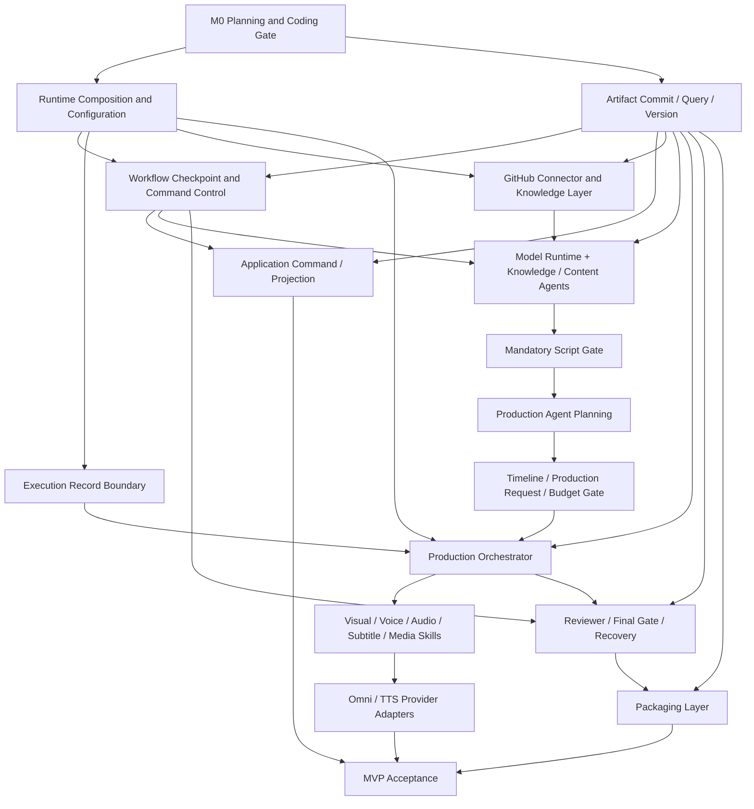

# AI Course Factory MVP Implementation Plan v0.1

## Document Status

| Field | Value |
| --- | --- |
| Document | AI Course Factory MVP Implementation Plan |
| Version | v0.1 |
| Phase | Phase 1.3 Step 7 — Implementation Plan Design |
| Status | Review Draft |
| Implementation Plan | Review Draft |
| Coding | Not Started |
| Last Updated | 2026-08-10 |
| Planning Authorization | Product Owner 已明确要求进入 Phase 1.3 Step 7 |
| Next Gate | Product Owner Review；Step 6 与本 Plan 获批后，仍需独立 Coding Authorization |

### Purpose

本文档把已经确认的产品、生产路线、逻辑架构、工程契约与实现边界转换为 MVP 的实施顺序和里程碑。它回答：

> 在不扩大产品范围、不破坏已冻结边界的前提下，应以什么顺序建立 AI Course Factory 的最小可运行闭环？

本文档定义实施策略、Milestone、依赖、并行规则、运行时实施顺序、未来工程执行角色、Coding Readiness、风险和 Non-goals。

本文档不创建 Goal、GitHub Issue、Branch、PR、代码或 Implementation Task，也不拆分未来的 bounded implementation work。

### Source of Truth

本 Plan 已重新读取并交叉核对以下输入：

1. [AI Course Factory MVP PRD v0.3 — Approved Baseline](../product/AI_Course_Factory_MVP_PRD_v0.3.md)
2. [Renderer Strategy Revision Addendum v1.0 — Accepted](../architecture/Renderer_Strategy_Revision_Addendum_v1.0.md)
3. [AI Course Factory MVP Technical Spec v0.1 — Step 1–5](../technical-spec/AI_Course_Factory_MVP_Technical_Spec_v0.1.md)
4. [AI Course Factory MVP Implementation Boundary Spec v0.1 — Step 6 Review Draft](../technical-spec/AI_Course_Factory_MVP_Implementation_Boundary_Spec_v0.1.md)

发生冲突时继续采用：Approved PRD → Accepted Addendum → Decision Records → Strategy → Technical Spec → Implementation Boundary → Implementation Plan。

### Baseline Status Qualification

本 Plan 只冻结“如何实施”的顺序，不改变任何上游状态：

- PRD v0.3 保持 `Approved Baseline`。
- Renderer Strategy Revision Addendum 保持 `Accepted`。
- Technical Spec 文件保持原状；本 Plan 不修改其 Step 1–5 内容或文档状态。
- Step 6 仍是 `Review Draft`，本 Plan 不把它静默升级为 Approved Baseline。
- Product Owner 本轮指令足以授权生成 Step 7 Review Draft，但不构成 Coding Authorization。

因此，当前不存在阻止规划的 Baseline Conflict，但 Step 6 与本 Plan 的批准状态仍是进入 Coding 前的显式 Gate。

### Frozen Scope Guard

本 Plan 只规划当前 MVP 已批准能力：

- 四个产品 Agent：Knowledge Agent、Content Agent、Production Agent、Reviewer。
- 已批准的 Knowledge、Creative 与 Production Skills。
- LLM、GitHub、Omni、TTS 四类外部系统边界。
- Prompt + Omni Hybrid Production。
- Provider-neutral Timeline 与 Production Request。
- Artifact First、Human / Budget Gates、Scene-level recovery 与 Publish Package。

本 Plan 不引入新的 Agent、Skill、Provider、Renderer、Knowledge Source 或产品能力。

# 1. Implementation Strategy

## 1.1 MVP Vertical Slice Strategy

MVP 采用“稳定脊柱 + 纵向闭环”的实施策略。

**稳定脊柱**先建立所有后续 Slice 共同依赖的最小控制语义：

```text
Runtime Composition
    ↓
Validated Configuration
    ↓
Artifact Commit / Exact Reference
    ↓
Workflow Command / Checkpoint / Resume
    ↓
Execution Record and Adapter Seams
```

稳定脊柱不是通用平台。只实现当前 MVP Slice 必需的接口、状态语义和持久化边界，不建设通用 DAG、动态 Workflow、Service Bus 或多 Provider Router。

**纵向闭环**按用户可观察结果推进：

```text
Public GitHub Source
    ↓
Grounded Knowledge
    ↓
Creator-approved Script
    ↓
Provider-neutral Production Plan
    ↓
Creator-approved Budget
    ↓
Scene Media and Video
    ↓
Reviewer + Creator Final Approval
    ↓
Publish Package
```

每个 Milestone 必须产生一个可验证的闭环增量，而不是先把所有 Layer 横向做完再尝试集成。

## 1.2 Three-pass Delivery Model

实施分为三个连续 Pass：

| Pass | Intent | External Cost Policy | Exit Signal |
| --- | --- | --- | --- |
| Pass A — Contract Spine | 建立 Artifact、Workflow、Storage、Configuration 与 Adapter 的最小稳定接缝。 | 不允许付费媒体调用。 | exact Reference、Checkpoint、Commit 与 replay 语义可被验证。 |
| Pass B — Safe Vertical Closure | 使用 local / mock adapters 贯通六个 Scene 的 Knowledge-to-Video 流程。 | 默认零付费；Mock 不得暗中调用真实 Provider。 | 完整控制流、Join、Gate 与 Failure 路径在安全环境中闭合。 |
| Pass C — Provider-backed MVP | 在预算与 attempt guard 已稳定后接入已批准的真实 Omni / TTS 路线，并完成最终验收。 | 每次调用前必须通过 Budget、Attempt 与 Idempotency Guard。 | Microsoft AI-For-Beginners → Episode 01 → Publish Package 真实闭环通过。 |

## 1.3 What to Build First and Why

首先建立的是：

> **Artifact / Workflow Control Spine，以及其上的 Source → Knowledge → Approved Script 第一条纵向 Slice。**

原因：

1. Artifact identity、immutable Version、exact Reference 与 Commit 顺序是所有下游能力的共同前置条件。
2. Workflow Gate、Checkpoint 和 Resume 必须在外部副作用前成立，否则后续 Omni / TTS 无法安全恢复。
3. Knowledge Grounding 是产品可信度的最高风险之一，应在媒体生产之前验证，而不是在视频完成后补追溯。
4. Mandatory Script Review 是进入正式生产的第一道产品门禁；先实现它可以证明 Reviewer 与 Creator Decision、Artifact 与 Workflow State 的分离。
5. Source-to-Script Slice 不依赖付费媒体生成，能以较低成本验证四层边界：Application、Workflow、Agent、Artifact。

第一个可见增量不是“一个视频生成按钮”，而是：

```text
提交 GitHub Source
    ↓
生成可追溯 Knowledge Artifact
    ↓
生成 Script Artifact
    ↓
Creator 对 exact Script Version 执行 Approve / Reject / Revise
    ↓
Checkpoint 可以安全 Resume
```

## 1.4 Build Order Rationale

实施顺序遵循以下原则：

1. **事实源先于控制投影**：Artifact Commit 与 exact retrieval 先于依赖它的 UI projection。
2. **控制 Gate 先于外部成本**：Budget、Attempt、Checkpoint 和 Idempotency 先于真实 Omni / TTS。
3. **内部协议先于供应商映射**：Timeline 与 Production Request 先于 Omni-specific request。
4. **安全闭环先于真实供应商**：先用同契约 local adapter 证明流程，再接真实 Provider。
5. **Scene 产物先于整集 Join**：Scene Clip、Scene Audio、Subtitle 可用后，才进入 Master Audio 与 Video Composition。
6. **正式 Review 先于 Packaging**：Reviewer 无 Hard Block 且 Creator 批准 exact Video Version 后，才生成 Publish Package。
7. **局部恢复建立在精确依赖之上**：Version、Scene ID、dependency 与 stale 已可追踪后，才开放 Continue From Here 和 Scene regeneration。
8. **只深化已证明的接缝**：内部复杂度隐藏在稳定 interface 后，不为单一未来假设增加新的公共抽象。

## 1.5 Milestone Quality Gate

每个 Milestone 进入下一个 Milestone 前必须同时满足：

- 没有违反 Step 1–6 的 dependency direction。
- 新结果只通过 Candidate → Validation → Commit → exact Reference 进入业务记录。
- Workflow State 没有复制 Artifact payload。
- External SDK / response 没有穿透 Adapter seam。
- 未批准的 Gate、stale input 或 implicit latest 没有被接受。
- 该 Milestone 的 Non-goals 未被顺带实现。
- 完成证据能够映射到 PRD Acceptance Criteria 或冻结的 Technical Spec invariant。

# 2. Milestone Plan

## 2.1 Milestone Overview

| Milestone | Outcome | Primary Exit Evidence |
| --- | --- | --- |
| M0 | Planning and Coding Gate Ready | Step 6 与本 Plan 获批，另有明确 Coding Authorization。 |
| M1 | Artifact and Workflow Control Spine | immutable Artifact、exact Reference、Checkpoint、Resume 与三类 storage seam 可验证。 |
| M2 | Source to Approved Script Vertical Slice | GitHub → Knowledge → Plan / Script → Mandatory Script Review 闭环。 |
| M3 | Approved Script to Approved Production Request | Character / Storyboard → Timeline → Production Request → Budget Approval。 |
| M4 | Safe Six-scene Production Closure | local / mock production 能生成 Scene media、Master Audio、Subtitle 与 Video。 |
| M5 | Provider-backed Hybrid Production | Omni / TTS 在 Budget、Attempt、Retry 与 Adapter guard 下执行。 |
| M6 | Review, Recovery, and Partial Execution | Hard Block / Warning、Final Review、Impact Preview、Scene regeneration 与 manual clip recovery。 |
| M7 | Workspace and Publish Package Closure | Artifact-centric Workspace 完整交互与本地 Publish Package 导出。 |
| M8 | MVP Acceptance and Release Readiness | Demo 闭环满足 PRD AC-01 至 AC-14，且无范围扩张。 |

## 2.2 Milestone 0 — Planning and Coding Gate

### Objective

建立进入 Coding 前唯一、明确且可审计的授权状态，消除“Plan 已生成是否等于可以编码”的歧义。

### Scope

- Product Owner 评审 Step 6 Implementation Boundary Review Draft。
- Product Owner 评审本 Implementation Plan Review Draft。
- 确认 Baseline Conflict Assessment 仍为 Passed。
- 确认未来 Coding 使用的 bounded ownership、acceptance evidence 与 authorization 规则。
- 独立记录明确的 Coding Authorization；Plan 获批本身不自动授权 Coding。

### Non-goals

- 不创建 Goal、Issue、Branch、PR、代码或 Implementation Task。
- 不选择具体 Provider SDK、Storage product、Framework 或部署拓扑。
- 不修改 Step 1–6。

### Dependencies

- PRD v0.3 Approved Baseline。
- Renderer Strategy Revision Addendum Accepted。
- Technical Spec Step 1–5 planning baseline。
- Step 6 Review Draft。
- 本 Step 7 Review Draft。

### Completion Criteria

- Step 6 被 Product Owner 明确批准或以等效书面决定接受为实现基线。
- 本 Implementation Plan 被 Product Owner 标记为 Approved Baseline。
- 未解决 Baseline Conflict 为零。
- Coding Authorization 以独立、明确指令存在。
- 在此之前，Coding 状态保持 Not Started。

## 2.3 Milestone 1 — Artifact and Workflow Control Spine

### Objective

建立所有纵向 Slice 共同依赖的最小运行时、Artifact 与 Workflow 控制脊柱。

### Scope

- Runtime Composition 与 validated Configuration boundary。
- Artifact Candidate validation、immutable commit、exact version retrieval 与 dependency association。
- Artifact Storage、Workflow Checkpoint Storage、Execution Record Storage 三个独立逻辑接缝。
- Workflow Command / Result、selected exact references、pending gate、checkpoint 与 resume cursor 的最小控制语义。
- Command、Artifact Commit 与 Provider Attempt 三层逻辑幂等边界。
- Local / mock adapters 与真实 adapters 共享相同 core-owned interfaces。
- 最小 Artifact / Workflow read projection，供后续 Slice 观察权威状态。

### Non-goals

- 不实现完整 Artifact 平台、通用 DAG、复杂查询或跨任务复用。
- 不实现真实 Omni / TTS 生产。
- 不实现完整 Workspace、Packaging 或自动发布。
- 不把物理 storage、folder 或 framework 变成架构契约。

### Dependencies

- M0 Complete。
- Step 5 Artifact / State invariants。
- Step 6 Runtime、Configuration、Storage 与 dependency direction。

### Completion Criteria

- Candidate 只有 Commit 成功后才产生 exact Artifact Reference。
- 重复等价 Commit 返回同一业务结果，不覆盖已批准 Version。
- Workflow Checkpoint 只保存控制状态和 exact References，不保存 payload。
- 三类 Storage interface 的 ownership、lifecycle 与失败语义未混合。
- Resume 能从 Checkpoint 重新绑定 exact References；缺失、stale 或不兼容输入会 fail closed。
- Local adapter 不绕过 Gate、Artifact Commit 或 Idempotency。
- Runtime configuration 缺失时在业务执行前 fail closed，credential 不进入业务状态。

## 2.4 Milestone 2 — Source to Approved Script Vertical Slice

### Objective

交付第一条用户可验证纵向 Slice：公开 GitHub 来源转化为可追溯知识、教学计划和经 Creator 批准的 Script Version。

### Scope

- Public GitHub Source validation 与 Source Record。
- Source normalization、repository structure / course index 理解与 Lesson 1 聚焦。
- Knowledge Agent、Content Agent 与 Model Runtime Adapter。
- Knowledge Artifact、Course / Episode Plan、Script Artifact 的 Candidate / Commit 流程。
- Source grounding、provenance 与无来源事实 Hard Block guard。
- Mandatory Script Review 的 Approve、Reject、Revise 与 Resume。
- Fixed 6 Scene Template 作为内容约束，但不编码为固定 Workflow shape。

### Non-goals

- 不生成 Character、Storyboard、Timeline、Production Request 或媒体。
- 不增加 Research Agent、RAG、多知识源或私有 GitHub 产品化鉴权。
- 不允许 Agent 直接读 GitHub protocol、Artifact Storage 或 Provider SDK。
- 不把 Agent conversation history 当作业务记录。

### Dependencies

- M1 Complete。
- GitHub Source Connector、Model Runtime 与 Agent Task interfaces 已稳定。
- PRD Knowledge Grounding 与 Episode Contract。

### Completion Criteria

- 一个公开 Microsoft AI-For-Beginners 输入可形成 Source Record 与 Knowledge Artifact。
- Knowledge Artifact 先表达 repository / course structure，再聚焦 Lesson 1。
- Script 中每项事实性教学主张可以追溯到 Knowledge / Source evidence。
- 无来源主张或依赖不完整时，当前 Script 不能通过 Gate。
- Creator Decision 与 Artifact / Review facts 分开记录，并绑定 exact Script Version。
- Reject / Revise 创建新 Version；旧 Version 与原决定保留。
- 满足 PRD AC-02、AC-03 的内容侧前置条件和 AC-04 的 Script Gate 部分。

## 2.5 Milestone 3 — Approved Script to Approved Production Request

### Objective

把 Approved Script 转换为 provider-neutral 的完整生产规划，并在任何正式外部生产前建立预算批准。

### Scope

- Production Agent 的 staged planning：Character / Storyboard、Timeline、Production Request。
- 小土豆 v1.0 Character Artifact 与 Fixed 6 Scene Storyboard。
- Optional Storyboard Review；启用时形成强制 Gate，未启用时记录 review skipped。
- provider-neutral Timeline 与 Production Request Artifact。
- Director / Prompt Skill 保持 provider-neutral planning role；不成为 Renderer 或 Provider Adapter。
- Production Budget Artifact 与 Mandatory Budget Approval。
- Production Request Version 与 Budget Approval 的 exact binding。

### Non-goals

- 不调用 Omni、TTS、Audio Composer 或 Media Composer。
- 不生成 provider-specific Prompt 作为核心 Artifact。
- 不让 Production Agent 执行生产、Retry 或 Failure Recovery。
- 不实现 Dynamic Scene Expansion、多 Renderer 或多 Provider routing。

### Dependencies

- M2 产生 Approved Script Ref。
- M1 的 Artifact / Workflow Gate spine。
- Step 3 Production Agent Contract 与 Step 5 exact-reference model。

### Completion Criteria

- 未批准 Script 不能进入正式 Storyboard planning。
- Character、Storyboard、Timeline 与 Production Request 按 staged invocation 分别 Commit。
- Optional Storyboard Review 的 enabled / skipped 两条路径均可恢复且可审计。
- Timeline 与 Production Request 不包含 Omni-specific 核心字段。
- Budget Artifact 与 Approval 精确绑定当前 Production Request Version。
- Request 创建新 Version 后，旧 Budget Approval 对新 Request 无效。
- 未批准 Budget 时 Production Invocation 被阻止。
- 满足 PRD AC-05、AC-11 以及 AC-13 的协议边界部分。

## 2.6 Milestone 4 — Safe Six-scene Production Closure

### Objective

在不产生真实媒体供应商费用的安全运行环境中，证明 Production Orchestrator、Skills、Join、Artifact Commit 与 Video 生成主链能够闭合。

### Scope

- Production Orchestrator 作为唯一 Production Execution 入口。
- Visual Generator、Voice Skill、Audio Composer、Subtitle Skill、Media Composer 五项已批准 Production capability。
- 与真实 Adapter 同契约的 local / mock visual 与 voice adapters。
- 六个 Scene 的 Visual、Narration 与 Subtitle / Timing 逻辑分支。
- Scene Audio、Master Audio、Subtitle、Scene Clip 与 Video Artifact Commit。
- Execution Record、Produced Output Reference、Skill Result / Failure 与 Artifact Candidate 的 promotion chain。
- branch Join、partial success preservation 与 composition ordering。

### Non-goals

- 不接入新的 Provider、Renderer 或真实付费媒体调用。
- 不实现自动质量优化、自动发布或分布式并发。
- 不要求真实并发；只保留 Step 2 定义的并行语义。
- 不允许 Workflow 或 Agent 直接调用 Production Skill。

### Dependencies

- M3 的 Approved Production Request 与 Budget Authorization 语义。
- M1 的 Execution Record、Artifact Commit 与 Idempotency spine。
- Step 4 Result / Failure 与 Adapter contracts。

### Completion Criteria

- Top-level Workflow 只通过 Production Execution interface 调用 Orchestrator。
- Orchestrator 能按 exact Request / Scene scope 调度五项能力并形成标准 outcome。
- Skill 只返回 Result / Failure；Artifact Commit 位于 Skill 之外。
- 六个 Scene 的必需 Scene Clip、Scene Audio 与 Subtitle 可被 Join。
- BGM / Effect 缺失不阻止 Master Audio；必需 Scene Audio 缺失会阻止成功。
- 单 Scene 失败只阻止新的完整 Composition，不删除其他成功 Scene Artifact。
- mock adapter 不产生真实费用，也不绕过 Budget / Attempt guard。
- 生成的 Video Artifact 可进入 Reviewer 前置状态，但尚不代表 Task Completed。

## 2.7 Milestone 5 — Provider-backed Hybrid Production

### Objective

在已经验证的生产接缝后接入已批准的真实 Omni Visual 与外部 TTS 路线，完成 Prompt + Omni Hybrid Production。

### Scope

- Omni Provider Adapter 与 TTS Provider Adapter 的真实实现。
- provider-neutral intent 到 provider-specific request 的受控映射。
- 外部响应、媒体 metadata、错误与 diagnostics 的验证和归一化。
- 每次付费 attempt 前的 Request、Scene、Attempt、Budget 与 Idempotency guard。
- Provider Error、Generation Failure 与 Budget Limit 的标准化路径。
- 首次调用加最多两次自动重试的生产域策略；每次重试前重新检查预算。
- 真实 Scene Clip 与 Scene Audio 进入既有 Commit / Join / Composition 路径。

### Non-goals

- 不新增第二个 Visual Provider、Provider Router、自动 failover 或智能成本路由。
- 不让 Provider capability 改写 Production Request、Scene scope 或产品功能。
- 不把 Provider Prompt、raw response 或 SDK type 写入核心 Artifact / Workflow State。
- 不恢复 deterministic Stickman Renderer 或接入 Remotion Renderer。

### Dependencies

- M4 Safe Production Closure Complete。
- 已批准的 Provider configuration 与 credential availability。
- M3 Budget binding 与 M1 Execution Record / Idempotency guard。
- Provider 能力、限制与价格在接入前完成当期核验。

### Completion Criteria

- 真实 Omni / TTS 只通过匹配 Adapter 被调用。
- 任何未批准、失效或超限预算均在外部成本前阻止调用。
- 每个 attempt 可追溯到 exact Production Request Version、Scene ID 与 Attempt Number。
- provider-specific response 被验证并归一化，敏感信息不进入 Artifact、Workflow 或日志语义。
- retry 总尝试数不超过三次，且不覆盖旧 Result / Artifact。
- Provider Error、Generation Failure 与 Budget Limit 能生成允许恢复的标准 Failure Artifact。
- Prompt + Omni Hybrid Production 可生成可合成的真实六 Scene 媒体输入。

## 2.8 Milestone 6 — Review, Recovery, and Partial Execution

### Objective

完成 MVP 的质量门禁、局部修订和失败恢复，使“可恢复生产”成为真实产品能力，而不是仅有成功路径。

### Scope

- Reviewer 对 exact Video Version 的 Source Grounding、Artifact completeness、format、character、teaching 与 production quality 评价。
- Review Artifact 的 Pass、Warning、Hard Block 与 Creator Approval 分离。
- Mandatory Final Video Review。
- 四类 Product Failure：Provider Error、Generation Failure、Quality Failure、Budget Limit。
- Impact Preview、stale propagation、Continue From Here 与 explicit entry resolution。
- Scene-level regeneration 的 visual-only、voice-only、narration、timing / subtitle 与 manual clip replacement 路径。
- 新 Video Version 后 Review、Final Approval、Cover 与 Publish Package 的失效规则。
- Pause / Resume 与成功 sibling Scene reuse。

### Non-goals

- 不建设通用恢复策略引擎、自动根因分析或跨供应商故障转移。
- 不把局部修改实现为整条任务无条件重跑。
- 不允许 Creator 绕过 Hard Block。
- 不实现 Dynamic Scene Expansion UI。

### Dependencies

- M4 的完整 safe production branch。
- M5 的真实 Provider Failure normalization 用于 provider-backed recovery 验证。
- M1 的 version / dependency / stale 与 checkpoint spine。
- M3 的 exact Request / Budget binding。

### Completion Criteria

- Reviewer 与 Creator Decision 分别持久化并绑定 exact target Version。
- Warning 可由 Creator 接受；Hard Block 不可被 Approve 绕过。
- Continue From Here 必须先选择 exact entry、生成 Impact Preview 并获得确认，再传播 stale。
- 单 Scene revision 只重建受影响的 Artifact；不受影响的 sibling Scene 保持有效。
- Manual Scene Clip 保留人工 provenance，可恢复到 composition-only scope。
- 任何新 Video Version 必须重新 Reviewer Evaluation 与 Final Review。
- 四类 Failure 均具有可追踪 Failure Artifact 与合法恢复路径。
- 满足 PRD AC-08、AC-09、AC-10 与 AC-11 的恢复部分。

## 2.9 Milestone 7 — Workspace and Publish Package Closure

### Objective

完成 Creator 可操作的 Artifact-centric Single Task Workspace，并在 Final Approval 后交付分层 Publish Package。

### Scope

- Workspace 展示 Task Lifecycle、selected Artifact Versions、Review、Budget、Failure 与 Impact Preview。
- Script edit、Artifact view、Approve、Reject、Revise、Regenerate、Continue From Here、Resume 与 Export 交互。
- UI Draft 与权威 Workflow / Artifact facts 分离。
- Final Approval 后的 Cover、Metadata Package、Artifact Manifest 与 Publish Package。
- Media Package、Metadata Package、Artifact Manifest 三层交付结构。
- Cover 从 approved Video 关键帧与品牌模板产生。
- 本地导出与可验证 Manifest。

### Non-goals

- 不实现多任务列表、多用户、权限、协作或 SaaS Workspace。
- 不实现自动发布、渠道适配或多平台 Packaging Profile。
- 不引入独立 AI Cover Provider。
- 不让 UI 直接调用 Agent、Skill、Provider 或修改 Artifact Storage。

### Dependencies

- M1 的 Command / Query 与 Artifact projection。
- M6 的 Final Approval 与 stale / recovery semantics。
- M4 / M5 的 media Artifact lineage。

### Completion Criteria

- UI 刷新或进程恢复不改变业务事实，待提交 UI Draft 不进入 Checkpoint。
- 所有操作通过 Workflow Command；Application 不绕过 Workflow。
- Final Video 未批准时 Packaging 被阻止。
- Publish Package 精确引用 approved Video、Media、Metadata、Manifest 与 Approval lineage。
- Package 可本地导出，且不表示已发布到任何外部平台。
- 满足 PRD AC-01 的交付部分、AC-04 的 Final Gate 部分和 AC-12。

## 2.10 Milestone 8 — MVP Acceptance and Release Readiness

### Objective

使用批准的 Demo 输入验证完整 MVP，确认产品闭环、边界、不变量、失败恢复和 Scope Control 均达到可交付标准。

### Scope

- Microsoft AI-For-Beginners → “小土豆学 AI”Episode 01《AI不是魔法》的端到端运行。
- PRD AC-01 至 AC-14 的 acceptance evidence。
- 正常路径、四类 Failure、Human Gate、Budget Gate、Resume、Continue From Here、manual clip 与 Packaging 路径。
- Local / mock 与 approved real Provider adapter 的契约一致性。
- Credential、untrusted input、Provider leakage 与 dependency direction 审查。
- MVP completion、known limitations 与 residual risks 的正式记录。

### Non-goals

- 不借验收增加新 Feature、Provider、Renderer、Knowledge Source、Agent 或基础设施平台。
- 不把 Architecture Foundation 的未来方向升级为当前 MVP 交付要求。
- 不自动部署、自动发布或扩展为 ContentOS。

### Dependencies

- M1–M7 全部满足 Completion Criteria。
- Provider access、预算授权与 Demo Source 当期可用。
- Baseline Conflict Assessment 仍为 Passed。

### Completion Criteria

- PRD AC-01 至 AC-14 均有可复现 evidence，或明确的 Product Owner exception。
- 从 Source Record 到 Publish Package 的 required Artifact lineage 完整且 exact-version 可追溯。
- Final Video 为简体中文、9:16、约 60 秒、Fixed 6 Scene、浅色教育风，并保持小土豆 v1.0 可识别身份。
- 未批准 Script / Budget / Final Video 的路径均被阻止。
- Hard Block、Warning、四类 Failure、retry limit、stale 与 partial regeneration 行为符合基线。
- Completed 只在 Final Video Approved、Packaging Complete、Publish Package Ready 后出现。
- 没有通过 MVP 实施静默引入 Non-goal。

# 3. Engineering Dependency Graph

## 3.1 Module Dependency Graph



该图表达实施依赖，不改变 Step 6 的运行时调用方向。Artifact、Checkpoint 与 Execution Record 是不同接缝，即使未来共享物理持久化也不能合并 ownership。

## 3.2 Hard Dependency Rules

| Downstream Capability | Must Exist First | Reason |
| --- | --- | --- |
| Workflow lifecycle / resume | exact Artifact Reference + Checkpoint seam | Resume 需要绑定精确版本，不能依赖 payload 或 latest。 |
| Knowledge / Content Agent integration | Artifact Commit + Model Runtime + Source Connector interfaces | Agent 只能返回 Candidate，来源协议与模型 Provider 都必须隔离。 |
| Production Agent planning | Approved Script Gate | 未批准 Script 不得进入正式 Storyboard / production planning。 |
| Production Orchestrator | Approved Production Request + Budget Authorization + Execution Record | Orchestrator 只执行已授权 Request，付费 attempt 必须可追踪。 |
| Production Skills | Orchestrator invocation + Result / Failure contracts | Workflow 与 Agent 均不得直接调用 Production Skill。 |
| Real Provider adapters | core-owned Skill / Adapter interface + budget / idempotency guard | 避免 SDK 与外部成本反向决定核心架构。 |
| Scene-level recovery | exact dependency graph + stale / Impact Preview semantics | 无精确依赖无法判断局部影响或安全复用 sibling Scene。 |
| Packaging | exact approved Video + Final Approval Record | Video 生成成功不等于可打包或 Completed。 |

## 3.3 Allowed Parallel Work

在未来获得 Coding Authorization 且 ownership 不重叠时，以下方向可以并行：

1. Runtime Composition / Configuration 与 Artifact Runtime 可以在共同 interface 已冻结后并行推进。
2. Artifact Storage、Checkpoint Storage、Execution Record Storage 的具体 adapter work 可以并行，但必须分别满足各自 contract，不能共享一个 Generic Store interface。
3. GitHub Source Connector 与 Model Runtime Adapter 可以并行，最终在 Knowledge Agent invocation boundary Join。
4. Character / Storyboard planning support 与 Timeline / Production Request validation 可以在 staged Agent contract 已固定后准备，但正式流程仍必须顺序 Commit 和过 Gate。
5. Visual、Narration 与 Subtitle / Timing 三条 Production branch 可以并行开发和执行；Media Composition 必须等待 required outputs Join。
6. Workspace 的 read projection 可以与后端 Slice 并行，只要 Command / Query 与 Artifact projection 已冻结；write interactions 仍必须等待对应 Workflow Command。
7. Packaging builder 的内部准备可以与 Review / Recovery 后期并行，但正式 Package execution 必须等待 Final Approval。

## 3.4 Forbidden Parallel Work

以下工作不得以并行名义越过依赖：

1. 不得在 Artifact identity / exact Reference 未稳定时并行设计各 Agent 自己的持久化模型。
2. 不得在 Workflow Gate 未实现时并行接入真实付费 Omni / TTS。
3. 不得在 Production Request 与 Adapter contract 未稳定时让 Provider SDK 反向定义业务输入。
4. 不得让 UI、Workflow 与 Artifact Layer 各自维护独立的 lifecycle / approval / current-version 事实。
5. 不得让多个执行角色同时修改同一个 stable interface 或 ownership area。
6. 不得在 dependency / stale / Impact Preview 未稳定时并行开放 Scene regeneration。
7. 不得在 Final Approval 语义未稳定时并行把 Video success 接到 Packaging / Completed。
8. 不得把有逻辑并行语义的 Production branches提前实现为分布式任务平台。

## 3.5 Join Rules

- Knowledge Slice Join：Source Record、Normalized Source Material、Knowledge provenance 与 Model Runtime outcome 齐全后，才可提交 Knowledge Candidate。
- Script Gate Join：Knowledge / Plan / Script exact references 齐全并通过 validation 后，才进入 Mandatory Script Review。
- Production Entry Join：Approved Production Request Ref 与有效 Budget Authorization Ref 同时存在，才进入 Orchestrator。
- Audio Join：所有 required Scene Audio 齐全后，Audio Composer 才能返回 Master Audio Result；BGM / Effect 可选。
- Video Join：全部 selected Scene Clip、Master Audio、final Subtitle 与 Timeline 齐全后，Media Composer 才能生成 Video Candidate。
- Packaging Join：approved Video、Final Approval、Media refs、Metadata 与 Manifest 输入齐全后，才可提交 Publish Package。

# 4. Runtime Implementation Sequence

运行时实施必须遵循以下顺序；序号表达 hard ordering，不是 Implementation Task 拆分。

1. **Composition and Configuration Boundary**：建立唯一装配入口、配置验证和 fail-closed 规则；业务模块不直接读取 environment 或 secret。

2. **Persistent Concept Separation**：保持 Artifact Storage、Workflow Checkpoint Storage、Execution Record Storage 三类语义分离，并提供可替换 local adapters。

3. **Artifact Commit Spine**：建立 Candidate validation、immutable Version、exact Reference、dependency、provenance 与 idempotent commit 顺序。

4. **Workflow Control Spine**：建立 Command / Result、Lifecycle、selected refs、pending gate、Checkpoint、Interrupt、Resume 与 payload prohibition。

5. **Source and Knowledge Runtime**：接入 public GitHub Connector、normalization、Knowledge Agent 与 source-grounding validation。

6. **Content and Script Gate Runtime**：接入 Content Agent、Plan / Script commit，以及 Creator 对 exact Script Version 的 Mandatory Gate。

7. **Production Planning Runtime**：按 staged Production Agent contract 生成 Character、Storyboard、Timeline 与 Production Request，并处理 optional Storyboard Gate。

8. **Budget Control Runtime**：从 exact Production Request 生成 Budget Artifact，记录 Creator Approval，并阻止无授权 Production Entry。

9. **Safe Production Runtime**：使用 local / mock adapters 贯通 Orchestrator、五项 Production Skills、logical branches、Join、media commit 与 Video Candidate。

10. **Provider-backed Production Runtime**：仅在 Budget、Execution Record、Idempotency 与 Failure normalization 已通过验证后接入真实 Omni / TTS adapters。

11. **Review and Recovery Runtime**：接入 Reviewer、Hard Block / Warning、Final Gate、四类 Failure、Impact Preview、stale、Continue From Here 与 Scene-level recovery。

12. **Packaging Runtime**：只在 exact Video Version 获 Creator Final Approval 后生成 Cover、Metadata、Manifest 与 Publish Package。

13. **Workspace Completion**：将全部权威状态投影到 Single Task Workspace；UI 仅提交 Command 和保存未提交 Draft，不成为事实源。

14. **End-to-end Acceptance**：运行 Demo 正常路径与恢复路径，验证 PRD AC-01 至 AC-14，并确认 Completed 语义。

任何顺序调整都必须证明不会：

- 让外部成本发生在 Budget / Attempt guard 之前；
- 让下游选择 implicit latest 或 stale input；
- 让 Provider / Framework detail 穿透稳定 seam；
- 让 Human Gate 或 Artifact Commit 被跳过。

# 5. Agent Execution Strategy

## 5.1 Delivery Roles Are Not Product Agents

本节中的 `ORCHESTRATOR_REVIEWER` 与 `luna-worker` 是未来工程交付角色，不属于 AI Course Factory 产品运行时的 Agent Layer。

它们不会改变已冻结的四个产品 Agent：Knowledge Agent、Content Agent、Production Agent、Reviewer，也不会作为新的 Product Agent、Skill 或 Workflow Node 实现。

## 5.2 ORCHESTRATOR_REVIEWER Responsibility

`ORCHESTRATOR_REVIEWER` 负责未来工程执行的治理、审查和集成控制：

1. 维护 PRD、Addendum、Technical Spec、Implementation Boundary 与 Implementation Plan 的优先级。
2. 在任何执行开始前验证 Coding Authorization、ownership、dependencies、acceptance criteria 和 Non-goals。
3. 根据本 Plan 的 Milestone 与 dependency graph 决定何时允许一个 bounded work package 进入执行。
4. 保证不同执行角色不会同时修改同一 stable interface 或 ownership area。
5. 审查 luna-worker 的 evidence，检查 dependency direction、Artifact / State boundary、Gate、Provider leakage、credential 与 scope。
6. 负责跨 Milestone integration gate；单个 worker 宣称完成不自动等于 Milestone Complete。
7. 遇到 baseline conflict、scope expansion、unresolved external dependency 或付费调用授权问题时停止执行并请求 Product Owner 决定。
8. 不以 Reviewer 身份重写产品方向，也不把实现便利提升为新的架构契约。

`ORCHESTRATOR_REVIEWER` 不能：

- 静默批准 Step 6、本 Plan 或 Coding；
- 跳过 Product Owner Human Gate；
- 为了加快进度新增 Agent、Skill、Provider、Renderer 或功能；
- 把多个未闭合 Milestone 同时标记为完成；
- 用“测试通过”替代对 frozen contract 的审查。

## 5.3 luna-worker Responsibility

`luna-worker` 是未来获得授权后的 bounded implementation execution role：

1. 只执行明确指定的一个 ownership area 或稳定接缝范围。
2. 只依据已批准 baseline、当前 Milestone 与授权范围做实现选择。
3. 保持最小改动，不修改未授权模块，不回滚用户或其他执行角色的无关工作。
4. 不自行增加依赖、Agent、Skill、Provider、Renderer、Knowledge Source、Infrastructure 或产品能力。
5. 不直接改变 frozen interface；发现 interface 不足时返回 blocker，由 ORCHESTRATOR_REVIEWER 发起设计审查。
6. 提交基于可观察行为的 verification evidence，并说明完成项、未完成项、外部依赖和 residual risk。
7. 外部 Provider、credential 或 paid execution 缺失时 fail closed，不使用未经批准的替代 Provider。
8. 当工作明确路由为 `luna-worker` 时，不得静默切换为其他 worker profile；不可用时应返回阻塞状态。

## 5.4 Future Routing Rules

本节只定义未来路由原则，不创建任何 Implementation Task。

| Future Work Characteristic | Route | Guard |
| --- | --- | --- |
| Baseline interpretation、architecture conflict、scope decision | ORCHESTRATOR_REVIEWER | 必须先解决再进入执行。 |
| 一个 ownership area 内的 bounded implementation | luna-worker | 需要 Approved Plan、Coding Authorization 与明确 acceptance evidence。 |
| Stable interface 变更 | ORCHESTRATOR_REVIEWER first | 先回到 specification review，不直接编码。 |
| Provider / credential / paid-call integration | ORCHESTRATOR_REVIEWER gate，随后 luna-worker | 必须确认 Provider、Budget、secret 与 test environment 授权。 |
| 多模块 integration | ORCHESTRATOR_REVIEWER | 只在各模块 contract evidence 完整后执行集成判断。 |
| Independent modules with no shared interface ownership | 可由多个 luna-worker 并行 | 需要 ownership 不重叠、依赖已满足、统一 baseline。 |
| Same interface or same persistence seam | 顺序执行，不并行路由 | 防止 contract drift 与合并冲突。 |
| Review finding limited to existing ownership | 原 luna-worker 修正后再审 | 不扩大 scope；新架构问题升级 ORCHESTRATOR_REVIEWER。 |

## 5.5 Execution Handoff Rule

未来每次执行交回 ORCHESTRATOR_REVIEWER 时，至少应说明：

- 使用了哪个 approved baseline 和 Milestone；
- 修改是否保持 ownership 与 dependency direction；
- 哪些 acceptance criteria 已有 evidence；
- 是否发生 Provider cost、external side effect 或 credential handling；
- 哪些风险、依赖或决定仍未闭合；
- 是否存在任何请求外 scope。

该规则是未来治理要求，不是本 Plan 中已经创建的工作项。

# 6. Coding Readiness Criteria

## 6.1 Current Decision

**Coding Readiness：Not Ready / Not Authorized。**

本 Plan 的生成只把状态推进到 Phase 1.3 Step 7 Review Draft。当前没有 Coding Authorization，也没有创建 Goal、Issue、Branch、PR、代码或 Implementation Task。

## 6.2 Required Preconditions Before Any Coding

以下条件必须全部满足：

| Readiness Gate | Required State | Current State |
| --- | --- | --- |
| PRD v0.3 | Approved Baseline | Passed |
| Renderer Addendum | Accepted | Passed |
| Technical Spec Step 1–5 | Product Owner 确认作为实现基线，且状态无歧义 | Planning input confirmed；formal status reconciliation pending |
| Step 6 Implementation Boundary | Approved Baseline | Review Draft — Pending |
| Step 7 Implementation Plan | Approved Baseline | Review Draft — Pending |
| Baseline Conflict Assessment | Passed | Passed for planning |
| Coding Authorization | Product Owner 明确授权 | Not Granted |
| Bounded ownership | 未来执行范围明确且不与并行 work 重叠 | Not Created in this Plan |
| Acceptance evidence | 未来执行范围具有可观察完成标准 | Not Created in this Plan |
| External dependency readiness | 所需 Provider、credential、budget、source 与 environment 获明确授权 | Not Assessed for Coding |
| Verification environment | local / mock 与必要 real-provider 路径可按同契约验证 | Not Established |

## 6.3 Start-of-Coding Guard

即使 M0 以外的技术前置条件已经可推断，也不得开始 Coding，除非同时存在：

1. Step 6 Approved Baseline。
2. Implementation Plan v0.1 Approved Baseline。
3. Product Owner 明确的 Coding Authorization。
4. 一个未来 bounded work package 的 Objective、Ownership、Baseline References、Allowed / Forbidden Changes、Acceptance Criteria、Verification Evidence 与 Handoff 条件。
5. 该工作依赖的上游 Milestone 已完成。
6. 没有未解决 Baseline Conflict 或同一 ownership area 的并行修改。
7. 若涉及外部 Provider，预算、credential、safe environment 和当前 Provider capability 已确认。

缺少任何一项，ORCHESTRATOR_REVIEWER 与 luna-worker 都必须保持在 review / clarification 状态。

## 6.4 Milestone Completion Is Not Coding Authorization

- Plan Review Draft Complete 不等于 Approved Plan。
- Approved Plan 不等于 Coding Authorization。
- Coding Authorization 不等于所有 Milestone 同时获准并行实施。
- 单个执行结果通过不等于 Milestone Complete。
- Video Artifact 生成成功不等于 MVP Complete。
- MVP Complete 必须满足 PRD AC-01 至 AC-14 及 Publish Package Ready。

# 7. Risks and Mitigation

| Risk | Why It Matters | Early Signal | Mitigation / Gate |
| --- | --- | --- | --- |
| Approval-state drift | Step 6 与 Technical Spec 文件状态若被误读，可能在未授权时进入 Coding。 | 文档或执行记录称“Approved”，但无 Product Owner decision。 | M0 强制状态 reconciliation；Plan 与 Coding 分别审批。 |
| Foundation overbuilding | Artifact / Workflow 容易被扩展成通用平台，拖慢 MVP。 | 出现通用 DAG、动态流程、Event Bus 或多任务抽象。 | 只实现下一个 vertical slice 所需的最小深度；Non-goal review。 |
| Framework leakage | LangGraph、Provider SDK 或 Storage type 可能变成核心架构。 | Workflow / Agent 直接出现 SDK type、raw response 或 physical path。 | Core-owned interface + Adapter seam；ORCHESTRATOR_REVIEWER dependency review。 |
| Artifact / Workflow duplication | 同一事实若在 UI、Graph State、Artifact 各存一份，会导致 Resume 与审核漂移。 | current version、approval 或 payload 在多个层各自更新。 | 单一 System of Record；Graph State 只保存 exact references。 |
| Knowledge hallucination | 源外事实会破坏教育可信度。 | Script claim 无 Source / Knowledge evidence。 | M2 提前验证 grounding；无来源主张 Hard Block。 |
| Paid-call replay | Crash / retry 可能重复产生 Omni / TTS 费用。 | Provider call 无 attempt identity 或 terminal record。 | M1 / M4 先建立 Execution Record 和 idempotency；M5 后接真实 Provider。 |
| Provider capability / price drift | Omni、TTS 的能力、限制或价格可能变化。 | Provider mapping 与当前文档 / sandbox 行为不一致。 | M5 接入前核验当前官方资料与可用环境；不把变化反向写入核心契约。 |
| Retry budget breach | 自动重试可能越过批准上限。 | retry 在 Budget guard 之外发生。 | Orchestrator 是唯一 retry owner；每次 attempt 前重新验证预算。 |
| Scene recovery becomes full rerun | 会增加成本、延迟并破坏 Artifact First 价值。 | 修改一个 Scene 导致 Knowledge / Script 或全部 sibling Scene 重建。 | 先冻结 exact scene dependencies、Impact Preview 和 stale rules，再开放 regeneration。 |
| UI becomes a fact source | 刷新、崩溃或多次提交会改变业务结果。 | Gate / current stage 只存在于前端内存。 | Application 只提交 Command、读取 projection；Draft 与业务事实分离。 |
| Provider response trust issue | 外部内容可能包含恶意指令、异常 metadata 或敏感信息。 | raw external response 进入 Agent、Artifact 或 Workflow。 | Adapter / Connector 验证、scope check、secret redaction 与 fail closed。 |
| Parallel ownership collision | 多个执行角色同时改同一 seam 会导致 contract drift。 | 同一 interface 出现互斥修改或重复模型。 | ORCHESTRATOR_REVIEWER 先分配 ownership；相同 seam 顺序执行。 |
| Packaging deferred too late | 可能在最后才发现 lineage、metadata 或 export 不完整。 | Video 可播放但无法构建 exact Manifest。 | M7 前在早期 Artifact contract 中保留 Packaging inputs；M8 验证完整 lineage。 |
| Mock / real contract divergence | safe path 通过但真实 Provider 失败。 | Mock 返回核心契约之外的简化 outcome。 | Mock 与 real adapter 使用同一 interface、Result / Failure、budget 与 attempt rules。 |
| Scope expansion through quality work | 为提升视觉效果可能引入新 Renderer、Provider 或自动修复。 | “临时”接入第二 Provider 或独立 Cover model。 | Quality 改进只能使用现有路线；范围变化回到 Product Review。 |

# 8. Explicit Non-goals

本 Step 7 与本 Implementation Plan 明确不包含：

- Goal 创建或 Goal 状态管理
- GitHub Issue、Milestone object、Branch、PR、commit 或 release 创建
- Implementation Task 或 bounded work package 的实际拆分
- 代码、伪代码、Python、TypeScript 或其他实现
- API / Endpoint 设计
- JSON、Pydantic、TypeScript Interface 或字段级 Schema
- Database Schema、table、index、migration 或具体 storage product 选择
- 最终 Repository directory / file structure
- Provider SDK、Prompt 文件、模型参数、价格 API 或 credential 配置
- LangGraph Node code、reducer、checkpointer product 或部署拓扑
- CI/CD、container、cloud infrastructure 或自动发布
- 新 Agent、新 Skill、新 Provider、新 Renderer、新 Knowledge Source
- Research Agent、Planning Agent、QA Agent、Cost Agent、Prompt Agent 或 Publishing Agent
- Deterministic Stickman Renderer、Remotion Renderer 或 Multi Renderer system
- Multi Provider Router、automatic failover 或 intelligent cost routing
- Dynamic Scene Expansion、dynamic workflow editor、Event Bus 或 distributed task platform
- 多用户、多任务、多租户、权限、协作或 SaaS Workspace
- RAG 平台、多知识源融合、私有仓库产品化鉴权
- 自动发布、多平台 Packaging Profile 或 ContentOS 平台化
- Coding

## Baseline Conflict Assessment

**Result：Passed for Implementation Planning。**

交叉核对结果：

- 保留 AI Creator、Microsoft AI-For-Beginners、“小土豆学 AI”Episode 01 和 Fixed 6 Scene 产品契约。
- 保留 Prompt + Omni Hybrid Production，不恢复 deterministic Stickman Renderer。
- 保留四个产品 Agent，未新增 Agent 或自由多 Agent 协作。
- 保留 Workflow、Agent、Skill、Production Orchestrator、Artifact 与 Provider Adapter 的责任边界。
- 保留 provider-neutral Timeline / Production Request，Provider Prompt 不进入核心 Artifact / Workflow State。
- 保留 Artifact First、immutable Version、exact Reference、stale、Impact Preview、partial execution 与 Scene-level recovery。
- 保留 Mandatory Script Review、Optional Storyboard Review、Mandatory Budget Approval 与 Mandatory Final Video Review。
- 保留 Provider Error、Generation Failure、Quality Failure 与 Budget Limit 四类 Product Failure。
- 保留 Publish Package 的 Media Package、Metadata Package、Artifact Manifest 分层。
- 未引入新的产品范围、Provider、Renderer、Knowledge Source 或平台能力。

状态说明：Step 6 仍为 Review Draft，不阻止本 Plan 作为 Review Draft 供 Product Owner 审阅，但在 Step 6 获批前阻止 Coding Readiness。

## Step 7 Completion Check

| Completion Criterion | Result |
| --- | --- |
| Step 1–6 与产品基线已重新读取并交叉确认。 | Passed |
| MVP vertical slice strategy 与 build-order rationale 已定义。 | Passed |
| M0–M8 的 Objective、Scope、Non-goals、Dependencies 与 Completion Criteria 已定义。 | Passed |
| Engineering dependency graph、parallel 与 forbidden-parallel rules 已定义。 | Passed |
| Foundation 到 MVP Closure 的 Runtime Implementation Sequence 已定义。 | Passed |
| ORCHESTRATOR_REVIEWER 与 luna-worker 的未来责任和路由规则已定义。 | Passed |
| Coding Readiness 与独立 Coding Authorization Gate 已定义。 | Passed |
| Risks、mitigations 与 scope guard 已定义。 | Passed |
| 未修改 Technical Spec 或 Step 6。 | Passed |
| 未创建 Goal、Issue、Branch、PR、Code 或 Implementation Task。 | Passed |
| 未进入 Coding。 | Passed |
| Baseline Conflict Assessment。 | Passed for planning |

## Current Status

```text
Phase 1.3 Step 7 — Review Draft Complete
Coding — Not Started
Implementation Plan — Review Draft
```
