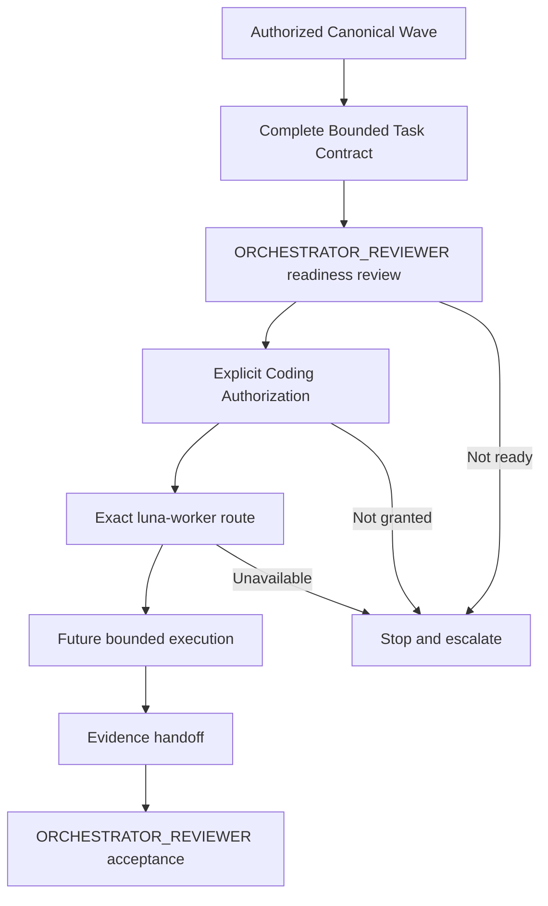

# AI Course Factory MVP Bounded Implementation Task Design v0.1

# 1. Document Status

| Field | Value |
| --- | --- |
| Document Name | AI Course Factory MVP Bounded Implementation Task Design |
| Version | v0.1 |
| Phase | Phase 1.3 — Implementation Preparation |
| Current Step | Step 9 — Bounded Implementation Task Design |
| Status | Review Draft |
| Coding | Not Started |
| Coding Authorization | Not Granted |
| Last Updated | 2026-08-10 |
| Input Baseline | PRD v0.3；Technical Spec Step 1–5；Implementation Boundary Step 6；Implementation Plan Step 7；Execution Plan Step 8 |
| Next Gate | Product Owner Review；Step 10 — Issue Specification / Task Package Design 只有在确认后才可开始 |

## 1.1 Source of Truth

本 Task Design 只使用以下逻辑输入，并且不修改其内容、状态或既有决策：

1. [AI Course Factory MVP PRD v0.3](../product/AI_Course_Factory_MVP_PRD_v0.3.md)
2. [AI Course Factory MVP Technical Spec v0.1 — Step 1–5](../technical-spec/AI_Course_Factory_MVP_Technical_Spec_v0.1.md)
3. [AI Course Factory MVP Implementation Boundary Spec v0.1 — Step 6](../technical-spec/AI_Course_Factory_MVP_Implementation_Boundary_Spec_v0.1.md)
4. [AI Course Factory MVP Implementation Plan v0.1 — Step 7](../implementation-plan/AI_Course_Factory_MVP_Implementation_Plan_v0.1.md)
5. [AI Course Factory MVP Execution Plan v0.1 — Step 8](../execution-plan/AI_Course_Factory_MVP_Execution_Plan_v0.1.md)

优先级继续采用：Approved PRD → Accepted Addendum → Decision Records → Strategy → Technical Spec → Implementation Boundary → Implementation Plan → Execution Plan → Task Design。

## 1.2 Status Qualification

本轮 Product Owner 指令授权生成 Step 9 Review Draft，不自动改变上游文件状态，也不构成 Coding Authorization。

当前仓库中的 Step 6、Step 7 与 Step 8 文件仍保留其原有 `Review Draft` 状态。本文件把它们作为已完成的逻辑设计输入使用，但不静默把它们改写为 Approved Baseline。未来是否允许创建 Task Instance、Issue 或代码，仍取决于上游批准、Step 9 / Step 10 评审和独立 Coding Authorization Gate。

# 2. Purpose

Step 9 不负责开发。它负责冻结以下转换规则：

```text
Implementation Plan Milestone
        ↓
Execution Plan Wave
        ↓
Bounded Implementation Task Boundary
```

本文件回答：

> 在未来获得 Coding Authorization 后，如何把一个已授权 Execution Wave 拆成 ownership 清晰、验收单一、依赖显式且可安全交给 luna-worker 的最小实现任务边界？

本文件只定义 Task Design，不创建 Task Instance。

必须区分：

- **Task Design 不是 Issue**：它定义未来 Task 的通用边界、模板与治理规则，不是 GitHub 中的追踪对象。
- **Task Design 不是 Goal**：它不启动长期自主执行，也不改变项目目标状态。
- **Task Design 不是 Coding Plan**：它不规定代码、文件树、函数、Schema、API、数据库或实现步骤。
- **Task Category 不是 Task Instance**：Category 只是允许的责任范围类型，没有 Task ID、文件范围、负责人实例或执行授权。
- **Execution Wave 不是 Task**：Wave 是带 Gate 的调度容器，一个 Wave 可以在未来包含多个 bounded tasks，但不会自动生成它们。

## 2.1 Step 9 Scope

Step 9 冻结：

- canonical Wave → future task category 映射；
- 单一 ownership 与验证目标；
- Bounded Task Contract 模板；
- ORCHESTRATOR_REVIEWER 与 luna-worker 的未来路由；
- task-level 并行、依赖和 merge-order 规则；
- future Issue 只能从 approved bounded task 生成的规则；
- Task Design、Task Instance、Issue 与执行授权之间的 Gate。

Step 9 不创建：Goal、Task Instance、Issue、Milestone object、Branch、Worktree、PR、Commit、Code 或 Agent Dispatch。

# 3. Task Design Principles

## 3.1 Single Ownership

每个未来 Task 只能拥有一个主要责任区域：

```text
One Future Task
    ↓ owns
One Primary Logical Module or One Stable Seam
    ↓ may read
Other Modules only through Frozen Interfaces
```

允许的边界形状：

- Artifact Layer 内的 Artifact Commit seam；
- Knowledge Layer 内的 GitHub Source Connector adapter；
- Production Layer 内的 Omni Provider Adapter；
- Workflow ownership 内的 Checkpoint / Resume behavior；
- 一个已冻结 Join seam 的 integration verification。

禁止的边界形状：

- “实现整个 Artifact System + Workflow + Provider”；
- 同时拥有 Workflow Gate 与 Production Retry policy；
- 同时修改 Production Request core contract 与 Provider Adapter；
- 同时拥有 UI current-version selection 与 Artifact selected-version facts；
- 以跨模块集成为名修改多个模块内部实现。

### Ownership Rules

1. `Ownership` 指逻辑模块或稳定 seam，不等同于文件夹名称。
2. `File Scope` 是未来 Task Instance 的执行保护范围，不是架构 ownership 的替代品。
3. 一个 task 可以修改 ownership 内的多个文件，只要只交付一个主要结果。
4. 一个 task 可以读取其他模块，但只能通过 frozen interface，不获得对方内部实现的写 ownership。
5. Integration task 只能拥有 Join seam 与 integration evidence，不自动拥有参与模块内部。
6. 同一 ownership 同一时间只能有一个 active writer。

## 3.2 Single Verification Target

每个未来 Task 必须具有：

- 明确输入；
- 明确输出；
- 明确可观察验收标准；
- 明确失败语义；
- 明确 evidence handoff。

Task Objective 必须能够用一句话表达一个结果。例如：

> 通过已冻结 Artifact Commit interface，把 validated Candidate 转换为 immutable exact Artifact Reference，并对等价重复提交返回同一业务结果。

这个句子只是目标形状示例，不是已创建的 Task Instance。

禁止使用：

- “完善 Artifact”；
- “实现 Workflow”；
- “接入 AI”；
- “处理所有边界情况”；
- “Build entire AI Course Factory”。

### Verification Rules

1. 验证面是模块 interface，而不是内部函数、文件数量或实现形状。
2. Acceptance Criteria 必须同时覆盖正常结果和适用的 fail-closed 结果。
3. 不得通过暴露内部 seam 来让测试更方便。
4. 外部 Provider / Storage task 必须通过 core-owned interface 提供可替换 test adapter evidence。
5. Verification Target 不能依赖尚未完成的隐藏工作。

## 3.3 Contract Preservation

未来 Task 可以：

- 实现已有 Interface；
- 实现已有 logical boundary；
- 实现已批准 Decision；
- 在 frozen interface 后选择最小内部 implementation；
- 提供满足同一 interface 的 local / mock adapter；
- 修复原 ownership 内、且不改变 contract 的实现问题。

未来 Task 不可以：

- 修改 Product Contract；
- 修改 Artifact Model、Version、Reference 或 stale 语义；
- 修改 Workflow ownership、Gate、Resume 或 Continue From Here 语义；
- 让 Agent 获得 Workflow、Artifact Commit、Provider、Retry 或 Human Approval 权限；
- 让 Skill 直接拥有 Artifact Commit 或 Workflow Transition；
- 让 Workflow 绕过 Production Orchestrator 调用 Skill / Provider；
- 修改 Production Request 的 provider-neutral 定位；
- 修改 Provider Adapter 的隔离责任；
- 新增 Agent、Skill、Provider、Renderer、Knowledge Source 或产品能力。

任何实现发现 frozen contract 不足时，Task 必须停止并返回 `SPECIFICATION_REVIEW_REQUIRED`，不能先修改 contract 再补文档。

## 3.4 Deep Task Boundary

Bounded 不等于细碎。一个有效的未来 Task 应把足够多的内部行为隐藏在一个小而稳定的 interface 后：

- 不按“每个文件一个 Task”拆分；
- 不把 validation、commit 与 idempotency 拆成互相穿透的 pass-through tasks；
- 不让调用方理解 Provider SDK、Storage key 或 Framework detail；
- 不为单一未来假设新增公共 seam；
- evidence 应能在不理解内部实现的情况下验证 Task 结果。

## 3.5 Exact Baseline and Wave Binding

每个未来 Task 必须绑定：

- 一个 canonical Execution Wave；
- 该 Wave 的 Entry Gate evidence；
- exact baseline versions；
- 一个 primary ownership；
- 明确 upstream dependencies；
- 明确 external side-effect posture。

不得使用：

- “当前最新版”；
- “前面讨论的版本”；
- “默认配置”；
- 隐式 current Wave；
- 未记录的口头依赖。

## 3.6 Authorization Separation

```text
Approved Task Design
    ≠ Approved Task Instance
    ≠ Created Issue
    ≠ Agent Dispatch
    ≠ Coding Authorization
```

未来 Task Instance 只有在以下条件全部满足后才能形成：

1. 上游 planning documents 已通过规定 Gate。
2. Product Owner 已明确进入相应阶段。
3. canonical Wave 已获得 Entry Authorization。
4. ORCHESTRATOR_REVIEWER 已完成具体 Task Contract readiness review。
5. 独立 Coding Authorization 已存在。

# 4. Wave to Task Mapping

## 4.1 Canonical Wave Rule

Step 8 的 W0–W8 是唯一 canonical Wave 编号：

| Canonical Wave | Frozen Step 8 Meaning |
| --- | --- |
| W0 | Authorization & Baseline Lock |
| W1 | Control Spine |
| W2 | Grounded Script Slice |
| W3 | Production Planning & Budget |
| W4 | Safe Production Closure |
| W5 | Provider-backed Production |
| W6 | Review & Recovery |
| W7 | Workspace & Packaging |
| W8 | MVP Acceptance |

Step 9 不重新编号、不重命名，也不把 W0 从授权 Gate 改成 implementation execution。

## 4.2 Task Category Crosswalk

本轮输入中提供的 category label 与 Step 8 canonical Wave 编号不一致。为保持 Step 8 不变，使用以下非破坏性交叉映射：

| Requested Category Label | Canonical Placement | Resolution |
| --- | --- | --- |
| “W0 Foundation Runtime” — Runtime Composition、Configuration Boundary、Storage Interface Skeleton | W1 — Control Spine | 作为 W1 task categories；W0 仍只有授权与基线锁定。 |
| “W1 Artifact Spine” — Artifact Reference、Artifact Commit、Dependency / Stale | W1 — Control Spine | 与 W1 Artifact control spine 合并，不创建第二个 W1。 |
| “W2 Workflow Control Spine” — Lifecycle、Checkpoint Resume、Command Processing | W1 — Control Spine | 作为 W1 Workflow ownership categories；W2 保持 Grounded Script。 |
| “W3 Source-to-Script” — Source Connector、Knowledge Agent Runtime、Content Agent Runtime | W2 — Grounded Script Slice | 内容保持，canonical 编号归一到 W2。 |
| “W4 Review Approval” — Review Artifact、Approval Record | W2 与 W6 | Script review records 属于 W2；Final video review records 属于 W6。 |
| “W5 Production Boundary” — Production Request、Production Orchestrator、Skill Contract | W3 与 W4 | Request planning 属于 W3；Orchestrator 与 Skills safe execution 属于 W4。 |
| “W6 Provider Integration” — Omni Adapter、TTS Adapter | W5 — Provider-backed Production | 保持 Provider Gate 与 safe production 前置条件。 |
| “W7 Recovery” — Failure Artifact、Scene Regeneration | W6 — Review & Recovery | 保持 exact dependency / stale / Impact Preview 前置条件。 |
| “W8 Packaging” — Packaging Layer、Validation Harness | W7 与 W8 | Packaging implementation 属于 W7；acceptance validation harness 属于 W8。 |

这个 Crosswalk 只纠正标签，不修改任何 category 内容，不创建实际 Task，也不改变 Step 8 的 hard ordering。

## 4.3 Canonical Mapping Overview

```mermaid
flowchart LR
    W0["W0 Authorization and Baseline Lock"]
    W1["W1 Control Spine"]
    W2["W2 Grounded Script Slice"]
    W3["W3 Production Planning and Budget"]
    W4["W4 Safe Production Closure"]
    W5["W5 Provider-backed Production"]
    W6["W6 Review and Recovery"]
    W7["W7 Workspace and Packaging"]
    W8["W8 MVP Acceptance"]

    W0 --> W1 --> W2 --> W3 --> W4 --> W5 --> W6 --> W7 --> W8
```



以下每项都是 future task category，不是 Task ID、Issue 或执行授权。

## 4.4 W0 — Authorization & Baseline Lock

### Implementation Responsibility

W0 不拥有 implementation responsibility。它只确认：

- Step 6、Step 7、Step 8、Step 9 的 review / approval state；
- Baseline Conflict Assessment；
- 独立 Coding Authorization；
- future Task Contract readiness；
- ownership、dependency 与 external-side-effect gate。

### Future Task Boundary

W0 不允许创建 implementation task category。Runtime、Configuration 与 Storage preparation 必须等待 W0 Exit Gate 后进入 W1。

### Exit Condition

没有明确 Coding Authorization 时，W0 保持关闭，所有 future task 仅能停留在 design category。

## 4.5 W1 — Control Spine

### Implementation Responsibility

建立 Artifact、Workflow、Storage、Configuration 与 Execution Record 的最小控制脊柱。

### Future Task Categories

| Category | Primary Ownership | Verification Target | Does Not Own |
| --- | --- | --- | --- |
| Runtime Composition | Runtime Composition seam | 只在启动时装配 selected implementations；业务模块不使用 Service Locator。 | Workflow lifecycle 或业务配置。 |
| Configuration Boundary | Configuration seam | 启动前 validation、最小分发与 fail-closed；secret 不进入业务状态。 | Audience、Scene、Budget 或 Artifact selection。 |
| Artifact Storage Adapter | Artifact Storage adapter seam | exact commit / retrieval behavior 满足 Artifact interface。 | Workflow checkpoint 或 provider attempt。 |
| Workflow Checkpoint Adapter | Checkpoint Storage adapter seam | 保存和恢复 control state + exact refs，不保存 payload。 | Artifact history。 |
| Execution Record Adapter | Execution Record adapter seam | reserve attempt、terminal outcome 与 replay guard 可验证。 | Artifact Version 或 Human Approval。 |
| Artifact Reference | Artifact identity / exact-reference seam | 所有引用绑定 Artifact ID + Version，不支持 implicit latest。 | Workflow selected-version decision。 |
| Artifact Commit | Artifact commit seam | validated Candidate → immutable exact Reference；等价重复不产生重复业务结果。 | Candidate 生产或 Workflow Transition。 |
| Dependency / Stale | Artifact dependency seam | exact dependency、Impact query 与 stale propagation 保留历史结果。 | Continue From Here 的用户确认。 |
| Lifecycle State | Workflow control seam | Lifecycle 与 Artifact Status 分离。 | Artifact payload。 |
| Checkpoint / Resume | Workflow resume seam | Human Interrupt / side effect 前后可恢复并重新绑定 exact refs。 | Artifact storage lifecycle。 |
| Command Processing | Workflow command seam | 重复 Command 不静默产生重复结果；Command Result 可审计。 | UI Draft 或 Provider Retry。 |

### Split Guards

- Artifact Reference 必须在 Artifact Commit 和 Workflow selected-ref 使用前稳定。
- Lifecycle / Checkpoint / Command 可以在同一 Workflow ownership 内进一步拆分，但不能由不同 tasks 同时修改 shared control contract。
- 三类 Storage Adapter 可以物理共享 persistence engine，但 Task ownership 与 evidence 必须保持三种语义。
- W1 不接入真实 Omni / TTS，也不产生媒体费用。

## 4.6 W2 — Grounded Script Slice

### Implementation Responsibility

建立 public GitHub Source → Knowledge → Plan / Script → Mandatory Script Review 的第一条纵向闭环。

### Future Task Categories

| Category | Primary Ownership | Verification Target | Does Not Own |
| --- | --- | --- | --- |
| Source Connector | Knowledge Layer / GitHub adapter | 获取批准范围内 public source，返回 normalized source result / failure。 | Teaching design 或 Script。 |
| Source Normalization | Knowledge Layer | 统一 source material、structure 与 provenance。 | External knowledge supplementation。 |
| Knowledge Agent Runtime | Knowledge Agent interface | exact Source refs → grounded Knowledge Candidate。 | Script、Workflow 或 Artifact Commit。 |
| Content Agent Runtime | Content Agent interface | exact Knowledge ref + constraints → Plan / Script Candidates。 | Storyboard、Timeline 或 Production。 |
| Script Grounding Validation | Artifact validation seam | 事实主张有 Source / Knowledge evidence；无来源主张 Hard Block。 | Creator Approval。 |
| Script Review Artifact | Reviewer / review-record seam | Reviewer 对 exact Script Version 输出 Hard Block / Warning / recommendation。 | Human decision。 |
| Script Approval Record | Artifact decision-record seam | Creator decision 精确绑定 Script Version。 | Reviewer evaluation 或 lifecycle progression。 |

### Split Guards

- Source Connector 与 Model Runtime Adapter 可以在 frozen interfaces 后并行准备。
- Knowledge Candidate Commit 必须先于 Content Agent 正式执行。
- Script Approval Record 不能与 Review Artifact 合并。
- W2 未批准 Script 不得进入 W3。

## 4.7 W3 — Production Planning & Budget

### Implementation Responsibility

把 exact Approved Script 转换为 provider-neutral planning artifacts 与有效 Budget Authorization。

### Future Task Categories

| Category | Primary Ownership | Verification Target | Does Not Own |
| --- | --- | --- | --- |
| Character / Storyboard Planning | Production Agent planning seam | Approved Script → Character / Storyboard Candidates。 | Omni、TTS 或 media execution。 |
| Optional Storyboard Review | Workflow gate seam | enabled 时强制 interrupt；disabled 时记录 skipped。 | Storyboard content generation。 |
| Timeline Planning | Production Agent planning seam | selected exact refs → provider-neutral Timeline Candidate。 | Provider Prompt。 |
| Production Request | Production Agent request-planning seam | Timeline → provider-neutral Production Request Candidate。 | Adapter mapping、Retry 或 execution。 |
| Production Budget Artifact | Budget preparation seam | exact Request Version → budget estimate / authorization target。 | Human Approval。 |
| Budget Approval Record | Artifact decision-record seam | Creator decision 精确绑定 Request Version。 | attempt execution。 |

### Split Guards

- Production Request contract 必须在 W5 Provider Adapter work 前稳定。
- Request 新 Version 使旧 Budget Approval 对新版本失效。
- Production Agent 不得承担 Production Orchestrator responsibility。
- W3 不调用 Omni、TTS、Audio Composer 或 Media Composer。

## 4.8 W4 — Safe Production Closure

### Implementation Responsibility

使用 local / mock adapters 证明 Production Orchestrator、approved Skills、Join、Artifact Commit 与 Video Candidate 路径。

### Future Task Categories

| Category | Primary Ownership | Verification Target | Does Not Own |
| --- | --- | --- | --- |
| Production Execution Entry | Production interface seam | 只接受 Approved Request + valid Budget Authorization。 | Human / Budget Approval。 |
| Production Orchestrator | Production ownership | Scene scope、Skill coordination、limited Retry、Failure Normalization 与 outcome aggregation。 | Teaching decision 或 Final Approval。 |
| Visual Generator Skill | Visual capability seam | provider-neutral visual input → Scene Visual Result / Failure。 | Workflow、Budget policy 或 Provider selection。 |
| Voice Skill | Voice capability seam | narration text → Scene Audio Result / Failure。 | Script revision 或 Master Audio。 |
| Audio Composer | Audio composition seam | required Scene Audio + optional BGM / Effect → Master Audio Result。 | TTS execution。 |
| Subtitle Skill | Subtitle capability seam | Script + Timeline → Subtitle Result。 | Script authoring。 |
| Media Composer | Media composition seam | Scene Visuals + Master Audio + Subtitle → Video Result。 | Final Approval 或 Packaging。 |
| Local / Mock Provider Adapters | matching test adapter seams | 同一 core-owned interface 下无费用、可重复的 production behavior。 | Gate、Commit 或 Review 的替代品。 |
| Production Join Verification | Orchestrator integration seam | required outputs Join；partial success preservation。 | 参与模块内部实现。 |

### Split Guards

- Production Orchestrator 先拥有 shared coordination contract；不同 Skill implementations 才可并行。
- Skill 只返回 Result / Failure，不直接 Commit Artifact。
- Workflow 与 Agent 均不得直接调用 Skill。
- W4 的 mock adapters 不得暗中调用真实 Provider。

## 4.9 W5 — Provider-backed Production

### Implementation Responsibility

在 W4 safe closure 与 external-side-effect guards 通过后接入已批准的 Omni 与 TTS。

### Future Task Categories

| Category | Primary Ownership | Verification Target | Does Not Own |
| --- | --- | --- | --- |
| Omni Adapter | Visual Provider adapter seam | provider-neutral input → Omni-specific request → normalized visual Result / Failure。 | Production Request、Budget 或 Retry policy。 |
| TTS Adapter | Voice Provider adapter seam | approved narration intent → TTS request → normalized Scene Audio Result / Failure。 | Script、Master Audio 或 Workflow。 |
| Provider Response Validation | matching Adapter seam | untrusted response、media metadata、scope 与 error validation。 | Business quality review。 |
| Paid Attempt Guard Integration | Orchestrator / Execution Record Join seam | 每次调用前检查 Request Version、Scene、Attempt、Budget 与 Idempotency。 | Human Budget Approval。 |

### Split Guards

- Omni 与 TTS Adapter 可以在不同 core-owned interface 和 credential scope 下并行。
- Provider Adapter 不得反向修改 Production Request。
- 真实调用必须经过 existing Budget / Attempt / Idempotency Gate。
- 不新增第二 Visual Provider、Provider Router 或 automatic failover。

## 4.10 W6 — Review & Recovery

### Implementation Responsibility

完成 exact Video review、Final Approval、四类 Failure、Impact Preview 与 Scene-level recovery。

### Future Task Categories

| Category | Primary Ownership | Verification Target | Does Not Own |
| --- | --- | --- | --- |
| Video Review Artifact | Reviewer interface | exact Video Version → Pass / Warning / Hard Block / recommendation Candidate。 | Creator Approval。 |
| Final Approval Record | Artifact decision-record seam | Creator decision 绑定 exact Video Version；Hard Block 不可绕过。 | Reviewer evaluation。 |
| Failure Artifact | Artifact failure-record seam | Provider Error、Generation Failure、Quality Failure、Budget Limit 可追踪。 | 第五类 Product Failure。 |
| Impact Preview | Artifact dependency query seam | 计算 selected upstream Version 变更的精确 downstream impact。 | 用户确认或 stale propagation execution。 |
| Continue From Here | Workflow control seam | exact entry selection → preview → confirmation → controlled resume。 | implicit latest。 |
| Scene Regeneration | Production recovery seam | 只重建受影响 Scene outputs，复用有效 sibling results。 | 全任务重跑。 |
| Manual Scene Clip Recovery | Production recovery seam | manual clip provenance + composition-only resume。 | 自动 Provider 调用。 |
| Recovery Integration Verification | Workflow / Artifact / Production Join seam | 新 Video Version 返回 Reviewer / Final Gate。 | 各模块内部 implementation。 |

### Split Guards

- Review Artifact 与 Approval Record 永远分开。
- dependency / stale / Impact Preview 必须先稳定，才允许 Scene regeneration。
- 同一 Scene dependency / stale seam 不允许多个 active writers。
- 新 Video Version 必须重新 Reviewer Evaluation 与 Final Review。

## 4.11 W7 — Workspace & Packaging

### Implementation Responsibility

完成 Artifact-centric Single Task Workspace 与 Final Approval 后的 Publish Package。

### Future Task Categories

| Category | Primary Ownership | Verification Target | Does Not Own |
| --- | --- | --- | --- |
| Workspace Read Projection | Application query seam | 展示 authoritative lifecycle、selected refs、Review、Budget、Failure 与 Impact Preview。 | 业务事实写入。 |
| Workspace Command Interaction | Application command seam | 所有 user action 只提交 Workflow Command。 | Agent、Skill、Provider 直调。 |
| UI Draft Isolation | Application local-state seam | 未提交 Draft 不进入 Workflow Checkpoint 或 Artifact facts。 | Artifact Version。 |
| Media Package | Packaging seam | 汇集 approved media refs。 | Final Approval。 |
| Metadata Package | Packaging seam | Title、Description、Cover 等 approved metadata Candidate / refs。 | 自动发布。 |
| Artifact Manifest | Packaging seam | exact lineage、Version 与 decision records 可验证。 | Artifact Storage implementation。 |
| Publish Package | Packaging Join seam | Media + Metadata + Manifest → exact Package Reference。 | 渠道发布。 |

### Split Guards

- Workspace read projection 与 Packaging preparation 可以在 frozen inputs 后并行。
- 所有 write interaction 必须经过 Workflow Command。
- Final Video 未批准时不得正式执行 Packaging。
- 不增加 Cover Provider、多平台 Profile 或自动发布。

## 4.12 W8 — MVP Acceptance

### Implementation Responsibility

W8 不新增产品实现范围。它验证 W1–W7 的 Demo、AC-01 至 AC-14、边界与 release readiness。

### Future Task Categories

| Category | Primary Ownership | Verification Target | Does Not Own |
| --- | --- | --- | --- |
| Acceptance Validation Harness | Acceptance evidence seam | 可复现验证 PRD AC-01 至 AC-14 与 exact lineage。 | 新产品功能。 |
| Boundary Compliance Review | ORCHESTRATOR_REVIEWER review seam | Artifact、Workflow、Agent、Skill、Orchestrator、Adapter boundaries 未被破坏。 | 普通实现。 |
| Failure / Recovery Acceptance | Acceptance evidence seam | 四类 Failure、retry limit、Resume、Continue From Here、manual clip。 | 新恢复策略。 |
| Security / External-side-effect Review | Acceptance evidence seam | credential、untrusted input、paid attempt 与 Provider leakage guards。 | 新 Provider。 |
| Release Readiness Assessment | Product Owner decision input | 汇总 evidence、known limitations、residual risk 与 exceptions。 | 自动部署或发布。 |

### Split Guards

- evidence collection 可以按 domain 并行，最终必须 Join。
- W8 发现的 defect 返回原 ownership；不得以验收名义扩大范围。
- 如果修复需要 contract change，返回 specification review。
- Completed 仍只表示 Final Video Approved、Packaging Complete、Publish Package Ready。

# 5. Bounded Task Contract Template

未来所有 Task Instance 必须使用以下完整模板。当前不填写模板，不产生 Task ID：

```text
Task ID:

Wave:

Ownership:

Logical Module:

Responsible Role:

Agent Route:

Baseline References:

Task Objective:

Background:

Current Preconditions:

Allowed Changes:

Forbidden Changes:

Input Contract:

Output Contract:

Dependencies:

Non-goals:

Acceptance Criteria:

Verification Requirements:

Risk:

Escalation Conditions:

Expected Handoff:
```

## 5.1 Template Semantics

| Field | Required Meaning |
| --- | --- |
| Task ID | 未来由 approved task-package process 分配的稳定标识；本 Step 不分配。 |
| Wave | Step 8 canonical W0–W8；implementation task 只能位于已开放的 W1–W8。 |
| Ownership | 一个 primary logical module 或 stable seam。 |
| Logical Module | 该 ownership 所属的 frozen architecture module。 |
| Responsible Role | 普通 bounded implementation 通常由 luna-worker 执行；review 由 ORCHESTRATOR_REVIEWER。 |
| Agent Route | 精确工程角色名；不得使用模糊“AI Agent”。 |
| Baseline References | exact document version、section、Milestone / Wave 与 applicable invariants。 |
| Task Objective | 一个可完成、可验证的工程结果。 |
| Background | 为什么该结果是当前 Wave 所必需；不重复整份 PRD。 |
| Current Preconditions | Entry Gate、upstream evidence、environment 与 external authorization。 |
| Allowed Changes | ownership 内允许的 implementation decisions。 |
| Forbidden Changes | frozen contracts、scope 与 external side effects。 |
| Input Contract | 调用方提供的 frozen semantic input；不定义字段级 Schema。 |
| Output Contract | 可观察 result / failure / exact reference behavior。 |
| Dependencies | prerequisite、blocking dependency、Join 与 merge order。 |
| Non-goals | 本 Task 不顺带完成的功能和平台能力。 |
| Acceptance Criteria | 可观察行为与错误语义。 |
| Verification Requirements | 必须返回的 evidence class。 |
| Risk | 该 ownership 特有的 contract、side-effect 或 integration 风险。 |
| Escalation Conditions | 何时停止并交回 ORCHESTRATOR_REVIEWER / Product Owner。 |
| Expected Handoff | READY、BLOCKED 或 review-required 状态以及 evidence。 |

## 5.2 Task Contract Validity Gate

只有同时满足以下条件，未来 Task Contract 才能被认为 `READY_FOR_AUTHORIZATION`：

1. 所有必填字段已填充且无 implicit latest。
2. 只有一个 primary ownership。
3. Objective 只有一个 verification target。
4. upstream dependencies 与 merge order 显式。
5. Allowed / Forbidden Changes 不冲突。
6. Acceptance Criteria 可以通过 frozen interface 观察。
7. Agent Route、external-side-effect posture 与 escalation 明确。
8. ORCHESTRATOR_REVIEWER 完成 readiness review。
9. 该状态仍不等于 Coding Authorization。

# 6. Agent Routing Rules

## 6.1 Engineering Roles Are Not Product Agents

`ORCHESTRATOR_REVIEWER` 与 `luna-worker` 是未来工程执行角色，不属于 AI Course Factory runtime Agent Layer，不改变四个产品 Agent：Knowledge Agent、Content Agent、Production Agent、Reviewer。

## 6.2 ORCHESTRATOR_REVIEWER

负责：

- 解释 baseline precedence 与 frozen contracts；
- 把 authorized Wave 拆分为 non-overlapping future Task Contracts；
- 审核 single ownership、dependencies、parallel eligibility 与 merge order；
- 处理跨模块、shared seam 与 integration 问题；
- 审核 luna-worker 的 scope、evidence 与 boundary compliance；
- 执行 task acceptance、Join review 与 Wave Exit assessment；
- 把 architecture、scope、provider、credential、budget 与 authorization blocker 升级给 Product Owner。

不负责：

- 普通 bounded implementation；
- 授予 Product Owner Approval 或 Coding Authorization；
- 以 review 身份修改 frozen contract；
- 增加 Agent、Skill、Provider、Renderer、Source 或产品能力；
- 在没有 Task Contract 时派发工作。

## 6.3 luna-worker

未来负责已授权的 bounded implementation，例如符合本文件规则的 Artifact Commit seam、GitHub Connector 或 Omni Adapter work。

每次调用前必须收到：

- 完整 Task Contract；
- canonical Wave 与 Entry evidence；
- primary Ownership；
- explicit file scope；
- Baseline References；
- Acceptance Criteria；
- Verification Requirements；
- Non-goals；
- external-side-effect / budget policy；
- Expected Handoff。

禁止：

- 没有完整 Task Contract 时直接调用；
- 自行选择或扩大 ownership；
- 修改 frozen interface；
- 新增依赖、Provider、Skill、Agent、Renderer 或 infrastructure；
- 回滚用户或其他 worker 的无关改动；
- 在 Provider / credential / budget 不明时尝试真实调用；
- 静默改用其他 worker profile。

若精确 `luna-worker` 路由不可用，返回 `BLOCKED_LUNA_WORKER_UNAVAILABLE` 并等待 Product Owner 处理，不得 fallback。

## 6.4 Routing Gate



当前流程停在 Task Design；图中的 Contract Instance、Route 与 Execute 均未发生。

# 7. Parallel Execution Rules

## 7.1 Parallel Eligibility

两个未来 Tasks 只有同时满足以下条件才允许并行：

1. canonical Wave 已开放；跨 Wave preparation 不得触发未开放 Wave 的实现或副作用。
2. 不共享未冻结 Contract。
3. 不修改同一 primary ownership、stable interface、persistence seam 或 shared files。
4. 不依赖对方尚未产生的输出。
5. 不存在 Artifact Commit、Gate、Budget、Provider side effect 或 merge-order 先后关系。
6. 可以各自独立提供 acceptance evidence。
7. ORCHESTRATOR_REVIEWER 已定义明确 Join 和 conflict owner。

任一条件不满足，必须顺序执行。

## 7.2 Allowed Parallel Shapes

在对应 Wave 已开放、contracts 已冻结且 ownership 不重叠时，可以并行：

- Artifact Storage Adapter 与 Workflow Checkpoint Adapter；
- GitHub Source Connector 与 Model Runtime Adapter；
- W4 中 Visual、Narration 与 Subtitle / Timing Skills；
- W5 中 Omni Adapter 与 TTS Adapter；
- W7 中 Workspace read projection 与无副作用 Packaging preparation；
- W8 中不同 acceptance domain 的 evidence collection；
- 不修改 frozen contract 的 documentation / evidence preparation。

附件中“Artifact Storage Adapter + Mock Provider Adapter + Documentation”的示例只说明 ownership 可能不重叠，不能绕过 Wave Gate。在 canonical sequence 中，Artifact Storage Adapter 属于 W1，而 Mock Provider Adapter 属于 W4；W4 未开放时，不能因为二者技术上独立就提前执行 Mock Provider implementation。

## 7.3 Forbidden Parallel Shapes

禁止并行：

| Pair / Shape | Reason |
| --- | --- |
| Artifact Reference Model + Workflow State Model 的初始 shared-reference contract work | 两者共同依赖 exact Reference 与 selected-ref control semantics；必须先由单一 owner 稳定 shared contract。 |
| Artifact Commit + Artifact identity contract change | Commit 依赖 identity；不能边实现边改变上游 contract。 |
| Production Request + Provider Adapter | Adapter 依赖 provider-neutral Request contract；W3 先于 W5。 |
| Production Orchestrator shared retry seam + Paid Attempt Guard integration | 同一 attempt / retry ownership；避免重复 side effect。 |
| Dependency / Stale core seam + Scene Regeneration | Recovery 依赖 exact impact semantics；W1 / W6 有硬顺序。 |
| Final Approval semantics + Publish Package execution | Packaging 只能消费已冻结的 approved Video decision。 |
| Two workers on the same stable interface or file scope | 会产生 contract drift、merge conflict 与事实源分裂。 |

## 7.4 Parallel Join Rules

每组并行 Tasks 必须预先定义：

- shared frozen input；
- independent outputs；
- Join owner；
- acceptance order；
- merge order；
- failure isolation；
- 哪一方失败时另一方 evidence 是否仍有效。

并行完成不等于自动 Join；ORCHESTRATOR_REVIEWER 必须验证组合后的 interface behavior。

# 8. Future Issue Generation Rules

## 8.1 Issue Derivation Rule

未来 GitHub Issue 必须来自一个已经批准的 Bounded Task Contract：

```text
Approved Bounded Task Contract
        ↓ exact derivation
Future GitHub Issue
```

禁止从以下输入直接创建 Issue：

- 模糊聊天目标；
- Execution Wave 名称；
- Milestone 名称；
- 未评审的 Task Category；
- “Build entire AI Course Factory”；
- 未经批准的 bug / feature idea；
- Agent 自行推断的后续工作。

## 8.2 Future Issue Template

```text
Issue Title:

Wave:

Task ID:

Ownership:

Objective:

Acceptance Criteria:

Dependencies:

Non-goals:
```

Issue 还必须链接完整 Task Contract 与 Baseline References；简化 Issue body 不能取代 Task Contract。

## 8.3 Issue Generation Gate

未来创建 Issue 前必须满足：

1. Task Contract 状态为 approved / authorized，而不是 Review Draft。
2. Task ID 已由 Step 10 规定的流程分配。
3. canonical Wave 已通过 Entry Gate。
4. ownership 不与 active work 冲突。
5. dependencies、acceptance、Non-goals 与 merge order 已冻结。
6. Product Owner 已允许进入 Issue / Task Package 阶段。
7. 创建 Issue 仍不自动等于允许 luna-worker 写代码；Coding Authorization 必须独立存在。

## 8.4 Issue Scope Rules

- 默认一个 Issue 对应一个 approved bounded Task。
- 只有当多个极小结果共享同一 ownership、同一 acceptance 和同一 merge order 时，才能由 ORCHESTRATOR_REVIEWER 提议紧密分组；不得跨 ownership 分组。
- Issue Title 必须表达 outcome，不使用“misc”、“cleanup”、“complete module”或“all remaining work”。
- Issue 不能修改 Task Contract，只能忠实追踪它。
- Scope expansion 必须停止并回到 Task Design / specification review，不能追加到现有 Issue。

本 Step 9 未创建任何 Issue。

# 9. Task Dependency Rules

## 9.1 Explicit Dependency Contract

每个未来 Task 必须显式说明：

- `prerequisite`：开始前必须已经存在的 contract、evidence 或 environment；
- `blocking dependency`：未完成时禁止本 Task 开始的 upstream Task / Gate；
- `consumed output`：本 Task 使用的 exact upstream result；
- `Join dependency`：多个并行结果在哪个 seam 汇合；
- `merge order`：哪些变更必须先被接受 / 合并；
- `external dependency`：Provider、credential、budget、source 或 environment；
- `failure propagation`：upstream 失败后本 Task 是 blocked、仍可验证还是必须失效。

禁止隐藏依赖在：

- 文件 import；
- Agent conversation；
- UI memory；
- implicit latest；
- 开发者个人环境；
- 未记录的 Provider capability 假设。

## 9.2 Dependency Expression

以下只表示未来依赖语法，不创建 Task A 或 Task B：

```text
Task A — Upstream Outcome
    ↓ produces an exact accepted output / frozen interface
Task B — Downstream Outcome
```

Task B 的 Contract 必须写明：

- Task A 是 prerequisite 还是 blocking dependency；
- 消费哪个 accepted output；
- 需要哪个 merge / acceptance state；
- Task A revision 是否使 Task B stale 或需要 re-verification。

## 9.3 Cross-wave Dependencies

| Downstream Category | Required Upstream Outcome |
| --- | --- |
| W2 Agent runtimes | W1 exact Artifact Reference、Commit、Workflow Command / Resume seams。 |
| W3 Production Request | W2 exact Approved Script Reference。 |
| W4 Production Orchestrator execution | W3 Approved Production Request + valid Budget Authorization。 |
| W5 Provider Adapters | W4 safe production interfaces、Execution Record 与 side-effect guards。 |
| W6 Scene Recovery | W1 dependency / stale + W5 failure normalization + exact media lineage。 |
| W7 Packaging | W6 exact Video Review + Final Approval + recovery semantics。 |
| W8 Acceptance | W1–W7 Exit evidence。 |

## 9.4 Merge Order Rules

1. Core-owned interface / contract implementation 先于 Adapter implementation。
2. Artifact identity / exact Reference 先于 Commit consumers。
3. Candidate Commit evidence 先于 Workflow selected-ref progression。
4. Workflow Gate 先于 paid Provider integration。
5. Production Request acceptance 先于 Provider Adapter acceptance。
6. Safe mock path acceptance 先于 real Provider path acceptance。
7. dependency / stale / Impact Preview acceptance 先于 Scene regeneration。
8. Final Approval acceptance 先于 Packaging execution。
9. 参与模块 task acceptance 先于 integration task acceptance。

## 9.5 Dependency Failure Rules

- Upstream Task blocked：所有 blocking downstream Tasks 保持 Not Ready，不得用 stub 绕过 frozen behavior。
- Upstream contract revised：ORCHESTRATOR_REVIEWER 重新进行 impact review；下游 evidence 可能需要 re-verification。
- External dependency unavailable：返回 `EXTERNAL_AUTHORIZATION_REQUIRED` 或适用 blocker，不切换未经批准 Provider。
- Circular dependency：Task Design invalid，必须重新划分 ownership；不得以并行协作掩盖循环。
- Merge-order conflict：暂停后进入 ORCHESTRATOR_REVIEWER review，不由 worker 自行重写顺序。

# 10. Step 9 Exit Criteria

| Criterion | Status |
| --- | --- |
| Wave → Task mapping | Passed；使用 Step 8 canonical W0–W8 并完成 category crosswalk。 |
| Task boundary rules | Passed |
| Single ownership | Passed |
| Single verification target | Passed |
| Contract preservation | Passed |
| Task contract template | Passed |
| Agent routing | Passed |
| Parallel rules | Passed |
| Issue generation rules | Passed |
| Dependency / merge-order rules | Passed |
| No Goal created | Passed |
| No Issue created | Passed |
| No Task Instance created | Passed |
| No Branch / Worktree / PR / Commit created | Passed |
| No luna-worker dispatched | Passed |
| No Coding | Passed |
| Step 1–8 unchanged | Passed |
| Baseline Conflict Assessment | Passed after canonical Wave normalization |

## 10.1 Baseline Conflict Assessment

**Result：Passed after canonical Wave normalization。**

发现并处理的差异：

1. Step 8 把 W0 定义为 Authorization & Baseline Lock；本轮输入把 “Foundation Runtime” 标成 W0。
2. 本轮输入的其余 category labels 也与 Step 8 W1–W8 存在整体重排和跨 Wave 聚合。
3. 如果直接采用这些新编号，会改变 Step 8 的 hard ordering，并可能让 Runtime work 在 Coding Authorization 之前出现。

解决方式：

- Step 8 canonical W0–W8 不变；
- 所有要求的 task categories 均保留，并按真实 dependency 映射到 canonical Wave；
- W0 保持纯授权 Gate，不产生 implementation task；
- Crosswalk 已在 4.2 明确记录；
- 没有修改 Step 1–8 或任何架构 Contract。

上游状态说明：Step 6–8 的文件状态仍为 Review Draft。Step 9 可以作为 Review Draft 完成，但 Task Instance、Issue、Agent Dispatch 和 Coding Gate 继续关闭。

## 10.2 Final Integrity Check

- Technical Spec Step 1–5 未修改。
- Step 6 Implementation Boundary 未修改。
- Step 7 Implementation Plan 未修改。
- Step 8 Execution Plan 未修改。
- 未创建 Goal。
- 未创建 GitHub Issue 或 Milestone object。
- 未创建 Implementation Task Instance。
- 未创建 Branch、Worktree、PR、Commit 或 Code。
- 未派遣 `luna-worker` 或其他 Coding Agent。
- 未进入 Coding。
- 未改变 Artifact、Workflow、Agent、Skill、Production Orchestrator、Provider Adapter 或 Packaging Contract。

# 11. Current Status

```text
Phase 1.3 Step 9 — Bounded Implementation Task Design

Status:
Review Draft Complete

Goal:
Not Started

Issue:
Not Created

Branch:
Not Created

PR:
Not Created

Coding:
Not Started

Coding Authorization:
Not Granted
```

## Next

```text
Step 10 — Issue Specification / Task Package Design
Status — Not Started
Waiting for Product Owner confirmation
```
