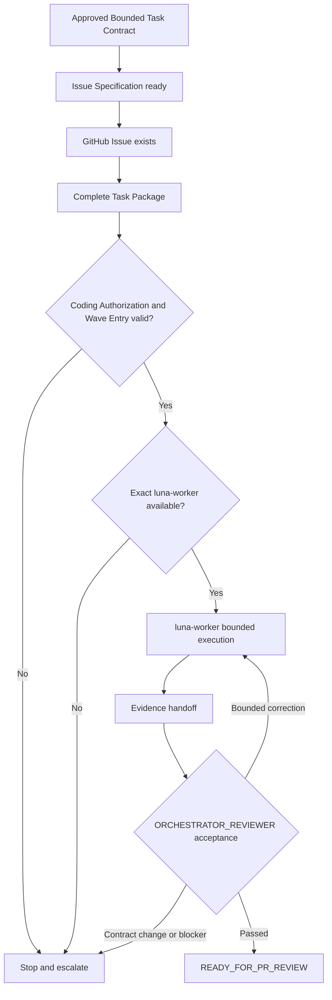
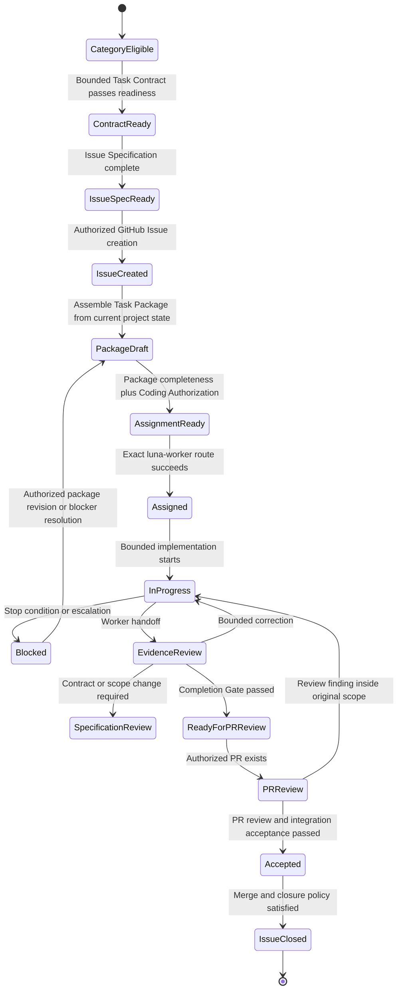

# AI Course Factory MVP Issue and Task Package Spec v0.1

## 1. Document Status

| Field | Value |
| --- | --- |
| Document | AI Course Factory MVP Issue and Task Package Specification |
| Version | v0.1 |
| Phase | Phase 1.3 Step 10 — Issue Specification / Task Package Design |
| Status | Review Draft |
| Coding | Not Started |
| Coding Authorization | Not Granted |
| Last Updated | 2026-08-10 |
| Input Baseline | PRD v0.3；Renderer Addendum；Technical Spec Step 1–5；Implementation Boundary Step 6；Implementation Plan Step 7；Execution Plan Step 8；Bounded Task Design Step 9 |
| Next Gate | Product Owner Review；本文件获批不自动创建 Issue、Task Package Instance、Agent Assignment、Branch、PR 或代码 |

### 1.1 Purpose

本文档定义未来如何把一个已经过审的 Bounded Implementation Task 转换为：

- 可创建 GitHub Issue 的标准 Issue Specification；
- 可交给工程执行角色的完整 Task Package；
- 可审计的 Agent Assignment、验收和未来 PR Review 入口。

本文档回答：

> Issue 如何从已批准的任务边界产生，Task Package 如何形成，任务在什么条件下可以交给 `luna-worker`，以及实现结果在什么条件下可以进入未来 PR Review？

本文档只设计规范，不创建真实 Task Instance、GitHub Issue、Goal、Branch、Worktree、PR、Commit、代码或 Agent Dispatch。

### 1.2 Current Authorization

当前仅授权 Step 10 文档固化：

| Object or Action | Current State |
| --- | --- |
| Goal | Not Started |
| GitHub Issue | Not Created |
| Implementation Task Instance | Not Created |
| Task Package Instance | Not Created |
| Agent Assignment | Not Created |
| luna-worker Dispatch | Not Started |
| Branch / Worktree | Not Created |
| PR | Not Created |
| Coding | Not Started |
| Coding Authorization | Not Granted |

文中出现的模板、状态、Gate、字段和流程都表示未来治理规则，不表示任何实例已经存在。

## 2. Step 10 Scope

### 2.1 In Scope

Step 10 冻结以下规范：

1. Issue Specification 的标准字段、边界与 readiness gate。
2. Task Package 的标准字段、完整性规则与 Issue binding。
3. Bounded Task Contract、Issue Specification、GitHub Issue、Task Package、Agent Assignment、Implementation 与 PR Review 的关系。
4. `ORCHESTRATOR_REVIEWER` 与 `luna-worker` 的未来工程执行路由。
5. Task dependency、parallel eligibility、acceptance、completion、handoff 与 escalation 规则。
6. Future GitHub Issue 的生成、更新、分组、关闭和 PR traceability 规则。

### 2.2 Explicitly Out of Scope

Step 10 不允许：

- 创建真实 GitHub Issue 或 GitHub Milestone object；
- 生成或填写真实 Implementation Task Instance；
- 生成或填写真实 Task Package Instance；
- 创建 Goal、Branch、Worktree、PR、Commit 或 Release；
- 调用或派发 `luna-worker`；
- 编写、修改或审查实现代码；
- 设计 API Endpoint、数据库 Schema、文件目录或字段级实现模型；
- 修改 Step 1–9 的任何文件、状态或 Contract；
- 新增 Agent、Skill、Provider、Renderer、Knowledge Source 或产品能力；
- 授予或推断 Coding Authorization。

### 2.3 Canonical Derivation Chain

用户要求的未来执行链保留，同时加入 Step 9 已冻结的 Bounded Task Contract Gate：

```mermaid
flowchart LR
    Plan["Implementation Plan"]
    Wave["Canonical Execution Wave"]
    Category["Task Category"]
    Contract["Approved Bounded Task Contract"]
    IssueSpec["Issue Specification"]
    Issue["Future GitHub Issue"]
    Package["Complete Task Package"]
    Assignment["Authorized Agent Assignment"]
    Implementation["Implementation"]
    PRGate["Acceptance and PR Readiness Gate"]
    PR["Future PR Review"]

    Plan --> Wave --> Category --> Contract --> IssueSpec --> Issue --> Package --> Assignment --> Implementation --> PRGate --> PR
```



解释：

- Execution Wave、Task Category 与 Bounded Task Contract 都不是 Issue。
- Issue Specification 是创建 Issue 前的规范化定义，不是 GitHub Issue 实例。
- GitHub Issue 是追踪对象，不是产品或架构事实源。
- Task Package 是执行包，不替代 Issue，也不修改 Bounded Task Contract。
- Agent Assignment 只有在 Issue 已存在、Task Package 完整、Coding Authorization 有效且 Wave 已开放后才能发生。
- Implementation 完成不自动等于 PR 可审；必须通过本文件定义的 Acceptance and PR Readiness Gate。

### 2.4 Canonical Wave Guard

Step 8 的 W0–W8 保持唯一 canonical 编号：

| Wave | Canonical Meaning |
| --- | --- |
| W0 | Authorization & Baseline Lock |
| W1 | Control Spine |
| W2 | Grounded Script Slice |
| W3 | Production Planning & Budget |
| W4 | Safe Production Closure |
| W5 | Provider-backed Production |
| W6 | Review & Recovery |
| W7 | Workspace & Packaging |
| W8 | MVP Acceptance |

W0 不产生 Implementation Issue 或 Task Package。任何未来 implementation Issue 只能属于已开放的 W1–W8，并继续遵守 Step 9 的 Task Category crosswalk。

## 3. Source of Truth

### 3.1 Required Inputs

本文件已基于以下输入进行交叉核对，并且不修改其内容或状态：

1. [AI Course Factory MVP PRD v0.3 — Approved Baseline](../product/AI_Course_Factory_MVP_PRD_v0.3.md)
2. [Renderer Strategy Revision Addendum v1.0 — Accepted](../architecture/Renderer_Strategy_Revision_Addendum_v1.0.md)
3. [AI Course Factory MVP Technical Spec v0.1 — Step 1–5](../technical-spec/AI_Course_Factory_MVP_Technical_Spec_v0.1.md)
4. [AI Course Factory MVP Implementation Boundary Spec v0.1 — Step 6 Review Draft](../technical-spec/AI_Course_Factory_MVP_Implementation_Boundary_Spec_v0.1.md)
5. [AI Course Factory MVP Implementation Plan v0.1 — Step 7 Review Draft](../implementation-plan/AI_Course_Factory_MVP_Implementation_Plan_v0.1.md)
6. [AI Course Factory MVP Execution Plan v0.1 — Step 8 Review Draft](../execution-plan/AI_Course_Factory_MVP_Execution_Plan_v0.1.md)
7. [AI Course Factory MVP Bounded Implementation Task Design v0.1 — Step 9 Review Draft](AI_Course_Factory_MVP_Bounded_Implementation_Task_Design_v0.1.md)

### 3.2 Precedence

冲突优先级固定为：

```text
Approved PRD
    ↓
Accepted Architecture Decision / Addendum
    ↓
Technical Spec
    ↓
Implementation Boundary
    ↓
Implementation Plan
    ↓
Execution Plan
    ↓
Bounded Task Design
    ↓
Issue and Task Package Spec
```

Step 10 不具有修改上游 Contract 的权限。

### 3.3 Conflict Handling Rule

若未来 Issue Specification 或 Task Package 与上游 Contract 冲突：

1. 停止受影响的 Issue / Package readiness review。
2. 精确指出冲突来源、版本、章节和受影响字段。
3. 说明继续执行会破坏的 ownership、interface、Artifact、Workflow、Provider 或产品边界。
4. 由 `ORCHESTRATOR_REVIEWER` 提出最小解决选项。
5. 需要 Contract 变更时返回 Product Owner / specification review。
6. 在明确决定前，不创建 Issue、不派发 Agent、不进入 Coding。

不得通过修改 Issue body、Task Package、Agent Prompt 或 PR 描述静默覆盖上游决策。

### 3.4 Frozen Contract Guard

所有未来 Issue 与 Task Package 必须保留：

- Artifact First、immutable Version、exact Reference、dependency、stale 与 Impact Preview；
- Top-level Workflow 对 Lifecycle、Human Gate、Budget Gate、Checkpoint、Resume 与 Continue From Here 的唯一 ownership；
- 四个产品 Agent：Knowledge Agent、Content Agent、Production Agent、Reviewer；
- Production Orchestrator 作为 Production 唯一执行入口；
- Agent、Skill、Production Orchestrator、Provider Adapter 与 Artifact Commit 的既有边界；
- provider-neutral Timeline 与 Production Request；
- Prompt + Omni Hybrid Production；
- Provider Error、Generation Failure、Quality Failure、Budget Limit 四类 Product Failure；
- Fixed 6 Scene 作为 MVP Template Constraint，而不是 Workflow State shape；
- Final Approval 后才允许 Packaging，Completed 必须意味着 Publish Package Ready。

## 4. Issue Specification Model

### 4.1 Definition

Issue Specification 是未来创建 GitHub Issue 前的规范化、可评审定义。它必须从一个已经通过 readiness review 的 Bounded Task Contract 精确派生。

Issue Specification：

- 约束 Issue 要追踪的单一工程结果；
- 绑定 canonical Wave、Milestone、Task Category 与 primary ownership；
- 保存 Baseline References、修改边界、验收和阻塞语义；
- 是 Task Package 的输入之一；
- 不授予 Coding Authorization，也不代表 GitHub Issue 已创建。

### 4.2 Standard Issue Specification Template

未来每个 Issue Specification 必须使用以下完整结构。当前模板不填写，不分配 Issue ID，也不形成 Issue 实例：

```text
Issue ID:

Title:

所属 Wave:

所属 Milestone:

所属 Task Category:

Owner:

负责 Agent:

状态:

背景:

目标:

用户价值:

技术目标:

依赖:

前置条件:

输入文档:

修改范围:

非修改范围:

接口约束:

Artifact / Workflow 影响:

验收标准:

测试要求:

风险:

阻塞条件:

完成定义:
```

### 4.3 Field Semantics

| Field | Required Meaning | Invalid Content |
| --- | --- | --- |
| Issue ID | GitHub Issue 实例创建后获得的稳定追踪标识；创建前保持 pending，不伪造编号。 | 临时聊天编号、Wave 编号或 Task Category 名称。 |
| Title | 以结果为中心的简短标题，表达一个可观察工程 Outcome。 | “完善系统”、“cleanup”、“实现全部 Workflow”。 |
| 所属 Wave | Step 8 canonical W1–W8；W0 不接受 implementation Issue。 | 重编号 Wave、隐式 current Wave。 |
| 所属 Milestone | Step 7 M1–M8 中与 Wave 对应的 Milestone。 | 新建或改写 Milestone Outcome。 |
| 所属 Task Category | Step 9 中该 canonical Wave 已允许的 category。 | 未评审 category、跨 Wave 拼接。 |
| Owner | 唯一 primary logical module / stable seam owner。 | 多个互不相关 ownership。 |
| 负责 Agent | 未来工程执行路由；普通 bounded implementation 为精确 `luna-worker`。 | 产品 Agent 名称、模糊“AI Agent”、未经批准 fallback。 |
| 状态 | 当前 engineering work lifecycle state。 | 产品 Task Lifecycle、Artifact Status 或 Review severity。 |
| 背景 | 说明为什么该结果是当前 Wave 必需输入。 | 重写整份 PRD、引入新产品方向。 |
| 目标 | 一个 primary verification target。 | 多个独立 Outcome 的列表。 |
| 用户价值 | 该工程结果如何支撑已批准 MVP / PRD AC。 | 新用户场景或新 Feature。 |
| 技术目标 | 通过 frozen interface 可观察的工程结果。 | 指定未经批准的实现技术或公共 Contract 变化。 |
| 依赖 | 使用第 8 节依赖语法表达上游、消费、产出、阻塞与并行关系。 | 隐式 latest、口头依赖、个人环境假设。 |
| 前置条件 | Wave Entry、upstream evidence、authorization、environment 和 external-side-effect readiness。 | 把未满足条件写成默认已完成。 |
| 输入文档 | exact 文档名称、版本、章节、Milestone / Wave 与 applicable invariants。 | “参考最新文档”或聊天摘要。 |
| 修改范围 | primary ownership 内允许改变的实现范围；未来实例还需明确文件保护范围。 | 借范围描述修改上游 Contract。 |
| 非修改范围 | 冻结的其他 ownership、Contract、Provider、Feature 与用户材料。 | 空白或“按需修改”。 |
| 接口约束 | 调用方必须知道的输入、输出、错误、顺序和 invariants。 | 暴露 Provider SDK、Storage key 或内部 seam。 |
| Artifact / Workflow 影响 | 明确是否产生 Candidate、Artifact Ref、selected-ref、Gate、Checkpoint、stale 或完全无影响。 | 模糊“更新状态”。 |
| 验收标准 | Functional、Contract、Testing、Regression、Documentation 五类适用条件。 | 仅“代码完成”或“看起来可用”。 |
| 测试要求 | 未来可执行的验证命令、test adapter、evidence 与 failure coverage。 | 只有截图、无预期结果、真实付费调用未授权。 |
| 风险 | ownership-specific 的 contract、side effect、security、merge 与 dependency 风险。 | 通用空话或隐藏外部成本。 |
| 阻塞条件 | 触发停止、升级或 `BLOCKED_*` handoff 的明确条件。 | 允许 worker 自行扩大范围。 |
| 完成定义 | 进入 PR Review 前必须满足的 Implementation Completion Gate。 | 把 PR 创建或 merge 预写为已完成。 |

### 4.4 Issue Boundary Rules

#### Single Ownership

一个 Issue 只能拥有一个 primary Owner：一个 logical module 或一个 stable seam。

默认禁止一个 Issue 同时拥有：

- Workflow 修改；
- Provider 修改；
- Artifact Schema / Contract 修改；
- UI 修改。

只有当这些变更共同构成一个不可拆分 Contract 时，才允许例外。例外必须同时满足：

1. 拆分后不存在可以独立验收的中间 Outcome。
2. 所有变更只服务同一个 interface 与同一个 verification target。
3. 只有一个 primary Owner，其他模块只做最小 integration adaptation。
4. 不改变任何 frozen Contract。
5. `ORCHESTRATOR_REVIEWER` 在 Issue 创建前记录不可拆分理由、Join owner 与 merge order。

如果无法证明上述五点，必须拆分为多个有依赖关系的 Issue。

#### Single Verification Target

每个 Issue 只能有一个主要验证目标。一个目标可以包含该 interface 必需的正常与失败行为，但不能同时追踪多个独立产品结果。

有效形状示例：

> 实现 Artifact Commit Boundary，并验证 Artifact Version immutable 与等价重复 Commit 返回同一 exact Reference。

无效形状示例：

> 优化整个生产系统。

这些示例只说明规范，不创建实际 Issue。

#### Contract Preservation

Issue 不得：

- 修改未授权 Contract；
- 引入新 Agent、Skill、Provider、Renderer、Source 或 Feature；
- 改变 Workflow ownership；
- 让 Agent / Skill 绕过 Artifact Commit 或 Production Orchestrator；
- 允许 implicit latest、silent overwrite 或 stale default input；
- 用实现便利重定义 Product Failure、Gate 或 Completed。

### 4.5 Forbidden Issue Shapes

以下 Issue Specification 必须被拒绝：

- 超大任务：“实现整个 AI Course Factory”；
- 架构模糊任务：“优化 Agent 系统”；
- 无验收任务：“完善体验”；
- 多 ownership 聚合：“同时改 Workflow、Artifact、Provider 与 UI”；
- 无 exact baseline：“按当前最新设计实现”；
- 无 fail-closed 行为：“接入 Provider，错误后自行处理”；
- 以验收为名增加 Feature；
- 以临时测试为名发起未授权真实 Provider 调用；
- 以文档同步为名修改上游冻结决策。

### 4.6 Issue Specification Readiness Gate

Issue Specification 只有同时满足以下条件才可标记为 `READY_FOR_ISSUE_CREATION`：

1. 来源 Bounded Task Contract 已通过 readiness review。
2. 所属 canonical Wave 已开放，且前一 Wave Exit evidence 有效。
3. Single Ownership 与 Single Verification Target 通过。
4. 所有模板字段完整，未使用 implicit latest。
5. Dependencies、merge order、parallel posture 与 external-side-effect posture 明确。
6. Acceptance Criteria 可通过 frozen interface 观察。
7. 修改范围与非修改范围互不冲突。
8. `ORCHESTRATOR_REVIEWER` 完成 baseline / boundary review。
9. Product Owner 已允许进入 Issue creation 阶段。
10. 该状态仍不等于 Coding Authorization，也不触发 Agent Assignment。

## 5. Task Package Model

### 5.1 Definition

Task Package 是未来交给 `luna-worker` 前的完整执行契约。它把已创建 GitHub Issue、Bounded Task Contract、exact baseline、当前工程状态、文件保护范围、验收和验证要求组装为一次可执行但不可自行扩张的工作包。

Task Package：

- 必须绑定一个已经存在的 GitHub Issue；
- 只能忠实实现该 Issue 与 Bounded Task Contract；
- 不能新增 Issue scope 或修改 frozen Contract；
- 是 Agent Assignment 的直接输入；
- 不等于 Agent Assignment，也不等于 Coding Authorization。

### 5.2 Standard Task Package Template

未来每个 Task Package Instance 必须使用以下完整结构。当前模板不填写，不分配 Package ID，也不形成 Task Instance：

```text
Task Package ID:

Issue:

Wave:

Milestone:

负责 Agent:
luna-worker

任务目标:

背景:

必须阅读:

当前已有实现:

允许修改:

禁止修改:

输入 Contract:

输出 Contract:

依赖:

执行步骤:

验收标准:

测试命令:

风险:

停止条件:

需要升级事项:

交付格式:
```

### 5.3 Task Package Field Semantics

| Field | Required Meaning |
| --- | --- |
| Task Package ID | Package 实例化时分配的稳定标识；不得与 Issue ID、Task ID 或 Wave 编号混用。具体格式后定。 |
| Issue | 已存在 GitHub Issue 的 exact reference；不存在 Issue 时 Package 无效。 |
| Wave | Issue 已绑定且当前已开放的 canonical Wave。 |
| Milestone | 对应 Step 7 Milestone，不重新定义 Outcome。 |
| 负责 Agent | 固定为精确 `luna-worker`；不可用时 fail closed。 |
| 任务目标 | 与 Issue 目标完全一致的一个可验收 Outcome。 |
| 背景 | 解释当前工程状态与该结果的必要性，不扩大产品范围。 |
| 必须阅读 | exact baseline documents、sections、Issue、Bounded Task Contract 与适用 existing implementation evidence。 |
| 当前已有实现 | 派发前重新审计得到的真实工程状态、已有接口、测试和未提交用户改动；不得只复制旧状态文档。 |
| 允许修改 | primary ownership 内明确的文件 /模块责任和允许的内部 implementation decisions。 |
| 禁止修改 | 其他 ownership、frozen interfaces、用户材料、Provider / Feature 范围及所有未授权 side effects。 |
| 输入 Contract | 调用方提供的 exact semantic inputs、preconditions、errors 和 ordering constraints。 |
| 输出 Contract | 通过 frozen interface 可观察的 Result / Failure、Artifact / Record / state effect 和 evidence。 |
| 依赖 | 第 8 节完整 dependency contract，以及当前已满足 / 未满足状态。 |
| 执行步骤 | 有限、按依赖排序的执行检查点；不得增加未授权工作。 |
| 验收标准 | 从 Issue 继承并具体化，不得降低或替换。 |
| 测试命令 | 派发时基于真实项目工具链填写的可执行验证命令；Step 10 不提前选择命令。 |
| 风险 | 当前 working state、external dependency、security、side effect、merge 与 regression 风险。 |
| 停止条件 | 触发 fail closed、暂停、evidence handoff 或 specification review 的条件。 |
| 需要升级事项 | 需要 `ORCHESTRATOR_REVIEWER` 或 Product Owner 决定的事项；worker 不自行解决。 |
| 交付格式 | files changed、behavior、tests、contract evidence、side effects、remaining risk 与 handoff state。 |

### 5.4 Package Assembly Rules

未来 Task Package 必须按以下顺序形成：

1. 读取已创建 Issue 与来源 Bounded Task Contract。
2. 核对 Issue 没有通过评论、标签或描述更新发生 scope drift。
3. 核对 canonical Wave、Milestone、Task Category、Owner 与 Agent route。
4. 重新检查当前项目、工作树、已有实现、测试、外部依赖与环境事实。
5. 填写 exact baseline references 与当前前置条件。
6. 把 Issue 的修改范围转换为明确的 allowed / forbidden execution boundary。
7. 填写可执行 verification commands 与适用 evidence classes。
8. 填写 stop / escalation conditions、external-side-effect policy 与 handoff format。
9. 由 `ORCHESTRATOR_REVIEWER` 执行完整性和 Contract review。
10. 只有在 Coding Authorization、Wave Entry 和 Agent route 均有效时，Package 才可进入 Assignment Readiness。

### 5.5 Task Package Completeness Gate

Task Package 只有满足以下条件才可标记为 `READY_FOR_AGENT_ASSIGNMENT`：

- Issue 已存在且状态允许执行；
- Package 与 Issue / Bounded Task Contract 的目标、ownership 和 scope 完全一致；
- exact baseline、current implementation、dependencies 与 file protection 已核实；
- allowed / forbidden changes 无歧义；
- input / output contracts 与 failure semantics 明确；
- acceptance、test commands 与 evidence 可执行；
- stop / escalation / handoff 条件完整；
- Coding Authorization 已明确授予；
- canonical Wave 的 Entry Gate 已通过；
- 没有 active ownership collision；
- `luna-worker` route 可用且身份可确认；
- 若涉及 Provider / credential / budget / paid call，External Side-effect Gate 已通过。

缺少任一项不得派发。

### 5.6 Task Package Immutability During Execution

派发后，Task Package 的目标、ownership、baseline、allowed / forbidden scope 和 acceptance 不得被 worker 静默改变。

若执行中需要改变上述任一项：

1. worker 停止；
2. 返回 `SPECIFICATION_REVIEW_REQUIRED` 或适用 blocker；
3. `ORCHESTRATOR_REVIEWER` 评估 Issue / Contract impact；
4. 需要 scope 或 Contract 变化时，由 Product Owner 决定；
5. 原 Package 关闭或产生明确的新版本 / replacement Package 后，才能重新派发。

评论、聊天消息或临时口头说明不能成为 Package scope mutation。

## 6. Agent Routing Rules

### 6.1 Engineering Roles Are Not Product Agents

`ORCHESTRATOR_REVIEWER` 与 `luna-worker` 是工程交付角色，不属于产品运行时 Agent Layer，不改变 Knowledge Agent、Content Agent、Production Agent、Reviewer 四个产品 Agent。

### 6.2 ORCHESTRATOR_REVIEWER Responsibilities

`ORCHESTRATOR_REVIEWER` 负责：

- 解释 baseline precedence 和 frozen Contract；
- 从 Step 9 Bounded Task Contract 形成 Issue Specification；
- 审查 Single Ownership、Single Verification Target 与 issue readiness；
- 在获得相应授权后创建或安排创建 GitHub Issue；
- 在 Issue 已存在后创建 Task Package；
- 重新审计 current implementation、dependencies、working state 和 external readiness；
- 决定 task dependency、parallel eligibility、Join 与 merge order；
- 确认 Coding Authorization、Wave Entry 和 exact `luna-worker` route；
- 审查 `luna-worker` 的 evidence、scope、contract compliance 与 PR readiness；
- 负责未来 PR Review、integration judgment 与 merge recommendation；
- 将 architecture、scope、authorization、Provider、credential、budget 与 unresolved conflict 升级给 Product Owner。

`ORCHESTRATOR_REVIEWER` 不负责：

- 普通 bounded implementation；
- 授予 Product Owner Approval 或 Coding Authorization；
- 在 Issue / Package 中修改 frozen Contract；
- 代替 worker 隐藏不完整 evidence；
- 新增 Agent、Skill、Provider、Renderer、Source 或 Feature。

### 6.3 luna-worker Preconditions and Responsibilities

`luna-worker` 只接收同时满足以下条件的未来工作：

1. GitHub Issue 已存在。
2. Task Package 完整并通过 `READY_FOR_AGENT_ASSIGNMENT` Gate。
3. Contract 已冻结。
4. 修改范围和禁止范围明确。
5. Acceptance Criteria 与测试命令明确。
6. Coding Authorization 有效。
7. canonical Wave 已开放。
8. ownership 没有冲突。
9. external side-effect policy 已明确。

`luna-worker` 未来只负责：

- 在 Package 指定 ownership 内实现一个 Outcome；
- 保持 frozen interface 与依赖方向；
- 保留用户和其他执行角色的无关改动；
- 执行 Package 指定验证并返回 evidence；
- 报告外部副作用、未完成项、blocker 与 residual risk；
- 在 stop condition 触发时立即停止并升级。

`luna-worker` 不得：

- 自行创建或扩大 Issue；
- 修改 Task Package scope；
- 新增依赖、Agent、Skill、Provider、Renderer、Source、Infrastructure 或 Feature；
- 修改 frozen interface 后再补文档；
- 在未授权时调用真实 Provider；
- 回滚无关用户工作；
- 自行 Merge 或判定 Wave Complete；
- 静默 fallback 到其他 worker profile。

若精确 `luna-worker` 路由不可用，必须返回：

```text
BLOCKED_LUNA_WORKER_UNAVAILABLE
```

并等待 Product Owner 处理，不得改用其他 worker。

### 6.4 Routing Flow



当前没有进入图中的 Issue、Package、Assignment 或 Execution 状态。

### 6.5 Forbidden Dispatch Types

以下 work 不得派发给任何 worker：

- “实现整个 AI Course Factory”；
- “优化 Agent 系统”；
- “完善体验”；
- 没有验收、测试命令或停止条件的工作；
- 同时拥有多个互不相关 ownership 的工作；
- 上游 interface 尚未冻结的 Provider / UI / downstream work；
- 需要新 Agent、Skill、Provider、Renderer 或 Feature 的工作；
- 缺少 Coding Authorization、Wave Entry 或 Issue 的工作；
- 需要真实 paid call 但缺少 Provider、credential、Budget、Attempt 或 Idempotency Gate 的工作；
- 要求 worker 先猜架构再实现的工作。

## 7. Dependency Rules

### 7.1 Required Dependency Block

未来每个 Issue Specification 与 Task Package 必须包含：

```text
Depends On:

Required Contract:

Consumes:

Produces:

Blocks:

Can Parallel With:
```

### 7.2 Dependency Field Semantics

| Field | Meaning |
| --- | --- |
| Depends On | 开始前必须完成并被接受的 upstream Issue / Task / Wave Gate；必须说明 blocking 或 non-blocking。 |
| Required Contract | 本工作依赖且不得修改的 exact interface、document section 与 invariant。 |
| Consumes | 本工作读取的 accepted upstream output、exact Reference、interface evidence 或 environment readiness。 |
| Produces | 本工作承诺交付的唯一 primary Outcome、interface behavior 与 evidence。 |
| Blocks | 本工作未被接受前不得开始或不得 Join 的 downstream work。 |
| Can Parallel With | 已通过 parallel eligibility test 的明确工作范围，并说明 shared input 与 Join owner。 |

不得在依赖块中使用“无”、“TBD”或“最新版本”来掩盖真实依赖。确实没有 upstream Task 时，也必须列出 applicable Wave Entry、baseline 与 environment preconditions。

### 7.3 Dependency Validation Rules

1. Depends On 必须在 Task Package 派发前重新核验真实状态，不能只信 Issue 标签。
2. Consumes 必须是 accepted output 或 frozen interface，不得消费另一个 worker 的临时未验收结果。
3. Produces 必须与 Single Verification Target 一致。
4. Blocks 必须包含 merge / acceptance order，而不只是技术 import 顺序。
5. Can Parallel With 只有在第 8 节全部条件满足时有效。
6. Upstream Contract 变化会使 downstream Package 进入 re-review；不得继续使用旧 evidence。
7. Circular dependency 表示 Task Design 无效，必须重新划分 ownership。
8. External dependency 必须明确 Provider、credential、budget、source、environment 与 availability；不可用时 fail closed。

### 7.4 Cross-wave Hard Dependencies

| Downstream Wave | Required Upstream Outcome |
| --- | --- |
| W2 | W1 exact Artifact Reference、Commit、Workflow Command / Checkpoint / Resume seams。 |
| W3 | W2 exact Approved Script Reference。 |
| W4 | W3 Approved Production Request + valid Budget Authorization。 |
| W5 | W4 safe Production interfaces、Execution Record 与 side-effect guards。 |
| W6 | W1 dependency / stale + W5 failure normalization + exact media lineage。 |
| W7 | W6 exact Video Review、Final Approval 与 recovery semantics。 |
| W8 | W1–W7 Exit evidence。 |

跨 Wave 的 downstream Issue 可以被规范化准备，但不能在上游 Exit Gate 之前进入 Assignment 或 Coding。

### 7.5 Merge Order Rules

未来 PR / integration 顺序必须遵守：

1. Core-owned interface / contract implementation 先于 Adapter implementation。
2. Artifact identity / exact Reference 先于 Commit consumer。
3. Commit evidence 先于 Workflow selected-reference progression。
4. Workflow Gate 先于 paid Provider integration。
5. Production Request acceptance 先于 Provider Adapter acceptance。
6. Safe local / mock path acceptance 先于真实 Provider acceptance。
7. dependency / stale / Impact Preview acceptance 先于 Scene regeneration。
8. Final Approval acceptance 先于 Packaging execution。
9. 参与模块 Issue / Task acceptance 先于 Integration Issue acceptance。

## 8. Parallel Rules

### 8.1 Parallel Eligibility Test

两个未来 Issue / Task 只有同时满足以下条件才允许并行：

1. 属于已开放的同一 canonical Wave，或只是明确允许的无副作用准备。
2. 不修改同一 Ownership。
3. Interface 已冻结并已通过 upstream acceptance。
4. 不修改同一 Artifact Schema / logical contract。
5. 不修改同一 Workflow State / control contract。
6. 不修改同一个公共 Interface。
7. 不修改同一个核心文件或重叠 file scope。
8. 不依赖对方尚未验收的输出。
9. 不存在 Gate、Commit、Budget、Provider side effect 或 merge-order 先后关系。
10. 可以独立提供 acceptance evidence。
11. Join owner、failure isolation 和 conflict owner 已明确。

任一项不满足，必须顺序执行。

### 8.2 Allowed Parallel Patterns

在对应 Wave 已开放且 ownership 不重叠时，可以并行：

- Artifact Storage Adapter 与 Workflow Checkpoint Adapter；
- GitHub Source Connector 与 Model Runtime Adapter；
- W4 中 Visual、Narration、Subtitle / Timing capability work；
- W5 中 Omni Adapter 与 TTS Adapter；
- W7 中 Workspace read projection 与无副作用 Packaging preparation；
- W8 中不同 acceptance domain 的 evidence collection。

这些是 eligibility patterns，不是已创建 Issue。

### 8.3 Forbidden Parallel Patterns

禁止并行：

- 同时修改 Artifact Schema / identity / exact Reference contract；
- 同时修改 Workflow State、Lifecycle、Gate 或 Command interface；
- 同时修改同一个公共 Interface 或 shared persistence seam；
- 同时修改同一个核心文件或重叠 file scope；
- Production Request 与依赖它的 Provider Adapter contract work；
- Production Orchestrator retry seam 与 Paid Attempt Guard shared seam；
- dependency / stale core seam 与 Scene Regeneration；
- Final Approval semantics 与正式 Packaging execution；
- 任何会使 UI、Workflow 与 Artifact Layer 分别维护同一事实的工作。

### 8.4 Parallel Join Contract

每组未来并行工作必须预先记录：

- shared frozen input；
- independent output；
- primary Owner；
- Join owner；
- acceptance order；
- merge order；
- failure isolation；
- 一方失败时另一方 evidence 是否仍有效；
- shared regression suite / verification target。

并行完成不等于自动 Join 或自动 Merge。

## 9. Acceptance Criteria Model

### 9.1 Five Required Dimensions

每个未来 Issue 与 Task Package 必须定义以下五类验收。若某一类确实不适用，必须说明理由，不能留空。

| Dimension | Required Question | Minimum Evidence Intent |
| --- | --- | --- |
| Functional | 声明的工程结果是否通过 frozen interface 完成？ | 正常路径与适用失败路径的可观察行为。 |
| Contract | 是否保持 ownership、dependency direction、Artifact / Workflow / Provider 边界？ | Contract checklist、interface behavior 与 no-scope-drift evidence。 |
| Testing | 是否有可重复验证，且命令与预期结果明确？ | 自动测试、contract test、fixture / mock 或受控 integration evidence。 |
| Regression | 先前 Wave 和相关能力是否仍成立？ | 适用回归验证与未受影响 ownership 说明。 |
| Documentation | 是否同步了本 Task 被授权修改或新增的必要工程文档？ | 文档变更或明确“不需要更新”的可审计理由。 |

### 9.2 Acceptance Criteria Writing Rules

Acceptance Criteria 必须：

1. 从调用方 / 用户可观察结果描述，不绑定内部实现形状。
2. 使用明确输入、事件、Guard、结果和失败语义。
3. 能映射到 Issue 目标、PRD AC、Technical Spec invariant 或 Wave Exit evidence。
4. 同时检查 Allowed Changes 与 Forbidden Changes。
5. 对外部 Provider / Storage 包含 test adapter 与 fail-closed evidence。
6. 对 Artifact 相关工作检查 immutable Version、exact Reference、dependency 与 duplicate behavior。
7. 对 Workflow 相关工作检查 Gate、Checkpoint、Resume、control-only state 与 version guard。
8. 对 paid side effect 检查 Budget、Attempt、Idempotency 与 credential handling。
9. 不得以“代码已写”、“人工看过”或“模型返回成功”作为唯一验收。

### 9.3 Verification Evidence Classes

Task Package 应从以下 evidence classes 中选择适用项：

- Scope evidence；
- Interface evidence；
- Artifact evidence；
- Workflow evidence；
- Failure / fail-closed evidence；
- External-side-effect / budget / idempotency evidence；
- Security / untrusted-input / secret-isolation evidence；
- Regression evidence；
- Documentation evidence；
- Handoff evidence。

选择适用类别不表示可以忽略五类 Acceptance Dimensions；二者分别定义“验收问题”和“提交什么证据”。

### 9.4 Implementation Completion Gate

一个未来 Task 只有同时满足：

```text
Code Completed
    +
Tests Passed
    +
Contract Verified
    +
Documentation Updated or Justified
    +
No Scope Drift
```

才允许被 `ORCHESTRATOR_REVIEWER` 标记为：

```text
READY_FOR_PR_REVIEW
```

其中：

- `Code Completed` 只表示 Package scope 内实现结束，不表示工程 Task 最终关闭。
- `Tests Passed` 必须对应 Package 中明确的 commands 与 expected results。
- `Contract Verified` 必须检查 frozen ownership、interface 和 invariants。
- `Documentation Updated or Justified` 不能用空白替代。
- `No Scope Drift` 必须核对实际变更、Issue、Package 与 Non-goals。

未满足时只能返回 bounded correction、blocked 或 specification review，不得进入 PR Review。

### 9.5 PR Readiness Review

进入未来 PR Review 前，`ORCHESTRATOR_REVIEWER` 必须确认：

- PR 只对应一个 approved Issue / Task Package，或一个事先获批的同 ownership 紧密组；
- Issue、Package、actual changes 与 evidence 一致；
- 所有 required tests 已运行并可复现；
- 没有未声明 external side effect、credential exposure 或 Provider leakage；
- 没有修改 frozen Contract 或引入 Non-goal；
- dependency / merge order 允许当前 PR 进入 Review；
- residual risk、known limitation 与 blocker 已明确；
- PR 描述引用 Issue、Task Package、baseline sections 与 acceptance evidence。

PR Review Passed 仍不自动等于 Wave Exit 或 MVP Complete。

## 10. Task Lifecycle

### 10.1 Engineering Work Lifecycle

以下 lifecycle 属于未来工程治理，不是 AI Course Factory 产品 Task Lifecycle，也不是 Artifact Status：



### 10.2 Lifecycle State Meanings

| State | Meaning | May Code? |
| --- | --- | --- |
| Category Eligible | Step 9 允许的 future task category，尚无 Task Instance。 | No |
| Contract Ready | Bounded Task Contract 已完整并通过 readiness。 | No |
| Issue Spec Ready | Issue Specification 可供授权创建 Issue。 | No |
| Issue Created | GitHub Issue 已存在，但 Task Package 尚未通过。 | No |
| Package Draft | 正在基于真实项目状态形成执行包。 | No |
| Assignment Ready | Package、Coding Authorization、Wave、dependencies 与 route 均满足。 | Not until assignment succeeds |
| Assigned | exact `luna-worker` 接收完整 Package。 | Yes，only within Package |
| In Progress | bounded implementation / verification 进行中。 | Yes |
| Blocked | stop condition 触发，等待授权、环境或 review。 | No further scope work |
| Evidence Review | worker 已交付，等待 contract / acceptance review。 | Only bounded correction if requested |
| Specification Review | 继续需要改变 frozen Contract。 | No |
| Ready for PR Review | Implementation Completion Gate 已通过。 | No new scope；只允许 PR preparation / review workflow |
| PR Review | 未来 PR 正在接受 review。 | Only approved review fixes |
| Accepted | PR contract / integration review 通过。 | No new scope |
| Issue Closed | Merge、evidence、documentation 与 Issue closure 条件满足。 | Complete |

### 10.3 State Transition Guards

1. Issue Spec Ready → Issue Created 需要独立 Issue creation authorization。
2. Issue Created → Package Draft 必须重新审计当前实现，不能只复制 Issue 文本。
3. Package Draft → Assignment Ready 需要 Coding Authorization、Wave Entry 与完整 Task Package。
4. Assignment Ready → Assigned 需要 exact `luna-worker` route；不可用时 blocked。
5. In Progress → Evidence Review 需要 Package 指定的交付格式与 verification evidence。
6. Evidence Review → Ready for PR Review 需要第 9.4 节全部条件。
7. Ready for PR Review → PR Review 需要未来 PR 创建授权与 traceability 完整。
8. PR Review → Accepted 需要无未解决 contract violation、blocking review finding 或 dependency conflict。
9. Accepted → Issue Closed 需要合并状态、Issue completion evidence 与 downstream handoff 可用。

### 10.4 Allowed Handoff States

未来 worker / reviewer handoff 只允许使用：

- `READY_FOR_INTEGRATION_REVIEW`
- `READY_FOR_PR_REVIEW`
- `BLOCKED_WITH_EVIDENCE`
- `BOUNDED_CORRECTION_REQUIRED`
- `SPECIFICATION_REVIEW_REQUIRED`
- `EXTERNAL_AUTHORIZATION_REQUIRED`
- `BLOCKED_LUNA_WORKER_UNAVAILABLE`

这些状态不修改产品的四类 Failure，也不进入 Artifact Graph。

## 11. Future GitHub Issue Generation Rules

### 11.1 Creation Preconditions

未来创建真实 GitHub Issue 前必须满足：

1. 来源 Bounded Task Contract 已批准。
2. Issue Specification 状态为 `READY_FOR_ISSUE_CREATION`。
3. canonical Wave、Milestone 与 Task Category 精确绑定。
4. ownership、dependencies、acceptance、Non-goals 与 merge order 已冻结。
5. 没有 active ownership collision 或 unresolved baseline conflict。
6. Product Owner 已允许进入真实 Issue creation。
7. Issue 创建行为本身已获授权。

Issue creation 不自动产生 Coding Authorization、Task Package 或 Agent Assignment。

### 11.2 One Issue to One Bounded Task

默认规则：

```text
One Approved Bounded Task Contract
    ↓
One GitHub Issue
    ↓
One Task Package lineage
```

只有多个极小结果同时满足同一 ownership、同一 verification target、同一 acceptance、同一 dependency 与同一 merge order 时，才可由 `ORCHESTRATOR_REVIEWER` 提议紧密分组。跨 ownership、跨 Wave 或跨独立 Outcome 不得分组。

### 11.3 Issue Content Fidelity

- GitHub Issue body 必须忠实呈现第 4.2 节全部字段。
- Issue 必须链接来源 Bounded Task Contract 和 exact Baseline References。
- Issue body 可以为了 GitHub 可读性组织格式，但不能删减 scope、Non-goals、acceptance、risk 或 blocker。
- Issue comment、label、assignee 或 checklist 不能修改 Contract。
- Scope expansion 必须停止并返回 Task Design / specification review；不得追加到原 Issue。
- Duplicate Issue 必须关闭或合并追踪关系，不能形成两个 active owners。

### 11.4 GitHub Metadata Semantics

未来 GitHub metadata 只用于追踪：

| Metadata | Allowed Meaning | Does Not Own |
| --- | --- | --- |
| Milestone | 映射 Step 7 Milestone。 | Milestone Outcome 或 acceptance truth。 |
| Label | Wave、Task Category、ownership、status 的检索投影。 | Architecture Contract。 |
| Assignee | 当前执行责任人 / Agent route 的追踪。 | Coding Authorization。 |
| Checklist | Issue acceptance progress projection。 | Test evidence 或 ORCHESTRATOR_REVIEWER decision。 |
| Link to PR | 追踪实现与 review。 | Merge authorization 或 Wave Exit。 |

具体 label 名称、GitHub automation 和权限配置不在 Step 10 范围内。

### 11.5 Issue Update Rules

1. 状态与 evidence 更新可以追加到 Issue，不改写历史决定。
2. 目标、ownership、baseline 或 acceptance 变化必须触发 Issue / Package re-review。
3. Frozen Contract 变化不能通过编辑 Issue 实现，必须回到 specification review。
4. Blocker 解除后必须重新运行 Package completeness、dependency 与 authorization checks。
5. Issue 在 PR Accepted 前不得仅因 worker 宣称完成而关闭。

### 11.6 Future PR Traceability

未来每个 PR 必须：

- 引用 GitHub Issue；
- 引用 Task Package ID；
- 引用 exact baseline sections；
- 说明 primary ownership 与 actual changed scope；
- 列出 Functional、Contract、Testing、Regression、Documentation evidence；
- 报告 external side effects、credential handling 与 residual risks；
- 说明未实现的 Non-goals；
- 保持一个可审查 Outcome，不混入未授权清理或 Feature。

PR comment 或 review fix 不能静默扩大 Task Package；新的独立 Outcome 必须进入新的 Issue / Package lineage。

### 11.7 Issue Closure Rule

未来 Issue 只有在以下条件全部满足后才可关闭：

- Task 已通过 Implementation Completion Gate；
- PR Review 与 integration review 已通过；
- required merge / acceptance state 已满足；
- tests、contract、regression 与 documentation evidence 已记录；
- 没有 unresolved blocker、scope drift 或 follow-up 被隐式遗留；
- downstream `Blocks` / handoff 已更新；
- Wave Exit 需要的 evidence 可被 `ORCHESTRATOR_REVIEWER` 消费。

Issue Closed 不自动意味着 Wave Complete；Wave Exit 仍由 Step 8 的 Gate 决定。

## 12. Baseline Conflict Assessment

### 12.1 Result

**Passed。**

未发现阻止 Step 10 Review Draft 的未解决 Baseline Conflict。

### 12.2 Assessment Notes

1. Step 8 canonical W0–W8 保持不变；W0 仍是 Authorization & Baseline Lock，不产生 implementation Issue。
2. Step 9 的 Task Category crosswalk 保持不变，本文件没有重新编号或移动 category。
3. 用户给出的 `Implementation Plan → Execution Wave → Task Category → Issue Specification → Task Package → Agent Assignment → Implementation` 链路与 Step 9 的“Issue 必须来自 Approved Bounded Task Contract”并不冲突；本文件把 Bounded Task Contract 作为 Task Category 与 Issue Specification 之间的 mandatory readiness gate，避免 category 被直接实例化。
4. Task Package 必须在 GitHub Issue 已存在后形成，与“Issue 已存在才可交给 luna-worker”的规则一致。
5. `ORCHESTRATOR_REVIEWER` 与 `luna-worker` 继续只是工程角色，不增加产品 Agent。
6. Issue / Package 规范没有修改 Artifact、Workflow、Production Orchestrator、Skill、Adapter、Provider、Review、Failure 或 Packaging Contract。
7. 本文件没有创建 Issue、Task、Goal、Branch、Worktree、PR、代码或 Agent Dispatch。

### 12.3 Scope Preservation Check

- No new Agent
- No new Skill
- No new Provider
- No new Renderer
- No new Knowledge Source
- No new Product Feature
- No Contract rewrite
- No Step 1–9 modification
- No Coding

## 13. Step 10 Completion Check

| Completion Criterion | Result |
| --- | --- |
| Step 1–9 与上层基线已重新读取并交叉确认。 | Passed |
| Issue Specification 标准字段与语义已定义。 | Passed |
| Single Ownership、Single Verification Target 与 Contract Preservation 已冻结。 | Passed |
| 禁止创建的超大、模糊、无验收与多 ownership Issue 已定义。 | Passed |
| Task Package 标准字段、组装顺序与完整性 Gate 已定义。 | Passed |
| ORCHESTRATOR_REVIEWER 与 exact luna-worker 路由已定义。 | Passed |
| luna-worker fail-closed 与禁止 fallback 规则已保持。 | Passed |
| Depends On / Required Contract / Consumes / Produces / Blocks / Can Parallel With 已定义。 | Passed |
| 并行 eligibility、forbidden parallelism 与 Join contract 已定义。 | Passed |
| Functional、Contract、Testing、Regression、Documentation 验收模型已定义。 | Passed |
| Code + Tests + Contract + Documentation + No Scope Drift 的 PR Readiness Gate 已定义。 | Passed |
| Engineering Task Lifecycle、handoff、PR traceability 与 Issue closure 已定义。 | Passed |
| Future GitHub Issue generation rules 已定义，但未创建真实 Issue。 | Passed |
| Baseline Conflict Assessment。 | Passed |
| 未创建 Goal。 | Passed |
| 未创建 GitHub Issue。 | Passed |
| 未创建 Implementation Task / Task Package Instance。 | Passed |
| 未创建 Branch、Worktree、PR 或 Commit。 | Passed |
| 未调用 luna-worker。 | Passed |
| 未修改 Step 1–9。 | Passed |
| 未进入 Coding。 | Passed |

## 14. Current Status

```text
Phase 1.3 Step 10 — Issue Specification / Task Package Design

Status:
Review Draft Complete

Created:
docs/implementation-task/AI_Course_Factory_MVP_Issue_and_Task_Package_Spec_v0.1.md

Goal:
Not Started

Issue:
Not Created

Task:
Not Created

Branch:
Not Created

PR:
Not Created

Coding:
Not Started

Coding Authorization:
Not Granted
```

下一步仅等待 Product Owner 审阅。本文件完成不自动授权任何 Issue creation、Task Package Instance、Agent Assignment 或 Coding。
