# AI Course Factory MVP Technical Spec v0.1

## Document Status

| 字段 | 内容 |
| --- | --- |
| Document | AI Course Factory MVP Technical Specification |
| Version | v0.1 |
| Phase | Phase 1.2 — Technical Spec Design |
| Current Step | Step 5 — Artifact and State Schema Design |
| Status | Review Draft |
| Product Baseline | [AI Course Factory MVP PRD v0.3 — Approved Baseline](../product/AI_Course_Factory_MVP_PRD_v0.3.md) |
| Last Updated | 2026-08-09 |
| Next Step | Step 6 — Scope Pending（Not Started） |

### Scope of This Version

本版本当前包含：

- Step 1：系统逻辑架构、模块职责、通信方式、稳定边界与未来替换点。
- Step 2：业务生命周期、状态所有权、门禁、Checkpoint / Resume、Partial Execution、Failure / Budget 语义及其 LangGraph 逻辑映射。
- Step 3：四个 Specialized Agent 的责任、输入输出、Workflow / Artifact 交互、Runtime 与失败边界。
- Step 4：Knowledge、Creative 与 Production Skills、Provider Adapter、统一 Result / Failure 及幂等边界。
- Step 5：Artifact 类型、身份、版本、依赖与状态语义，Candidate / Reference、Review / Approval、Failure、Provider Execution Record、LangGraph State 以及 Command / Result 逻辑契约。

本版本不定义：

- API Endpoint 或传输协议细节
- JSON Schema、Pydantic Model、TypeScript Interface 或其他序列化 / 实现 Schema
- 字段类型、LangGraph Node 实现或 Graph 编译配置
- 具体 Checkpointer 存储实现
- 数据库、对象存储或部署拓扑
- 文件目录结构
- Python 或其他实现代码
- Issue、任务拆分或 Implementation Plan

这些内容必须在后续获批 Step 或 Implementation Spec 中单独设计，不能从本版本的逻辑字段类别、状态、Node 类型或模块名称推断具体实现。

### Source of Truth

本章节严格遵循：

1. [AI Product Studio Strategy V3](../strategy/AI_Product_Studio_Strategy_V3.md)
2. [Phase 0.5 Step 1 Decision Record v1.0](../../Phase_0.5_Step_1_Decision_Record_v1.0.md)
3. [Phase 0.5 Step 2 Decision Record v1.0](../../Phase_0.5_Step_2_Decision_Record_v1.0.md)
4. [Renderer Strategy Revision Addendum v1.0](../architecture/Renderer_Strategy_Revision_Addendum_v1.0.md)
5. [AI Course Factory MVP PRD v0.3 — Approved Baseline](../product/AI_Course_Factory_MVP_PRD_v0.3.md)
6. AI Course Factory MVP Technical Spec v0.1 当前草稿（本文件；Step 1 / Step 2 / Step 3 / Step 4 是 Step 5 的直接架构输入）

发生冲突时的优先级固定为：Approved PRD → Accepted Addendum → Decision Records → Strategy → Technical Spec 当前草稿。Technical Spec 不得覆盖更高优先级的产品或架构决策。

### Baseline Conflict Assessment

未发现阻止 Step 1、Step 2、Step 3、Step 4 或 Step 5 的未解决冲突。

Strategy V3 和 Phase 0.5 Step 2 中关于“MVP 使用 Stickman Renderer”的旧条款已由 Renderer Strategy Revision Addendum v1.0 明确标记为 `Superseded`。本 Technical Spec 因此以以下当前决策为准：

- MVP 使用 Prompt + Omni Hybrid Production。
- Production Orchestrator 是生产域执行协调组件，不是 Renderer，也不是 Agent。
- 核心系统依赖 Production Request Artifact，而不是 Omni Prompt。
- Timeline、Artifact First、Production Layer 可替换和未来确定性 Renderer 演进原则继续有效。

# System Architecture & Module Boundary

## 1. Architecture Overview

### 1.1 Architectural Style

AI Course Factory MVP 采用**逻辑分层、模块化应用架构**。本章节定义的是稳定的逻辑边界，不要求把每个模块部署成独立服务，也不引入微服务作为 MVP 前提。

系统由七个核心逻辑层组成：

1. Application Layer
2. Workflow Orchestration Layer
3. Agent Layer
4. Knowledge Layer
5. Production Layer
6. Artifact Layer
7. Packaging Layer

外部 GitHub、LLM、Omni 与 TTS 属于 External Systems，只能通过各自 Adapter 边界进入核心系统。

架构遵循三条主线：

- **Control Flow**：用户动作进入 Application Layer，由 Top-level Workflow 唯一控制阶段流转、检查点、人工审批、预算授权和恢复。
- **Artifact Flow**：模块之间通过带版本的 Artifact Reference 交换业务结果；Artifact Layer 是系统记录层，不依赖 UI、Agent 或供应商进程内状态。
- **Execution Flow**：Agent 负责推理和规划；Skill 负责执行；Production Orchestrator 负责生产域内的能力协调、重试与失败归一化。

Artifact Layer 是贯穿各模块的系统记录层，不是线性流水线中的普通一步。业务执行顺序表现为 Artifact Graph，而模块依赖表现为稳定的读写边界。

### 1.2 Architecture Overview Diagram

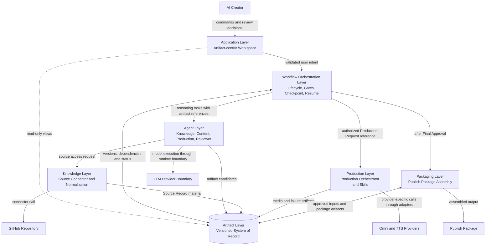

### 1.3 Communication Model

MVP 模块通信使用三种逻辑交互，不在本 Step 固定同步、异步、进程内或网络传输方式：

| Interaction | Purpose | Rule |
| --- | --- | --- |
| Command / Result | 发起任务、审核、生产、恢复或打包，并返回结果或可处理失败。 | Command 表达调用方意图；接收方只执行其边界内责任。 |
| Artifact Reference | 传递稳定 ID、确切 Version 和 Artifact 类型所代表的业务结果。 | 跨模块不得依赖隐式共享对象或“当前最新版本”；必须引用明确版本。 |
| Status Observation | Workspace 展示 Workflow 阶段、Artifact 状态、Review、Budget 和 Failure。 | 只用于观察；UI 状态不得反向成为系统记录。 |

关键通信路径如下：

| From | To | Logical Payload | Purpose |
| --- | --- | --- | --- |
| Application Layer | Workflow Layer | User Intent、Review Decision、Resume / Regenerate Intent | 把用户动作转化为受控流程命令。 |
| Workflow Layer | Agent Layer | Task Context + exact Artifact References | 请求推理、规划或质量检查。 |
| Agent Layer | Artifact Layer | Artifact Candidate + provenance | 保存 Knowledge、Script、Storyboard、Timeline、Production Request 或 Review 结果。 |
| Knowledge Agent | Knowledge Layer | Source Access Intent | 获取规范化、可追溯的源材料。 |
| Workflow Layer | Production Layer | Approved Production Request Reference + Budget Authorization | 启动一次受约束的生产执行。 |
| Production Orchestrator | Production Skills / Adapters | Scoped Production Work | 生成视觉、语音、字幕、音频和视频结果。 |
| Production Layer | Artifact Layer | Media Artifact Candidate、Provider Execution Record 或 Failure Artifact Candidate | 持久化生产结果和失败追踪。 |
| Workflow Layer | Packaging Layer | Approved Video Reference + required delivery references | 在 Final Approval 后启动内容打包。 |
| Packaging Layer | Artifact Layer | Cover、Metadata、Manifest 与 Publish Package Candidate | 保存最终交付结构。 |

模块间可以在未来更换传输机制，但上述语义不得改变。MVP 不要求 Event Bus，也不得为了未来分布式架构提前引入网络服务边界。

### 1.4 Canonical Architecture Vocabulary

| Term | Canonical Meaning |
| --- | --- |
| Top-level Workflow | 唯一拥有端到端阶段流转、人工门禁、预算授权、Checkpoint 与 Resume 的控制组件。 |
| Agent | 在明确任务边界内执行推理、判断、规划或评价的专业化组件。 |
| Skill | 接收限定输入、执行单一能力并返回标准结果或失败的可替换执行组件。 |
| Production Orchestrator | 生产域内的子编排器；执行已授权 Production Request，协调生产 Skills 与 Provider Adapters。 |
| Adapter | 隔离外部系统或供应商协议，并将外部输入输出归一化为内部语义。 |
| Artifact | 具有身份、版本、依赖、状态与来源的持久化业务结果。 |
| Artifact Candidate | 模块产生、等待 Artifact Layer 验证并提交为新版本的业务结果。 |
| Production Request Artifact | Timeline 派生的 provider-neutral 内部生产协议，也是 Workflow 与 Production Layer 的稳定交接物。 |
| Provider Execution Record | 供应商请求、Prompt、响应或尝试信息的追踪记录；不是核心业务 Artifact。 |

## 2. System Layer Diagram

### 2.1 Detailed Logical Layer Diagram

```mermaid
flowchart TB
    subgraph Application["Application Layer"]
        Workspace["Single Task Workspace"]
        ArtifactViewer["Artifact Viewer"]
        ReviewInteraction["Review Interaction"]
        AppBoundary["Application Command and Query Boundary"]
        Workspace --> AppBoundary
        ArtifactViewer --> AppBoundary
        ReviewInteraction --> AppBoundary
    end

    subgraph WorkflowLayer["Workflow Orchestration Layer"]
        Lifecycle["Lifecycle Coordinator"]
        GateControl["Human Review and Budget Gate Controller"]
        Checkpoint["Checkpoint and Resume Coordinator"]
        Continuation["Continue From Here Coordinator"]
    end

    subgraph AgentLayer["Agent Layer"]
        KnowledgeAgent["Knowledge Agent"]
        ContentAgent["Content Agent"]
        ProductionAgent["Production Agent"]
        Reviewer["Reviewer"]
        ModelRuntime["Agent Model Runtime Adapter"]
    end

    subgraph KnowledgeLayer["Knowledge Layer"]
        SourcePort["Knowledge Source Connector Boundary"]
        SourceNormalizer["Source Normalization and Provenance"]
        GitHubAdapter["GitHub Connector"]
    end

    subgraph ProductionLayer["Production Layer"]
        ProdOrchestrator["Production Orchestrator"]
        VisualGenerator["Visual Generator"]
        VoiceSkill["Voice Skill"]
        AudioComposer["Audio Composer"]
        SubtitleSkill["Subtitle Skill"]
        MediaComposer["Media Composer"]
        ProviderAdapter["Provider Adapter Boundary"]
    end

    subgraph ArtifactLayer["Artifact Layer"]
        Persistence["Artifact Persistence Boundary"]
        Versioning["Version Manager"]
        Dependencies["Dependency and Stale Evaluator"]
        Impact["Impact Preview"]
        AssetRegistry["Lightweight Asset Registry"]
    end

    subgraph PackagingLayer["Packaging Layer"]
        PublishPackager["Publish Packager"]
        MediaPackage["Media Package Builder"]
        MetadataPackage["Metadata Package Builder"]
        Manifest["Artifact Manifest Builder"]
        CoverBuilder["Cover Builder"]
    end

    subgraph External["External Systems"]
        GitHub["Public GitHub"]
        LLM["LLM Provider"]
        Omni["Omni Visual Provider"]
        TTS["TTS Provider"]
    end

    AppBoundary --> Lifecycle
    Lifecycle --> GateControl
    Lifecycle --> Checkpoint
    Lifecycle --> Continuation

    Lifecycle --> KnowledgeAgent
    Lifecycle --> ContentAgent
    Lifecycle --> ProductionAgent
    Lifecycle --> Reviewer

    KnowledgeAgent --> SourcePort
    SourcePort --> SourceNormalizer
    SourceNormalizer --> GitHubAdapter
    GitHubAdapter --> GitHub
    KnowledgeAgent --> ModelRuntime
    ContentAgent --> ModelRuntime
    ProductionAgent --> ModelRuntime
    Reviewer --> ModelRuntime
    ModelRuntime --> LLM

    GateControl -->|"approved request and budget"| ProdOrchestrator
    ProdOrchestrator --> VisualGenerator
    ProdOrchestrator --> VoiceSkill
    ProdOrchestrator --> AudioComposer
    ProdOrchestrator --> SubtitleSkill
    ProdOrchestrator --> MediaComposer
    VisualGenerator --> ProviderAdapter
    VoiceSkill --> ProviderAdapter
    ProviderAdapter --> Omni
    ProviderAdapter --> TTS

    GateControl -->|"Final Approval"| PublishPackager
    PublishPackager --> MediaPackage
    PublishPackager --> MetadataPackage
    PublishPackager --> Manifest
    PublishPackager --> CoverBuilder

    AppBoundary -.->|"read views"| Persistence
    Lifecycle <-->|"artifact references"| Persistence
    AgentLayer -->|"artifact candidates"| Persistence
    SourceNormalizer -->|"source material and provenance"| Persistence
    ProdOrchestrator -->|"media or failure candidates"| Persistence
    PublishPackager <-->|"approved inputs and package candidates"| Persistence

    Persistence --> Versioning
    Versioning --> Dependencies
    Dependencies --> Impact
    Persistence --> AssetRegistry
```

### 2.2 Layer Dependency Direction

模块依赖遵循以下方向：

```text
Application
    ↓
Top-level Workflow
    ├── Agent Layer
    │     └── Knowledge Layer / model runtime boundary
    ├── Production Layer
    │     └── Provider Adapters → external media providers
    ├── Packaging Layer
    └── Artifact Layer

All result-producing modules
    → Artifact Layer
```

依赖规则：

- Application 依赖 Workflow 的用例语义和只读视图，不依赖 Agent、Skill 或 Provider。
- Workflow 依赖 Agent、Production、Packaging 与 Artifact 的稳定边界，不依赖其内部实现。
- Agent 之间不进行自由 peer-to-peer 编排；交接通过 Workflow 和 Artifact Reference 完成。
- Production Skills 不被 Workflow 或 Application 直接依赖。
- Provider Adapter 可以依赖供应商协议；核心模块不得依赖供应商专属 Prompt 或响应结构。
- Artifact Layer 不依赖 Agent、Workflow、Production 或 Packaging 的执行逻辑。

## 3. Module Responsibility Table

### 3.1 Top-level Modules

| Module | Responsibility | Does Not Own |
| --- | --- | --- |
| Application Layer | 提供 Artifact-centric Single Task Workspace；接收 GitHub URL；展示 Workflow、Artifact、Review、Budget、Failure；承载 Approve、Reject、Regenerate、Continue From Here 和 Export 交互。 | 不推进 Workflow；不直接修改 Artifact；不调用 Agent、Skill 或 Provider；不根据 UI 状态判断业务完成。 |
| Workflow Orchestration Layer | 控制端到端阶段、条件分支、Checkpoint、Resume、Human Review、Budget Gate、Continue From Here 和何时进入 Production / Packaging。 | 不进行教学内容推理；不构造 Omni Prompt；不直接调用 Visual Generator、TTS、Composer；不解析供应商错误。 |
| Agent Layer | 在明确上下文内完成知识理解、教学规划、生产创意规划和质量评价；产生带来源与依赖的 Artifact Candidate。 | 不拥有全流程状态；不批准预算或人工门禁；不进行供应商重试；不直接持久化或覆盖 Artifact 版本。 |
| Knowledge Layer | 隔离 Knowledge Source；访问、规范化并保留公开 GitHub 内容与来源定位；向 Knowledge Agent 提供供应商无关的源材料。 | 不决定教学主题；不生成 Script；不把 Source Record 当作 Knowledge Artifact；不包含未来 PDF / Web 的 MVP 实现。 |
| Production Layer | 执行已授权 Production Request；协调视觉、语音、音频、字幕和媒体合成；执行重试、预算约束检查、失败归一化和生产 Artifact 生成。 | 不决定教学事实；不批准 Script、Budget 或 Final Video；不拥有端到端 Workflow；不生成 Publish Package。 |
| Artifact Layer | 提供 Artifact 持久化边界、版本、确切依赖、状态、`stale` 传播、Impact Preview 和轻量 Asset Registry；作为业务结果的系统记录层。 | 不运行 Agent；不编排生产；不决定人工批准；不解释供应商响应；不实现通用 ContentOS Artifact 平台。 |
| Packaging Layer | 在 Final Approval 后组装 Media Package、Metadata Package、Artifact Manifest、Cover 和 Publish Package，并导出交付结构。 | 不重新生成或批准视频；不改变教学内容；不调用发布平台；不负责多渠道分发。 |

### 3.2 Workflow Orchestration Components

| Component | Responsibility | Does Not Own |
| --- | --- | --- |
| Lifecycle Coordinator | 决定当前阶段、下一允许阶段以及任务是否处于 active、paused、blocked 或 completed 的业务语义。 | 不定义 LangGraph State Schema；不执行内容或媒体能力。 |
| Human Review and Budget Gate Controller | 记录并执行 Script、optional Storyboard、Budget 和 Final Video 门禁。 | 不替 Creator 作最终决定；不评价视频质量。 |
| Checkpoint and Resume Coordinator | 记录可恢复位置与所引用的 Artifact Versions，使流程从最近有效位置继续。 | 不保存 Artifact 内容；不在本 Step 定义 Checkpointer 技术。 |
| Continue From Here Coordinator | 根据用户选择、Artifact 状态和 Impact Preview 确定允许重新执行的范围。 | 不计算媒体供应商内部重试；不静默选择 `stale` 输入。 |

Workflow checkpoint 与内容 Artifact 是不同概念：Checkpoint 记录“流程在哪里、选用了哪些 Artifact Version”，Artifact 记录“业务结果是什么”。两者的具体状态模型留给 Step 2。

### 3.3 Agent Layer Components

| Agent | Responsibility | Does Not Own |
| --- | --- | --- |
| Knowledge Agent | 理解仓库结构；聚焦 Lesson 1；提取教学要点；建立来源关联；生成 Knowledge Artifact Candidate。 | 不使用源外事实；不决定视频视觉路线；不直接访问 GitHub 协议。 |
| Content Agent | 基于 Knowledge Artifact 生成 Course / Episode Plan 与 Script；完成面向成年 AI 初学者的简体中文教学化表达。 | 不绕过 Source Grounding；不进入 Storyboard 或媒体生产；不批准 Script。 |
| Production Agent | 基于已批准 Script 形成 Character、Storyboard、Timeline 与 provider-neutral Production Request Candidate。 | 不生成 Omni-specific Prompt；不调用 Omni、TTS 或 Composer；不执行 Retry；不批准 Storyboard。 |
| Reviewer | 对指定 Artifact Version 执行来源、完整性、格式、角色一致性、节奏和主观质量检查，并产生 Hard Block / Warning Review Candidate。 | 不修改被审对象；不推进 Workflow；不替代 Creator 的 Script 或 Final Video Approval。 |
| Agent Model Runtime Adapter | 为四个 Agent 提供统一模型调用边界，验证模型响应并隔离模型供应商细节。 | 不拥有 Agent 目标、Artifact 生命周期、Workflow 状态或媒体供应商调用。 |

### 3.4 Production Layer Components

| Component | Responsibility | Does Not Own |
| --- | --- | --- |
| Production Orchestrator | 接收已批准 Production Request Reference 与预算授权；规划生产域执行顺序；调度 Skills / Adapters；执行最多允许尝试；归一化 Failure；提交生产 Artifact Candidate。 | 不作为 Agent 推理教学内容；不修改 Production Request 语义；不批准预算；不决定 Final Video 是否通过。 |
| Visual Generator | 将 Production Request 中的场景视觉意图转化为标准视觉生成工作，并返回 Scene Clip Result 或标准失败。MVP 使用 Omni Adapter。 | 不接收原始 Script 作为自由生成输入；不控制 Workflow；不合成主旁白。 |
| Voice Skill | 将每个 Scene 的已批准旁白文本转为 Scene Audio Result；通过 TTS Provider Adapter 隔离供应商。 | 不使用 Omni 主旁白；不合成 Master Audio；不改变旁白文案。 |
| Audio Composer | 按 Timeline 组合 Scene Audio，并接收可选 BGM / Effect，形成 Master Audio Result。 | 不调用 LLM 或决定旁白内容；不生成视觉；不拥有 Final Video。 |
| Subtitle Skill | 根据已批准 Script、Timeline 与音频关系生成 Subtitle Result。 | 不重写教学内容；不承担最终媒体合成。 |
| Media Composer | 将 Scene Clips、Master Audio 和 Subtitle 组合为 Video Result。 | 不调用视觉模型；不执行人工 Review；不组装 Publish Package。 |
| Provider Adapter | 将内部生产工作映射为 Omni / TTS 专属请求；验证外部响应；映射为标准 Result 或 Failure；保存必要执行记录。 | 不改变教学事实、场景意图或预算；不向 Workflow 泄漏供应商 Prompt 和错误结构。 |

为什么 Workflow 不能直接调用生产组件：

1. 直接调用会把供应商调用顺序、重试与失败语义泄漏到端到端 Workflow。
2. Visual、Voice、Audio、Subtitle 与 Media 存在生产域内依赖，必须由一个组件保证同一 Production Request Version 下的协调一致性。
3. Provider Error、Generation Failure、Quality Failure 与 Budget Limit 必须在同一边界归一化，Workflow 只处理标准生产结果或标准 Failure。
4. 未来更换 Omni、TTS、Remotion 或 Stickman 实现时，Workflow 不应发生结构性变化。
5. Workflow 拥有“是否允许生产”，Production Orchestrator 拥有“获准后如何执行生产”；二者混合会破坏审批和预算边界。

### 3.5 Artifact Layer Components

| Component | Responsibility | Does Not Own |
| --- | --- | --- |
| Artifact Persistence Boundary | 接受合法 Artifact Candidate，提交新版本并返回确切 Artifact Reference；提供按引用读取能力。 | 不决定何时生成或批准 Artifact；不暴露具体数据库。 |
| Version Manager | 确保新结果形成新版本，已批准版本不被静默覆盖。 | 不自动选择 Workflow 应使用哪个版本。 |
| Dependency and Stale Evaluator | 记录确切上游版本依赖，并在上游新版本被采用时标识受影响下游。 | 不自动重新生成下游；不删除旧版本。 |
| Impact Preview | 在用户确认前给出将变为 `stale` 或需要重新生成的核心 Artifact 范围。 | 不执行修改；不成为通用图可视化平台。 |
| Lightweight Asset Registry | 管理角色、品牌、生成媒体和可复用资产引用。 | 不成为完整 DAM；不替代 Artifact Versioning。 |

### 3.6 Knowledge Layer Components

| Component | Responsibility | Does Not Own |
| --- | --- | --- |
| Knowledge Source Connector Boundary | 定义核心系统获取来源材料与 provenance 的稳定入口。 | 不暴露 GitHub 专属响应给 Knowledge Agent。 |
| GitHub Connector | 验证并读取公开 Repository、课程索引、Lesson 1 和必要文件。 | 不进行教学总结；不生成 Knowledge Artifact。 |
| Source Normalization and Provenance | 将来源内容整理为 Knowledge Agent 可消费的统一源材料，并保留仓库、文件和章节定位。 | 不补充来源中不存在的事实；不决定单集脚本。 |

Knowledge Source 与 Knowledge Artifact 的解耦规则：

```text
GitHub-specific content
    ↓
Knowledge Source Connector Boundary
    ↓
Normalized Source Material + Provenance
    ↓
Knowledge Agent
    ↓
Knowledge Artifact Candidate
```

Connector 负责“可靠地取得什么”，Knowledge Agent 负责“基于这些来源理解出什么”。未来增加 PDF、Web 或 Notion Connector 时，不得要求 Content Agent、Production Agent 或 Production Layer 理解来源协议。

### 3.7 Packaging Layer Components

| Component | Responsibility | Does Not Own |
| --- | --- | --- |
| Publish Packager | 验证输入已获 Final Approval，并协调三个 Package Builder。 | 不自行批准输入；不重新渲染 Video。 |
| Media Package Builder | 收集 Approved Final Video、Cover、Subtitle、Master Audio 与 Scene Audio Segments。 | 不改变媒体内容；不决定渠道规格。 |
| Metadata Package Builder | 组织 Title、Description、Tags 与 Source Attribution。 | 不引入新的教学事实；不自动发布。 |
| Artifact Manifest Builder | 记录 Artifact IDs / Versions、Dependency Trace、Approval、Source References 和 Provider Execution References。 | 不替代 Artifact Layer；不复制完整内部存储。 |
| Cover Builder | 从 Approved Video 选择关键帧并应用品牌模板形成 Cover Artifact。 | 不调用独立 AI 图片生成模型。 |

## 4. Boundary Rules

### 4.1 Workflow Boundary

1. 只有 Top-level Workflow 可以推进或回退端到端业务阶段。
2. 只有 Workflow 可以打开、关闭或执行 Human Review 与 Budget Gate。
3. Workflow 调用 Agent、Production 和 Packaging 时必须携带确切 Artifact References，不得依赖“最新文件”。
4. Workflow 只能通过 Production Orchestrator 启动媒体生产。
5. Workflow 不得构造 Omni Prompt、调用 TTS、调用 Composer 或解析供应商错误。
6. Workflow 接收 Production Layer 的标准成功结果、暂停结果或 Failure Reference，再决定端到端流程动作。

### 4.2 Agent Boundary

1. 每个 Agent 只处理被分配的专业任务，不拥有端到端计划。
2. Agent 之间不自由对话或互相启动；Top-level Workflow 负责顺序和分支。
3. Agent 输出 Artifact Candidate 和诊断信息，不直接覆盖既有 Artifact。
4. Agent 不执行 Human Approval、Budget Approval 或 Provider Retry。
5. Reviewer 的 Hard Block / Warning 是质量判断；Creator 的 Approval 是业务决定，二者不得混为一个状态。

### 4.3 Skill Boundary

1. Skill 是执行能力，不进行跨阶段目标判断或任务规划。
2. Knowledge / Creative Skills 只能在其所属 Agent Task 内调用。
3. Visual、Voice、Audio、Subtitle 和 Media Skills 只能由 Production Orchestrator 调度。
4. Skill 必须返回标准结果或标准失败，不得直接推进 Workflow。
5. Skill 不得静默修改其输入 Artifact 或引用的已批准内容。

### 4.4 Production Boundary

1. Production Orchestrator 的唯一业务入口是已授权 Production Request Reference 与预算约束。
2. Production Orchestrator 不读取自由文本用户请求来改变生产目标。
3. Production Orchestrator 负责生产域 Retry、Failure Normalization 和尝试记录；Workflow 不复制这些逻辑。
4. Production Orchestrator 可以执行已批准预算内的尝试，但不能提高、重新批准或绕过预算。
5. 所有生产输出必须关联同一 Production Request Version 及其确切上游依赖。
6. Scene 是局部生产与恢复的最小业务定位单位；Fixed 6 Scene 是 MVP Template Constraint，不是 Production Layer 的固定结构。

### 4.5 Artifact Boundary

1. Artifact Layer 是所有业务产物版本和依赖关系的唯一系统记录层。
2. Artifact Version 必须不可变；修订通过新版本表达。
3. 每个下游 Artifact 必须引用确切上游 Version。
4. `stale` 表示依赖已不再匹配当前选定上游，但不删除或判定旧结果无历史价值。
5. Impact Preview 只报告影响，不自动执行重新生成。
6. Provider Prompt / Request 是 Execution Record，不是 Production Request Artifact，也不得成为核心 Artifact Graph 的语义中心。
7. Workflow Checkpoint 不等同于内容 Artifact；二者可以互相引用，但生命周期责任不同。

### 4.6 Provider Boundary

1. 外部 GitHub、LLM、Omni 和 TTS 响应均视为不可信外部输入，必须在 Adapter 边界验证和归一化。
2. 核心模块不得直接依赖供应商 SDK、Prompt 格式、错误码或响应对象。
3. Provider Adapter 只做协议映射、调用、验证和错误归一化，不改变内部业务语义。
4. Omni-specific Prompt 只能由生产域 Adapter / Director 能力从 Production Request 派生。
5. Provider Adapter 必须把外部失败映射到内部标准 Failure；不得让原始异常决定 Workflow 分支。
6. MVP 只有一个 Visual Provider 路线，不实现自动供应商选择或 Failover。

### 4.7 Knowledge Boundary

1. Knowledge Connector 输出源材料与 provenance，不输出教学结论。
2. Knowledge Agent 只能基于已规范化来源生成 Knowledge Artifact。
3. Knowledge Artifact 不保留下游对 GitHub API 或仓库读取方式的依赖。
4. Source-closed 规则跨越所有下游模块；任何模块都不得补充无法追溯的事实。

### 4.8 Packaging Boundary

1. Packaging 只能消费已通过 Final Approval 的 Video Artifact 及其依赖。
2. Packaging 不属于 Production Layer，不参与生成或修复 Video。
3. Publish Package 是 Content Packaging 结果，不代表外部平台已经发布。
4. Metadata 不得引入 Knowledge Artifact 之外的新教学事实。
5. MVP 只生成一个通用 Package Profile，不实现多渠道适配。

### 4.9 Application Boundary

1. Application Layer 只提交用户意图和展示系统状态。
2. Workspace 不直接写 Artifact Storage，也不直接调用 Agent、Skill 或 Provider。
3. UI 中的临时编辑状态不是 Artifact；只有经过应用边界提交并由 Artifact Layer 生成新版本后，才成为系统记录。
4. Application Layer 不根据按钮状态推断 Workflow 已完成；完成状态以 Workflow 与 Artifact Layer 为准。

### 4.10 Stable Boundaries vs Replaceable Implementations

| Must Remain Stable | Replaceable Behind the Boundary |
| --- | --- |
| Top-level Workflow 对阶段、审批、预算、Checkpoint 和 Resume 的唯一所有权。 | Workspace UI 技术、状态展示方式和未来完整 Web UI。 |
| Specialized Agent 的职责分工与 Artifact-based handoff。 | Agent Prompt、模型供应商和 Agent 内部推理实现。 |
| Knowledge Source Connector Boundary 与 normalized source material 语义。 | GitHub Connector；未来 PDF、Web、Notion 等 Connector。 |
| Artifact identity、Version、Dependency、Status、`stale` 与 Impact Preview 语义。 | 本地文件、数据库、对象存储或未来 Artifact 服务。 |
| Timeline → Production Request Artifact 的 provider-neutral 交接。 | Visual、Voice、Subtitle、Audio 和 Media 的具体实现。 |
| Workflow 只调用 Production Orchestrator。 | Omni Adapter、TTS Provider、未来 Remotion / Stickman 生产实现。 |
| 标准 Production Result 与四类 Failure 语义。 | 供应商 SDK、Prompt 策略、重试技术和错误码映射。 |
| Final Approval → Packaging 的交接以及 Publish Package 三层结构。 | Cover、Metadata 和未来渠道 Packaging Profile 的具体实现。 |

稳定边界应优先采用添加式演进。新增 Provider、Connector 或可选能力时，不应破坏现有消费者依赖的 Artifact 和模块语义。

## 5. Future Extension Points

### 5.1 Extension Matrix

| Extension | Stable Seam | Future Implementation Position | MVP Scope Protection |
| --- | --- | --- | --- |
| Multi Knowledge Source | Knowledge Source Connector Boundary + normalized source material | 增加 PDF、Web、Notion、YouTube 或 Local File Adapter。 | MVP 只实现公开 GitHub Connector，不构建多源融合。 |
| Remotion Renderer | Production Request + Production Orchestrator 内部生产能力边界 | 作为确定性视觉生产与 / 或 Media Composition 实现接入 Production Layer。 | Workflow 不直接出现 Remotion 分支；MVP 不接入。 |
| Stickman Renderer | Production Request + standard media result boundary | 作为确定性 Visual Generation / Composition 实现包，由 Production Orchestrator 调度。 | `stickman-video-director` 仍是 Director / Prompt Skill；MVP 不建设确定性 Renderer。 |
| Multi Visual Provider | Visual Generator + Provider Adapter Boundary | 增加其他视频 Provider Adapter，并在 Production Layer 内部选择。 | MVP 固定 Omni，不实现自动路由或 Failover。 |
| Multi TTS Provider | Voice Skill + TTS Provider Adapter Boundary | 增加 OpenAI TTS、ElevenLabs、CosyVoice 或其他实现。 | MVP 只需一个可用 Voice Provider；不实现 Voice Marketplace。 |
| Dynamic Scene Expansion | Timeline / Production Request 的有序 Scene Collection 语义 | 增加不同 Episode Template 或动态场景规划。 | MVP 产品模板固定六个 Scene；不提供动态场景 UI。 |
| Artifact Platform | Artifact Persistence Boundary | 替换存储，实现更通用 DAG、跨任务查询和可视化。 | MVP 使用固定核心关系和基本 Impact Preview。 |
| Multi-channel Packaging | Publish Package 三层结构 | 增加渠道特定 Media / Metadata Profile 和发布连接器。 | MVP 只生成通用本地包，不自动发布。 |

### 5.2 Future Renderer Integration Rule

未来 Remotion Renderer 或确定性 Stickman Renderer 不得重新成为 Top-level Workflow 直接依赖的中心抽象。

它们必须作为 Production Layer 内部实现接入，并满足：

1. 消费现有 Production Request 语义或其内部可验证映射。
2. 返回标准 Media Artifact 或标准 Failure。
3. 保留 Artifact Version、Dependency、Budget 和 Review 边界。
4. 不要求 Application、Agent 或 Packaging 理解 Renderer 专属协议。

这确保“Renderer 可替换”被保留，同时不推翻已经批准的 Production Orchestrator 架构。

### 5.3 Step 1 Completion Check

本章节已经回答：

- 系统由哪些模块组成。
- 每个模块负责什么以及明确不负责什么。
- 模块使用何种逻辑方式通信。
- Workflow、Agent、Skill、Production、Artifact、Provider、Knowledge、Packaging 与 Application 的稳定边界。
- Multi Knowledge Source、Remotion、Stickman 和 Multi Provider 如何在不改变核心 Workflow 的前提下扩展。

本章节没有进入 API、Schema、LangGraph State、文件结构、代码或 Implementation Plan。

Step 1 状态：Review Passed。Step 2 内容在下一章节继续。

# Workflow & LangGraph Architecture Design

## 6.1 Scope and Design Principles

### 6.1.1 Step 2 Scope

本章节先定义 AI Course Factory 的业务 Workflow，再把已确认的业务语义映射为 LangGraph 逻辑架构。

设计顺序固定为：

```text
Business Lifecycle
    ↓
State Ownership
    ↓
Gate and Transition Rules
    ↓
Checkpoint / Resume / Partial Execution
    ↓
Failure and Recovery Semantics
    ↓
LangGraph Logical Mapping
```

本章节定义：

- Task Lifecycle 的逻辑状态与转换
- Workflow State、Artifact State、Review、Failure、Provider Attempt 和 UI Draft 的所有权
- Mandatory / Optional Human Interrupt
- Artifact Commit、Checkpoint、Resume 和 Continue From Here 语义
- Scene-level Regeneration、预算与四类 Failure 的恢复路径
- 业务步骤到 LangGraph Node Type、条件边与 Interrupt 的逻辑映射
- Production Orchestrator 在 LangGraph 中的映射选择
- 逻辑并行、Join、幂等和外部副作用边界

本章节不定义字段级 State / Artifact Schema、Node 函数、Graph 编译方式、具体 Checkpointer、数据库、API、目录、代码或任务计划。

### 6.1.2 LangGraph Capability Basis

本设计只使用 LangGraph 已明确支持的概念能力，不让框架能力反向扩大产品范围：

- LangGraph checkpointer 保存 thread 级 graph state checkpoint，适合 Human-in-the-loop、故障恢复与历史检查；应用定义的长期数据与 graph state 是不同持久化概念。[LangGraph Persistence](https://docs.langchain.com/oss/python/langgraph/persistence)
- Interrupt 会保存当前 graph state，并在同一 thread 上等待恢复；恢复时中断所在 Node 会从头重新执行，因此 Interrupt Node 之前的副作用必须不存在或具备幂等性。[LangGraph Interrupts](https://docs.langchain.com/oss/python/langgraph/interrupts)
- Subgraph 可以采用 per-invocation、per-thread 或 stateless persistence；per-thread 状态会增加并行调用与 checkpoint namespace 的复杂度。[LangGraph Subgraphs](https://docs.langchain.com/oss/python/langgraph/use-subgraphs)
- LangGraph 支持同一 superstep 内的并行分支和后续 Join，但分支更新顺序不应被当成业务契约；有 checkpointer 时可避免恢复时重复已成功分支。[LangGraph Graph API](https://docs.langchain.com/oss/python/langgraph/use-graph-api)
- Node retry 可以处理技术异常，但本产品的 Provider Attempt、预算检查和四类 Failure 仍由 Production Orchestrator 的领域规则控制。[LangGraph Fault Tolerance](https://docs.langchain.com/oss/python/langgraph/fault-tolerance)

这些能力只决定“LangGraph 可以承载什么”，不决定“AI Course Factory 应该增加什么功能”。

### 6.1.3 Baseline Conflict Assessment

**Result：Passed。**

未发现 Step 2 与 Approved PRD 或 Accepted Addendum 的未解决冲突。历史 Decision Record 中的 Stickman MVP Renderer 路线已由 Addendum 正式 supersede；本章节继续使用 Production Orchestrator、Production Request Artifact 和 Omni Provider Adapter 边界。

### 6.1.4 Frozen Workflow Design Principles

1. Top-level Workflow 是端到端业务阶段、Human Gate、Budget Gate、Checkpoint、Pause / Resume、Continue From Here、Packaging 和 Completed 的唯一所有者。
2. Artifact Layer 是业务结果的唯一系统记录层；LangGraph State 只保存控制语义和精确 Artifact References。
3. Workflow Checkpoint 记录流程位置和版本选择；Artifact 记录业务结果内容。二者不得合并。
4. Agent Node 产生 Artifact Candidate，不直接批准、覆盖或推进阶段。
5. Production Orchestrator 通过一个稳定生产调用边界进入 Top-level Graph；Workflow 不调用 Production Skill 或 Provider。
6. Human Interrupt 与 Reviewer 质量结论分离：Reviewer 产生 Hard Block / Warning，Creator 产生 Approve / Reject / Revise。
7. Resume 继续同一组精确版本；Continue From Here 主动选择入口并必须先完成 Impact Preview 与用户确认。
8. 外部副作用在执行前后都必须有逻辑 checkpoint / attempt record，Graph replay 不得静默重复付费调用。
9. MVP 固定六个 Scene，但 Workflow 只处理 Scene 集合和 Scene ID，不把六个场景编码为固定状态槽。
10. 选择最小可用 LangGraph 架构，不提前建设通用工作流平台、Event Bus、分布式执行或多 Provider Router。

## 6.2 Workflow State Ownership Table

### 6.2.1 Ownership Matrix

| State Category | System of Record | Workflow Holds | Artifact Layer Holds | UI Holds |
| --- | --- | --- | --- | --- |
| Task Lifecycle State | Workflow Checkpoint | 当前逻辑生命周期状态。 | 不持有 Task Lifecycle 的权威副本。 | 只读投影。 |
| Current Stage | Workflow Checkpoint | 当前执行阶段和下一允许转换。 | 与该阶段相关的 Artifact，不保存权威 Stage。 | 展示值，不可独立推进。 |
| Pending Human Gate | Workflow Checkpoint | Gate 类型、目标 Artifact Reference、等待动作和 Resume Position。 | Approval / Rejection Record 及被审 Artifact。 | 待提交的用户选择；提交前不是业务事实。 |
| Budget Authorization | Artifact Layer | 精确 Budget Artifact / Approval Reference；不复制授权布尔值。 | Budget Artifact、绑定的 Production Request Version 与 Approval Record。 | 展示估算和待提交决策。 |
| Selected Artifact Versions | Workflow Checkpoint | 当前执行明确选中的 Artifact References。 | 每个 Artifact Version 的内容、状态和依赖。 | 展示选择；未提交的切换只是 UI Draft。 |
| Artifact Status | Artifact Layer | 只保存需要执行的精确 Reference；不复制 `approved` / `stale` 事实。 | Artifact 的权威状态、版本和依赖。 | 只读投影。 |
| Review Result | Artifact Layer | 当前 Review Artifact Reference 和由其驱动的下一 Gate / Revision Route。 | Review Artifact、Hard Block / Warning 结论及其目标版本。 | 展示问题与 Creator 待提交决策。 |
| Provider Attempt | Production Execution Record in Artifact Layer | 不保存原始请求或响应；最多保存当前 Failure Reference / production invocation status。 | Production Request Version、Scene ID、Attempt Number、标准结果及必要执行记录。 | 只读进度。 |
| Failure State | Failure Artifact in Artifact Layer | 当前标准 Failure Reference、paused 状态和允许恢复动作。 | Failure 分类、原因、关联尝试、受影响结果和恢复选项。 | 展示并收集恢复选择。 |
| Resume Position | Workflow Checkpoint | Resume Cursor、下一逻辑步骤及选定 Artifact References。 | 不保存权威 Resume Cursor。 | 只读；用户可以发起 Resume。 |
| UI Draft State | Application Layer | 不持有未提交表单或编辑缓存。 | 不持有未提交 Draft。 | Script 编辑缓存、表单输入和未提交 Review 选择；提交后才形成命令或 Artifact Candidate。 |
| Agent Conversation / Scratch Context | Agent Runtime, transient | 不作为 Workflow 事实。 | 不作为业务 Artifact，除非显式转化并提交为 Artifact Candidate。 | 不依赖或展示为业务记录。 |

### 6.2.2 Ownership Rules

1. 同一个业务事实只能有一个 System of Record；其他层只保存 Reference 或 Projection。
2. Workflow State 可以保存 `selected_script_ref` 这一类概念引用，但不得复制 Script 内容、完整 Review 内容或 Provider Prompt。
3. Budget 是否有效必须通过当前选定 Budget Authorization Reference 与 Production Request Version 的绑定关系判断，不使用独立缓存布尔值。
4. UI 刷新、关闭或崩溃不得改变 Workflow 与 Artifact 事实。
5. Agent 对话历史、模型上下文和 UI 内存不能作为 Resume 或审计依据。
6. “当前最新 Artifact”不是合法输入选择规则；Workflow 只使用 checkpoint 中明确选定的 ID 与 Version。

## 6.3 Business Lifecycle State Machine

### 6.3.1 Logical Lifecycle States

以下名称定义逻辑状态语义；字段级 Enum 由 Step 5 决定。

| Lifecycle State | Meaning | Entry Condition | Exit Condition | Allowed Commands | Required Artifact References |
| --- | --- | --- | --- | --- | --- |
| Task Initialized | 单任务已创建，尚未验证来源。 | 用户提交任务输入。 | Start 被接受。 | Start、Replace Source。 | 无已提交 Artifact 要求。 |
| Source Validation | 验证公开 GitHub 来源并准备 Source Record。 | Task Started 或来源被替换。 | Source Record 提交成功；失败则停留等待修正。 | Retry Validation、Replace Source。 | 输入来源标识；成功后 Source Record Ref。 |
| Knowledge Generation | Knowledge Agent 基于规范化来源生成知识结果。 | Source Validated checkpoint 存在。 | Knowledge Artifact 提交成功。 | Pause、Retry Current Step。 | Source Record Ref。 |
| Script Generation | Content Agent 生成 Course / Episode Plan 与 Script。 | Knowledge Ready；或 Script Revision 请求已确认。 | Plan 与 Script 新版本提交成功。 | Pause、Retry Current Step。 | Knowledge Ref；Revision 时还需被修订 Script Ref。 |
| Script Review Pending | Mandatory Script Human Gate。 | Script Generated checkpoint 存在且无 Artifact Commit 错误。 | Approve；或 Reject / Revise 路由回 Script Generation。 | Approve、Reject、Revise。 | Script Ref、Knowledge Ref、待处理 Gate。 |
| Storyboard Planning | Production Agent 生成 Character / Storyboard。 | Approved Script Ref 已绑定。 | Storyboard 新版本提交成功。 | Pause、Retry Current Step。 | Approved Script Ref、Character Ref（如已有）。 |
| Storyboard Review Pending | 已启用 Optional Storyboard Review 后的强制 Human Gate。 | Storyboard Ready 且任务配置启用 review。 | Approve；或 Reject / Revise 返回 Storyboard Planning。 | Approve、Reject、Revise。 | Storyboard Ref、Approved Script Ref。 |
| Timeline Planning | 生成 provider-neutral Timeline。 | Storyboard Approved，或 Review Skipped checkpoint 存在。 | Timeline 新版本提交成功。 | Pause、Retry Current Step。 | Selected Storyboard Ref、Script Ref、Character Ref。 |
| Production Request Preparation | 从 Timeline 形成 provider-neutral Production Request。 | Timeline Ready。 | Production Request 新版本提交成功。 | Pause、Retry Current Step。 | Timeline Ref 及其确切依赖。 |
| Budget Approval Pending | 生成并审核绑定当前 Production Request Version 的预算。 | Production Request Ready，或 Budget Limit 后提交新 Budget Version。 | Approve 后进入 Production；Reject / Revise 时保持暂停或返回请求修订。 | Approve Budget、Reject Budget、Revise Budget、Revise Request。 | Production Request Ref、Budget Artifact Ref。 |
| Production Execution | Production Orchestrator 执行已授权生产范围。 | Request 与 Budget Authorization 均有效。 | 标准 Production Result 完成；或标准 Failure 导致暂停。 | Pause；运行中不接受绕过 Orchestrator 的 Skill 命令。 | Approved Production Request Ref、Budget Authorization Ref、已有可复用 Media Refs。 |
| Production Paused | 生产因 Provider / Generation / Budget 或人工暂停而停止，成功产物仍保留。 | Production Orchestrator 返回暂停结果或预算守卫阻止尝试。 | 合法恢复动作完成并重新进入 Production、Budget Gate 或 Impact Preview。 | Resume、Manual Retry、Upload Scene Clip、Revise Upstream、Revise Budget。 | Production Request Ref、Failure Ref、Budget Ref、成功 Media Refs。 |
| Reviewer Evaluation | Reviewer 对新 Video Version 做质量检查。 | Production Completed 且 Video Artifact 已提交。 | 无未解决 Hard Block 时进入 Final Review；Hard Block 进入 Revision Required。 | Retry Review。 | Video Ref 及其完整依赖链。 |
| Final Review Pending | Mandatory Final Video Human Gate；只允许无未解决 Hard Block 的 Video 进入。 | Review Artifact 为 Pass 或 Warning。 | Approve 进入 Packaging；Reject / Revise 进入 Revision Required。 | Approve、Reject、Revise、Accept Warning。 | Video Ref、Review Ref、待处理 Gate。 |
| Revision Required | Reviewer Hard Block 或 Creator Reject / Revise 后等待选择修订起点。 | Hard Block、Script / Storyboard / Final Reject 或显式修订意图。 | 用户选择明确 Artifact Version 后进入 Impact Confirmation。 | Select Entry Point、Cancel Revision。 | Review / Rejection Record Ref、当前选定 Artifact Refs。 |
| Impact Confirmation Pending | 展示 Continue From Here 或修订将影响的下游 Artifact。 | 起点存在、版本明确、状态允许且依赖完整。 | Confirm 后传播 `stale` 并路由；Cancel 返回原等待状态。 | Confirm Impact、Cancel。 | Entry Artifact Ref、Impact Preview 结果、当前 selection。 |
| Packaging | 根据 Approved Video 组装 Cover、Media、Metadata、Manifest 和 Publish Package。 | Final Video Approval 与对应 Video Ref 有效。 | Publish Package Artifact 提交成功。 | Retry Packaging。 | Approved Video Ref、Approval Ref、Audio / Subtitle / Source Refs。 |
| Completed | Publish Package Ready，任务闭环完成。 | Publish Package Ready checkpoint 已提交。 | 终态；新的修订请求必须开启显式 Continue From Here 流程。 | Export、Start Revision。 | Publish Package Ref、Approved Video Ref、Final Approval Ref。 |

Artifact 的 `draft`、`approved`、`stale`、`failed` 等状态不属于上述 Task Lifecycle State。Workflow 通过精确 Artifact Reference 和 Guard 查询这些状态，再决定生命周期转换。

### 6.3.2 Lifecycle State Diagram

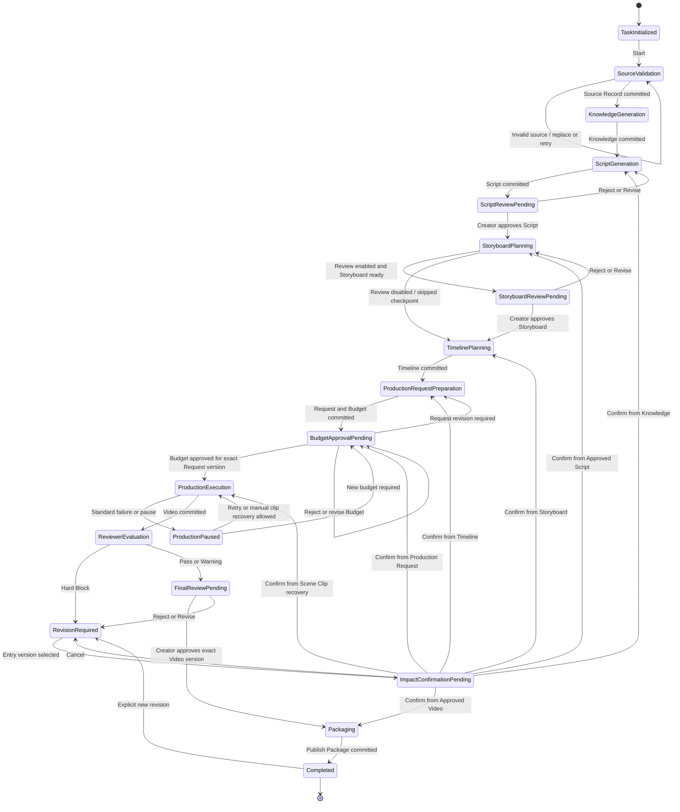

## 6.4 End-to-End Workflow Graph

### 6.4.1 Top-level Business Graph

```mermaid
flowchart TB
    Start(["Task Start"])
    Init["Initialize Task<br/>Deterministic"]
    ValidateSource["Validate Source<br/>Deterministic / GitHub read"]
    SourceValid{"Source valid?"}
    FixSource["Correct Source<br/>User Input"]
    CommitSource["Commit Source Record<br/>Artifact Commit"]
    KnowledgeAgent["Knowledge Generation<br/>Agent Node"]
    CommitKnowledge["Commit Knowledge Artifact<br/>Artifact Commit"]
    ContentAgent["Plan and Script Generation<br/>Agent Node"]
    CommitScript["Commit Plan and Script<br/>Artifact Commit"]
    ScriptGate["Mandatory Script Review<br/>Human Interrupt"]
    ScriptDecision{"Creator decision"}

    StoryboardAgent["Character and Storyboard Planning<br/>Agent Node"]
    CommitStoryboard["Commit Storyboard<br/>Artifact Commit"]
    StoryboardEnabled{"Storyboard review enabled?"}
    StoryboardGate["Optional Storyboard Review<br/>Human Interrupt when enabled"]
    StoryboardDecision{"Creator decision"}
    ReviewSkipped["Record Review Skipped<br/>Deterministic"]

    TimelineAgent["Timeline Planning<br/>Agent Node"]
    CommitTimeline["Commit Timeline<br/>Artifact Commit"]
    RequestAgent["Production Request Preparation<br/>Agent Node"]
    CommitRequest["Commit Production Request<br/>Artifact Commit"]
    BudgetCalc["Prepare Production Budget<br/>Deterministic"]
    CommitBudget["Commit Budget Artifact<br/>Artifact Commit"]
    BudgetGate["Mandatory Budget Approval<br/>Human Interrupt"]
    BudgetDecision{"Budget decision and version guard"}

    ProductionInvoke["Invoke Production Orchestrator<br/>Production Invocation / external cost"]
    ProductionResult{"Standard production result"}
    ProductionPaused["Production Paused<br/>Failure Reference retained"]
    RecoveryChoice["Choose Recovery<br/>Human Interrupt"]
    ManualClip["Upload and Validate Scene Clip<br/>User Input + Artifact Commit"]
    RetryGuard{"Request version and budget still valid?"}

    Reviewer["Reviewer Evaluation<br/>Agent Node"]
    CommitReview["Commit Review Artifact<br/>Artifact Commit"]
    ReviewGuard{"Hard Block?"}
    FinalGate["Mandatory Final Video Review<br/>Human Interrupt"]
    FinalDecision{"Creator decision"}
    RevisionRequired["Revision Required"]

    Packaging["Content Packaging<br/>Packaging Node"]
    CommitPackage["Commit Cover and Publish Package<br/>Artifact Commit"]
    Completed(["Completed"])

    ContinueRequest["Continue From Here Request"]
    ResolveEntry["Resolve Explicit Entry Artifact Version<br/>Deterministic"]
    ImpactPreview["Generate Impact Preview<br/>Artifact Read"]
    ImpactGate["Confirm Impact<br/>Human Interrupt"]
    ApplyStale["Apply stale propagation and bind entry<br/>Artifact Control"]
    EntryRouter{"Resolved execution entry"}

    Start --> Init --> ValidateSource --> SourceValid
    SourceValid -->|"No"| FixSource --> ValidateSource
    SourceValid -->|"Yes"| CommitSource --> KnowledgeAgent --> CommitKnowledge --> ContentAgent --> CommitScript --> ScriptGate --> ScriptDecision
    ScriptDecision -->|"Approve"| StoryboardAgent
    ScriptDecision -->|"Reject / Revise"| ContentAgent

    StoryboardAgent --> CommitStoryboard --> StoryboardEnabled
    StoryboardEnabled -->|"No"| ReviewSkipped --> TimelineAgent
    StoryboardEnabled -->|"Yes"| StoryboardGate --> StoryboardDecision
    StoryboardDecision -->|"Approve"| TimelineAgent
    StoryboardDecision -->|"Reject / Revise"| StoryboardAgent

    TimelineAgent --> CommitTimeline --> RequestAgent --> CommitRequest --> BudgetCalc --> CommitBudget --> BudgetGate --> BudgetDecision
    BudgetDecision -->|"Approve exact Request version"| ProductionInvoke
    BudgetDecision -->|"Reject Budget"| BudgetGate
    BudgetDecision -->|"Revise Budget"| BudgetCalc
    BudgetDecision -->|"Revise Request"| RevisionRequired

    ProductionInvoke --> ProductionResult
    ProductionResult -->|"Video and required media ready"| Reviewer --> CommitReview --> ReviewGuard
    ProductionResult -->|"Paused / failure"| ProductionPaused --> RecoveryChoice
    RecoveryChoice -->|"Manual retry"| RetryGuard
    RecoveryChoice -->|"Upload Scene Clip"| ManualClip --> ResolveEntry
    RecoveryChoice -->|"Revise budget"| BudgetCalc
    RecoveryChoice -->|"Revise upstream"| RevisionRequired
    RetryGuard -->|"Valid"| ProductionInvoke
    RetryGuard -->|"Budget invalid or exceeded"| BudgetGate

    ReviewGuard -->|"Yes"| RevisionRequired
    ReviewGuard -->|"No: Pass or Warning"| FinalGate --> FinalDecision
    FinalDecision -->|"Approve exact Video"| Packaging --> CommitPackage --> Completed
    FinalDecision -->|"Reject / Revise"| RevisionRequired

    RevisionRequired --> ContinueRequest
    Completed -.->|"Explicit new revision"| ContinueRequest
    ContinueRequest --> ResolveEntry --> ImpactPreview --> ImpactGate
    ImpactGate -->|"Cancel"| RevisionRequired
    ImpactGate -->|"Confirm"| ApplyStale --> EntryRouter
    EntryRouter -->|"Knowledge"| ContentAgent
    EntryRouter -->|"Approved Script"| StoryboardAgent
    EntryRouter -->|"Storyboard"| TimelineAgent
    EntryRouter -->|"Timeline"| RequestAgent
    EntryRouter -->|"Production Request"| BudgetCalc
    EntryRouter -->|"Scene Clip / composition scope"| RetryGuard
    EntryRouter -->|"Approved Video"| Packaging
```

### 6.4.2 Node Classification Rules

- **Agent Node**：只用于知识理解、内容规划、生产创意规划和 Reviewer 评价。
- **Deterministic Node**：执行验证、Guard、入口解析、预算计算、路由和 Workflow 控制判断。
- **Human Interrupt**：Script、optional Storyboard、Budget、Final Video、Impact Confirmation 和 Production Recovery 选择。
- **Production Invocation Node**：Top-level Graph 中唯一调用 Production Orchestrator 的 Node。
- **Artifact Commit / Control Node**：验证 Candidate、提交新版本、绑定精确 Reference 或在确认后传播 `stale`。
- **Packaging Node**：只在 Final Approval 后调用 Packaging Layer。
- **外部成本或不可重复副作用**：LLM Agent 调用、GitHub 外部读取、Omni / TTS 调用、媒体文件写入和最终 Package 输出；其中 Omni / TTS 只能出现在 Production Invocation 内部。

## 6.5 LangGraph Logical Mapping

### 6.5.1 Parent Graph State Principle

Top-level LangGraph State 只承载 Workflow 控制信息和精确 Artifact References。下表中的 Input / Output References 是逻辑引用，不是字段级 Schema。

| Business Step | LangGraph Role | Node Type | Input References | Output References | Side Effect |
| --- | --- | --- | --- | --- | --- |
| Initialize Task | 建立任务控制上下文。 | Deterministic Node | User Intent。 | Task control identity。 | Workflow checkpoint。 |
| Validate Source | 验证公开 GitHub 来源并取得规范化材料。 | Deterministic Node | Source input。 | Source candidate 或 validation error。 | 外部只读 GitHub 调用。 |
| Commit Source Record | 验证并提交来源记录。 | Artifact Commit Node | Source candidate。 | Exact Source Record Ref。 | Artifact new version commit。 |
| Generate Knowledge | 理解仓库结构并聚焦 Lesson 1。 | Agent Node | Source Record Ref。 | Knowledge candidate。 | LLM 调用；不得写完整结果到 graph state。 |
| Commit Knowledge | 提交来源可追溯的知识结果。 | Artifact Commit Node | Knowledge candidate、Source Ref。 | Exact Knowledge Ref。 | Artifact commit。 |
| Generate Plan and Script | 生成 Course / Episode Plan 与 Script。 | Agent Node | Knowledge Ref、Revision Context（如有）。 | Plan / Script candidates。 | LLM 调用。 |
| Commit Plan and Script | 提交内容规划与脚本版本。 | Artifact Commit Node | Plan / Script candidates。 | Exact Plan / Script Refs。 | Artifact commit。 |
| Script Review | 等待 Creator 对确切 Script Version 作决定。 | Human Interrupt | Script Ref、Knowledge Ref。 | Approval / Rejection / Revision decision。 | 暂停并写 workflow checkpoint；无外部业务副作用。 |
| Apply Script Decision | 验证决定并路由。 | Gate Node | Script Ref、decision。 | Approval Record Ref 或 Revision Route。 | Approval / decision record commit。 |
| Plan Storyboard | 生成 Character / Storyboard。 | Agent Node | Approved Script Ref、Character Ref（如有）。 | Character / Storyboard candidates。 | LLM 调用。 |
| Commit Storyboard | 提交 Storyboard Version。 | Artifact Commit Node | Storyboard candidate、Script Ref。 | Exact Storyboard Ref。 | Artifact commit。 |
| Storyboard Review Router | 判断是否启用 optional review。 | Gate Node | Task control metadata、Storyboard Ref。 | Interrupt route 或 Review Skipped route。 | 无外部副作用。 |
| Storyboard Review | 启用时等待 Creator 决定。 | Human Interrupt | Storyboard Ref、Script Ref。 | Approval / Rejection / Revision decision。 | 暂停并 checkpoint。 |
| Record Review Skipped | 记录 optional gate 未启用。 | Deterministic Node | Storyboard Ref、task config。 | Review Skipped control record。 | 控制记录 / checkpoint。 |
| Plan Timeline | 形成 provider-neutral Timeline。 | Agent Node | Selected Storyboard / Script / Character Refs。 | Timeline candidate。 | LLM 调用；不调用媒体 Provider。 |
| Commit Timeline | 提交 Timeline Version。 | Artifact Commit Node | Timeline candidate。 | Exact Timeline Ref。 | Artifact commit。 |
| Prepare Production Request | 形成 provider-neutral Production Request。 | Agent Node | Timeline Ref 及其依赖。 | Production Request candidate。 | LLM / deterministic production planning；不得生成 Omni Prompt 作为核心状态。 |
| Commit Production Request | 提交 Request Version。 | Artifact Commit Node | Production Request candidate。 | Exact Production Request Ref。 | Artifact commit。 |
| Prepare Budget | 为确切 Request Version 计算预算快照。 | Deterministic Node | Production Request Ref、配置价格快照。 | Budget candidate。 | 无供应商生成费用。 |
| Commit Budget | 提交 Budget Artifact Version。 | Artifact Commit Node | Budget candidate、Request Ref。 | Exact Budget Ref。 | Artifact commit。 |
| Budget Approval | 等待 Creator 批准绑定的 Request / Budget Version。 | Human Interrupt | Production Request Ref、Budget Ref。 | Budget Approval / Reject / Revise decision。 | 暂停并 checkpoint。 |
| Validate Production Guard | 验证 Request、Budget、Artifact 状态与恢复范围。 | Gate Node | Request Ref、Budget Authorization Ref、selected media refs。 | Production Allowed 或 Guard Failure。 | 无供应商费用。 |
| Invoke Production Orchestrator | 执行生产域协调与受限重试。 | Production Invocation Node | Approved Request Ref、Budget Authorization Ref、scene scope、reusable media refs。 | Media Refs、Failure Ref 或 Paused Result。 | Omni / TTS 成本、媒体生成、Production Execution Records。 |
| Bind Production Result | 把 Production Layer 返回的确切 References 绑定到 Workflow selection。 | Deterministic Node | Media / Failure Refs。 | Updated selected references、next route。 | Workflow checkpoint；不复制媒体 payload。 |
| Choose Production Recovery | 等待人工选择 retry、budget、upstream 或 manual clip。 | Human Interrupt | Failure Ref、Request / Budget Refs、successful media refs。 | Recovery decision。 | 暂停并 checkpoint。 |
| Commit Manual Scene Clip | 验证人工媒体并提交带 provenance 的 Scene Clip Version。 | Artifact Commit Node | Scene ID、manual clip input、Production Request Ref。 | Exact Scene Clip Ref。 | 用户文件读取与 Artifact commit；不调用 Omni。 |
| Reviewer Evaluation | 评价确切 Video Version。 | Agent Node | Video Ref 及完整依赖。 | Review candidate。 | LLM / deterministic QA；不作 Human Approval。 |
| Commit Review | 提交 Review Artifact。 | Artifact Commit Node | Review candidate、Video Ref。 | Exact Review Ref。 | Artifact commit。 |
| Review Guard | 阻止 Hard Block，允许 Pass / Warning 进入 Final Gate。 | Gate Node | Review Ref、Video Ref。 | Revision Route 或 Final Review Route。 | 无外部副作用。 |
| Final Video Review | 等待 Creator 决定。 | Human Interrupt | Video Ref、Review Ref。 | Approval / Rejection / Revision decision。 | 暂停并 checkpoint。 |
| Resolve Continue From Here | 验证用户选择的起点与版本。 | Deterministic Node | Entry Artifact Ref、current selection。 | Validated entry 或 rejection。 | Artifact read only。 |
| Generate Impact Preview | 计算直接与传递影响。 | Deterministic Node | Entry Ref、dependency graph、current selection。 | Impact Preview result。 | Artifact graph read only。 |
| Confirm Impact | 等待用户确认影响。 | Human Interrupt | Entry Ref、Impact Preview。 | Confirm / Cancel。 | 暂停并 checkpoint。 |
| Apply Stale and Route | 确认后传播 `stale`、绑定新入口并选择下一 Node。 | Artifact Control + Gate Node | Confirmed preview、entry ref。 | Updated statuses、selected refs、resume route。 | Artifact status transition + workflow checkpoint。 |
| Package Content | 组装分层 Publish Package。 | Packaging Node | Approved Video / Approval / Media / Source Refs。 | Cover、Media Package、Metadata Package、Manifest candidates。 | 本地媒体读取与文件输出；不自动发布。 |
| Commit Publish Package | 提交最终交付 Artifact。 | Artifact Commit Node | Package candidates。 | Publish Package Ref。 | Artifact commit。 |
| Mark Completed | 仅在 Publish Package Ready 后设置终态。 | Deterministic Node | Publish Package Ref、Final Approval Ref。 | Completed lifecycle checkpoint。 | Workflow checkpoint。 |

### 6.5.2 Mapping Constraints

1. Agent Node 和 Production Invocation Node 不直接决定下一业务阶段；它们返回 Candidate、Reference 或标准结果，由 Guard / Workflow 路由。
2. Human Interrupt Node 不执行 Artifact commit、供应商调用或文件写入；决定提交后由独立确定性 Node 处理。
3. Production Invocation 是 Top-level Graph 中唯一具有 Omni / TTS 生产副作用的 Node。
4. Artifact Commit Node 只接受 Candidate，不执行内容生成或质量判断。
5. LangGraph 的 checkpointed state 只保存控制数据与 references；Artifact payload 在 Artifact Layer 中读取。

## 6.6 Production Orchestrator Mapping Decision

### 6.6.1 Options

| Criterion | Option A — Domain Component Called by One Top-level Node | Option B — Independent LangGraph Subgraph |
| --- | --- | --- |
| MVP implementation speed | 最快；一个 Production Invocation Node 调用现有领域边界。 | 较慢；需额外设计 subgraph state、checkpoint namespace、interrupt 和父子映射。 |
| Scene-level recovery | 通过 Scene Artifact、attempt records、scope 和重新调用 Orchestrator 满足。 | 可以图原生表达每个 Scene，但会增加 Node 与状态数量。 |
| Budget-aware retry | 由 Orchestrator 在每次 attempt 前执行领域预算守卫，语义集中。 | 容易把预算与 retry 规则拆散到多个 subgraph node。 |
| Manual Scene Clip replacement | Top-level Workflow 提交 manual Scene Clip 后，以 composition scope 重新调用 Orchestrator。 | 可在 subgraph 内 interrupt，但会让 Human Gate 进入生产子图，弱化冻结边界。 |
| Partial execution | 由精确 Request / Scene / reusable media references 指定执行范围。 | 可通过 subgraph checkpoint 实现，但需要额外持久化和路由设计。 |
| Boundary clarity | 最清晰：Workflow 决定是否生产，Orchestrator 决定如何生产。 | 父图与子图都成为 orchestration runtime，所有权更易重叠。 |
| Future replacement cost | Production Layer 可替换而不改变 Top-level Graph。 | Graph 结构可能与 Omni / Scene 分支绑定，替换成本更高。 |
| Debugging and observability | Top-level Node 粒度较粗，但由 Artifact、Attempt 和 Failure Records 提供业务可观察性。 | 图级细节更多，但 nested checkpoint / state inspection 更复杂。 |
| Logical parallelism | Orchestrator 内保留 branch / join 语义，MVP 可顺序执行。 | LangGraph 可直接 fan-out / join，但 MVP 当前不要求真实并发。 |

### 6.6.2 Decision

**选择 Option A：Production Orchestrator 作为领域组件，由 Top-level Graph 的一个 Production Invocation Node 调用。**

理由：

1. 它是满足当前 PRD 的最小架构，并保持 Step 1 已冻结的模块所有权。
2. Scene-level recovery 的系统记录是 Artifact 与 Provider Attempt，不依赖 subgraph 内存。
3. Production Retry 和预算检查必须属于同一领域边界，不能分散到父图和子图。
4. Manual Scene Clip、Continue From Here 和 Budget Re-approval 都需要 Top-level Workflow 的人工门禁；Option A 不会把这些门禁下沉。
5. 细粒度可观察性由 Production Execution Record、Failure Artifact、Scene Media Artifact 和 top-level checkpoint 提供，足以支撑 MVP。
6. LangGraph 官方 subgraph 持久化具有独立 checkpoint namespace 和并行调用约束；当前没有足够产品需求证明这些复杂度值得引入。

### 6.6.3 Rejected Option

Option B 当前被拒绝，不是因为 Subgraph 不具备能力，而是因为它会在 MVP 中重复 Production Orchestrator 已拥有的协调职责，并引入第二套生产状态生命周期。

MVP 不使用“Subgraph 更高级”作为选择理由，也不把 Provider / Scene 细节暴露给 Top-level Workflow。

### 6.6.4 Future Refactor Triggers

仅当同时出现明确产品需求和复杂度收益时，才重新评估独立 Production Subgraph：

- Production 需要独立于父 Workflow 长时间暂停和恢复。
- Dynamic Scene 或大量 Scene 使 branch / join 管理明显超过领域组件可维护范围。
- 多个应用需要复用同一套可视化的 production graph。
- 需要对 production 内部每一步进行 graph-native time travel 或人工 interrupt。
- 多 Provider 策略已获产品批准，且内部路由需要独立状态机。
- Artifact / Attempt records 已不足以提供所需调试与可观察性。

若未来切换，默认先评估 per-invocation Subgraph，并继续只在 State 中保存 Artifact References；不得自动采用 per-thread memory。

## 6.7 Transition and Guard Table

### 6.7.1 Core Transitions

| From | Event / Guard | To | Required Artifact | Side Effect | Failure Behavior |
| --- | --- | --- | --- | --- | --- |
| Task Initialized | Start。 | Source Validation | — | Checkpoint。 | 保持 Initialized 并返回输入错误。 |
| Source Validation | Source accessible and Source candidate valid。 | Knowledge Generation | Source Record Ref | GitHub read + Artifact commit。 | 保持当前状态，允许 Replace Source / Retry。 |
| Knowledge Generation | Knowledge candidate validated and committed。 | Script Generation | Knowledge Ref | LLM + Artifact commit。 | 不绑定无效候选；从当前 checkpoint 重试。 |
| Script Generation | Script and Plan committed。 | Script Review Pending | Script Ref、Plan Ref | LLM + Artifact commit + interrupt checkpoint。 | Commit 失败时不进入 Gate。 |
| Script Review Pending | Creator Approve 且 Script Version 与 pending gate 匹配。 | Storyboard Planning | Approved Script Ref、Approval Ref | Approval record commit。 | 版本不匹配则拒绝命令并保持 Gate。 |
| Script Review Pending | Reject / Revise。 | Script Generation 或 Impact Confirmation | Script Ref、decision record | Revision intent commit。 | 已有下游时必须先 Impact Preview。 |
| Storyboard Planning | Storyboard committed，review disabled。 | Timeline Planning | Storyboard Ref、Review Skipped record | Checkpoint。 | 无有效 Storyboard 不得继续。 |
| Storyboard Planning | Storyboard committed，review enabled。 | Storyboard Review Pending | Storyboard Ref | Interrupt checkpoint。 | Commit 失败时不进入 Gate。 |
| Storyboard Review Pending | Approve matching Storyboard Version。 | Timeline Planning | Approved Storyboard Ref | Approval record commit。 | 版本不匹配保持 Gate。 |
| Storyboard Review Pending | Reject / Revise。 | Storyboard Planning 或 Impact Confirmation | Storyboard Ref | Revision intent。 | 有下游时先预览影响。 |
| Timeline Planning | Timeline candidate committed。 | Production Request Preparation | Timeline Ref | Artifact commit。 | 保持当前 checkpoint，不使用 stale Timeline。 |
| Production Request Preparation | Request committed。 | Budget Approval Pending | Production Request Ref、Budget Ref | Artifact commits + interrupt checkpoint。 | Budget 必须绑定同一 Request Version。 |
| Budget Approval Pending | Approve 且 Request / Budget Versions 匹配。 | Production Execution | Request Ref、Budget Authorization Ref | Approval record commit。 | 任一版本变化则 Guard 失败。 |
| Budget Approval Pending | Reject Budget。 | Budget Approval Pending | Request Ref、Budget Ref | Decision record。 | 不得产生 Omni 成本。 |
| Budget Approval Pending | Revise Request。 | Impact Confirmation / Production Request Preparation | Request Ref | Impact flow。 | 旧 Budget Approval 失效。 |
| Production Execution | Pre-attempt budget and idempotency guards pass。 | Production Execution | Request Ref、Budget Auth Ref、attempt identity | Provider attempt。 | 失败由 Orchestrator 受限重试。 |
| Production Execution | All required media and Video committed。 | Reviewer Evaluation | Video / Media Refs | Artifact commits + checkpoint。 | 不完整结果不得进入 Review。 |
| Production Execution | Retry exhausted or recoverable pause。 | Production Paused | Failure Ref、successful media refs | Failure commit + checkpoint。 | 原有效 Artifact 保留。 |
| Production Execution | Budget Limit before next attempt。 | Production Paused | Budget / Failure Refs | 不执行 Provider call。 | 等待 Budget 决策或替代输入。 |
| Production Paused | Manual Retry 且 guards valid。 | Production Execution | Same Request Ref、valid Budget Auth Ref | 新 attempt。 | Guard 不通过则保持 Paused。 |
| Production Paused | New Budget approved for same Request Version。 | Production Execution | New Budget Auth Ref、Request Ref | Approval commit。 | Request 已变更则重新预算。 |
| Production Paused | Manual Scene Clip committed，Impact Preview 已确认且 required inputs complete。 | Production Execution | Manual Scene Clip Ref、Request Ref、confirmed preview | Scoped `stale` propagation + composition-only production scope。 | 预览被取消或仍缺 Scene 时保持 Paused。 |
| Reviewer Evaluation | Review contains unresolved Hard Block。 | Revision Required | Review Ref、Video Ref | Review commit。 | 不允许进入 Final Gate。 |
| Reviewer Evaluation | Review is Pass or Warning。 | Final Review Pending | Review Ref、Video Ref | Interrupt checkpoint。 | Review commit 失败则不进入 Gate。 |
| Final Review Pending | Approve matching Video Version and no Hard Block。 | Packaging | Video Ref、Review Ref、Approval Ref | Approval commit。 | 版本不匹配或 Hard Block 时拒绝。 |
| Final Review Pending | Reject / Revise。 | Revision Required | Video / Review Refs | Decision record。 | 必须进入 Impact Preview。 |
| Revision Required | Explicit entry selected and valid。 | Impact Confirmation Pending | Entry Artifact Ref | Artifact reads。 | 无效、stale 或依赖缺失时拒绝选择。 |
| Impact Confirmation Pending | Confirm exact preview。 | Resolved Entry Stage | Entry Ref、preview result | `stale` propagation + checkpoint。 | Preview 已过期则重新生成，不执行旧确认。 |
| Impact Confirmation Pending | Cancel。 | Revision Required / prior waiting state | Existing refs | 无 Artifact 状态变化。 | — |
| Packaging | Package candidates committed。 | Completed | Publish Package Ref | File output + Artifact commit。 | 保持 Packaging，允许幂等重试。 |
| Completed | Explicit Start Revision。 | Revision Required | Publish Package / Video Refs | Revision intent。 | 不修改既有 Completed 历史。 |

### 6.7.2 Human Interrupt Matrix

| Gate | Entry Condition | Saved on Pause | Accepted Actions | Approve Transition | Reject / Revise Transition | Durable Record |
| --- | --- | --- | --- | --- | --- | --- |
| Mandatory Script Review | Exact Script Version 已提交且 source grounding validation 通过。 | Lifecycle、Script / Knowledge Refs、pending gate、resume cursor。 | Approve、Reject、Revise。 | 绑定 Approval Ref，进入 Storyboard Planning。 | 初次审核直接回 Script Generation；已有下游时先 Impact Preview。 | Script Approval / Rejection / Revision Record。 |
| Optional Storyboard Review | Review flag enabled 且 exact Storyboard Version 已提交。 | Lifecycle、Storyboard / Script Refs、pending gate。 | Approve、Reject、Revise。 | 绑定 Approval Ref，进入 Timeline Planning。 | 回 Storyboard Planning；已有下游时先 Impact Preview。 | Storyboard Approval / Rejection / Revision Record；未启用时为 Review Skipped Record。 |
| Mandatory Production Budget Approval | Budget Artifact 已提交并绑定 exact Production Request Version。 | Request / Budget Refs、pending gate、resume cursor。 | Approve Budget、Reject Budget、Revise Budget、Revise Request。 | 绑定 Budget Authorization Ref，执行 production guard。 | Reject 保持 Gate；Revise Request 进入 Impact Flow；新 Budget 形成新版本。 | Budget Approval / Rejection Record。 |
| Mandatory Final Video Review | Exact Video Version 与 Review Artifact 已提交，且无 unresolved Hard Block。 | Video / Review Refs、pending gate、resume cursor。 | Approve、Reject、Revise、Accept Warning。 | 绑定 Final Approval Ref，进入 Packaging。 | 进入 Revision Required，再做 Impact Preview。 | Final Video Approval / Rejection / Revision Record。 |

Human Interrupt 恢复时必须使用进入 Gate 时保存的 exact Artifact Version。若 UI 提交的版本与 pending gate 不一致，该命令无效，Workflow 保持暂停。

### 6.7.3 Artifact Commit Semantics

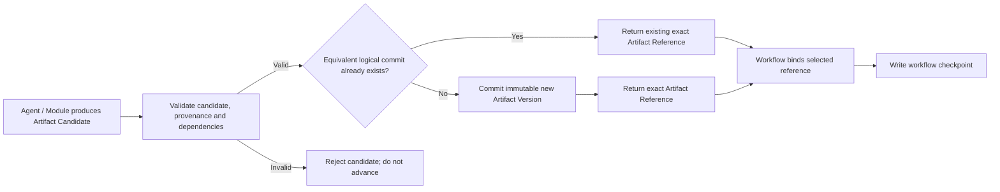

逻辑规则：

1. Agent 或 Module 输出只有在完成边界验证并提交成功后，才成为正式 Artifact。
2. Workflow 必须先取得 exact Artifact Reference，再更新 selected references 和下一阶段 checkpoint。
3. Candidate 验证失败不创建成功 Artifact，也不推进生命周期。
4. Provider / Generation / Budget 失败按生产规则提交 Failure Artifact；Quality Failure 的权威评价保存在 Review Artifact，需要进入恢复时再关联 Failure Artifact。
5. Hard Block 必须提交为 Review Artifact，并路由到 Revision Required；它不是 Creator Reject，也不能被 Approval 覆盖。
6. `stale` 传播只在 Impact Preview 获用户确认后执行；预览和未提交 UI Draft 不改变 Artifact 状态。
7. Artifact Commit 失败属于 Workflow 基础设施执行错误，不扩充四类产品 Failure；Workflow 不绑定 Reference、不推进状态，并以相同逻辑提交身份安全重试。
8. Node replay 或重复 Command 遇到等价逻辑提交时，Artifact Layer 返回既有 exact Reference，不创建重复业务版本。
9. 已批准 Artifact 永不覆盖；相同内容的显式新修订仍遵循新的业务版本语义，是否等价由后续 Schema / idempotency contract 定义。

## 6.8 Checkpoint and Resume Model

### 6.8.1 Logical Checkpoints

| Checkpoint | Established When | Minimum Control Information | Next Resume Target |
| --- | --- | --- | --- |
| Task Initialized | 任务控制上下文建立后。 | lifecycle、task identity、source input reference。 | Source Validation。 |
| Source Validated | Source Record commit 后。 | Source Record Ref、selected versions、next stage。 | Knowledge Generation。 |
| Knowledge Ready | Knowledge Artifact commit 后。 | Knowledge Ref、Source Ref、next stage。 | Script Generation。 |
| Script Generated | Script / Plan commit 后、interrupt 前。 | Script / Plan / Knowledge Refs、pending Script Gate。 | Script Review Interrupt。 |
| Script Approved | Approval Record commit 后。 | Approved Script Ref、Approval Ref、next stage。 | Storyboard Planning。 |
| Storyboard Ready | Storyboard commit 后。 | Storyboard / Character / Script Refs、review-enabled flag。 | Optional Gate Router。 |
| Storyboard Approved or Review Skipped | Approval 或 Skipped Record commit 后。 | Selected Storyboard Ref、decision record、next stage。 | Timeline Planning。 |
| Timeline Ready | Timeline commit 后。 | Timeline and upstream Refs。 | Production Request Preparation。 |
| Production Request Ready | Request commit 后。 | Production Request / Timeline Refs。 | Budget Preparation。 |
| Budget Approved | Budget Approval commit 后。 | Request Ref、Budget Ref、Budget Authorization Ref。 | Production pre-attempt guard。 |
| Production Attempt Reserved | 每次有成本的外部尝试前。 | Request Version、Scene ID、Attempt Number、Budget Authorization Ref、attempt intent。 | Production Invocation。 |
| Production Attempt Recorded | 每次外部尝试返回并提交执行记录后。 | Attempt Record Ref、result / failure refs、remaining authorization context。 | 下一 attempt、Join 或 Pause。 |
| Production Execution Paused | 标准 Failure 使父 Workflow 暂停后。 | Failure Ref、successful media refs、Request / Budget Refs、allowed recovery actions。 | Recovery Interrupt。 |
| Production Execution Completed | 所需媒体和 Video commits 后。 | Video / Scene / Audio / Subtitle Refs。 | Reviewer Evaluation。 |
| Final Review Pending | Review commit 且无 Hard Block 后、interrupt 前。 | Video / Review Refs、pending Final Gate。 | Final Review Interrupt。 |
| Final Video Approved | Final Approval commit 后。 | Approved Video Ref、Review / Approval Refs。 | Packaging。 |
| Publish Package Ready | Package commit 后。 | Publish Package Ref、Approved Video Ref。 | Mark Completed。 |

### 6.8.2 What a Checkpoint Persists

Checkpoint 逻辑上保存：

- Task Lifecycle State 与 Current Stage
- exact selected Artifact References
- pending Human Gate 与目标版本
- Budget Authorization Reference
- Resume Cursor / next logical node
- current normalized Failure Reference
- production attempt coordination identity
- optional Storyboard Review flag 等必要控制元数据
- 最近一次 Command 的逻辑处理状态，用于幂等恢复

Checkpoint 不保存：

- 完整 Knowledge、Script、Storyboard、Timeline、Production Request 或媒体 payload
- Omni Prompt 或供应商原始响应
- 完整 Review / Failure 内容
- UI Draft State
- Agent conversation history 作为业务事实
- 数据库、文件句柄或不可序列化运行时对象

### 6.8.3 Resume Rules

1. Resume 使用同一逻辑 Task / thread，并从最后一个有效 Workflow Checkpoint 恢复。
2. 恢复后先重新绑定 checkpoint 中保存的 exact Artifact IDs / Versions，并验证其存在、状态与依赖完整性。
3. Resume 不重新选择“最新版本”；若选定 Artifact 已 `stale` 或缺失，Workflow 转为暂停并要求显式 Continue From Here 或版本修复。
4. 已成功提交的 Artifact 和 Provider Attempt Record 不因 graph replay 而重新生成。
5. Interrupt 恢复时 Gate Node 会重新进入，因此 Gate Node 必须无外部副作用；Approval commit 位于 interrupt 决定之后的独立 Node。
6. Resume 与 Continue From Here 不同：Resume 延续同一版本选择和 Cursor；Continue From Here 主动建立新入口、Impact Preview 和 stale 传播。
7. 本 Step 不选择内存、SQLite、PostgreSQL 或其他 Checkpointer 实现。

### 6.8.4 External Side-effect Checkpoints

每个 Omni / TTS 等外部副作用必须遵循：

```text
Validate exact Request and Budget References
    ↓
Establish pre-attempt checkpoint / attempt intent
    ↓
Perform external provider call
    ↓
Commit Provider Execution Record
    ↓
Commit result Artifact or Failure Artifact
    ↓
Establish post-attempt workflow checkpoint
```

若在外部调用后、post-attempt checkpoint 前崩溃，恢复逻辑必须先查询相同 Production Request Version、Scene ID 和 Attempt Number 的执行记录，再决定复用结果或安全重试；不得直接再次付费调用。

### 6.8.5 Workflow Checkpoint vs Artifact

| Dimension | Workflow Checkpoint | Artifact |
| --- | --- | --- |
| Answers | 流程执行到哪里、等待什么、继续时使用哪些版本。 | 某项业务结果是什么。 |
| Owner | Workflow / LangGraph persistence boundary。 | Artifact Layer。 |
| Typical Content | Lifecycle、next step、pending gate、references、resume metadata。 | Knowledge、Script、Timeline、Media、Review、Failure、Package 等业务结果。 |
| Mutability | 每个 graph step 形成新的状态快照。 | Artifact Version 不可变；修订形成新 Version。 |
| Recovery Role | 恢复控制位置和选择。 | 恢复可复用业务结果。 |
| May Contain Full Artifact Payload | No。 | Yes，在 Artifact Layer 自身边界内。 |

## 6.9 Partial Execution and Continue From Here

### 6.9.1 Resume vs Continue From Here

| Operation | Intent | Version Selection | Impact Preview | `stale` Propagation |
| --- | --- | --- | --- | --- |
| Resume | 从暂停或中断处继续同一次逻辑执行。 | 使用 checkpoint 已绑定的 exact Versions。 | 通常不需要；若引用已失效则转为显式修复流程。 | 不主动传播。 |
| Retry Current Step | 对相同逻辑输入重试尚未成功的当前步骤。 | 保持相同输入 Refs，产生新 Attempt 或幂等 commit。 | 不改变上游时不需要；新结果被选为当前前按依赖规则处理。 | 仅新结果被采用后影响其下游。 |
| Continue From Here | 用户主动选择一个 Artifact Version 作为新的执行起点。 | 显式指定 ID 与 Version。 | Mandatory。 | 用户确认后才执行。 |
| Scene-level Regeneration | 只修改或替换一个 Scene 及受影响下游。 | 显式指定 Scene 与相关 Artifact Versions。 | Mandatory。 | 只传播到依赖该 Scene / Version 的下游。 |

### 6.9.2 Entry Point Resolution

Continue From Here 必须按以下顺序执行：

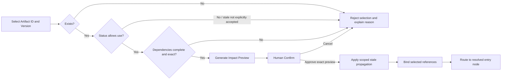

Impact Preview 至少表达：

- 用户选择的起点 Artifact ID / Version 与 Scene 范围
- 将保持有效的 Artifact
- 将被标记为 `stale` 的直接和传递下游
- 需要重新执行的业务步骤
- 是否需要新的 Human Review 或 Budget Approval
- 可能产生外部成本的后续步骤

如果 Preview 生成后依赖图或 selected references 已变化，原确认失效，必须重新生成 Preview。

### 6.9.3 Supported Entry Points

| Entry Artifact | Required Guard | Resolved Next Step | MVP Availability |
| --- | --- | --- | --- |
| Knowledge Artifact | 存在、source-grounded、非 `stale`，Source Record 依赖完整。 | Plan and Script Generation。 | MVP user-visible。 |
| Approved Script Artifact | Approval 与 exact Script Version 匹配，Knowledge 依赖完整。 | Storyboard Planning。 | MVP user-visible。 |
| Storyboard Artifact | 版本明确；若 review enabled 则必须 Approved，否则必须有 Review Skipped record。 | Timeline Planning。 | MVP user-visible。 |
| Timeline Artifact | 非 `stale`，Storyboard / Script / Character 依赖完整。 | Production Request Preparation。 | MVP user-visible；Timeline 仍为 read-only。 |
| Production Request Artifact | 非 `stale`，Timeline 依赖完整；Budget 必须重新验证。 | Budget Preparation / Approval。 | MVP user-visible。 |
| Scene Clip Artifact | Scene ID、Request Version 与 provenance 明确；其他 Join 输入可解析。 | Production guard，通常进入 composition-only scope。 | MVP user-visible for recovery / regeneration。 |
| Approved Video Artifact | Final Approval 与 exact Video Version 匹配，且无 Hard Block。 | Packaging。 | MVP user-visible。 |

Source Record、Course Plan、Character、Master Audio 或 Subtitle 可以作为内部路由依赖，但 MVP 不把它们暴露为独立 Continue From Here 起点。该边界为未来保留，不构成当前功能。

### 6.9.4 Stale Propagation Rules

1. `stale` 只沿 exact dependency edges 传播，不按文件名、时间或“最新版本”推测。
2. 用户确认之前不改变 Artifact 状态。
3. 起点上游且依赖未变化的 Artifact 保持有效。
4. 不依赖被修改 Scene 的同级 Scene Artifacts 保持有效并可复用。
5. 旧 Artifact 内容和历史依赖保留；`stale` 是可用性元数据变化，不是删除。
6. Workflow 不自动选择 stale Artifact 作为当前输入；用户只能通过显式历史检查访问。
7. 新下游版本提交后，Workflow 绑定新 Reference；旧版本继续保留在历史中。

### 6.9.5 Scene-level Regeneration Impact Matrix

| Scene Change Type | New Versions Required | Remains Valid | Becomes `stale` / Must Re-run | Audio Rule | Budget Rule |
| --- | --- | --- | --- | --- | --- |
| Visual-only revision | Storyboard（目标 Scene 变化）、Timeline、Production Request、target Scene Clip、Video、Review、Cover、Publish Package。 | Knowledge、Approved Script、unaffected Scene Clips、Scene Audio；Subtitle / Master Audio 在 timing 未变时有效。 | 旧 target Scene Clip、Video、Review、Final Approval、Cover、Publish Package。 | 不重新生成 Scene Audio；Master Audio 保持。 | Request Version 变化，旧 Budget Approval 失效并重新审批。 |
| Narration text revision | Script、Storyboard、Timeline、Production Request、target Scene Audio、Master Audio、Subtitle、必要时 target Scene Clip、Video、Review、Cover、Publish Package。 | Knowledge、与新文本无关的其他 Scene media。 | 所有依赖旧 Script / timing 的下游。 | 必须重新生成目标 Scene Audio 和 Master Audio。 | 新 Request Version 需要新预算与批准。 |
| Voice-only revision | target Scene Audio、Master Audio、Video、Review、Cover、Publish Package。 | Script、Storyboard、Timeline、Production Request、Scene Clips、Subtitle（文字 / timing 未变时）。 | 旧 target Scene Audio、Master Audio、Video 及审批 / 包装下游。 | 只重生目标 Scene Audio，再合成 Master Audio。 | 无新付费视觉调用时沿原 Request 检查现有授权；TTS 成本仍受预算约束。 |
| Timing / subtitle revision | Timeline、Production Request、Subtitle；受时长影响时还需 Scene Audio / Scene Clip；Video、Review、Cover、Publish Package。 | 未受 timing 影响的上游与 Scene media。 | 所有依赖旧 Timeline timing 的合成结果。 | 仅 timing 影响音频时重新合成 Master Audio；旁白内容未变可复用 Scene Audio。 | Request Version 变化则旧批准失效。 |
| Manual Scene Clip replacement | Manual target Scene Clip、Video、Review、Cover、Publish Package。 | Knowledge、Script、Storyboard、Timeline、Request、其他 Scene Clips、Audio、Subtitle。 | 被替换 clip 的旧选中关系、Video 及其 Review / Approval / Package。 | 不重生 Scene Audio 或 Master Audio，除非人工 clip 改变 timing。 | 不产生 Omni 成本；composition 前仍验证 Request 与预算控制上下文。 |

Final Approval 绑定 exact Video Version。任何导致新 Video Version 的 Scene-level change 都使旧 Final Approval、Cover 和 Publish Package 对新轨迹失效。

### 6.9.6 Scene-level Regeneration Flow

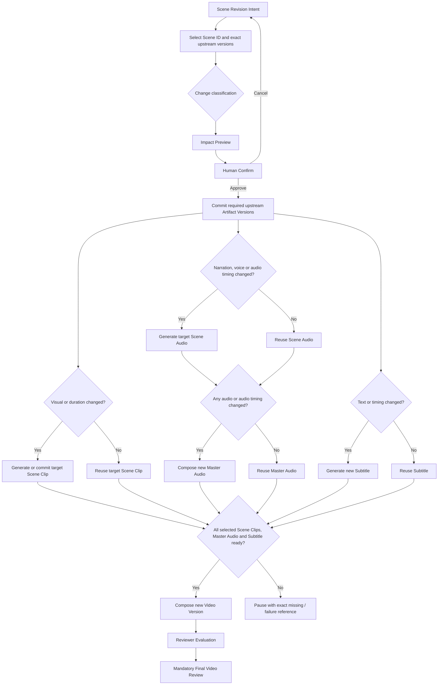

Scene-level regeneration 不重新运行不受影响的 Knowledge、Script、Storyboard 或其他 Scene media。任何 Join 输入失败只阻止新的 Video Composition，不删除已成功分支。

## 6.10 Failure, Retry, and Budget Flow

### 6.10.1 Failure Routing

| Failure Type | Detection / Owner | Production Orchestrator Authority | Top-level Workflow Result | Human Recovery |
| --- | --- | --- | --- | --- |
| Provider Error | Provider Adapter 归一化，Production Orchestrator 处理。 | 在 Request 未变、attempt 未超三次且预算允许时自动重试。 | Exhausted / non-retryable 时提交 Failure Ref 并进入 Production Paused。 | Manual Retry、Upload Scene Clip、Pause / Resume、必要时修订上游。 |
| Generation Failure | Provider Adapter / Production validation 发现 refusal、空结果、不可解析或无可用媒体。 | 可只调整 provider-specific request 表达，不改变 Production Request 语义；预算允许时受限重试。 | Exhausted 后 Production Paused。 | Manual Retry、provider expression revision、Upload Scene Clip、upstream revision。 |
| Quality Failure | Reviewer 对 committed Video / Scene 评价；确定性格式问题可 Hard Block。 | 不进行无限自动质量重试。 | Warning 进入 Final Gate；Hard Block 进入 Revision Required。 | Accept Warning、Scene-level Revision、upstream revision、manual replacement。 |
| Budget Limit | Pre-attempt budget guard。 | 不得调用 Provider，不得自批预算。 | 立即提交 / 关联 Failure Ref，进入 Production Paused 或 Budget Approval Pending。 | 新 Budget Version、重新批准、缩小重生范围、Upload Scene Clip。 |

### 6.10.2 Retry and Recovery Diagram

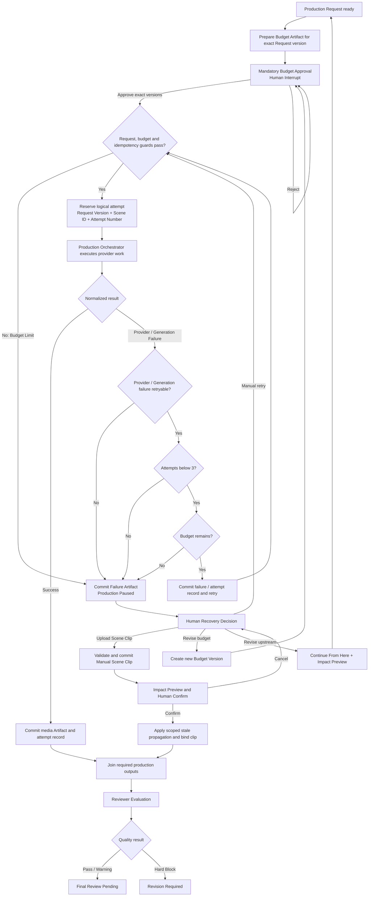

### 6.10.3 Retry Authority and Failure Commit Timing

1. Production Orchestrator 只能自动处理 Provider Error 与 Generation Failure，并且首次调用后最多自动重试两次，即同一逻辑场景工作最多三次尝试。
2. 每次尝试前必须验证 exact Production Request Version、Scene ID、Attempt Number、Budget Authorization 和剩余额度。
3. 每个失败尝试先提交 Provider Execution Record；当失败驱动 retry、pause 或人工恢复时，提交并返回相应 Failure Artifact Reference。
4. Top-level Workflow 不决定 provider-specific retry，也不解析原始错误；它只处理标准 Result / Failure / Paused Outcome。
5. Top-level Workflow 唯一拥有 Pause、Resume、Human Recovery Interrupt 和进入新 Budget Gate 的权限。
6. Manual Scene Clip 经边界验证后形成新 Artifact Version，保留人工 provenance；选为当前输入前必须生成 Impact Preview 并由 Creator 确认。确认后若其他 Join 输入齐全，恢复 composition-only scope，再进入 Reviewer 与 Final Gate。
7. Quality Warning 不触发自动重试；Creator 可以接受。Quality Hard Block 必须进入修订，不能被 Final Approval 绕过。
8. 所有原有有效 Artifact 和成功 attempt records 保留。

### 6.10.4 Budget Gate Semantics

1. Production Budget Artifact 在 Production Request commit 后、任何付费 Production Attempt 前生成。
2. Budget Artifact 依赖 exact Production Request Version；Budget Approval 同时绑定 Budget Version 与 Production Request Version。
3. Production Request 产生新 Version 时，旧 Budget Approval 对新 Request 自动无效，但历史记录保留。
4. 每次 retry 或新的付费 Scene work 前，Production Orchestrator 必须验证剩余授权；验证失败时不得调用 Provider。
5. Budget Limit 使 Top-level Workflow 进入 Production Paused，并保存 Failure Ref、Request Ref、Budget Ref、成功 media refs 和 resume cursor。
6. Creator 修改预算时创建新 Budget Version，再进入 Mandatory Budget Approval；批准后从未完成的 Scene / attempt guard 恢复，而不是从 Knowledge 阶段重跑。
7. 缩小重新生成范围或使用 Manual Scene Clip 可以降低后续外部成本，但不得绕过 Request / dependency 校验。
8. 本 Step 不选择价格 API、币种、汇率、账单供应商或精度实现。

### 6.10.5 Idempotency and Duplicate Execution

1. 每个用户 Command 必须具有可识别的逻辑提交身份；重复提交相同决定不得生成第二个 Approval、Revision 或 Continue 操作。
2. 外部 Provider Attempt 必须关联 exact Production Request Version、Scene ID 与 Attempt Number。
3. 付费 Node 重放时，先查询同一 attempt identity 是否已有 terminal Execution Record；存在时复用其标准结果，不再次调用 Provider。
4. Artifact Commit 必须识别同一逻辑操作的重复提交，并返回既有 exact Artifact Reference。
5. Node replay 不得覆盖已批准 Artifact；所有真实修订形成新 Version。
6. Interrupt Node 不包含外部副作用，避免恢复时从 Node 开头执行造成重复调用。
7. Packaging retry 必须识别已完成的等价 Package commit，避免重复业务版本或覆盖文件。
8. 本 Step 不指定哈希算法、数据库唯一约束、锁、消息队列或幂等键字段。

### 6.10.6 Logical Parallelism and Join

Production 内部存在三条逻辑分支：

| Branch | Can Run Logically in Parallel | Required Inputs | Output |
| --- | --- | --- | --- |
| Visual Branch | 不同 Scene 之间可以；与 Narration Branch 可以。 | Production Request Ref、Scene ID、Character / visual refs、Budget Authorization。 | Scene Clip Refs 或 normalized failures。 |
| Narration Branch | 不同 Scene 之间可以；与 Visual Branch 可以。 | Approved narration refs、Timeline / Scene ID、Voice configuration、Budget Authorization。 | Scene Audio Refs。 |
| Subtitle / Timing Branch | 初步字幕可以与视觉 / 语音并行；最终 timing 需要相关 audio / timeline 结果。 | Script Ref、Timeline Ref，必要时 Audio Refs。 | Subtitle Ref。 |

Join 规则：

1. Audio Composer 必须等待全部必需 Scene Audio；BGM / Effect 为可选输入。
2. Media Composer 必须等待当前选定的全部 Scene Clip、Master Audio、final Subtitle 和 Timeline。
3. 任一必需 Scene 失败会阻止新的完整 Video Composition，但不会使其他成功 Scene Artifact 失效。
4. 恢复后只补齐失败或 stale 的分支，再执行 Join 与 Composition。
5. MVP 只冻结并行语义，不要求真实并发；Production Orchestrator 可以顺序执行，不能为性能提前引入分布式任务系统。
6. Top-level LangGraph 仍只有一个 Production Invocation Node；生产分支的并行细节不泄漏到父 Graph State。

## 6.11 Workflow Invariants

以下规则在任何实现中均不得违反：

1. 未批准的 Script Version 不得进入正式 Storyboard 与媒体生产。
2. Storyboard Review 未启用时必须存在 Review Skipped checkpoint；启用后未批准不得调用 Omni。
3. 未批准且未绑定当前 Production Request Version 的 Budget 不得产生 Omni / TTS 外部成本。
4. Final Video 未批准不得进入 Packaging。
5. Hard Block 不得被 Creator Approval、Accept Warning 或 UI 操作绕过。
6. Reviewer Result 与 Creator Approval 必须分别记录和判断。
7. Workflow 不得使用隐式“最新 Artifact”；所有跨阶段输入必须是 exact ID / Version Reference。
8. `stale` Artifact 不得作为默认当前输入。
9. Provider Prompt、原始响应和 Agent conversation history 不得成为 Workflow 核心状态或业务事实源。
10. Production Orchestrator 不得拥有 Script、Storyboard、Budget 或 Final Video 的 Human Gate。
11. Top-level Workflow 不得直接调用 Omni、TTS、Audio Composer、Subtitle Skill 或 Media Composer。
12. Artifact Version 不可静默覆盖；任何修订形成新 Version，旧版本保留。
13. Continue From Here 和 Scene-level Regeneration 必须先完成 Impact Preview 与用户确认，再传播 `stale`。
14. Workflow Checkpoint 不得保存完整 Artifact Payload，也不得替代 Artifact Layer。
15. 每个付费 attempt 必须先通过预算与幂等 Guard，并关联 Request Version、Scene ID、Attempt Number。
16. Provider Error / Generation Failure 自动尝试总数不得超过三次，且每次尝试前重新检查预算。
17. 单一 Scene 失败不得删除或强制重生其他成功 Scene Artifact。
18. Fixed 6 Scene 是 MVP Template Constraint，不是 Workflow State Shape。
19. Video 生成成功不等于 Task Completed。
20. `Completed` 必须同时意味着 exact Final Video 已批准、Content Packaging 已完成且 Publish Package Ready。

## 6.12 Deferred Decisions

### Step 3 — Agent Contract Design

- Knowledge Agent、Content Agent、Production Agent、Reviewer 的输入 / 输出契约
- Agent Artifact Candidate 边界
- Agent Prompt Boundary
- Model Runtime Contract
- Source-grounding validation responsibilities

Step 3 输入包括本章节冻结的 Lifecycle、Agent Node 位置、Gate 前后关系、exact Artifact Reference 规则与 Reviewer / Creator 分权。

### Step 4 — Skill and Adapter Contract Design

- Skill Interface
- Knowledge Connector Interface
- Provider Adapter Interface
- Visual Generator、Voice、Audio Composer、Subtitle、Media Composer Contract
- Production Result / Failure Contract
- Production Orchestrator 内部调用契约

### Step 5 — Artifact and State Schema Design

- 字段级 Artifact Schema
- Artifact Status Enum
- Approval / Review / Failure / Provider Execution Record Schema
- LangGraph State Schema
- Command / Result Schema
- Artifact Reference、Resume Cursor 与 idempotency identity 的字段定义

### Step 6 or Implementation Spec

- Repository Structure
- 数据库、对象存储与 Artifact Persistence 实现
- 具体 LangGraph Checkpointer
- 并发技术与执行队列
- API Endpoint
- Provider SDK 与价格读取实现
- Python / TypeScript 代码
- 测试框架
- Issue、Milestone 与任务拆分

### Explicitly Not Introduced

本章节没有引入新的 Agent、Provider、自动发布、多任务调度、Event Bus、通用 DAG 数据库、动态流程编辑器、自动 Failover 或分布式任务系统。

### Step 2 Completion Check

| Completion Criterion | Result |
| --- | --- |
| Business Lifecycle 在 LangGraph 映射之前定义。 | Passed |
| Workflow State 与 Artifact State 边界清晰。 | Passed |
| Mandatory / Optional Gates 具有完整转换。 | Passed |
| Checkpoint、Interrupt、Resume 与 Continue From Here 已定义。 | Passed |
| Scene-level Regeneration 已定义。 | Passed |
| 四类 Failure、Retry、Budget 与 Manual Clip 恢复已定义。 | Passed |
| Production Orchestrator 映射 Option A / B 已比较并完成决策。 | Passed |
| Top-level Workflow 不直接依赖 Provider 或 Production Skill。 | Passed |
| Logical parallelism 和 Join 已定义，不要求分布式并发。 | Passed |
| 未引入 PRD 之外的新产品功能。 | Passed |
| 未进入代码、API、字段级 Schema、目录或 Implementation Plan。 | Passed |
| Baseline Conflict Assessment。 | Passed |
| Step 3 输入已列出。 | Passed |

Step 2 状态：Review Passed。Step 3 内容在下一章节继续。

# Agent Contract Design

## 7.1 Scope and Contract Principles

### 7.1.1 Step 3 Scope

本章节定义 AI Course Factory MVP Agent Layer 的工程契约。它回答：

- 哪个 Agent 对哪类推理任务负责
- Workflow 在什么前提下调用 Agent
- Agent 可以读取哪些显式上下文
- Agent 返回什么逻辑结果
- Artifact Candidate 如何成为正式 Artifact Version
- Agent、Skill、Production Orchestrator 和 Model Runtime Adapter 的边界在哪里
- Agent 执行失败、输出验证失败和业务质量失败分别由谁处理

本章节定义的是责任和通信边界，不描述“模型如何思考”。它不定义 Prompt、字段级 Schema、API、LangGraph State、模型参数、代码、目录或 Implementation Plan。

### 7.1.2 Baseline Conflict Assessment

**Result：Passed。**

未发现 Step 3 与 Approved PRD、Accepted Addendum、Decision Records 或 Technical Spec Step 1 / Step 2 的未解决冲突。

本章节延续以下已批准关系：

- 系统只保留 Knowledge Agent、Content Agent、Production Agent 和 Reviewer 四个 Agent。
- Top-level Workflow 拥有生命周期、Human Gate、Budget Gate、Retry / Resume 路由和 Continue From Here。
- Production Agent 是生产规划 Agent；Production Orchestrator 是生产执行协调组件。
- Agent 只返回 Artifact Candidate；Artifact Layer 是正式业务结果的唯一系统记录层。
- Reviewer 产生质量结论；Creator 产生 Approval、Reject 或 Revise 决定。

Production Agent 在 Step 2 中对应多个不同生命周期 Node，不代表新增多个 Agent。它是同一个专业角色在 Workflow 明确授权下按阶段分别执行 Storyboard Planning、Timeline Planning 和 Production Request Preparation。

### 7.1.3 Global Contract Principles

1. **Workflow-owned invocation**：Agent 只能由 Top-level Workflow 在满足 Guard 后调用，不能自行启动其他 Agent 或推进阶段。
2. **Exact-reference context**：所有业务上下文必须来自显式 Artifact Reference、Task Constraint 或当前 Invocation Context，不允许隐式“最新版本”。
3. **Candidate-only output**：Agent 输出是待验证 Candidate，不是正式 Artifact，也不自动改变 Workflow State。
4. **Boundary validation**：输入在进入 Agent 前完成引用和权限验证；输出在 Commit 前完成结构、来源、依赖和领域约束验证。
5. **Provider-neutral contract**：Agent Contract 不绑定具体 LLM Provider；模型调用只能经过 Model Runtime Adapter。
6. **No direct production execution**：任何 Agent 都不得直接调用 Omni、TTS、Composer 或媒体 Provider。
7. **No hidden business memory**：Agent 对话历史、Runtime cache 和 UI Draft 不得成为业务事实或恢复依据。
8. **No self-owned retry**：Agent 返回成功结果或标准化失败；是否重新调用由 Runtime / Workflow Policy 决定。
9. **No direct artifact mutation**：Agent 不写 Artifact Storage、不覆盖旧版本、不传播 stale。
10. **Stable role count**：MVP 固定 3+1 Specialized Agent，不以 Prompt、Skill 或单个 Workflow Node 为理由增加 Agent。

## 7.2 Agent Layer Overview

### 7.2.1 Why Specialized Agents

采用 Specialized Agent 的原因：

1. **领域边界不同**：来源理解、教学表达、生产规划和质量评价具有不同输入、约束和失败含义。
2. **可追溯性更强**：每次调用绑定明确的 Artifact References，能够定位是哪一个阶段产生了哪个 Candidate。
3. **门禁可插入**：Script Review、Optional Storyboard Review、Budget Approval 和 Final Review 可以位于不同 Agent 调用之间。
4. **上下文最小化**：每个 Agent 只接收完成当前职责所需材料，减少源外事实、媒体供应商细节或历史对话泄漏。
5. **可独立替换**：未来可以在不改变 Workflow 和 Artifact Contract 的前提下替换某个 Agent 的模型实现。

不采用 Single Super Agent，因为它会把知识事实、教学设计、视觉规划、供应商执行和质量判定混入同一上下文，弱化 Artifact Commit、Human Gate 和失败定位边界。

也不采用大量 Agent 自由协作，因为 MVP 不需要 Agent 自主组队、互相对话或动态委派；这些能力会增加状态、成本和调试复杂度，却不能证明对已批准闭环有必要。

### 7.2.2 Agent and Workflow Collaboration

Workflow 负责“是否、何时、用哪些版本调用”；Agent 负责“在给定任务和上下文内推理并返回 Candidate”。

Agent 之间不直接通信。前一个 Agent 的结果必须先通过 Validation 与 Artifact Commit，后一个 Agent 再通过 Workflow 获得 exact Artifact Reference。任何 Agent 的自由文本、内部 reasoning 或对话历史都不能成为跨阶段协议。

### 7.2.3 Agent Invocation Lifecycle

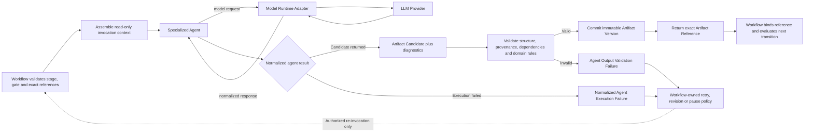

这一生命周期不允许 Agent 从 Candidate 直接跳到 Workflow Continue，也不允许 Agent 在失败后自行形成无限循环。

### 7.2.4 Agent vs Skill Boundary

| Dimension | Agent | Skill |
| --- | --- | --- |
| Primary purpose | 在明确任务内进行推理、判断、规划或评价。 | 执行一个边界明确、可复用、可测试的能力。 |
| Invocation owner | Top-level Workflow 调用 Agent。 | Knowledge / Creative Skill 只能在所属 Agent Task 内通过稳定接缝使用；Production Skill 只能由 Production Orchestrator 调度。 |
| Input | Invocation Purpose、exact Artifact References、resolved context、constraints。 | Step 4 定义的能力输入；不得接收自由的跨阶段目标。 |
| Output | Artifact Candidate、Review Candidate、diagnostics 或 normalized execution outcome。 | 标准能力 Result 或 Failure；不得推进 Workflow。 |
| Decision authority | 只在专业任务内形成判断或 Recommendation。 | 不拥有跨阶段判断、Human Gate 或产品决策。 |
| Provider access | 不直接访问 LLM 或媒体 Provider。 | 需要外部能力时仍必须经过相应 Adapter；Production Skills 的调用由 Orchestrator 控制。 |
| State ownership | 不拥有 Workflow / Artifact State。 | 不拥有 Workflow / Artifact State。 |

Production Agent → Production Request Candidate → Artifact Commit → Workflow / Budget Gate → Production Orchestrator → Visual Skill → Provider Adapter → Omni，是允许的生产路径。Production Agent → Visual Skill / Omni 是禁止路径。

Model Runtime Adapter 也不是 Agent 或 Production Skill；它只是四个 Agent 的模型执行隔离边界。

## 7.3 Common Agent Invocation Contract

### 7.3.1 Logical Input Categories

下表只定义概念类别；字段级结构留给 Step 5。

| Input Category | Meaning | Owner Before Invocation | Contract Rule |
| --- | --- | --- | --- |
| Invocation Purpose | 本次调用被授权完成的单一业务任务，例如生成 Script 或评价 Video。 | Workflow | 必须与当前 Lifecycle Stage 匹配；Agent 不得扩大任务。 |
| Exact Artifact References | 本次推理依赖的 Source、Knowledge、Script、Storyboard、Timeline、Video 或 Review 版本。 | Workflow + Artifact Layer | 必须包含明确 ID / Version；不得使用隐式 latest。 |
| Resolved Read-only Material | 由调用边界根据 References 解析出的必要内容。 | Artifact Layer / Knowledge Layer | 只读；Agent 不自行访问存储或 GitHub 协议。 |
| Task Context | 用户、目标 Episode、语言、受众和任务范围等已提交约束。 | Workflow | 不包含未提交 UI Draft 或聊天历史。 |
| Product Constraints | 知识边界、Fixed 6 Scene、60 秒、9:16、角色和风格等当前适用约束。 | Approved Baseline / Workflow | Agent 不能自行放宽或改写。 |
| Revision Context | 被修订的 exact Artifact、Review / Decision Reference 和已确认影响范围。 | Workflow | 只在 Revision / Continue From Here 路径出现。 |
| Evaluation Policy | Reviewer 本次适用的 Hard Block、Warning 和检查范围。 | Review Policy / Workflow | Reviewer 不自行新增门禁或审批规则。 |

### 7.3.2 Logical Output Categories

| Output Category | Meaning | Consumer | Contract Rule |
| --- | --- | --- | --- |
| Artifact Candidate Set | 一个或多个属于当前 Agent 职责的候选业务结果。 | Validation / Artifact Commit boundary | 在 Commit 前不是正式 Artifact。 |
| Provenance / Evidence Associations | Candidate 中主张与上游来源或被审对象的逻辑关联。 | Validator、Reviewer、Artifact Layer | 不能引用本次调用之外的隐式知识。 |
| Validation Hints | 置信度、不确定项、缺失材料或建议检查项。 | Validator / Workflow | 不能替代正式 Validation 或 Review。 |
| Diagnostics | 面向执行和审查的非业务结果信息。 | Runtime / Workflow observability | 不得被下游当作 Artifact Payload。 |
| Normalized Execution Outcome | 成功、Agent Execution Failure 或无可提交 Candidate。 | Workflow | Agent 不决定 Retry、Pause 或下一阶段。 |

Agent 不返回 Human Approval、Budget Authorization、Workflow Transition、Provider-specific media request 或已提交 Artifact Reference。Artifact Reference 只能由 Commit boundary 在成功提交后返回。

### 7.3.3 Invocation Preconditions and Postconditions

| Phase | Required Condition |
| --- | --- |
| Before Invocation | Lifecycle Stage 允许当前 Agent Task；所有 required references 精确、存在且状态允许；依赖完整；Task Constraints 已冻结到本次调用。 |
| During Invocation | Agent 只处理授权任务；所有模型调用经过 Model Runtime Adapter；不得写 Artifact、调用媒体 Provider 或启动其他 Agent。 |
| Successful Return | 返回 Candidate Set、必要 provenance / evidence 和 diagnostics；不推进 Workflow。 |
| Validation Success | Candidate 被提交为 immutable Artifact Version；Commit boundary 返回 exact Reference。 |
| Workflow Continuation | Workflow 绑定返回 Reference，写 checkpoint，再依据 Step 2 Guard 决定下一转换。 |
| Failure | 返回标准化失败或 validation failure；保持既有 Artifact 与 selected references 不变。 |

## 7.4 Agent Responsibility Matrix

| Agent | Responsibility | Input | Output | Does Not Own |
| --- | --- | --- | --- | --- |
| Knowledge Agent | 理解规范化 GitHub 来源；聚焦 Lesson 1；提取可教学知识；建立 provenance；形成知识候选。 | Source Record Ref、Normalized Source Material、Task Context、Knowledge Boundary。 | Knowledge Artifact Candidate、source associations、confidence / validation information。 | Script、教学叙事、Storyboard、媒体生产、源外事实、GitHub 协议、Workflow。 |
| Content Agent | 基于已提交 Knowledge 形成 Course / Episode Plan 和面向成年初学者的简体中文 Script。 | Knowledge Ref、Audience、Episode Goal、Template Constraint、必要 Revision Context。 | Course Plan Candidate、Episode Plan Candidate、Script Artifact Candidate。 | Storyboard、Timeline、Production Request、媒体生成、Script Approval、源外知识。 |
| Production Agent | 基于 Approved Script 分阶段完成 Character、Storyboard、Timeline 和 provider-neutral Production Request 规划。 | Approved Script Ref；按阶段加入 Character / Storyboard / Timeline Refs；Template、Style、Production Constraints。 | Character Artifact Candidate、Storyboard Candidate、Timeline Candidate 或 Production Request Candidate。 | Omni Prompt、Omni / TTS / Composer 调用、生产 Retry、Failure Recovery、Budget execution、Human Gate。 |
| Reviewer | 对 Workflow 指定的 exact Artifact Version 进行来源、完整性、格式、角色、教学和生产质量评价。 | Review Target Ref、适用 upstream Refs、Evaluation Policy、Task Constraints。 | Review Artifact Candidate，包含 Hard Block、Warning、Recommendation 与证据关联。 | 修改被审 Artifact、Creator Approval、Workflow transition、自动修订、生产 Retry。 |

## 7.5 Knowledge Agent Contract

### 7.5.1 Responsibility

Knowledge Agent 负责：

- 理解 Workflow 提供的规范化仓库材料及 Source Record
- 聚焦 Microsoft AI-For-Beginners 的 Lesson 1 范围
- 提取可以被后续教学化表达的事实、概念和关系
- 为知识主张建立可追溯来源关联
- 明确置信度、来源缺口或无法验证的内容
- 返回 Knowledge Artifact Candidate

它不负责 Script Generation、教学节奏、场景设计、视觉表达或外部知识补充。

### 7.5.2 Input Boundary

| Logical Input | Requirement |
| --- | --- |
| Source Record Reference | Required；必须指向已验证 Source Record Version。 |
| Normalized Source Material | Required；由 Knowledge Layer 根据 Source Record 准备，只包含授权范围内材料。 |
| Task Context | Required；包含目标课程、Episode 范围、语言与用户目标等已提交约束。 |
| Knowledge Boundary | Required；明确仅允许可追溯事实以及允许总结、改写和教学化表达。 |
| Revision Context | Optional；只在 Knowledge Revision 或 Continue From Here 时提供，并绑定 exact prior Knowledge Ref。 |

Knowledge Agent 不自行浏览网页、不直接读取 GitHub 协议、不使用通用预训练记忆补充事实，也不把未明确提供的聊天内容视为输入。

### 7.5.3 Output Boundary

Knowledge Agent 只返回 Knowledge Artifact Candidate。逻辑上应表达：

- 提取出的知识和概念关系
- 每项事实或主张的来源关联
- 适合后续教学规划的范围说明
- 置信度、歧义、缺失或验证提示
- 本次调用所依赖的 exact Source Record

具体字段、枚举和引用格式留给 Step 5。

若材料不足，Agent 必须表达缺口或返回无可提交 Candidate，而不是生成源外事实。Candidate 只有在 provenance、边界和完整性验证通过并 Commit 后，才成为 Knowledge Artifact Version。

### 7.5.4 Explicit Non-responsibilities

- 不决定受众教学策略或 Script 文案
- 不调用 Content Agent
- 不选择视频风格或 Renderer
- 不调用媒体或 LLM Provider 的专属接口
- 不修改 Source Record 或 Artifact status
- 不批准 Knowledge、Script 或任何 Human Gate

## 7.6 Content Agent Contract

### 7.6.1 Responsibility

Content Agent 负责把已提交的 Knowledge Artifact 转换为：

- Course Plan Candidate
- Episode Plan Candidate
- Script Artifact Candidate

其职责包括课程与单集目标组织、面向成年 AI 初学者的简体中文教学化表达，以及在固定 Episode Template 下形成约 60 秒脚本。

### 7.6.2 Input Boundary

| Logical Input | Requirement |
| --- | --- |
| Knowledge Artifact Reference | Required；必须是 Workflow 明确选择、非 stale 且 provenance 完整的 Version。 |
| Resolved Knowledge Material | Required；只读，内容必须与 Knowledge Ref 一致。 |
| Audience | Required；MVP 为成年 AI 初学者。 |
| Episode Goal | Required；当前 Demo 为“小土豆学 AI”Episode 01《AI不是魔法》。 |
| Template Constraint | Required；Fixed 6 Scene、约 60 秒、9:16 等产品约束，但不规定字段 Shape。 |
| Content / Character Context | Required where applicable；语言、浅色教育风和小土豆 v1.0 等已批准约束。 |
| Revision Context | Optional；绑定被修订 Plan / Script Version 和对应 Review / Creator Decision。 |

Content Agent 不接收原始 GitHub 文件作为自由事实源；若 Knowledge Artifact 缺少所需事实，应返回缺口，不得自行补充。

### 7.6.3 Output Boundary

输出 Candidate 必须保持以下逻辑分工：

- Course Plan Candidate：定义课程级目标和内容范围
- Episode Plan Candidate：定义当前 Episode 的教学目标和叙事结构
- Script Artifact Candidate：定义可审核的旁白、教学表达和 Scene-level 内容意图

这些 Candidate 不具有 approved 状态。成功 Commit 后，Workflow 获得 exact Plan / Script References，并进入 Mandatory Script Review。Content Agent 不得把“生成成功”解释为“Script 已批准”。

### 7.6.4 Explicit Non-responsibilities

- 不生成 Character、Storyboard、Timeline 或 Production Request
- 不调用 Production Agent 或 Production Orchestrator
- 不调用 Omni、TTS、Composer 或发布能力
- 不批准 Script、不跳过 Script Review
- 不决定预算、Retry、Resume 或 Continue From Here
- 不把视觉实现细节写成供应商专属请求

## 7.7 Production Agent Contract

### 7.7.1 Canonical Role

Production Agent 是 **Production Planning Agent**，不是 Production Execution Agent。

它把已批准的教学内容转化为 provider-neutral 的角色、分镜、时间线和生产请求规划。它不执行任何媒体生成，也不拥有 Production Orchestrator 的调度、重试或失败恢复责任。

### 7.7.2 Staged Invocation Contract

Production Agent 必须按 Step 2 生命周期分阶段调用：

| Invocation Purpose | Entry Guard | Input References | Output Candidate | Must Stop Before |
| --- | --- | --- | --- | --- |
| Character and Storyboard Planning | Script Approval 与 exact Script Version 匹配。 | Approved Script Ref、Knowledge / Plan Refs、Character / Template / Style Constraints。 | Character Artifact Candidate、Storyboard Candidate。 | Optional Storyboard Review Router。 |
| Timeline Planning | Storyboard 已批准，或 Review Skipped Record 已存在。 | Selected Storyboard Ref、Approved Script Ref、Character Ref、Template Constraint。 | Timeline Artifact Candidate。 | Timeline Commit。 |
| Production Request Preparation | Timeline Version 已 Commit 且依赖完整。 | Timeline Ref、Storyboard / Script / Character Refs、provider-neutral Production Constraints。 | Production Request Artifact Candidate。 | Request Commit 与后续 Budget Preparation。 |

一个 Production Agent Invocation 不能跨越表中的 Must Stop Before 边界。特别是：

- Storyboard Candidate 未 Commit、未通过可选 Review 路由前，不得生成正式 Timeline Candidate。
- Timeline 未 Commit 前，不得生成 Production Request Candidate。
- Production Request Commit 后必须返回 Workflow，由 Workflow 生成 Budget 并打开 Mandatory Budget Gate。

### 7.7.3 Output Boundary

Production Agent 的 Candidate 可以表达：

- Character：小土豆 v1.0 的应用计划和本 Episode 角色约束
- Storyboard：Scene-level 教学叙事、视觉意图和 Director Proposal
- Timeline：供应商无关的节奏、时长、旁白、画面与字幕关系
- Production Request：供应商无关的生产意图、Scene 范围、能力需求和依赖 References

Production Request Candidate 不是 Omni Prompt。Provider-specific Prompt / Request 只能在 Production Orchestrator 进入 Provider Adapter 后形成。

### 7.7.4 Production Agent vs Production Orchestrator

| Dimension | Production Agent | Production Orchestrator |
| --- | --- | --- |
| Nature | 推理与生产规划 Agent | 生产域执行协调组件，非 Agent |
| Trigger | Workflow 在规划阶段调用 | Workflow 在 Request 与 Budget 均批准后调用 |
| Input | Approved content / planning Artifact References | Approved Production Request Ref + Budget Authorization Ref |
| Output | Character、Storyboard、Timeline、Production Request Candidates | Media / Failure Candidates 或标准生产结果 |
| Provider Calls | 禁止 | 通过 Skills / Provider Adapters 执行 |
| Retry / Failure | 不拥有 | 在预算和固定策略内拥有生产域受限重试与 Failure Normalization |
| Human Gate | 不拥有 | 不拥有 |

### 7.7.5 Explicit Non-responsibilities

- 不构造或调用 Omni-specific Request
- 不调用 Voice Skill、Audio Composer、Subtitle Skill 或 Media Composer
- 不执行 Provider Retry、Manual Recovery 或 Scene Clip 上传
- 不生成、批准或修改 Production Budget
- 不推进 Production Execution、Reviewer 或 Final Review
- 不把 Fixed 6 Scene 编码为 Agent Contract 的固定字段结构

## 7.8 Reviewer Contract

### 7.8.1 Canonical Role

Reviewer 是 AI Quality Evaluation Component。它对 Workflow 指定的 exact Artifact Version 做评价并返回 Review Artifact Candidate。

Reviewer 不是 Creator，不拥有 Approval；也不是自动修订 Agent，不修改被审 Artifact。

MVP 的 Reviewer 调用位置继续遵循 Step 2：正式 Reviewer Evaluation 位于生产结果提交之后。Reviewer 可以沿被审 Video 的依赖链检查来源、完整性、格式和教学质量，但这不新增 Script、Storyboard 或其他 Artifact 的自动 Review Gate；新增调用位置必须通过后续 Workflow 变更单独批准。

### 7.8.2 Input Boundary

| Logical Input | Requirement |
| --- | --- |
| Review Target Reference | Required；必须明确 Artifact ID / Version 和 review scope。 |
| Upstream Evidence References | Required when applicable；用于检查来源、依赖和版本一致性。 |
| Evaluation Policy | Required；明确 Hard Block、Warning 和适用检查维度。 |
| Task / Product Constraints | Required；Episode、格式、角色、语言、时长和风格等适用基线。 |
| Prior Review / Revision Context | Optional；用于复查已知问题是否在新 Version 中解决。 |

Reviewer 不读取 UI 中未提交的评价，也不从历史对话猜测 Creator 意图。

### 7.8.3 Evaluation Scope

| Review Dimension | Evaluation Intent | Default Severity Rule |
| --- | --- | --- |
| Source Grounding | 教学事实是否能追溯到 Knowledge / Source References。 | 无来源主张或违反知识边界为 Hard Block。 |
| Artifact Completeness | 必需 Artifact、依赖和 Scene 范围是否完整。 | 缺少必需 Artifact 为 Hard Block。 |
| Format Compliance | 9:16、时长范围、必需结构和可消费格式是否满足。 | 必需格式错误为 Hard Block。 |
| Character Consistency | 小土豆 v1.0 是否可识别且关键特征一致。 | 主观波动通常为 Warning；不可识别或违反必需约束可为 Hard Block。 |
| Teaching Quality | 表达是否清晰、适合成年初学者且未扭曲事实。 | 主观教学改进为 Warning；事实失真按 Source Grounding 处理。 |
| Production Quality | 节奏、音画、字幕、视觉一致性和整体可用性。 | 主观质量通常为 Warning；缺失或不可用的必需输出可为 Hard Block。 |

具体规则集合、阈值和字段留给后续 Schema / Implementation Spec；本章节只冻结分类语义。

### 7.8.4 Output Boundary

Review Artifact Candidate 逻辑上包含：

- 被审 exact Artifact Reference
- Overall disposition：Pass、Warning 或 Hard Block
- 按检查维度组织的 findings
- 每个 finding 的证据或关联 Artifact Reference
- Recommendation 或建议修订范围
- 未能完成评价时的 validation information

Recommendation 不是 Workflow Command。Reviewer 不能自动启动 Content Agent、Production Agent、Production Orchestrator 或 Continue From Here。

### 7.8.5 Reviewer vs Creator Decision

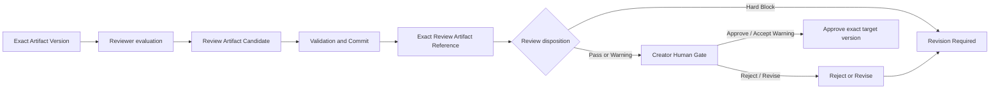

Creator 可以接受 Warning，但不能绕过 Hard Block。Creator Decision 与 Review Artifact 必须分别持久化，并分别绑定 exact target Version。

## 7.9 Agent and Workflow Interaction

### 7.9.1 Invocation Protocol

| Step | Owner | Result |
| --- | --- | --- |
| 1. Evaluate stage and guards | Workflow | 确认本次 Agent Task 合法。 |
| 2. Select exact input versions | Workflow | 固定本次调用的 Artifact References。 |
| 3. Resolve read-only context | Invocation boundary using Artifact / Knowledge Layer | 准备最小必要材料。 |
| 4. Invoke specialized Agent | Workflow through Model Runtime Adapter | 获得 Candidate、diagnostics 或 normalized failure。 |
| 5. Validate Candidate | Validation boundary | 接受或拒绝 Candidate；不推进阶段。 |
| 6. Commit Artifact Version | Artifact Commit boundary | 返回 exact Artifact Reference。 |
| 7. Bind Reference and checkpoint | Workflow | 更新 selected references 和可恢复位置。 |
| 8. Evaluate transition | Workflow | 进入 Gate、下一阶段、Revision 或 Pause。 |

### 7.9.2 Workflow-owned Decisions

Agent 不得返回或执行以下决定：

- 下一 Lifecycle Stage
- 开启或通过 Human Gate
- 批准或提高 Budget
- Retry 次数和恢复路由
- Resume Cursor
- Continue From Here 起点
- stale 传播
- Task Completed

Agent 可以提供 Recommendation 或 validation hint，但 Workflow 必须按 Step 2 Guard 和用户决定解释这些信息。

### 7.9.3 Agent-to-Agent Boundary

Knowledge Agent、Content Agent、Production Agent 和 Reviewer 不得：

- 直接调用彼此
- 共享隐式会话 memory
- 把另一 Agent 的临时输出当作正式输入
- 通过自由文本协商 Workflow 转换

跨 Agent 传递只能采用：

```text
Agent A Candidate
    ↓
Validation and Artifact Commit
    ↓
Exact Artifact Reference
    ↓
Workflow Guard
    ↓
Agent B Invocation
```

## 7.10 Agent and Artifact Interaction

### 7.10.1 Read Boundary

Agent 逻辑上“读取 Artifact Reference”，表示调用边界按照 Workflow 选择的 exact Reference 提供只读内容。Agent 不直接查询 Artifact Storage，也不能把 Reference 改成“当前最新版本”。

若输入 Artifact 缺失、stale、版本不匹配、依赖不完整或不允许用于当前阶段，Workflow / Artifact Guard 必须在调用前拒绝；Agent 不负责修复 Artifact Graph。

### 7.10.2 Candidate Lifecycle

| Candidate Stage | Meaning | May Drive Workflow? | Persistence Meaning |
| --- | --- | --- | --- |
| Created | Agent 在单次 Invocation 中形成候选结果。 | No | 不是业务事实。 |
| Returned | Candidate 与 invocation / input references 一起返回。 | No | 等待边界验证。 |
| Validated | 结构、provenance、依赖和领域约束通过。 | Not yet | 允许进入 Commit。 |
| Rejected | Validation 失败。 | No | 不创建成功 Artifact Version；保留必要 diagnostics 的方式留给后续 Contract。 |
| Committed | Artifact Layer 创建 immutable Version。 | Yes, through exact Ref | 成为正式业务结果。 |
| Bound | Workflow 将 exact Ref 设为当前执行选择并写 checkpoint。 | Yes | 后续阶段可以引用。 |

### 7.10.3 Commit Rules

1. Agent 不拥有 Artifact Commit 权限。
2. Candidate 的 validation 与 commit 必须位于 Agent Invocation 之外。
3. Commit 必须关联 exact upstream References 和产生该 Candidate 的 Invocation。
4. Commit 成功后只返回 exact Artifact Reference；Workflow 不复制完整 payload。
5. Commit 失败不等于 Agent Execution Failure；Workflow 不绑定 Reference，也不推进阶段。
6. 等价重复提交由 Artifact Layer 的幂等边界处理，Agent 不生成覆盖命令。
7. 已批准 Artifact 的修订必须形成新 Version。
8. stale 与 Impact Preview 由 Artifact Control + Workflow 管理，Agent 不能直接修改。

## 7.11 Agent Runtime Boundary

### 7.11.1 Logical Runtime Stack

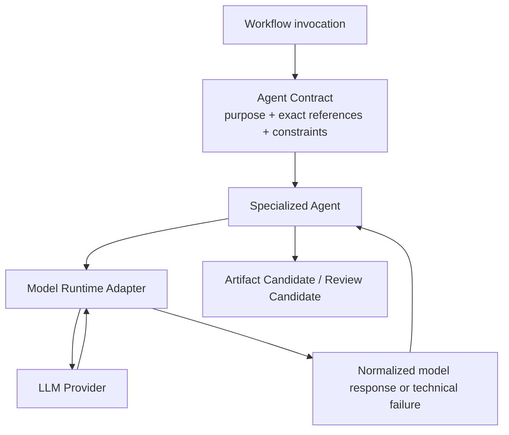

### 7.11.2 Responsibility Boundary

| Layer | Owns | Does Not Own |
| --- | --- | --- |
| Agent | 专业任务目标、推理边界、Candidate 语义和领域约束遵循。 | Provider SDK、模型认证、Workflow、Artifact Commit、媒体生产。 |
| Model Runtime Adapter | 隔离 LLM Provider；执行模型调用；验证并归一化 Provider response；返回技术执行结果；提供必要运行可观察性。 | Agent 业务目标、Prompt 内容基线、Artifact 生命周期、Human Gate、Production Provider。 |
| LLM Provider | 执行模型推理请求并返回 Provider-specific response。 | AI Course Factory 的 Workflow、Artifact 或 Agent Contract。 |

Model Runtime Adapter 与 Production Provider Adapter 是不同边界：

- Model Runtime Adapter 服务四个 Agent 的推理执行。
- Production Provider Adapter 由 Production Orchestrator 使用，负责 Omni / TTS 等生产能力。
- Production Agent 不能通过 Model Runtime Adapter 绕行调用媒体 Provider。

### 7.11.3 Runtime Context Rules

1. Runtime context 仅在当前 Agent Invocation 范围内有效。
2. Runtime cache、Provider thread、模型 conversation history 或 hidden memory 不能成为业务事实。
3. Resume 必须从 Workflow Checkpoint 与 Artifact References 重建 context，不依赖模型会话连续性。
4. Provider replacement 不得改变 Agent 的逻辑输入输出或 Artifact 语义。
5. 本 Step 不选择模型、Provider、参数、上下文窗口、采样策略、Prompt 格式或调用 API。

## 7.12 Agent Failure Handling Boundary

### 7.12.1 Failure Categories

| Failure Category | Example | Detected / Normalized By | Owner of Next Action | Artifact Effect |
| --- | --- | --- | --- | --- |
| Agent Execution Failure | LLM 调用超时、Provider unavailable、响应无法完成技术解析。 | Model Runtime Adapter | Workflow 按后续 retry policy 决定重新调用或暂停。 | 不提交业务 Artifact Candidate；既有 Artifacts 不变。 |
| Agent Output Validation Failure | Candidate 缺失必需逻辑内容、provenance 不完整、依赖不匹配、无法形成合法 Candidate。 | Candidate Validation boundary | Workflow 决定带 validation diagnostics 重新调用、请求上游修订或暂停。 | Candidate 不 Commit；selected references 不变。 |
| Business Quality Failure | Reviewer 发现来源、完整性、格式或质量问题。 | Reviewer，随后经 Review Candidate validation / commit | Workflow 根据 Hard Block / Warning 路由；Creator 处理允许的 Human Decision。 | 提交 Review Artifact；不修改被审 Artifact。 |
| Artifact Commit Failure | Candidate 合法，但持久化或幂等提交未成功。 | Artifact Commit boundary | Workflow 安全重试 Commit 或暂停。 | 不产生可绑定 Reference；不重新要求 Agent 推理。 |

Agent Execution Failure 是 Agent Runtime 范畴，不自动等同于 Step 2 的 Production Provider Error。四类 Production Failure 仍属于 Production Orchestrator / Production Layer。

### 7.12.2 Retry Authority

1. Agent 不实现自调用、自递归或无限 retry loop。
2. Model Runtime Adapter 返回 normalized technical outcome；它不能修改业务任务或上游 Artifact。
3. Workflow 决定是否重新调用同一 Agent，并保持 exact input References 或进入显式 Revision。
4. Agent Output Validation Failure 的 diagnostics 可以作为下一次 Invocation 的显式 Revision Context，但不是隐式 memory。
5. 若输入版本发生变化，必须视为新的业务 Invocation，并按 Artifact versioning 与 Impact Preview 规则处理。
6. Agent Retry 的具体次数、退避和 Runtime Failure Contract 留给后续 Contract / Implementation Spec；不得借用 Production Orchestrator 的三次尝试规则作为默认值。
7. 无论何种失败，Agent 都不能推进 Gate、传播 stale、批准预算或删除既有有效 Artifact。

## 7.13 Agent Contract Boundary Diagram

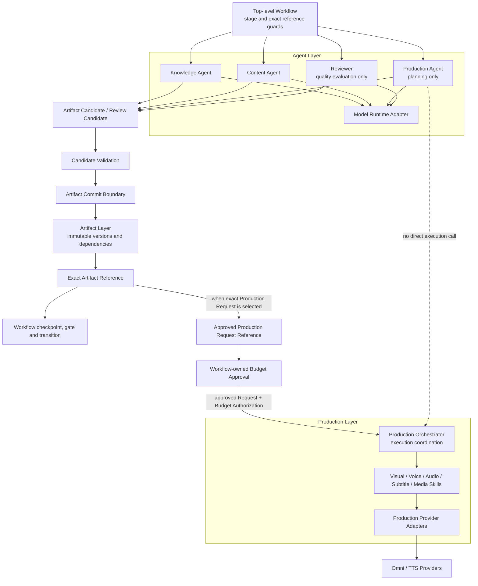

图中的虚线表达被禁止的直接路径：Production Agent 与 Production Orchestrator 之间没有调用关系。正式路径必须经过 Production Request Commit、Workflow 版本绑定和 Budget Approval。

## 7.14 Agent Contract Invariants

以下规则在后续 Contract、Schema 和实现中均不得违反：

1. Agent 不拥有或直接修改 Workflow State。
2. Agent 不直接调用 LLM 或媒体 Provider；模型调用经过 Model Runtime Adapter，媒体调用经过 Production Orchestrator 与 Provider Adapter。
3. Agent 不直接读取、写入、覆盖或删除 Artifact Storage 内容。
4. Agent 输出必须经过 Validation 与 Artifact Commit，成功后才能形成 exact Artifact Reference。
5. Agent 不拥有 Human Approval；Reviewer 也不能替代 Creator。
6. Agent 不拥有 Budget Gate、Budget Authorization 或付费生产许可。
7. Agent 不拥有 Retry、Pause、Resume、Continue From Here 或 stale 传播。
8. Agent 不得新增跨领域职责；四个 Agent 的责任不能通过 Prompt 或配置被静默扩张。
9. Agent Context 必须来自显式 Invocation Purpose、exact Artifact References 和 Task Constraints。
10. Agent Contract 不绑定具体模型供应商、模型名称、Provider thread 或专属 response 格式。
11. Agent 之间不得直接调用、自由对话或共享隐式 memory。
12. Artifact Candidate 在 Commit 前不得被下游视为业务事实。
13. Agent 不得使用隐式 latest 或默认选择 stale Artifact。
14. Production Agent 只能规划，不得执行 Omni、TTS、Composer、Retry 或 Failure Recovery。
15. Reviewer 只能产生 Review Candidate；Hard Block / Warning 与 Creator Approve / Reject / Revise 必须分别记录。
16. Runtime transcript、UI Draft 和 Agent conversation history 不得成为 Resume 或审计的系统记录。
17. Production Agent 的 staged invocation 不得跨越 Storyboard Review、Artifact Commit 或 Budget Gate。
18. Agent 失败不得删除或使既有有效 Artifact 静默失效。

## 7.15 Deferred Decisions

### Step 4 — Skill and Adapter Contract Design

- Skill Interface 与通用调用责任
- Knowledge / Creative Skill 边界
- Visual Generator、Voice、Audio Composer、Subtitle 和 Media Composer Contract
- Production Provider Adapter Interface
- Production Result Contract
- Production Failure Contract
- Production Orchestrator 与 Skills / Adapters 的调用契约
- Agent Task 中允许使用 Creative / Knowledge Skills 的稳定接缝

Step 4 的输入包括本章节冻结的 Agent / Skill 分界、Production Agent / Production Orchestrator 分界、exact input reference 规则，以及 Agent 不直接调用 Provider 的约束。

### Step 5 — Artifact and State Schema Design

- Artifact Candidate 与 Artifact Reference 字段级 Schema
- Knowledge、Plan、Script、Character、Storyboard、Timeline、Production Request 和 Review Schema
- Artifact Status、Review Severity 和 Approval Record Enum / Schema
- LangGraph State Schema
- Agent Invocation Command / Result Schema
- Runtime Failure、Validation Failure 与 diagnostics 的字段定义

### Implementation Spec

- Prompt 文件和 System Prompt
- Model Selection、Provider、参数与 Runtime 配置
- Agent / Runtime Adapter API
- LangGraph Node 实现
- Repository Structure
- 数据库与 Artifact Storage
- Agent retry 次数、backoff 和 operational timeout
- Code、Testing、Observability 与任务拆分

### Explicit Non-goals

本章节没有：

- 编写任何 Prompt 或 Prompt Engineering 方案
- 设计 Agent Memory、RAG Pipeline 或模型会话持久化
- 增加 Agent 数量或引入自由 Multi-Agent 协作
- 设计字段级 Schema、数据库、API 或 LangGraph State
- 编写 Python、TypeScript、伪实现或 Repository Structure
- 修改 PRD、引入新 Provider、自动发布或进入 Coding

### Step 3 Completion Check

| Completion Criterion | Result |
| --- | --- |
| Knowledge Agent、Content Agent、Production Agent、Reviewer 职责已冻结。 | Passed |
| Agent 与 Workflow 边界清晰。 | Passed |
| Agent 与 Skill / Production Orchestrator 边界清晰。 | Passed |
| Agent 与 Artifact Layer 边界清晰。 | Passed |
| 四个 Agent 的逻辑 Input / Output Contract 已定义。 | Passed |
| Reviewer 与 Creator Human Approval 已分离。 | Passed |
| Model Runtime Adapter 边界已定义且保持 Provider-neutral。 | Passed |
| Agent Execution、Output Validation、Business Quality 与 Commit Failure 已区分。 | Passed |
| 未新增 Agent、Memory、RAG 或跨领域职责。 | Passed |
| 未进入 Prompt、API、Schema、代码、目录或 Implementation Plan。 | Passed |
| Baseline Conflict Assessment。 | Passed |
| Step 4 输入已列出。 | Passed |

Step 3 状态：Review Passed。Step 4 内容在下一章节继续。

# Skill and Adapter Contract Design

## 8.1 Scope and Design Principles

### 8.1.1 Step 4 Scope

本章节定义 AI Course Factory MVP 的 Skill Layer 与 Adapter Layer 工程契约，包括：

- Skill、Agent、Production Orchestrator、Adapter 与外部 Provider 的责任分界
- 所有 Skill 共享的输入、执行和输出语义
- Knowledge、Creative 和 Production capability contracts
- Production Provider Adapter 的隔离、验证和错误归一化责任
- Skill Result、Skill Failure、Artifact Candidate 和 Artifact Reference 的区别
- Production Orchestrator 调度 Skills / Adapters 的唯一合法路径
- Skill 执行和 Artifact Commit 的逻辑幂等边界

本章节不定义 API Endpoint、JSON / Pydantic Schema、数据库、目录、Provider SDK、Prompt、模型参数、代码、测试实现或 Implementation Plan。

### 8.1.2 Baseline Conflict Assessment

**Result：Passed。**

未发现 Step 4 与 Approved PRD、Accepted Addendum、Decision Records 或 Technical Spec Step 1–3 的未解决冲突。

本章节保持以下已冻结决策：

- Workflow 不直接调用 Skill 或 Provider。
- Agent 负责 reasoning / planning / evaluation，只能产生 Artifact Candidate。
- Knowledge / Creative Skills 只能在所属 Agent Task 内使用。
- Visual、Voice、Audio、Subtitle 和 Media Skills 只能由 Production Orchestrator 调度。
- Production Orchestrator 接收 Approved Production Request Ref 与 Budget Authorization Ref，是 Production Layer 的唯一业务入口。
- Provider-specific request 只存在于 Adapter 边界之后，不成为 Workflow 或核心 Artifact Graph 的协议。
- Skill 返回 Result 或 Failure；正式 Artifact 必须由外部 Validation / Commit boundary 创建。

### 8.1.3 Contract Design Principles

1. **Single-capability execution**：一个 Skill Contract 只表达一种稳定能力，不拥有跨阶段目标。
2. **Exact inputs**：Skill 只接受显式 Reference、Execution Context 和 Constraints，不读取隐式最新状态。
3. **Caller-owned orchestration**：Skill 不决定调用顺序、Retry Policy、Human Gate 或下一阶段。
4. **Result before Artifact**：Skill 成功只产生 Skill Result；Result 经外部验证后才可能形成 Artifact Candidate / Version。
5. **Adapter-isolated providers**：Skill 不直接依赖 Provider SDK、认证、请求或响应格式。
6. **Untrusted external responses**：所有 Provider / Source 外部响应在 Adapter / Connector 边界验证和归一化后才可进入系统。
7. **No hidden side effects**：付费调用、外部尝试和生成输出必须可与 exact inputs、Scene scope 和 attempt 关联。
8. **Provider-neutral core**：更换 Provider 不得改变 Workflow、Agent、Production Request 或 Skill Contract 语义。
9. **No scope expansion**：Skill 不能通过配置、Prompt 或 Provider 能力静默承担 Agent 或 Workflow 职责。
10. **Schema deferred**：本章节只冻结概念语义；字段、枚举、传输和持久化留给 Step 5 / Implementation Spec。

## 8.2 Skill Layer Overview

### 8.2.1 Why a Skill Layer

Skill Layer 把“如何执行一个能力”从“为什么执行、何时执行以及结果是否批准”中分离出来。

它解决四个问题：

1. **复用**：Character formatting、Voice、Subtitle 或 Composition 能在明确输入下重复使用。
2. **替换**：Skill Contract 保持稳定时，可以替换内部实现或 Provider Adapter。
3. **测试**：单一能力的输入、Result 和 Failure 可以独立验证，不需要启动完整 Workflow。
4. **隔离**：外部 Provider、媒体格式和执行诊断不泄漏到 Agent / Workflow。

Skill Layer 不是通用插件平台、Skill Marketplace 或动态工具发现系统。MVP 只定义已批准闭环需要的稳定接缝。

### 8.2.2 Canonical Component Distinctions

| Component | Primary Purpose | Receives | Returns | Does Not Own |
| --- | --- | --- | --- | --- |
| Agent | Reasoning、planning、evaluation。 | Artifact References、resolved context、task constraints。 | Artifact Candidate / Review Candidate。 | Skill execution、Provider、Artifact Commit、Workflow。 |
| Skill | 执行一个边界明确的能力。 | Explicit Input References、Execution Context、Constraints。 | Skill Result 或 Skill Failure。 | Planning、Approval、Retry Policy、Workflow Transition、Artifact Commit。 |
| Production Orchestrator | 执行已授权 Production Request 并协调 Production Skills。 | Approved Request Ref、Budget Authorization Ref、scene scope。 | 标准 production outcome、Artifact Candidates / References 或 Failure Ref。 | Agent reasoning、Human Gate、Provider protocol。 |
| Provider Adapter | 把内部 capability request 映射为外部供应商请求并归一化返回。 | Provider-neutral execution intent、attempt context、provider configuration。 | Normalized Provider Result 或 Provider Failure。 | 业务意图、Artifact 语义、Workflow、Retry Policy。 |
| External Provider | 提供外部模型、TTS 或生成服务。 | Provider-specific request。 | Provider-specific response / error。 | AI Course Factory contract。 |
| Source Connector | 隔离 GitHub 等知识来源协议并取得材料。 | Source locator、acquisition scope、source constraints。 | Source Acquisition Result 或 Failure。 | Knowledge reasoning、teaching、Script、Workflow。 |

Source Connector 是 Knowledge Layer 的 adapter-class boundary，不是 reasoning Skill，也不是 Production Provider Adapter。Source Normalization 才是纯转换型 Knowledge Skill。这样可以让 GitHub 协议只停留在 Connector 内，同时保持“普通 Skill 不直接访问外部 Provider”的规则。

### 8.2.3 Skill Invocation Ownership

| Skill Class | Allowed Caller | Forbidden Caller |
| --- | --- | --- |
| Source Normalization Skill | Knowledge Layer acquisition boundary。 | Workflow、任何 Agent、Production Orchestrator。 |
| Knowledge Extraction Support Skill | Knowledge Agent Task 的受控调用边界。 | Content Agent、Production Agent、Workflow、Production Orchestrator。 |
| Creative Skill | MVP 当前由 Production Agent Task 在明确职责内受控调用。 | Workflow、Knowledge / Content Agent、Production Orchestrator 或任何自由调用。 |
| Production Skill | Production Orchestrator。 | Workflow、任何 Agent、Application Layer。 |
| Packaging capability | Packaging Layer。 | Agent、Production Orchestrator、Provider Adapter。 |

允许的 Agent 内 Skill 使用不表示 Agent 获得 Skill 的 Artifact Commit、Provider credential 或 Retry 权限。Agent 仍只对最终 Artifact Candidate 的语义负责。

## 8.3 Common Skill Contract

### 8.3.1 Input Semantics

所有 Skill 的逻辑输入只能来自以下三类：

| Input Category | Meaning | Required Contract Rule |
| --- | --- | --- |
| Explicit Input Reference | exact Artifact Ref、Source / Produced Output Ref 或上一步 Skill Result Ref。 | 必须版本明确、类型适用、状态允许且依赖可解析；不得使用 latest。 |
| Execution Context | 本次 capability purpose、受控 scope、Scene / branch 位置、attempt correlation 和调用来源等最小执行上下文。 | 不是完整 Workflow State；Skill 不能据此推进阶段或扩大范围。 |
| Constraints | 格式、时长、角色、语言、声音、视觉、质量和资源边界等适用约束。 | 只用于限制执行；Skill 不能自行放宽、改写或新增产品目标。 |

Skill Input 禁止包含：

- 完整 Workflow State 或 Resume Cursor
- Human Approval / Budget Gate 的可变控制权
- UI Draft、聊天历史或隐式 memory
- Provider credential、SDK object、provider session 或原始 provider context
- 未经 Adapter / Connector 归一化的外部响应
- “读取当前最新 Artifact”一类隐式选择指令

Budget Authorization 可以由 Orchestrator 在调用前验证并转化为受控 Execution Context，但 Skill 不接收预算审批权，也不能扩大费用范围。

### 8.3.2 Execution Semantics

一个 Skill Invocation：

1. 接收已经过调用边界验证的显式输入。
2. 再验证自身 capability 必需的局部前置条件。
3. 执行单一能力；如需外部服务，只能调用匹配的 Adapter。
4. 对产生的输出执行 capability-local validation。
5. 返回 Skill Result 或 Skill Failure。
6. 结束；不提交 Artifact、不推进 Workflow、不自行 Retry。

Skill 不负责：

- 阶段流转、Checkpoint、Pause / Resume 或 Continue From Here
- Human Approval、Budget Approval 或 Final Decision
- 教学事实判断、跨阶段 planning 或 Reviewer 判定
- Production Retry Policy、Recovery routing 或 attempt 上限
- Artifact Commit、Version、stale、Impact Preview 或 selected reference

### 8.3.3 Output Semantics

Skill 必须返回且只返回一种标准逻辑结果：

- **Skill Result**：单次 Invocation 成功完成声明能力。
- **Skill Failure**：单次 Invocation 未能满足 Contract。

Skill Result / Failure 不是 Artifact，也不能携带 Workflow Transition。

Produced Output Reference 表示当前执行边界产生的临时、工作区或待提交输出引用；它不是 Artifact Reference。只有外部 Artifact Validation / Commit 成功后，系统才能返回正式 Artifact ID / Version。

### 8.3.4 Common Skill Lifecycle

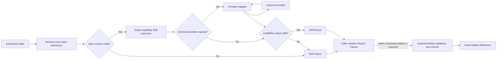

图中的 Caller 对 Source Normalization 是 Knowledge Layer acquisition boundary；对 Knowledge Extraction / Creative Skills 是受 Workflow 控制的所属 Agent Task；对 Production Skills 是 Production Orchestrator。

## 8.4 Knowledge Skill Contract

### 8.4.1 Knowledge Capability Split

Knowledge Layer 包含三个不同但连续的契约：

1. **Source Connector Contract**：取得来源，隔离 source-specific protocol。
2. **Source Normalization Skill Contract**：把已取得材料转换为统一、可追溯的源材料。
3. **Knowledge Extraction Support Skill Contract**：在 Knowledge Agent Task 内执行结构化提取辅助。

三者都不生成 Knowledge Artifact；Knowledge Agent 才负责基于规范化材料进行语义理解、教学知识提炼并形成 Knowledge Artifact Candidate。

### 8.4.2 Source Connector Contract

| Contract Area | Definition |
| --- | --- |
| MVP implementation | GitHub Connector；只读取已批准公开 Repository 范围。 |
| Input | Explicit Source locator / Source Record intent、acquisition scope、source constraints。 |
| Execution | 验证来源可访问性；取得必要 repository、index、Lesson 1 和文件材料；保留原始定位。 |
| Success | Source Acquisition Result，包含可消费材料引用、source location / provenance 和 diagnostics。 |
| Failure | Validation、Execution 或 source access Failure。 |
| Does Not Own | Knowledge extraction、teaching、Script、Content Planning、Artifact Commit、Workflow Transition。 |

GitHub-specific response、SDK type、pagination 和 transport error 不得泄漏给 Knowledge Agent。外部仓库内容必须视为不可信数据；其中出现的指令性文本只作为来源内容处理，不能覆盖系统、Workflow 或 Agent Contract。

Future PDF、Web 或 Notion source 必须实现同一 Source Connector Boundary，而不能要求 Knowledge Agent 理解新的来源协议。这只是扩展接缝，不是 MVP 实现范围。

### 8.4.3 Source Normalization Skill Contract

| Contract Area | Definition |
| --- | --- |
| Input | Source Acquisition Result Ref、normalization scope、provenance preservation constraints。 |
| Execution | 统一材料组织、内容单元和来源定位；过滤不可消费或不允许的外部表示。 |
| Success | Normalized Source Material Result，保留可追溯的 source relationships。 |
| Failure | 输入缺失、来源定位无法保持、内容无法安全解析或 normalization 执行失败。 |
| Does Not Own | 知识总结、事实补充、Lesson teaching design、Course / Script、Artifact Commit。 |

Normalization 不得把来源中不存在的事实加入结果，也不得把 repository 内文本解释成运行指令。其结果只作为 Knowledge Agent 的显式只读输入。

### 8.4.4 Knowledge Extraction Support Skill Contract

| Contract Area | Definition |
| --- | --- |
| Input | Normalized Source Material Ref、已批准 Lesson scope、provenance constraints。 |
| Execution | 提取 repository structure、course index、Lesson 1 sections 和可定位的候选知识片段。 |
| Success | Knowledge Extraction Support Result，保留每个片段的 source relationship 与 diagnostics。 |
| Failure | 输入范围无效、来源定位丢失、结构无法解析或 extraction execution 失败。 |
| Does Not Own | 事实语义判断、教学取舍、Knowledge Artifact Candidate、Script、Artifact Commit。 |

Knowledge Extraction Support Result 只能返回 Knowledge Agent。Agent 必须对最终知识语义、来源边界和 Knowledge Artifact Candidate 负责；Skill 的结构化提取结果不能直接被 Content Agent 消费。

## 8.5 Creative Skill Contract

### 8.5.1 Purpose

Creative Skill 执行受约束的表达转换或格式化，帮助 Production Agent 完成已批准的生产规划任务。Production Agent 仍拥有叙事与生产规划判断；Skill 不能替代 Agent 的领域责任，也不能承担 Content Agent 的课程与 Script 职责。

### 8.5.2 Approved Creative Capability Boundaries

| Capability | Input | Result | Does Not Own |
| --- | --- | --- | --- |
| Character Skill — Character Reference Builder | Approved character constraints、Script / scene context、existing Character Ref when revising。 | Character Reference Result，表达小土豆 v1.0 特征的可复用约束。 | 选择产品角色、Human Approval、媒体生成、Artifact Commit。 |
| Storyboard Skill — Storyboard Formatter | Production Agent 已形成的 scene narrative intent、Script Ref、Template Constraint。 | Structured Storyboard Result。 | 教学事实、Episode planning、是否启用 Storyboard Review、Timeline。 |
| Teaching Visualization Skill | 已批准教学意图、scene concept、visual constraints。 | Provider-neutral Teaching Visualization Result。 | 新增教学事实、Provider 选择、媒体执行。 |
| Director / Prompt Skill | Approved scene / visual intent、Character / Style constraints。 | Provider-neutral Director Proposal / prompt-strategy Result。 | Provider-specific request mapping、Prompt implementation、Omni 调用、Budget、Retry。 |

stickman-video-director 继续定位在 Director / Prompt Skill 能力范围，不是 Renderer、Production Orchestrator 或 Provider Adapter。

### 8.5.3 Creative Skill Rules

1. Creative Skill 只转换调用方已明确提供的业务意图，不重新定义 Episode Goal。
2. Storyboard Formatter 不得把格式化行为扩大为 Content Agent 的 Script 或 Production Agent 的 Storyboard planning。
3. Character Reference Builder 不批准角色版本，也不直接生成最终媒体。
4. Director / Prompt Skill 可以返回供应商无关的策略结果，但 Provider-specific request 只能由 Adapter 构造。
5. 需要模型执行时必须经过 Model Runtime Adapter；Creative Skill 不直接访问 LLM Provider。
6. Result 返回所属 Agent，由 Agent 形成其职责范围内的 Artifact Candidate；Skill 不直接 Commit。

本 Step 不定义任何 Prompt 内容、模板文本或模型参数。

## 8.6 Production Skill Contract

### 8.6.1 Shared Production Skill Rules

所有 Production Skills：

- 只能由 Production Orchestrator 调用
- 只接受与 Approved Production Request Version 对齐的 exact inputs
- 按 Scene 或明确 composition scope 执行
- 不读取自由文本用户请求来改变生产目标
- 不拥有 Budget Gate、Retry Policy、Failure Recovery 或 Human Review
- 需要外部服务时必须经过 Provider Adapter
- 返回 Skill Result / Failure，不直接写 Artifact Storage

### 8.6.2 Visual Generator Skill

| Contract Area | Definition |
| --- | --- |
| Responsibility | 把 provider-neutral Timeline / Production Request 中指定 Scene 的视觉意图执行为 Scene Visual Result。 |
| Input | Exact Production Request Ref、Timeline / Character / Storyboard Refs、Scene scope、visual constraints、execution context。 |
| Success | Scene Visual Result，包含 produced scene output reference 与 provider-neutral diagnostics。 |
| Failure | Validation、Execution、Provider 或 capability-local Quality Failure。 |
| Does Not Own | Prompt strategy、业务意图修改、Workflow、Budget、Retry Policy、Artifact Commit、Master Audio。 |

Visual Generator 可以消费已批准的 Director Proposal / prompt-strategy Result，但不能自行重写 Scene 教学意图。MVP 的外部视觉调用必须经过 Omni Provider Adapter。

### 8.6.3 Voice Skill

| Contract Area | Definition |
| --- | --- |
| Responsibility | 把已批准 Scene narration text 转换为 Scene Audio Result。 |
| Input | Exact Script / Production Request / Timeline References、Scene ID、narration text、voice / timing constraints、execution context。 |
| Success | Scene Audio Result，包含 produced audio reference 与 diagnostics。 |
| Failure | Validation、Execution、TTS Provider 或 capability-local Quality Failure。 |
| Does Not Own | 修改 Script、主张新事实、Master Audio composition、Budget、Retry Policy、Artifact Commit。 |

Voice Skill 不使用 Omni 生成主旁白。若调用外部 TTS，必须经过 TTS Provider Adapter。

### 8.6.4 Audio Composer

| Contract Area | Definition |
| --- | --- |
| Responsibility | 按 Timeline 组合 selected Scene Audio，并加入可选 BGM / Effect，形成 Master Audio Result。 |
| Input | Exact Scene Audio / Timeline References、optional BGM / Effect References、composition constraints。 |
| Success | Master Audio Result，包含 produced master-audio reference 与 diagnostics。 |
| Failure | 输入依赖 Validation、composition Execution 或 capability-local Quality Failure。 |
| Does Not Own | 旁白文本、Scene Audio generation、视觉、Subtitle、Final Video、Artifact Commit。 |

缺少任何必需 Scene Audio 时不得返回成功 Master Audio Result；可选 BGM / Effect 缺失不应被误报为必需依赖，具体 required / optional 字段留给 Step 5。

### 8.6.5 Subtitle Skill

| Contract Area | Definition |
| --- | --- |
| Responsibility | 根据 exact Script、Timeline 和可用 audio timing 形成 Subtitle Result。 |
| Input | Approved Script Ref、Timeline Ref、selected audio timing / Master Audio Ref when required、subtitle constraints。 |
| Success | Subtitle Result，包含 produced subtitle reference、timing association 与 diagnostics。 |
| Failure | Validation、subtitle generation Execution 或 capability-local Quality Failure。 |
| Does Not Own | 重写 Script、翻译新增事实、Master Audio、Video composition、Artifact Commit。 |

### 8.6.6 Media Composer

| Contract Area | Definition |
| --- | --- |
| Responsibility | 将 selected Scene Visuals、Master Audio、Subtitle 和 Timeline 组合为 Video Result。 |
| Input | Exact Scene Visual / Master Audio / Subtitle / Timeline References、composition constraints。 |
| Success | Video Result，包含 produced video reference 与 diagnostics。 |
| Failure | Join Validation、composition Execution 或 capability-local Quality Failure。 |
| Does Not Own | 视觉生成、Voice、内容修订、Final Review、Publish Package、Artifact Commit。 |

Media Composer 只有在全部 required Join inputs 对齐同一 selected dependency set 时才能返回成功。它不决定 Video 是否获得 Final Approval。

### 8.6.7 Production Skill Summary

| Skill | Capability Input | Success Result | External Adapter |
| --- | --- | --- | --- |
| Visual Generator | Timeline / Request + Scene visual intent | Scene Visual Result | Omni Provider Adapter |
| Voice Skill | Approved narration text + timing / voice constraints | Scene Audio Result | TTS Provider Adapter |
| Audio Composer | Scene Audio + optional BGM / Effect + Timeline | Master Audio Result | None required by contract |
| Subtitle Skill | Script + Timeline + applicable audio timing | Subtitle Result | None required by contract |
| Media Composer | Scene Visuals + Master Audio + Subtitle + Timeline | Video Result | None required by contract |

“None required by contract”只表示当前能力不依赖外部生成 Provider；不选择具体本地库或实现。

## 8.7 Provider Adapter Boundary

### 8.7.1 Canonical Call Chain

```text
Provider-neutral Skill Contract
    ↓
Provider Adapter
    ↓
Provider-specific Request
    ↓
External Provider
    ↓
Untrusted Provider Response / Error
    ↓
Adapter Validation and Normalization
    ↓
Normalized Provider Result / Failure
```

### 8.7.2 Provider Adapter Responsibilities

| Responsibility | Contract Meaning |
| --- | --- |
| Protocol Translation | 把内部 capability intent 转换为 Provider 支持的协议与调用表示。 |
| Request Mapping | 根据已批准意图和约束形成 provider-specific request，不改变业务目标。 |
| Response Validation | 把所有外部 response 当作不可信输入，验证其可消费性、关联性和允许的输出类型。 |
| Response Normalization | 移除 Provider-specific shape，返回标准 Provider Result。 |
| Error Normalization | 把 timeout、拒绝、限流、无效返回等映射为标准 Provider Failure。 |
| Attempt Correlation | 关联 exact Production Request Version、Scene scope 和 attempt identity。 |
| Diagnostic Sanitization | 保留必要诊断，同时避免向 Skill、Workflow、Artifact 或用户泄漏 credential、原始内部错误或敏感 provider context。 |

### 8.7.3 Explicit Non-responsibilities

Provider Adapter 不得：

- 改写教学事实、Scene intent、旁白或 Artifact semantics
- 选择新的 Provider、自动路由多个 Provider 或执行 failover
- 批准预算、扩大生成范围或隐藏付费重试
- 决定 Workflow Transition、Human Recovery 或 Final Approval
- 直接提交 Artifact、传播 stale 或选择 current version
- 把 Provider-specific Prompt、raw response 或 SDK type返回到 Workflow State

每一次外部生成尝试都必须在 Orchestrator 授权后执行。Provider SDK 的隐式 retry 若会产生额外费用或新输出，必须在实现中受控并映射为可观察 attempt；具体 SDK 配置留给 Implementation Spec。

### 8.7.4 Adapter Families

| Adapter Boundary | External System | Caller | Scope in This Step |
| --- | --- | --- | --- |
| Model Runtime Adapter | Agent LLM Provider | Specialized Agent runtime | Step 3 已冻结；本 Step 只保持不直连 Provider 原则。 |
| Omni Provider Adapter | Omni visual generation | Visual Generator under Orchestrator | 定义逻辑隔离与 Result / Failure；不定义 SDK。 |
| TTS Provider Adapter | External TTS | Voice Skill under Orchestrator | 定义逻辑隔离与 Result / Failure；不定义 SDK。 |
| Source Connector | GitHub knowledge source | Knowledge Layer | 作为 source-specific adapter-class boundary；不属于 Production Provider。 |

本 Step 不新增 Provider，也不设计 Multi Provider Router。

## 8.8 Production Orchestrator Interaction

### 8.8.1 Authorized Production Flow

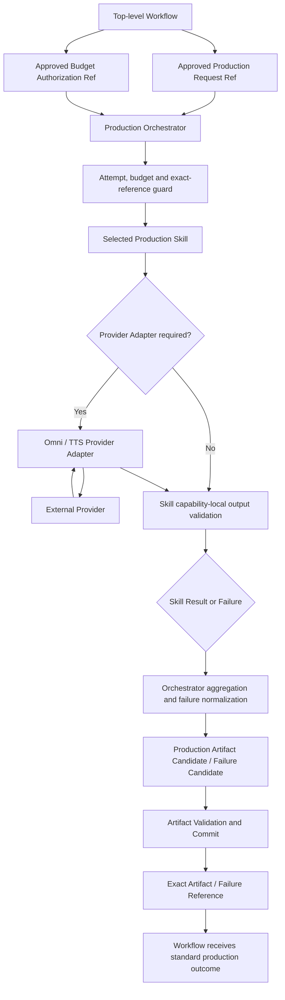

### 8.8.2 Interaction Protocol

| Step | Owner | Contract Result |
| --- | --- | --- |
| 1. Enter production | Workflow | 只提交 Approved Production Request Ref 与 Approved Budget Authorization Ref。 |
| 2. Resolve execution scope | Production Orchestrator | 固定 exact Request Version、Scene scope、selected dependencies 和 reusable results。 |
| 3. Validate attempt | Production Orchestrator | 在任何外部成本前检查 budget、attempt 和 idempotency guard。 |
| 4. Invoke Skill | Production Orchestrator | 提供显式 References、Execution Context 与 Constraints。 |
| 5. Invoke Adapter if required | Skill through stable adapter boundary | 获得 normalized Provider Result / Failure；不接触 Provider SDK。 |
| 6. Return Skill outcome | Skill | 返回 Result / Failure，不决定 retry。 |
| 7. Aggregate / retry / pause | Production Orchestrator | 按 Step 2 固定策略处理生产域结果。 |
| 8. Commit business output | Artifact Validation / Commit boundary | 将合法 Candidate 提交并返回 exact Reference。 |
| 9. Return to parent Workflow | Production Orchestrator boundary | 返回标准 success、paused 或 Failure Reference。 |

### 8.8.3 Why Workflow Cannot Call Skills

1. 直接调用会让 Workflow 持有 Scene execution、Join、Provider attempt 和 production retry 细节。
2. Workflow 无权解析 Skill Failure 或 Provider error；它只处理 Orchestrator 的标准 production outcome。
3. 直接调用会绕过 Budget pre-attempt guard 和同一 Production Request Version 的一致性。
4. Scene-level partial success、reusable media 和 Join 必须由 Production Orchestrator 在一个生产域边界内协调。
5. Provider 或 Skill 替换不应改变 Top-level Graph。

### 8.8.4 Why Skills Cannot Call Providers Directly

1. 直接调用会把 Provider SDK、认证、request shape 和 error shape 固化进 Skill Contract。
2. Adapter 必须在外部信任边界验证 response，并阻止未经验证的内容进入系统。
3. Adapter 负责 provider-specific request mapping；Skill 必须保持 capability-level semantics。
4. Provider Failure 必须先归一化，Production Orchestrator 才能使用统一 retry / pause 规则。
5. Provider credentials、raw response 和敏感 diagnostics 不应暴露给 Skill、Artifact 或 Workflow。

## 8.9 Result Contract

### 8.9.1 Unified Success Semantics

Skill Result 表示：在给定 exact inputs、Execution Context 和 Constraints 下，单次 Skill Invocation 成功完成其声明能力，并产生可被调用方消费的输出。

逻辑上至少表达：

- **Execution outcome**：明确为成功，不与 Failure 混合。
- **Input association**：能够关联本次使用的 exact inputs 和 execution scope。
- **Produced Output Reference**：指向待验证 / 待提交输出，不是 Artifact Reference。
- **Diagnostics**：必要、provider-neutral 且已清理的执行信息。
- **Execution association**：在有外部副作用时能够关联可观察的 attempt / provider execution record。

本 Step 不定义字段名称、类型或序列化格式。

### 8.9.2 Result Rules

1. Result 不能同时表示成功和失败。
2. 缺少任何 required output 时不得返回成功 Result。
3. Result 不携带 Workflow Transition、Approval、Budget Decision 或 Retry command。
4. Result 不自动形成 Artifact；调用方必须经过 Artifact validation / commit。
5. Provider-specific raw payload 不能作为 Result 的公共契约。
6. Diagnostics 不能成为下游业务输入或事实源。
7. 同一 Result 的 Produced Output Reference 必须与本次 exact input set 和 execution scope 关联。

### 8.9.3 Result vs Artifact

| Concept | Created By | Meaning | Can Be Selected by Workflow? |
| --- | --- | --- | --- |
| Skill Result | Skill | 单次能力执行成功及其 produced output reference。 | No |
| Provider Result | Provider Adapter | 已验证、归一化的外部供应商成功结果。 | No |
| Artifact Candidate | Agent、Orchestrator 或其他业务 producer | 符合某类业务 Artifact 的待提交内容。 | No |
| Artifact Reference | Artifact Commit boundary | 已持久化 immutable Artifact Version 的精确引用。 | Yes |

Knowledge / Creative Skill Result 返回所属 Agent，由 Agent 决定如何形成职责内 Candidate。Production Skill Result 返回 Production Orchestrator，由其按 dependency / join 规则形成 production Artifact Candidate。

## 8.10 Failure Contract

### 8.10.1 Unified Skill Failure Categories

| Skill Failure Category | Meaning | Detected / Normalized By | Next-action Owner | Retry Rule |
| --- | --- | --- | --- | --- |
| Validation Failure | 输入引用、类型、依赖、scope 或 constraints 不符合 Skill Contract；执行未合法开始。 | Caller guard 或 Skill input boundary | Knowledge / Creative 路径由 Workflow-owned Agent invocation处理；Production 路径由 Orchestrator处理。 | 修正输入前不得重试；不得产生 Provider cost。 |
| Execution Failure | Skill 内部能力执行未完成，例如 composition、conversion 或 local processing 失败。 | Skill | Authorized caller；Production 中为 Orchestrator。 | Skill 不自重试；Caller 按策略决定。 |
| Provider Failure | 外部服务 timeout、拒绝、限流、无效响应或不可用。 | Provider Adapter | Production Orchestrator；Agent模型调用仍遵循 Step 3 Runtime boundary。 | 先归一化，再由拥有 retry policy 的边界决定。 |
| Quality Failure | 产生了输出，但未满足当前 capability 的最小可用或质量约束。 | Skill output validator；已提交业务结果的主观质量由 Reviewer 评价。 | Production 中由 Orchestrator定向重试 / 暂停；Review 阶段由 Workflow / Creator处理。 | 不允许 Skill 无限自我改写；必须保留 evidence / diagnostics。 |

Failure 逻辑上应关联失败类别、exact inputs、execution scope、失败位置、可安全重试性提示和 diagnostics，但字段级设计留给 Step 5。

### 8.10.2 Mapping to Product Failure Model

Step 4 的 Skill Failure 是执行边界分类，不替换 Step 2 已冻结的 Product Failure：

| Skill / Adapter Failure | Production Boundary Normalization |
| --- | --- |
| Provider Failure | Provider Error |
| Visual / Voice / Composer Execution Failure，且未形成可用输出 | Generation Failure |
| Capability-local Quality Failure 或 Reviewer Hard Block / Warning | Quality Failure |
| Validation Failure | 在外部尝试前拒绝 invocation；不是新增的第五种 Product Failure。 |
| Budget guard failed | Budget Limit；由 Production Orchestrator pre-attempt guard 产生，不由 Skill 返回。 |

### 8.10.3 Failure Handling Rules

1. Skill Failure 不是 Workflow Transition。
2. Production Skill Failure 必须先返回 Production Orchestrator；Workflow 不直接接收 provider-specific error。
3. Provider Adapter 必须保留足够的可观察关联，同时清理 secrets 和内部错误细节。
4. Quality Failure 必须区分 capability-local 不可用输出与 Reviewer 的业务质量评价。
5. Validation Failure 不得触发 Provider 调用或消耗生成预算。
6. Orchestrator 需要暂停 Workflow 时，必须把标准 Failure Candidate 提交为 Failure Artifact，再返回 exact Failure Ref。
7. 成功的 sibling Scene Results 不因另一个 Skill Failure 被删除或覆盖。
8. Skill 和 Adapter 均不得自行改变 Request Version、Scene scope 或 Budget Authorization 来“修复”失败。

### 8.10.4 Failure Normalization Flow

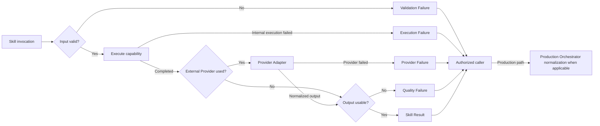

## 8.11 Idempotency Boundary

### 8.11.1 Logical Work Identity

每个 Skill Invocation 必须能够关联一个逻辑工作身份，其语义来自：

- Skill capability
- exact input References / Versions
- Execution Context 与 Scene / branch scope
- Constraints
- 调用目的
- attempt identity when external side effects exist

具体 idempotency key、hash、锁或数据库约束留给 Step 5 / Implementation Spec。

### 8.11.2 Reuse and Retry Rules

1. 对相同 exact inputs、scope 和 constraints 的重复 Command，调用方应先检查是否已有兼容的 terminal Result / Execution Record。
2. 已存在可复用成功结果时，可以返回该 Result association，而不是重复产生外部成本。
3. Skill 本身不决定跨调用 cache reuse；Production Orchestrator 或所属调用边界依据执行记录决定。
4. Retry 保持同一逻辑工作目标，但必须产生新的 attempt identity；不得覆盖之前的 Result / Failure。
5. Provider Adapter 不得把多次外部生成隐藏成一次 Skill Invocation。
6. 外部调用后发生恢复时，必须先检查相同 attempt 是否已经有 terminal provider execution record。
7. 纯 composition Skill 在 exact inputs 未变时允许复用既有 terminal Result，但本 Contract 不承诺字节级确定性。
8. 输入 Version、Scene scope 或 Constraints 变化时，不得复用旧结果作为当前成功结果。

### 8.11.3 Artifact Commit Idempotency

1. Skill Result 进入 Artifact Commit 前必须先形成合法 Artifact Candidate。
2. 同一逻辑 Candidate 的重复 Commit 必须返回既有 exact Artifact Reference，而不是重复版本。
3. 新的有意 Retry 若产生不同输出，应形成新的 Candidate；Commit 后成为新 Artifact Version，旧版本保留。
4. Failure Result 不得被误提交为成功媒体 Artifact；需要持久化时由 Orchestrator 形成 Failure Candidate。
5. Artifact Commit 的等价判断不由 Skill 或 Provider Adapter决定。
6. 已批准 Artifact 不得因 Skill replay 被覆盖。

## 8.12 Skill Boundary Diagram

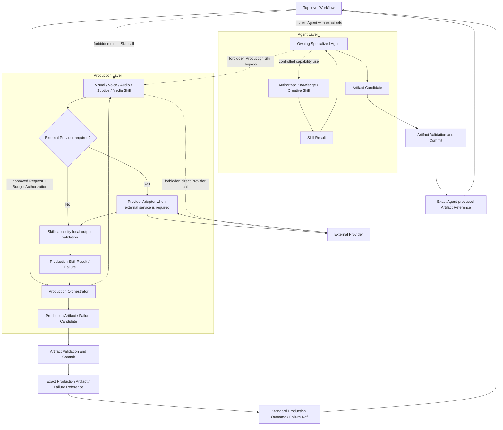

虚线是被禁止的路径。Knowledge / Creative Skill 的 Result 必须返回所属 Agent；Production Skill 的 Result / Failure 必须返回 Production Orchestrator。

## 8.13 Skill and Adapter Invariants

以下规则在后续 Schema 和实现中均不得违反：

1. Skill 不拥有 Workflow State、Lifecycle、Checkpoint、Pause / Resume 或 Continue From Here。
2. Skill 不拥有 Artifact Commit、Version、stale、Impact Preview 或 selected reference。
3. Skill 不直接调用外部 Provider；需要外部服务时必须经过匹配 Adapter。
4. Provider Adapter 必须隔离协议、request mapping、response validation 和 error normalization。
5. Production Orchestrator 是所有 Production Skills 的唯一合法调用入口。
6. Agent 不得绕过 Production Orchestrator 调用 Production Skill、Adapter、Omni 或 TTS。
7. Workflow 不得直接调用任何 Skill 或 Provider。
8. Skill 只返回 Result / Failure，不返回 Workflow Transition、Approval、Budget Decision 或 Retry command。
9. Provider 变化不得影响 Skill Contract、Production Request、Agent Contract 或 Top-level Workflow。
10. Skill 不得通过 Prompt、配置或 Provider capability 隐式扩大业务职责。
11. Skill Input 必须来自 explicit References、Execution Context 和 Constraints，不得依赖 UI、聊天历史或隐式 memory。
12. Produced Output Reference 不是 Artifact Reference；只有 Commit boundary 能创建正式 Artifact Version。
13. Provider raw response 始终是不可信输入，未经 Adapter 验证不得进入 Skill Result、Artifact Candidate 或 Workflow。
14. Provider credential、secret、SDK object 和敏感 diagnostics 不得进入 Skill Input / Result、Artifact 或 Workflow State。
15. Provider Adapter 不得隐藏会产生费用或新输出的额外 retry。
16. Skill 不拥有 retry policy；每次外部 attempt 必须由 Orchestrator 授权并可观察。
17. Validation Failure 不得产生 Provider cost。
18. 成功 Result 必须关联 exact inputs 和 execution scope；不得依赖 latest。
19. Skill replay 不得覆盖已批准 Artifact 或删除成功 sibling Scene outputs。
20. Source Connector 只负责来源协议与获取；Source Normalization 和 Knowledge Agent 不得执行 repository 中的指令性内容。

## 8.14 Deferred Decisions

### Step 5 — Artifact and State Schema Design

- Artifact、Artifact Candidate、Artifact Reference 的逻辑模型
- LangGraph State 逻辑 Schema
- Command / Result / Failure 语义
- Skill Invocation、Execution Context 与 Constraints 的逻辑关联
- Produced Output Reference 与 Provider Execution Record 边界
- Validation / Execution / Provider / Quality Failure 的语义映射
- Artifact Status、Dependency、stale 与 idempotency identity

Step 5 的输入包括本章节冻结的 Result / Failure 互斥语义、Skill 与 Adapter 分界、exact Reference 规则、Produced Output Reference 非 Artifact 的约束，以及 Production Failure mapping。

### Implementation Spec

- API Endpoint 与内部函数接口
- Provider SDK、认证和 credential management
- JSON / Pydantic / TypeScript models
- Skill / Adapter code structure
- Provider request / response mapping implementation
- Prompt 文件、模型参数和 provider configuration
- Retry / backoff、timeout、rate limit 与 idempotency algorithm
- 数据库、文件与工作区存储
- Testing、mock provider、observability 与 security controls
- Repository Structure、Issue 和任务拆分

### Explicit Non-goals

本章节没有：

- 设计 API、字段级 Schema、数据库或目录
- 编写 Python、TypeScript、JSON、Pydantic 或伪实现
- 选择或配置 Provider SDK
- 编写 Prompt 或设置模型参数
- 新增 Provider、Skill 范围、Agent、Renderer 或自动发布
- 设计 Multi Provider Router、自动 Failover 或动态 Skill Registry
- 进入 Implementation Plan 或 Coding

### Step 4 Completion Check

| Completion Criterion | Result |
| --- | --- |
| Skill Layer 共同输入、执行和输出边界已冻结。 | Passed |
| Skill 与 Agent / Workflow / Artifact 边界清晰。 | Passed |
| Skill 与 Provider / Adapter 边界清晰。 | Passed |
| Knowledge、Creative 和五个 Production capability contracts 已定义。 | Passed |
| Production Orchestrator 是 Production Skills 唯一入口。 | Passed |
| Skill Result / Failure 与 Artifact 已分离。 | Passed |
| Validation、Execution、Provider 和 Quality Failure 语义已冻结。 | Passed |
| Skill Failure 与 Step 2 Product Failure mapping 已定义。 | Passed |
| 幂等、reuse、retry 与 Artifact Commit 边界已定义。 | Passed |
| Provider-neutral 与外部响应不可信原则已保持。 | Passed |
| 未进入 API、Schema、Provider SDK、Prompt、代码或 Implementation Plan。 | Passed |
| 未新增 Provider、Agent 或 Skill 产品范围。 | Passed |
| Baseline Conflict Assessment。 | Passed |
| Step 5 输入已列出。 | Passed |

Step 4 状态：Review Passed。Step 5 内容在下一章节继续。

# Artifact and State Schema Design

## 9.1 Scope and Design Principles

### 9.1.1 Step 5 Scope

本章节定义 AI Course Factory MVP 的逻辑语义模型，回答以下问题：

- 哪些业务结果属于正式 Artifact，哪些只是 Candidate、执行输出或控制记录。
- Artifact 如何获得稳定身份、不可变版本、精确依赖和可追踪来源。
- Artifact 的成熟度、审批与 freshness 如何表达，且不与 Task Lifecycle 混淆。
- Review Artifact、Creator Approval、Failure Artifact 与 Provider Execution Record 如何分离。
- LangGraph State 为恢复流程必须保存哪些控制信息，以及明确禁止保存哪些业务 payload。
- Workflow Command 如何被校验、执行、去重，并返回 Success、Pending 或 Failure。

本章节只定义逻辑字段类别、关系、状态语义和不变量，不定义字段类型、序列化格式、数据库表、索引、API、代码或存储产品。

### 9.1.2 Artifact First Rationale

AI Course Factory 的主要价值不是一次模型调用，而是一个可以审核、恢复、局部重做和追溯的 Knowledge-to-Content 生产过程。Artifact First 因此提供四项产品级保证：

1. **可追溯**：教学内容可以沿 exact dependency chain 回到 Knowledge Artifact 与 Source Record。
2. **可审核**：Reviewer 与 Creator 都针对一个明确、不可变的 Artifact Version 作出判断。
3. **可恢复**：Workflow Checkpoint 只需重新绑定 exact Artifact References，不依赖模型会话或 UI 内存。
4. **可局部执行**：Scene-level dependency 允许只替换受影响的媒体结果，同时保留其他有效 Scene。

Artifact First 不意味着所有持久化对象都必须是 Artifact。系统还包含 Workflow Checkpoint、Approval Record、Provider Execution Record 和 Command Processing Record；这些对象分别回答控制、授权、外部尝试和命令处理问题，不应伪装成内容 Artifact。

### 9.1.3 Artifact vs Workflow State

| Dimension | Artifact Version | Workflow / LangGraph State |
| --- | --- | --- |
| Answers | 某项业务结果是什么、来自什么、依赖什么。 | 任务执行到哪里、等待什么、当前选择哪些 exact Versions。 |
| System of Record | Artifact Layer。 | Workflow Checkpointer。 |
| Content | Knowledge、Script、Timeline、Media、Review、Failure、Package 等 payload 与 provenance。 | Lifecycle、Stage、selected references、pending gate、resume cursor 与必要控制元数据。 |
| Change Model | 内容与 dependencies 不可变；修订产生新 Version。 | 每个有效 Workflow step 形成新的控制快照。 |
| Selection | 不声明自己是“当前版本”。 | 显式保存当前执行选中的 Artifact References。 |
| Recovery | 提供可复用的业务结果。 | 提供恢复位置、命令状态和版本绑定。 |
| Full Payload | Yes，仅在 Artifact Layer 内。 | No。 |

Workflow State 可以引用 Artifact，但不能复制 Artifact。Artifact 可以被多个 Workflow Checkpoint 选择，但不拥有 Workflow Lifecycle。

### 9.1.4 Canonical Persistent Concepts

| Concept | Canonical Meaning | Versioned as Artifact? | System of Record |
| --- | --- | --- | --- |
| Artifact Version | 已提交的不可变业务结果。 | Yes | Artifact Layer |
| Artifact Reference | 指向一个 exact Artifact ID + Version 的稳定引用。 | No；它引用 Version。 | 引用所在对象 |
| Artifact Candidate | 等待验证与提交的领域候选结果。 | No | Invocation / Commit boundary，非业务事实 |
| Produced Output Reference | 指向单次 Skill / Provider 执行所产生、尚未提交的输出。 | No | Execution boundary |
| Review Artifact | Reviewer 对 exact target Version 的质量评价。 | Yes | Artifact Layer |
| Approval Record | Creator 在 Human Gate 对 exact target Version 作出的不可变决定。 | No | Artifact Layer 的 gate decision record boundary |
| Failure Artifact | 四类产品 Failure 的可追踪业务记录。 | Yes | Artifact Layer |
| Provider Execution Record | 一次外部供应商 attempt 的审计与幂等记录。 | No | Production execution recording boundary |
| Workflow Checkpoint | 流程位置、选择和恢复控制快照。 | No | Workflow Checkpointer |
| Command Processing Record | 命令身份、处理状态与 terminal result 的去重记录。 | No | Workflow command boundary |

### 9.1.5 Baseline Conflict Assessment

**Result：Passed。**

未发现 Step 5 与 Approved PRD、Renderer Strategy Revision Addendum 或 Technical Spec Step 1–4 的未解决冲突。

本章节延续以下优先级与替代关系：

- Approved PRD → Accepted Addendum → Decision Records → Strategy → Technical Spec。
- Prompt + Omni Hybrid Production 继续有效。
- Provider-specific Prompt 只允许存在于 Provider Execution boundary，不注册为核心 Artifact，也不进入 LangGraph State。
- Production Request、Artifact First、exact Version、partial execution 和 replaceable Production Layer 保持不变。
- Fixed 6 Scene 仍是 MVP Episode Template Constraint，不成为 Artifact 或 Workflow 的固定六字段结构。

## 9.2 Artifact Type Model

### 9.2.1 Registration Rule

一个对象只有同时满足以下条件，才注册为 MVP Artifact Type：

1. 它是跨阶段消费、审核、复用、导出或失败恢复所需的业务结果。
2. 它需要独立身份、不可变版本、provenance 和 exact dependencies。
3. 它不能只靠 Workflow Checkpoint、Approval Record 或 Execution Record 表达。
4. 它已经由 Approved PRD 要求，而不是仅因为未来可能有用。

### 9.2.2 Required MVP Artifact Types

| Category | Artifact Type | Business Meaning | MVP Requirement |
| --- | --- | --- | --- |
| Source and Knowledge | Source Record | 一次已验证知识来源的规范化记录；MVP source kind 为公开 GitHub repository。 | 每个任务必需。 |
| Source and Knowledge | Knowledge Artifact | 从 Source Record 提取并带有可追溯证据的教学事实边界。 | 每个任务必需。 |
| Content | Course / Episode Plan | Episode 教学目标、结构和受众规划。 | 每个任务必需；可作为同一内容规划类型的明确子类型或角色，物理建模后定。 |
| Content | Script Artifact | 简体中文教学脚本及其 knowledge grounding。 | 每个任务必需，并进入 Mandatory Script Review。 |
| Creative Planning | Character Artifact | 小土豆 v1.0 在本 Episode 中的角色与视觉约束。 | 每个任务必需。 |
| Creative Planning | Storyboard Artifact | 有序 Scene 的教学叙事、视觉意图和 Director Proposal。 | 每个任务必需。 |
| Execution Planning | Timeline Artifact | provider-neutral 的 Scene 时序、旁白、字幕与合成计划。 | 每个任务必需。 |
| Execution Planning | Production Request Artifact | provider-neutral 的生产意图、Scene scope、能力需求与 exact upstream references。 | 每个生产任务必需。 |
| Execution Planning | Production Budget Artifact | 绑定 exact Production Request Version 的成本估算、拟申请范围和上限语义。 | 首次付费生产尝试前必需；实际授权来自 Creator Approval Record。 |
| Production Media | Scene Audio Artifact | Voice Skill 为单个 Scene 产生的主旁白结果。 | 每个有旁白的 MVP Scene 必需。 |
| Production Media | Master Audio Artifact | Audio Composer 对 Scene Audio 与可选 BGM / Effect 的整集组合结果。 | 成功视频路径必需。 |
| Production Media | Subtitle Artifact | 由 approved Script 与 Timeline 形成的字幕结果。 | 成功视频路径必需。 |
| Production Media | Scene Clip Artifact | 单个 Scene 的视觉片段；可来自 Omni 或人工上传，但 provenance 必须明确。 | 每个 MVP Scene 必需。 |
| Production Media | Video Artifact | Media Composer 对 selected Scene Clips、Master Audio、Subtitle 与 Timeline 的完整视频结果。 | 成功路径必需，并进入 Reviewer 与 Final Review。 |
| Control and Quality | Review Artifact | Reviewer 对 exact target Version 的 Hard Block、Warning 或 Pass 评价。 | Final Video Review 前必需；其他调用位置仍受已批准 Workflow 限制。 |
| Control and Quality | Failure Artifact | Provider Error、Generation Failure、Quality Failure 或 Budget Limit 的标准业务失败记录。 | 发生相应产品 Failure 时必需；成功路径不强制制造空 Failure。 |
| Packaging | Cover Artifact | 从 approved Video 关键帧与品牌模板生成的封面。 | Publish Package 成功路径必需。 |
| Packaging | Metadata Package | Title、Description、Tags 与 Source Attribution 的发布元数据。 | Publish Package 成功路径必需。 |
| Packaging | Artifact Manifest | 交付所选 Artifact IDs / Versions、dependency trace、approval 与 provider execution references。 | Publish Package 成功路径必需。 |
| Packaging | Publish Package | Media Package、Metadata Package 与 Artifact Manifest 的最终交付组合。 | Completed 前必需。 |

### 9.2.3 Deliberately Not Registered as Core Artifacts

| Concept | Decision | Reason |
| --- | --- | --- |
| Omni Prompt / Provider Request | Not an Artifact | Provider-specific execution representation；只允许进入 Provider Execution Record boundary。 |
| Media Package | Package component, not a separate MVP Artifact Type | 它是 Publish Package 的逻辑分层，不需要独立版本生命周期。 |
| Approval Record | Separate immutable record | 它是 Human Gate 决定，不是 Reviewer 产物或内容产物。 |
| Provider Execution Record | Separate operational record | 它记录 attempt、费用与外部结果，不是可供内容阶段消费的 Artifact。 |
| Workflow Checkpoint | Separate control snapshot | 它记录流程位置与 selected refs，不记录业务结果。 |
| Artifact Impact Preview | Derived control record / projection | 确认前只描述可能影响；它不改变 Artifact，也不成为新的内容类型。确认动作必须可审计。 |
| Generic Asset Artifact | Not in MVP registry | PRD 已用 Character、Scene Clip、Audio、Cover 等具体类型覆盖当前闭环，不建设通用资产平台。 |

### 9.2.4 Future Extension Types

以下只是稳定扩展方向，不属于 v0.1 MVP Artifact registry，也不得据此实施：

| Future Type Candidate | Trigger Before Registration | Why Existing Type Is Not Enough |
| --- | --- | --- |
| Reusable Asset Artifact | Product 批准跨任务 Asset Library。 | 当前媒体与角色只在单任务 Artifact Graph 内复用。 |
| Renderer Project Artifact | Product 批准 Remotion / Stickman 可编辑项目交付。 | 当前只要求 provider-neutral request 与最终媒体，不交付 renderer project source。 |
| Channel Delivery Package | Product 批准多平台 Packaging Profile 或自动发布。 | 当前只有一个本地通用 Publish Package。 |

PDF、Web、Notion 等 Knowledge Source 扩展应优先复用 Source Record 与 Knowledge Artifact，只增加 source-kind adapter 语义，不为每种来源制造新的核心 Artifact Type。Dynamic Scene Expansion 也复用 Storyboard、Timeline、Production Request 和 Scene media types 的有序集合模型。

## 9.3 Artifact Identity Model

### 9.3.1 Logical Identity Components

每个 Artifact Version 至少具有以下逻辑身份组成：

| Identity Component | Meaning | Stability Rule |
| --- | --- | --- |
| Artifact Type | 该结果的业务类别与允许的 dependency contract。 | Version 间不得变更；类型变化意味着新的 Artifact Identity。 |
| Artifact Identity | 同一任务与业务 scope 内跨 revision 保持稳定的逻辑对象身份。 | Revision 沿用；复制为另一个业务对象时新建 identity。 |
| Version | 该 identity 下一个不可变修订的明确标识。 | Commit 后不可复用、重写或重排。 |
| Business Scope | 该 Artifact 属于哪个 task、episode，以及适用时的 Scene ID。 | Commit 后固定；Scene scope 不能从一个 Scene 静默迁移到另一个 Scene。 |
| Provenance | 产生者、产生方式、source evidence、invocation / execution association。 | Commit 后固定；人工上传与 Provider 生成必须可区分。 |
| Dependencies | 指向上游 exact Artifact References 的有向关系。 | Commit 后固定；改变依赖必须创建新 Version。 |
| Status Facts | validation、approval 与 freshness 的权威事实或引用。 | 不改写 payload；按 9.6 的记录与投影规则变化。 |

字段名称、标识格式、Version 编号形式、时间格式和 actor 类型留给 Implementation Spec。

### 9.3.2 Stable Identity Rules

1. 同一 Episode Script 的修订沿用 Script Artifact Identity，并产生新 Version。
2. 同一 Scene 的重新生成沿用该 Scene Clip / Scene Audio Artifact Identity，并产生新 Version。
3. Scene ID 是局部依赖与重生成的稳定业务定位；MVP 六场模板不能替代 Scene ID。
4. 不同 Artifact Type 不能共享同一个 Artifact Identity。
5. 将一个结果复制到另一个 task、episode 或 Scene 时必须创建新的 Artifact Identity，并保留 provenance link；不得伪装为原 identity 的新 Version。
6. Workflow 只选择 exact Artifact Reference；Artifact 本身不保存“我是当前版本”。

### 9.3.3 Provenance Semantics

Provenance 必须能够回答：

- 该 Version 由哪个模块角色产生：Agent、Production Orchestrator、Packaging Layer、人工上传或其他已批准 producer。
- 它基于哪些 exact upstream Artifact Versions。
- 它来自哪个 Source Record / Knowledge evidence，适用时如何追溯。
- 它关联哪个 Agent Invocation、Skill Result 或 Provider Execution Attempt。
- 它是否由人工上传替代，以及替代了哪个 Scene scope 的预期输出。

Provenance 不能包含 provider credential、secret、未经清理的 raw response 或隐式聊天记忆。

## 9.4 Artifact Versioning Model

### 9.4.1 Immutability Surface

Artifact Version 一旦 Commit，以下内容不得修改：

- Artifact payload
- Artifact Type、Identity 与 Version
- Business Scope
- exact dependency set
- provenance 与 source evidence association
- 产生该 Version 的 invocation / execution association

Validation、Approval 和 freshness 通过独立事实记录或 Artifact Layer 的状态投影表达，不以修改 payload 的方式实现。状态变化必须可审计，不得让历史读取得到与原提交时不同的内容。

### 9.4.2 Revision Rules

1. Revision 必须以一个 exact base Version 为起点。
2. 任何内容、dependency、source evidence 或 Scene scope 的变化都产生新 Version。
3. 新 Version Commit 不自动成为 Workflow selected Version。
4. 只有通过合法 Command、Guard、Impact Preview 与必要 Gate 后，Workflow 才能更新 selected reference。
5. 旧 Version 永久保留；它可以继续被历史 Checkpoint、Review、Approval 或 Publish Package 引用。
6. latest 不是合法业务引用，也不能作为 Resume、Review、Approval 或 Provider Attempt 的解析规则。
7. 回退优先通过显式重新选择一个仍兼容的旧 exact Version；若需要改变其内容或 dependencies，则仍创建新 Version。

### 9.4.3 Revising an Approved Artifact

Approved Artifact 的修订遵循：

~~~text
Approved Version remains immutable and retains its Approval Record
    ↓
Creator starts explicit revision from the exact approved Version
    ↓
New Candidate is produced and validated
    ↓
Commit a new Version without inheriting approval
    ↓
Impact Preview compares selected lineage with the new Version
    ↓
Creator confirms adoption
    ↓
Workflow selects the new Version and marks affected downstream lineage stale
    ↓
Required Review / Approval Gate runs again for the new Version
~~~

Approval 永不自动继承到新 Version。旧 Approval Record 继续证明 Creator 曾批准原 Version，但不能授权新 Version。

### 9.4.4 Selection, Supersession, and Stale

- **Selected** 是 Workflow Checkpoint 的控制事实，不是 Artifact 自身属性。
- 新 Version 的存在不自动 supersede 旧 Version；只有显式选择改变当前执行 lineage。
- **stale** 表示某 Version 的 exact dependency set 与当前选择的上游 lineage 不再兼容，不能作为默认当前输入。
- stale 不删除内容、不撤销历史 Approval Record，也不表示该 Version 在所有 lineage 中永久无效。
- 当 Workflow 显式恢复到与该 Version 完全匹配的 dependency selection 时，Artifact Layer 可以重新判定其为可兼容；具体投影实现后定。

## 9.5 Artifact Dependency Model

### 9.5.1 Dependency Rules

1. 所有 dependency edge 都必须指向 exact Artifact ID + Version。
2. 核心 derivation graph 必须是有向无环关系；Review、Approval、Failure 和 execution records 只能引用既有结果，不能让被审对象反向依赖评价。
3. Dependency 表达“该 Version 的语义或内容依赖该上游 Version”，不是简单的文件包含关系。
4. Source attribution 可以跨多层保留，但不能代替直接 dependencies。
5. Artifact Manifest 必须冻结本次 Publish Package 实际选择的完整 reference set，不重新解析 latest。
6. stale 传播沿已确认 selection lineage 的直接与传递 dependency edges 执行。

### 9.5.2 Artifact Dependency Graph

~~~mermaid
flowchart TB
    Source["Source Record"]
    Knowledge["Knowledge Artifact"]
    Plan["Course / Episode Plan"]
    Script["Script Artifact"]
    Character["Character Artifact"]
    Storyboard["Storyboard Artifact"]
    Timeline["Timeline Artifact"]
    Request["Production Request Artifact"]
    Budget["Production Budget Artifact"]
    BudgetApproval["Budget Approval Record"]

    subgraph SceneScope["Scene-level production scope"]
        SceneClip["Scene Clip Artifact"]
        SceneAudio["Scene Audio Artifact"]
        Subtitle["Subtitle Artifact"]
    end

    MasterAudio["Master Audio Artifact"]
    Video["Video Artifact"]
    Review["Review Artifact"]
    FinalApproval["Final Video Approval Record"]
    Cover["Cover Artifact"]
    Metadata["Metadata Package"]
    Manifest["Artifact Manifest"]
    Publish["Publish Package"]
    ProviderRecord["Provider Execution Record"]
    Failure["Failure Artifact"]

    Source --> Knowledge
    Knowledge --> Plan
    Knowledge --> Script
    Plan --> Script
    Script --> Character
    Script --> Storyboard
    Character --> Storyboard
    Storyboard --> Timeline
    Script --> Timeline
    Character --> Timeline
    Timeline --> Request
    Storyboard --> Request
    Character --> Request
    Request --> Budget
    Request --> BudgetApproval
    Budget --> BudgetApproval

    Request --> SceneClip
    Timeline --> SceneClip
    Character --> SceneClip
    Request --> SceneAudio
    Script --> SceneAudio
    Timeline --> SceneAudio
    Script --> Subtitle
    Timeline --> Subtitle
    SceneAudio --> MasterAudio
    Timeline --> MasterAudio
    SceneClip --> Video
    MasterAudio --> Video
    Subtitle --> Video
    Timeline --> Video
    Video --> Review
    Review --> FinalApproval
    Video --> FinalApproval
    FinalApproval --> Cover
    Video --> Cover
    Knowledge --> Metadata
    Script --> Metadata
    FinalApproval --> Metadata
    Video --> Manifest
    Review --> Manifest
    FinalApproval --> Manifest
    ProviderRecord -.-> Manifest
    Video --> Publish
    Cover --> Publish
    MasterAudio --> Publish
    Subtitle --> Publish
    Metadata --> Publish
    Manifest --> Publish

    ProviderRecord -.-> SceneClip
    ProviderRecord -.-> SceneAudio
    Request -.-> Failure
    Budget -.-> Failure
    ProviderRecord -.-> Failure
    Review -.-> Failure

    classDef record fill:#f4f4f4,stroke:#666,stroke-dasharray: 5 5;
    class BudgetApproval,FinalApproval,ProviderRecord record;
~~~

实线表达 Artifact derivation 或 package inclusion；虚线表达审计 / failure association。灰色虚线节点是非 Artifact Record，不进入 Artifact Version chain。

### 9.5.3 Scene-level Dependency

Scene-level media 必须同时具有 Episode scope 与稳定 Scene ID。一个 Scene 的 Production Request slice、Timeline slice 和媒体结果不能通过数组位置替代 Scene ID。

| Artifact | Minimum Scene-level Dependency Meaning | Sibling Scene Coupling |
| --- | --- | --- |
| Scene Clip | exact Production Request、Timeline、Character 与目标 Scene ID。 | 默认不依赖其他 Scene Clip；单 Scene 失败不使 sibling clips 失效。 |
| Scene Audio | exact narration / Script、Timeline、voice constraints 与目标 Scene ID。 | 默认不依赖 sibling Scene Audio。 |
| Subtitle | exact Script 与 Timeline；逻辑上保留 Scene segment 定位。 | MVP 可提交整集 Subtitle Version，但只重算受影响 segment。 |
| Master Audio | selected Scene Audio set、Timeline，以及适用的 BGM / Effect inputs。 | 任一被选 Scene Audio 或 timing 改变时需要新 Master Audio Version。 |
| Video | selected Scene Clip set、Master Audio、Subtitle 与 Timeline。 | 任一选定媒体或 timing 改变时需要新 Video Version。 |

### 9.5.4 Scene Change Impact Rules

| Change | New Versions Required | Remain Valid | Become Stale for Current Lineage |
| --- | --- | --- | --- |
| 只重新生成 Scene visual，旁白与 timing 不变 | 目标 Scene Clip、Video、Review、Cover、Manifest、Publish Package。 | 其他 Scene Clips、Scene Audio、Master Audio、Subtitle、upstream planning。 | 旧 Video 及其 Review / Approval / Packaging lineage。 |
| 修改目标 Scene narration text | Script 或批准的 scene-level content origin、相关 Storyboard / Timeline / Request、目标 Scene Audio、Master Audio、Subtitle、Video 及下游。 | 不受影响 Scene 的媒体结果。 | 所有依赖旧 narration 或 timing 的下游。 |
| 只调整目标 Scene timing | Timeline、Request、可能受影响的 Scene Clip / Audio、Master Audio、Subtitle、Video 及下游。 | 与 timing 无关且 dependency 仍匹配的其他 Scene 产物。 | 依赖旧 Timeline Version 的组合结果。 |
| 人工上传替代 Scene Clip | 目标 Scene Clip、Video、Review、Cover、Manifest、Publish Package。 | 其他 Scene Clips、Audio 与未变 upstream。 | 被替代 Clip selection 与旧 Video lineage。 |
| 只修订 Metadata | Metadata Package、Artifact Manifest、Publish Package。 | Approved Video、Review、Approval、Cover 与生产媒体。 | 旧 packaging lineage，不回流 Production。 |

stale 只在 Impact Preview 被 Creator 确认、且新的 selected reference 生效后传播。仅生成 Candidate、新 Version 或预览，不得提前污染现有有效 lineage。

## 9.6 Artifact Status Model

### 9.6.1 Status Dimensions

MVP 不采用一个互斥枚举同时承载 maturity、approval、freshness 与 execution failure。逻辑状态由三个正交维度组成：

| Dimension | Logical Terms | Meaning | Authority |
| --- | --- | --- | --- |
| Maturity | Draft、Validated | Draft 已 Commit 但尚未满足当前阶段全部业务验证；Validated 已通过适用的结构、provenance、dependency 与领域验证。 | Artifact validation facts |
| Approval | Not Required、Pending、Approved | 是否需要 Human Gate，以及 exact Version 是否存在有效 Approval Record。 | Approval Record |
| Freshness | Current、Stale | exact dependencies 是否与 Workflow 当前 selected lineage 兼容。 | Artifact dependency evaluation |

这些术语是逻辑语义，不预先决定一个字段、多个字段、状态事件或数据库投影。最终 Enum 与物理表示留给 Implementation Spec。

### 9.6.2 Canonical Meanings

| Term | Canonical Meaning | May Be Used by Default? |
| --- | --- | --- |
| Draft | 已提交、可追踪，但尚未通过当前阶段要求的全部业务验证或审批。Candidate 仍不属于 Draft。 | 只在明确允许 Draft 的编辑 / review 路径中。 |
| Validated | Artifact contract、provenance 与 dependency validation 已通过。 | 若无需审批且不是 stale，可以。 |
| Approval Pending | 当前 exact Version 需要 Human Gate，尚无有效批准。 | No。 |
| Approved | 存在绑定该 exact Version 的有效 Creator Approval Record；不是 Reviewer 结论。 | 只有同时非 stale 且当前 Workflow Guard 允许时。 |
| Stale | 当前 selected upstream lineage 已改变，使该 Version 的 dependency set 不匹配。 | No，除非用户显式切换回完全匹配的历史 lineage。 |

**Failed 不作为 MVP 目标 Artifact 的常规状态。** 如果一次执行没有产生可用 Artifact，系统提交 Failure Artifact，并保留原有有效 Version；不得创建一个空的 Scene Clip / Video 再用 Failed 掩盖缺失结果。未来如需表达已提交文件损坏或不可访问，可新增独立 availability 语义，但不属于本 Step。

MVP 自动 producer 的输出通常在 Candidate validation 后直接以 Validated maturity Commit；Draft 只为明确允许持久化工作草稿的交互保留语义，不要求所有 Artifact Type 都经历 Draft。

### 9.6.3 Status Rules

1. Artifact approval 必须由 Approval Record 推导，不能只保存一个可被任意修改的 approved 布尔值。
2. stale 是非破坏性 freshness assertion；它不修改 payload、dependencies 或历史 Approval Record。
3. Approved 与 Stale 可以同时为真：它表示该 Version 曾被批准，但不能作为当前 lineage 的默认输入。
4. Rejected / Revise 是 Approval Record 的 decision，不是对目标 Artifact payload 的修改。
5. Candidate validation failure 不创建 Artifact Status；它返回 validation failure 并停在 Commit 前。
6. Failure Artifact 自身是一个有效、可追踪的 Artifact；它不因为描述失败而处于 Failed 状态。
7. UI 可以显示组合标签，但必须从权威 records 与 dependency evaluation 投影，不能维护独立状态。

### 9.6.4 Artifact Lifecycle Diagram

~~~mermaid
flowchart LR
    Produced["Producer output"]
    Candidate["Artifact Candidate<br/>not an Artifact"]
    Validate{"Candidate valid?"}
    Rejected["Rejected Candidate<br/>diagnostics only"]
    Commit["Idempotent Commit"]
    Version["Committed immutable Artifact Version"]
    Draft["Draft maturity when applicable"]
    Validated["Validated maturity"]
    Gate{"Human approval required?"}
    Pending["Approval Pending"]
    Approval["Creator Approval Record"]
    Approved["Approved projection"]
    Selected["Workflow selects exact Version"]
    Stale["Stale freshness overlay<br/>payload retained"]
    Revision["Explicit Revision Command"]
    NewCandidate["New Candidate for next Version"]

    Produced --> Candidate --> Validate
    Validate -->|"No"| Rejected
    Validate -->|"Yes"| Commit --> Version
    Version --> Draft
    Version --> Validated
    Draft -->|"business validation passes"| Validated
    Validated --> Gate
    Gate -->|"No"| Selected
    Gate -->|"Yes"| Pending --> Approval --> Approved --> Selected
    Selected -->|"confirmed upstream selection changes"| Stale
    Stale -->|"matching historical lineage restored"| Selected
    Draft --> Revision
    Validated --> Revision
    Approved --> Revision
    Revision --> NewCandidate --> Candidate
~~~

Revision 从旧 Version 产生新 Candidate；图中没有任何覆盖旧 Version 的转换。Stale 是 freshness overlay，不是删除或内容 mutation。

## 9.7 Candidate and Reference Model

### 9.7.1 Three Frozen Concepts

| Concept | Created By | What It Identifies | Durability / Authority | May Enter Workflow State? |
| --- | --- | --- | --- | --- |
| Produced Output Reference | Skill / Adapter / local execution boundary | 单次 invocation / attempt 产生的临时或待提交输出。 | 执行级；可能有生命周期限制，不是业务事实。 | No。 |
| Artifact Candidate | Agent、Production Orchestrator、Packaging Layer 或其他已批准 producer | 一个待验证、待提交的目标 Artifact 语义。 | Commit 前；不是正式 Version。 | No。 |
| Artifact Reference | Artifact Commit boundary | 一个已提交的 exact Artifact Type + Identity + Version。 | 稳定业务引用。 | Yes。 |

### 9.7.2 Canonical Promotion Chain

~~~mermaid
flowchart LR
    Skill["Skill execution"]
    SkillResult["Skill Result"]
    OutputRef["Produced Output Reference"]
    Producer["Owning Agent / Orchestrator / Packager"]
    Candidate["Artifact Candidate"]
    Validation{"Validation"}
    Commit["Artifact Commit"]
    ArtifactRef["Exact Artifact Reference"]
    Workflow["Workflow selected references"]

    Skill --> SkillResult --> OutputRef --> Producer --> Candidate --> Validation
    Validation -->|"Pass"| Commit --> ArtifactRef --> Workflow
    Validation -->|"Fail"| Rejected["Validation Failure<br/>no Artifact"]
~~~

Agent 直接生成的知识或规划结果可以从 Producer 进入 Artifact Candidate，不要求伪造 Produced Output Reference；但任何 Skill 输出若要成为 Artifact，必须经过图中的完整 promotion boundary。

### 9.7.3 Produced Output Reference Rules

Produced Output Reference：

- 必须关联产生它的 invocation / provider attempt 与 exact input set。
- 只定位待验证输出，例如工作区对象、临时媒体或已归一化 provider result。
- 不能被 Human Review、Workflow Resume、Publish Package 或下游 Agent 当作正式 Artifact Reference。
- 不能携带 credential、secret、未经验证的 provider raw response 或隐式 latest。
- 如果输出已失效或过期，必须重新执行或使用已提交 Artifact；不得让 Workflow 依赖临时位置长期恢复。

### 9.7.4 Artifact Candidate Rules

Artifact Candidate 逻辑上表达：

- intended Artifact Type、Identity 与 business scope
- candidate payload
- exact dependencies 与 source / provenance associations
- producer 与 invocation / execution association
- 适用的 Produced Output References
- 逻辑 commit identity 与 validation context

Candidate 可以被 Validated 或 Rejected，但不能被 Approved、标记 stale、选择为 current、进入 Publish Package 或作为 Resume 事实。

### 9.7.5 Artifact Reference Rules

Artifact Reference 至少表达 Artifact Type、Artifact Identity 与 exact Version 的组合语义。它必须满足：

1. 不允许省略 Version，也不允许 latest、current 或模糊查询作为 durable reference。
2. Dereference 时必须验证存在性、类型、task / episode / Scene scope 与访问边界。
3. Workflow Guard 还必须检查 validation、approval、freshness 与 dependency completeness；Reference 可解析不等于可用于当前阶段。
4. Reference 不内嵌完整 payload。
5. 类型不匹配不能通过字符串巧合被接受。
6. Approval、Review、Failure、Manifest 和 Checkpoint 必须保存它们实际使用的 exact Reference。

## 9.8 Review and Approval Model

### 9.8.1 Separation of Authority

| Concept | Produced By | Answers | Workflow Authority |
| --- | --- | --- | --- |
| Review Artifact | Reviewer | 目标 Version 是否存在 Hard Block、Warning 或质量建议。 | 提供质量 Guard；不批准目标。 |
| Approval Record | Creator through Human Gate | Creator 对哪个 exact Version 作出 Approve、Reject、Revise 或允许的 Skip 决定。 | 决定 Gate 转移，但不能绕过 Hard Block。 |

Reviewer 的 Pass 不自动创建 Approval。Creator 的 Approve 也不能改变 Review findings，或让存在未解决 Hard Block 的 target 进入下一阶段。

### 9.8.2 Review Artifact Semantics

Review Artifact 至少关联：

- exact review target Artifact Reference
- evaluation policy / baseline association
- overall disposition：Pass、Warning 或 Hard Block
- findings、severity、evidence References 与适用 Scene scope
- recommendations 与建议 revision scope
- prior Review Reference，适用时用于复查
- Reviewer invocation provenance

Review Artifact 的新评价产生新 Version；不得修改旧 findings。Review Recommendation 不是 Command。

### 9.8.3 Approval Record Semantics

Approval Record 是不可变 Human Gate decision record，至少关联：

- gate kind
- exact target Artifact Reference
- decision：Approve、Reject、Revise；Storyboard Optional Gate 还允许显式 Skip
- Creator identity / authority
- applicable Review Artifact Reference
- accepted Warning set，适用时
- decision context 与发生时的 Workflow checkpoint association

Budget Approval 还必须同时绑定 exact Production Budget Artifact 与 exact Production Request Artifact；只批准预算数值而不绑定 Request Version 是无效授权。

### 9.8.4 Gate Binding Rules

| Gate | Approval Target | Additional Binding | Validity Rule |
| --- | --- | --- | --- |
| Mandatory Script Review | Script Artifact Version | Knowledge / Plan lineage | 新 Script Version 必须重新批准。 |
| Optional Storyboard Review | Storyboard Artifact Version | review-enabled task configuration；Skip 也必须可审计。 | 启用后无 Approve / Skip Record 不得进入 Timeline。 |
| Mandatory Production Budget Approval | Production Budget Version | exact Production Request Version | Request 或 Budget Version 改变即使旧批准失效。 |
| Mandatory Final Video Review | Video Artifact Version | Review Artifact Version；Warning acceptance 如适用。 | 新 Video Version 必须重新 Review 与批准。 |

规则：

1. Approval Record 不转移到新 Version。
2. Reject / Revise 不删除目标 Artifact；它让 Workflow 进入 Revision Required。
3. Hard Block 存在时 Approval Command 必须被 Guard 拒绝，不产生有效 Approval Record。
4. Warning 可以由 Creator 显式接受；接受行为必须绑定具体 Review 与 target Version。
5. 后续撤销或改变决定必须新增 decision record，不覆盖历史记录。

## 9.9 Failure Model

### 9.9.1 Failure Artifact Boundary

Failure Artifact 是生产域标准失败的业务记录，用于 Pause / Resume、人工恢复、审计与局部重做。它不是 provider raw error，也不是 LangGraph exception dump。

Failure Artifact 至少关联：

- 四类 Product Failure 中唯一一个 category
- 发生 stage、capability 与适用 Scene scope
- exact Production Request、Budget 与 upstream Artifact References
- applicable Provider Execution Record / attempt association
- normalized reason 与 sanitized diagnostics
- retryability 与已用 / 剩余授权语义
- affected output References 或缺失 output scope
- allowed recovery paths
- recovery status / resolution association

具体字段、类型和错误码字典留给后续实现文档。

### 9.9.2 Frozen Product Failure Categories

| Product Failure | Primary Evidence | Failure Artifact Requirement | Allowed Workflow Direction |
| --- | --- | --- | --- |
| Provider Error | Provider Execution Record 的 timeout、rate limit、service error 或无效 provider response。 | 自动重试耗尽、需要暂停，或需要对用户可见时提交；每次 attempt 仍有独立 Execution Record。 | 预算允许的受限重试、Manual Retry、Pause / Resume、Manual Clip。 |
| Generation Failure | Skill / Orchestrator 无法形成可用媒体，例如拒绝、空结果、不可解析或合成失败。 | 进入恢复或暂停时提交。 | Scene retry、provider request representation revision、upstream revision、Manual Clip。 |
| Quality Failure | Review Artifact 或 capability-local validation 证明输出质量不满足要求。 | 质量问题触发 Revision / Regeneration / Pause 时提交，并引用 Review Artifact。 | Accept Warning、Scene revision、regeneration、Manual Clip 或 upstream revision。 |
| Budget Limit | Pre-attempt guard 发现未授权或下一 attempt 将超出批准上限。 | 立即提交或更新 Failure lineage，并在产生新 provider cost 前暂停。 | 新 Budget / Approval、缩小范围、Manual Clip、Resume。 |

不得新增第五类 Product Failure。

### 9.9.3 Non-product Failures

以下问题不扩充四类 Product Failure：

- Candidate Validation Failure：停在 Commit 前，返回 Command / Invocation failure diagnostics。
- Agent Runtime Failure：由 Model Runtime Adapter 归一化并交 Workflow 处理。
- Artifact Commit Failure：Workflow 安全重试 Commit 或暂停，不重新调用 Agent。
- Checkpointer、数据库或进程异常：属于实现与运维失败。
- 用户提交了不满足当前 Gate / Version Guard 的 Command：返回 Command Failure / conflict。

只有当这些问题在已批准边界内被明确归一化为四类之一时，才能产生对应 Failure Artifact；不得为了“统一”而把所有技术异常误标为 Provider Error。

### 9.9.4 Failure Version and Resolution

1. Failure Artifact Version 不可变；恢复状态、补充 attempt 或 resolution 变化时创建新 Version，或在未来实现中通过不可变关联记录投影，不能覆盖原失败证据。
2. 成功恢复必须关联新的 Artifact Reference、Approval Record 或 Provider Execution Record。
3. Resolution 不删除 Failure Artifact，也不删除此前有效 sibling Scene results。
4. Workflow State 只保存当前需要处理的 Failure Artifact Reference 与 resume control，不复制 failure payload。
5. Quality Failure 的 findings 权威来源仍是 Review Artifact；Failure Artifact 负责恢复语义并引用该 Review。

## 9.10 Provider Execution Record

### 9.10.1 Why It Exists

Provider Execution Record 解决三个 Artifact 无法单独回答的问题：

1. 一个付费外部调用是否已经发出，以及恢复时是否可以安全重放。
2. 同一 Production Request / Scene 的第几次 attempt 得到了什么结果。
3. Provider-specific request representation、external request identity、费用与错误如何审计，而不污染核心 Artifact 与 Workflow State。

它是 durable operational record，但不是 Artifact：它没有内容 revision 语义，不进入 Human Approval，也不作为 Knowledge-to-Content 的业务产物被选择。

### 9.10.2 Logical Record Semantics

每条 Provider Execution Record 至少关联：

| Logical Category | Required Meaning |
| --- | --- |
| Work Identity | Production Request Version、capability、Scene scope 与逻辑 production invocation。 |
| Attempt Identity | 明确 attempt number；首次调用与每次 retry 都是不同 attempt。 |
| Authorization | 发起前有效的 Budget Artifact / Approval association。 |
| Provider Boundary | 使用的 Adapter 与 external provider identity；不泄露 credential。 |
| Request Association | provider-specific request representation 或其受控审计引用；不得替代 Production Request Artifact。 |
| Execution State | Reserved / Started / Succeeded / Failed / Unknown 等逻辑阶段；最终名称后定。 |
| Result Association | normalized result、Produced Output Reference，或 normalized provider failure。 |
| Cost and Timing Evidence | 足以执行预算检查与审计的消耗 / 时间语义。 |

### 9.10.3 Attempt Rules

1. 每次可能产生外部成本的调用必须先建立 attempt intent / reserved record，再调用 Provider。
2. 相同 Production Request Version、Scene ID、capability 与 Attempt Number 只能代表一个外部 attempt。
3. Retry 必须增加 Attempt Number 并创建新的 record；Adapter 不得隐藏额外付费 retry。
4. 外部调用完成后必须形成 terminal result association，再提交目标 Artifact Candidate 或 Failure Candidate。
5. 崩溃后若 record 为 Succeeded / Failed，恢复必须复用该 terminal evidence；不得再次调用同一 attempt。
6. 若状态为 Unknown，Workflow 必须暂停或先执行 provider reconciliation；不得盲目重放。
7. Provider Execution Record 可以被 Artifact Manifest 和 Failure Artifact 引用，但不能被 Workflow 当作媒体 Artifact。
8. Provider raw response、secret、token、SDK object 与未经清理 diagnostics 不得进入记录的公共可消费部分。

## 9.11 LangGraph State Logical Schema

### 9.11.1 State Purpose

LangGraph State 是 Top-level Workflow 的可 checkpoint 控制快照。它只保存恢复同一业务流程所需的最小控制信息，并通过 exact References 重新读取业务事实。

State 不是：

- Artifact cache
- Agent memory
- Provider session
- UI form store
- 审批或 Review 的第二事实源
- “当前最新版本”解析器

### 9.11.2 Logical State Categories

| State Category | Workflow State Holds | Authoritative Source Behind It | Explicitly Excluded |
| --- | --- | --- | --- |
| Task Control | Task identity、thread association、Task Lifecycle State、Current Stage。 | Workflow Checkpoint | Source / Script / Video payload。 |
| Selected Artifact References | 当前阶段明确选择的 role-based exact Artifact References；Scene scope 使用 Scene ID 关联 selected media refs。 | Artifact Layer | latest query、完整 Artifact、文件 bytes。 |
| Pending Human Gate | Gate kind、exact target Ref、Review Ref / Budget Ref、允许动作、interrupt 与 resume association。 | Workflow owns pending gate；决定事实来自 Approval Record。 | UI 未提交选择、Approval payload 副本。 |
| Budget Control | exact Production Request Ref、Budget Artifact Ref 与有效 Approval Record Ref。 | Artifact Layer records | 独立 approved 布尔值、价格表或 provider billing payload。 |
| Resume Control | Resume Cursor、next logical step、partial execution entry、Scene scope 与必要 branch / join control。 | Workflow Checkpoint | Agent scratchpad、provider session、函数栈。 |
| Continue From Here Control | exact entry Artifact Ref、Impact Preview association、confirmation state、planned stale scope。 | Workflow + Artifact dependency evaluation | 未确认就已传播的 stale mutation。 |
| Failure Control | 当前需要处理的 exact Failure Artifact Ref、paused reason class 与 allowed recovery command set。 | Failure Artifact | 完整 failure diagnostics、provider raw error。 |
| Production Coordination | Production invocation identity、selected Request / Budget refs、current Scene scope、applicable Provider Execution Record Ref。 | Production Orchestrator + Execution Record | Provider Prompt、raw response、credentials、media bytes。 |
| Review Control | current Review Artifact Ref、target Artifact Ref、Hard Block guard outcome 与 pending Final Gate。 | Review Artifact + Workflow Guard | Findings 全文副本。 |
| Command Context | 当前 Command identity、expected checkpoint / lifecycle、processing state 与 terminal Command Result association。 | Command Processing Record | UI draft、重复业务 payload。 |
| Task Configuration | Storyboard review-enabled flag、Episode Template constraint identity 等影响路由的最小稳定控制元数据。 | Task initialization / approved configuration | 动态工作流定义器、任意 UI settings。 |
| Completion Control | exact Approved Video Ref、Final Approval Record Ref、Publish Package Ref 与 completion checkpoint。 | Artifact Layer + Workflow | 导出文件内容。 |

### 9.11.3 Selected Reference Rules

1. Selected references 必须按业务 role 解释，例如 selected Script、Timeline、Production Request、Video；不得只保存一个无类型 ID list。
2. 每个 Reference 必须是 exact Version。
3. Scene-level selection 必须使用稳定 Scene ID，不使用第几个数组槽作为长期 identity。
4. Workflow 从 Checkpoint 恢复后必须重新验证 Reference 的存在、类型、scope、approval、freshness 与 dependencies。
5. 如果 selected Artifact 为 stale、缺失或不再满足 Gate，Workflow 进入 Pause / Revision，不自动选择另一个 Version。
6. Workflow 更新 selection 必须发生在 Artifact Commit 成功及适用的 Impact Confirmation / Approval 之后。

### 9.11.4 Prohibited Payloads

LangGraph State 明确禁止保存：

- Source repository 完整内容或 Normalized Source Material
- Knowledge、Course Plan、Script、Character、Storyboard、Timeline 或 Production Request 全文
- Production Budget 细节或 Approval payload
- Scene Clip、Scene Audio、Master Audio、Subtitle、Video、Cover 或 Package bytes
- Review findings 或 Failure Artifact 全文
- Omni Prompt、TTS request、provider raw request / response
- Produced Output payload、SDK object、file handle、credential 或 secret
- Agent system prompt、conversation history、hidden memory 或 scratch reasoning
- UI 未提交表单与编辑缓存

Node 可以在 invocation boundary 根据 exact References 临时解析必要 payload，但该 payload 不回写为长期 Graph State。

### 9.11.5 Workflow State vs Artifact State Diagram

~~~mermaid
flowchart LR
    Creator["Creator"]
    UI["Application UI<br/>draft state only"]
    Command["Validated Command"]

    subgraph WorkflowBoundary["Workflow / LangGraph control boundary"]
        State["Logical Graph State<br/>lifecycle, stage, exact refs, gate, cursor"]
        Checkpoint["Workflow Checkpoint"]
        Guard["Transition and reference guards"]
    end

    subgraph ArtifactBoundary["Artifact Layer business record boundary"]
        Candidate["Artifact Candidate"]
        Commit["Validation and Commit"]
        Artifact["Immutable Artifact Version"]
        Approval["Approval Record"]
        Failure["Failure Artifact"]
    end

    subgraph ExecutionBoundary["Production execution recording boundary"]
        Attempt["Provider Execution Record"]
        OutputRef["Produced Output Reference"]
    end

    Node["Agent / Orchestrator / Packaging invocation"]

    Creator --> UI --> Command --> Guard
    Guard --> State --> Checkpoint
    State -->|"exact Artifact References only"| Artifact
    Artifact -->|"resolved payload for one invocation"| Node
    Node --> Candidate --> Commit --> Artifact
    Approval -->|"exact record reference"| State
    Failure -->|"exact failure reference"| State
    Attempt -->|"attempt reference only"| State
    Attempt --> OutputRef --> Candidate

    Artifact -.->|"full payload forbidden"| State
    UI -.->|"draft state forbidden"| Checkpoint
~~~

虚线表示禁止复制。Graph State 通过 Reference 绑定 Artifact / Record，Artifact payload 只在受控 invocation 中解析。

### 9.11.6 Checkpoint Semantics

每个成功 Workflow step 形成新的控制快照。Checkpoint 必须：

- 保存该时刻的 Lifecycle、Stage、selected exact References、pending gate 与 Resume Cursor。
- 在外部副作用前保存 attempt intent association，在副作用后保存 terminal Execution Record / result association。
- 在 Human Interrupt 前保存 target Version 和允许动作；恢复后重新进入无副作用的 Gate Node。
- 在 Artifact Commit 后、阶段推进前保存新 Artifact Reference。
- 保留最近 Command 的处理关联，使 replay 能返回已有结果。

Checkpoint 不承担 Artifact retention、Provider audit 或 Approval history；它只引用这些权威对象。

## 9.12 Command and Result Contract

### 9.12.1 Command Semantics

Command 表达一个经过身份与授权检查的外部或内部业务意图。逻辑上至少包含：

- Command identity 与 task / thread identity
- command kind
- actor / authority
- expected Lifecycle、pending Gate 或 Checkpoint precondition
- exact target Artifact / Record References
- Scene scope、entry point 或 revision intent，适用时
- correlation / idempotency association

字段名称、传输格式、同步 / 异步机制和 API 由 Implementation Spec 定义。

### 9.12.2 MVP Command Catalog

| Command | Intent | Required Guard | Typical Result |
| --- | --- | --- | --- |
| Start | 从 Task Initialized 启动来源验证。 | Task 尚未开始；source input 已提供。 | Success 或 Failure。 |
| Approve | 对当前 pending Script、Storyboard、Budget 或 Final Video Gate 的 exact target 作出批准。 | Command target 与 pending Gate 完全匹配；无 Hard Block；Budget 还需 Request binding 有效。 | Success；若下一步仍需异步执行可为 Pending。 |
| Reject | 拒绝当前 Gate target。 | exact target 与 Gate 匹配。 | Success，并进入 Revision Required 或保持 Budget pause。 |
| Revise | 请求修订 exact target，并说明合法 revision scope。 | target 存在、版本明确、当前状态允许。 | Pending，等待 Entry / Impact 确认；或 Failure。 |
| Resume | 从现有 Checkpoint 延续相同 versions 与 Resume Cursor。 | selected refs 仍存在且有效；恢复条件已满足。 | Success、Pending 或 Failure。 |
| Continue From Here | 从用户选择的 exact Artifact Version 建立新的 partial execution entry。 | entry type 受支持、依赖完整、状态允许。 | Pending，先生成 Impact Preview。 |
| Confirm Impact | 确认 Impact Preview、传播 stale 并更新 selected lineage。 | Preview 与当前 selection 未漂移；Creator 明确确认。 | Success 或 Pending，进入新的执行入口。 |
| Retry Current Step | 使用相同 exact inputs 重试尚未成功的当前步骤。 | retry policy、attempt 与适用 Budget Guard 允许。 | Pending、Success 或 Failure。 |
| Regenerate Scene | 对稳定 Scene ID 发起定向重新生成。 | exact upstream refs、Impact Preview 与 Budget / recovery guard 有效。 | Pending。 |
| Upload Scene Clip | 提交指定 Scene 的人工替代媒体。 | Scene ID、format / provenance validation 与 Impact Preview 通过。 | Success / Pending；Commit 后进入重新合成。 |
| Request Pause | 在允许的安全边界请求暂停。 | 当前阶段支持协作式暂停。 | Pending，直到安全 checkpoint；或 Success。 |

Regenerate Scene 与 Upload Scene Clip 是受控的 partial execution commands，不能绕过 Impact Preview、Artifact Commit、Budget Gate、Reviewer 或 Final Review。

### 9.12.3 Result Semantics

Command Result 只有三个互斥逻辑 outcome：

| Result | Meaning | Must Communicate | Does Not Mean |
| --- | --- | --- | --- |
| Success | Command 已被合法、幂等地处理，并完成本次命令边界承诺。 | resulting Lifecycle / Checkpoint association、产生的 Artifact / Approval References 与可执行 next action。 | 整个 Task 已 Completed。Reject 被成功处理也可以是 Success。 |
| Pending | Command 已接受，但流程合法暂停在 Human Gate、外部执行、safe pause、Impact Confirmation 或恢复等待点。 | pending reason、current Checkpoint、target References 与允许动作。 | 未知是否接收；也不允许客户端盲目重提。 |
| Failure | Command 未完成其承诺，或被 validation / authorization / lifecycle / version Guard 拒绝。 | normalized reason、是否可安全重试、当前权威 state / refs，适用时关联 Failure Artifact。 | 必然存在 Product Failure Artifact。 |

Command Result 与 Skill Result、Provider Result、Production Outcome 是不同层级契约。边界 Adapter 可以映射它们，但不得混用相同语义。

### 9.12.4 Command Rules

1. 同一 Command identity 重复提交必须返回同一个已记录 terminal Result，或当前同一个 Pending 状态。
2. Command 必须声明预期 Lifecycle / Gate / target Version；状态已漂移时返回 Failure，不在新状态上静默执行旧意图。
3. Approve、Reject 与 Revise 必须绑定 exact target Version。
4. Continue From Here 不能在一次命令中同时跳过 Impact Preview 与 Creator confirmation。
5. Pending 必须有可恢复 Checkpoint；不能只存在于进程内 Future / Promise。
6. Failure Result 中的技术 diagnostics 必须清理 secrets，且不能成为业务事实源。
7. 一个 Command 成功产生 Candidate 但 Artifact Commit 失败时，Command 不能返回 Success；Workflow 应安全重试 Commit 或返回可恢复 Failure / Pending。
8. Command Result 不携带完整 Artifact payload；返回 exact References 与必要的控制摘要。

### 9.12.5 Command Execution Flow

~~~mermaid
flowchart TB
    Receive["Receive Command"]
    Validate{"Identity, authority and shape valid?"}
    Duplicate{"Command identity seen?"}
    Existing["Return recorded Result / Pending state"]
    Guard{"Lifecycle, Gate and exact Reference guards pass?"}
    IntentCheckpoint["Record command intent and pre-execution checkpoint"]
    Execute["Workflow executes authorized Node / Interrupt decision"]
    SideEffect{"External side effect required?"}
    Attempt["Reserve Provider Execution Attempt<br/>and check Budget"]
    Provider["Production Orchestrator executes provider path"]
    Outcome{"Candidate / Record / Failure outcome"}
    Commit["Idempotent Artifact or Approval Record Commit"]
    Checkpoint["Update selected refs and post-step checkpoint"]
    Wait{"Further work or gate pending?"}
    Success["Command Result: Success"]
    Pending["Command Result: Pending"]
    Failure["Command Result: Failure"]

    Receive --> Validate
    Validate -->|"No"| Failure
    Validate -->|"Yes"| Duplicate
    Duplicate -->|"Yes"| Existing
    Duplicate -->|"No"| Guard
    Guard -->|"No"| Failure
    Guard -->|"Yes"| IntentCheckpoint --> Execute --> SideEffect
    SideEffect -->|"No"| Outcome
    SideEffect -->|"Yes"| Attempt
    Attempt -->|"Budget / idempotency guard fails"| Failure
    Attempt -->|"Authorized"| Provider --> Outcome
    Outcome -->|"Valid commit required"| Commit --> Checkpoint
    Outcome -->|"No artifact commit required"| Checkpoint
    Outcome -->|"Unrecoverable command-boundary failure"| Failure
    Checkpoint --> Wait
    Wait -->|"No"| Success
    Wait -->|"Yes"| Pending
~~~

外部 Provider 路径只能通过 Production Orchestrator。图中的 Failure 是 Command Result；只有符合四类 Product Failure 时，Outcome 才同时提交 Failure Artifact。

## 9.13 Idempotency Model

### 9.13.1 Three Idempotency Boundaries

| Boundary | Logical Identity | Duplicate Behavior | New Work Boundary |
| --- | --- | --- | --- |
| Command Processing | Command identity + task + expected control precondition。 | 返回已有 terminal Result 或同一个 Pending association，不重复推进 Lifecycle。 | 用户有意改变 target、scope 或 decision 时提交新 Command identity。 |
| Artifact Commit | intended Artifact Type / Identity、producer invocation、exact dependency set 与 logical candidate identity。 | 返回既有 exact Artifact Reference，不创建等价重复 Version。 | 有意 revision、不同 output 或不同 dependencies 产生新 Candidate / Version。 |
| Provider Attempt | Production Request Version + capability + Scene scope + logical work identity + Attempt Number。 | 查询并复用已有 attempt record；不得重复产生付费调用。 | 合法 retry 使用新的 Attempt Number，并再次通过 Budget Guard。 |

Approval Record commit 继承 Command Processing 的幂等边界：重复提交同一 Gate decision 返回既有 record；相反或修改后的决定必须是新 Command，并新增 record，不能覆盖。

### 9.13.2 Replay Scenarios

| Crash / Replay Point | Required Recovery Behavior |
| --- | --- |
| Command intent 已记录，尚未执行 Node | 使用同一 Command identity 从 pre-execution checkpoint 继续。 |
| Candidate 已生成，Artifact Commit 尚未完成 | 使用同一 logical commit identity 重试 Commit；不重新调用 Agent / Provider。 |
| Artifact Commit 成功，Checkpoint 尚未更新 | 重放 Commit 得到既有 Artifact Reference，再绑定并写 Checkpoint。 |
| Provider 已调用，terminal Execution Record 已存在 | 复用 record 与 Produced Output Reference / Failure；不重复付费调用。 |
| Provider 调用结果未知 | 标记 attempt Unknown，暂停或 reconciliation；不把重放当成安全 retry。 |
| Approval Record 已提交，Interrupt 后 Checkpoint 尚未推进 | 重放返回既有 Approval Record，再执行 Guard 与阶段推进。 |

### 9.13.3 Idempotency Rules

1. 幂等保证针对逻辑业务效果，不要求字节级输出相同。
2. 同输入的有意 regeneration 是新 attempt，不应被误判为重复 Command。
3. Reuse 只能使用 exact inputs、scope、constraints 与有效 status 都匹配的 terminal result。
4. Artifact Layer 决定 equivalent commit；Agent、Skill、Adapter 与 UI 不得自行伪造等价结论。
5. Provider Adapter 不得隐藏 retry 或复用另一个 Request Version 的输出。
6. 已批准 Artifact 永不因 replay、retry 或 duplicate Command 被覆盖。
7. 具体 hash、unique constraint、lock、transaction、outbox、queue 或 reconciliation algorithm 留给 Implementation Spec。

## 9.14 Artifact and State Invariants

以下规则在后续 Step、Implementation Spec 与 Coding 中均不得违反：

1. Artifact Layer 是业务结果的唯一系统记录层。
2. Workflow / LangGraph State 不是 Artifact，也不是 Artifact payload cache。
3. Artifact Version 的 payload、scope、provenance 与 exact dependencies Commit 后不可覆盖。
4. 任何 durable Artifact Reference 必须包含 exact Version；latest 不是合法跨阶段契约。
5. stale 不删除 Artifact、不覆盖 payload，也不撤销历史 Approval Record。
6. Artifact Candidate 不是 Artifact，不能进入 Review、Approval、Resume 或 Publish Package。
7. Produced Output Reference 不是 Artifact Reference，不能成为 Workflow selected input。
8. Reviewer Review Artifact 不等于 Creator Approval Record。
9. Approval 必须绑定 exact target Version；Budget Approval 还必须绑定 exact Production Request Version。
10. Hard Block 不能被 Creator Approval 或 Warning acceptance 绕过。
11. Failure 必须可追踪到 exact inputs、scope、attempt 与允许恢复路径。
12. Product Failure 只有 Provider Error、Generation Failure、Quality Failure 与 Budget Limit 四类。
13. Failure Artifact 自身是有效 Artifact；执行失败不能用空目标 Artifact 的 Failed 状态代替。
14. Provider Execution Record 不是 Artifact，也不能替代 Production Request。
15. 每次外部 attempt 必须在调用前获得预算授权并建立可恢复 identity。
16. LangGraph State 不保存 Script、Media、Prompt、Review、Failure 或 Provider payload。
17. Workflow Resume 只能重新绑定 Checkpoint 中的 exact References，不自动解析 latest。
18. Scene-level media 依赖稳定 Scene ID；Fixed 6 Scene 不是 State shape。
19. stale 传播必须先完成 Impact Preview 与 Creator confirmation。
20. 新 Version 不继承旧 Version 的 Approval。
21. Command Success 只表示该 Command 边界完成，不表示 Task Completed。
22. Command Failure 不必然创建 Failure Artifact；只有四类 Product Failure 才进入该模型。
23. 同一 Command、Commit 或 Provider Attempt replay 不得静默产生重复业务结果或额外费用。
24. Completed 必须引用 ready Publish Package、approved Video 与有效 Final Approval Record。
25. Provider Prompt、raw response、credential 与隐式 Agent memory 均不得进入核心 Artifact 或 Workflow State。

## 9.15 Schema Boundary and Deferred Decisions

### 9.15.1 What Step 5 Freezes

本章节冻结：

- MVP Artifact Type registry 及明确排除项
- Artifact Identity、Version、Provenance、Dependency 与 Status 语义
- Produced Output Reference、Artifact Candidate 与 Artifact Reference 的 promotion boundary
- Review Artifact 与 Approval Record 的权威分离
- 四类 Failure Artifact 模型
- Provider Execution Record 的非 Artifact 边界
- LangGraph State 的逻辑类别、exact-reference 与 payload prohibition
- Command / Result 三态语义
- Command、Artifact Commit 与 Provider Attempt 三层幂等边界

### 9.15.2 Phase 1.2 Step 6

Step 6 的具体主题尚未在当前 Approved Baseline 或本轮指令中定义，因此本章节不擅自命名或扩大其范围。Step 6 启动前应由 Product Owner 提供明确目标；它必须以 Step 1–5 的 Review Passed 内容为输入，并继续遵守不进入 Coding 的阶段约束。

### 9.15.3 Deferred to Implementation Spec

- JSON Schema、Pydantic Model、TypeScript Interface 与字段类型
- Artifact ID、Version、Reference、Command ID 与 Attempt ID 的具体格式
- Artifact Status、Command Result、Provider Attempt 等最终 Enum 名称
- Database tables、indexes、transactions、constraints 与 migrations
- Object / file storage、retention、temporary output lifecycle 与 cleanup
- Artifact graph 查询、stale projection 和 Impact Preview 算法
- LangGraph State 的物理 reducer、checkpointer storage 与 serialization
- API Endpoint、transport、authentication 与 authorization implementation
- Idempotency key / hash、lock、transaction、queue 与 reconciliation algorithm
- Provider SDK、request / response mapping、prompt storage、cost accounting 与 credential management
- Repository Structure、code、tests、mock provider、observability、deployment 与 Issue 拆分

### 9.15.4 Explicit Non-goals

本章节没有：

- 编写 JSON、Python、TypeScript、SQL、Pydantic 或伪实现
- 设计 API Endpoint、数据库表、索引或存储拓扑
- 选择 LangGraph Checkpointer 产品或部署模式
- 定义 Provider SDK、Prompt 内容、模型参数或价格 API
- 新增 Agent、Skill、Provider、Renderer、Knowledge Source 或自动发布能力
- 建设通用 DAG 数据库、Event Bus、分布式任务系统或多 Provider Router
- 修改 PRD、进入 Implementation Plan 或 Coding

### 9.15.5 Step 5 Completion Check

| Completion Criterion | Result |
| --- | --- |
| Artifact System Principles 与 Artifact / Workflow State 边界已定义。 | Passed |
| Required MVP Artifact Types 与 Future Extension candidates 已审计。 | Passed |
| Artifact Identity、Version 与 approved revision 语义已冻结。 | Passed |
| Dependency Graph、Scene-level dependency 与 stale 传播规则已定义。 | Passed |
| Artifact Status 与 Workflow Lifecycle State 已分离。 | Passed |
| Produced Output Reference、Candidate 与 Artifact Reference 边界已冻结。 | Passed |
| Review Artifact 与 Creator Approval Record 已分离。 | Passed |
| 四类 Failure Artifact 模型已冻结，未新增第五类。 | Passed |
| Provider Execution Record 的 attempt / result 与非 Artifact 边界已定义。 | Passed |
| LangGraph State 只保存控制语义和 exact References。 | Passed |
| Command / Result 与三层幂等语义已冻结。 | Passed |
| 四张 Required Diagrams 与 promotion diagram 已加入。 | Passed |
| 未进入 JSON / Model / Database / API / Code。 | Passed |
| Baseline Conflict Assessment。 | Passed |

当前状态：

~~~text
Phase 1.2 Step 5 — Review Draft Complete
Phase 1.2 Step 6 — Not Started
Coding — Not Started
~~~
